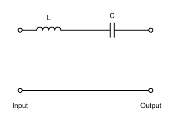
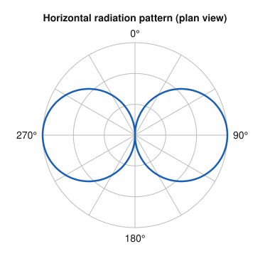
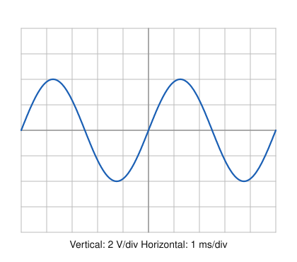

# IRTS HAREC Practice Exam — Set 2

60 questions · 2 hours · pass mark 60% **in each section** (at least 18/30 in Section A and 18/30 in Section B).
Only ONE answer is correct for each question. Answers and short explanations are at the end.

> Unofficial practice paper based on the IRTS HAREC Exam Syllabus (Rev 2.0.2), the IRTS Sample Exam Paper 2022 and the IRTS HAREC Study Guide (4.0.3).
> Page numbers in the answer key are the **printed** page numbers of the Study Guide; in a PDF viewer, add 24 (e.g. p. 343 is PDF page 367).

---

## Section A: Technical

### A.1 Safety (5 questions)

**1.** A 1000 W power supply is connected to the 230 V mains. Which plug fuse gives the best protection?

- A) 3 A
- B) 5 A
- C) 13 A
- D) 20 A

**2.** In a 230 V mains plug, the EARTH conductor is coloured:

- A) Brown
- B) Blue
- C) Black
- D) Green with a yellow stripe

**3.** Guy ropes supporting a mast should be anchored to the ground at a distance from the base of the mast of about:

- A) 60–80% of the mast height
- B) 10–20% of the mast height
- C) 30–40% of the mast height
- D) Exactly the mast height plus 10 m

**4.** A bleeder resistor connected across a high-voltage smoothing capacitor is used to:

- A) Increase the output voltage
- B) Reduce mains hum
- C) Discharge the capacitor after the power is switched off
- D) Protect the fuse

**5.** On a resonant quarter-wave vertical antenna, the highest RF voltage, and therefore the greatest RF burn risk, is found:

- A) At the feed point
- B) At the top of the radiator
- C) On the ground radials near the base
- D) Equally along the whole radiator

### A.2 Interference and Immunity (4 questions)

**6.** Two strong signals on 7.050 MHz and 7.060 MHz mix in a non-linear stage of a receiver. Which third-order intermodulation products may appear?

- A) 7.040 MHz and 7.070 MHz
- B) 7.055 MHz only
- C) 14.110 MHz only
- D) 0.010 MHz only

**7.** Splatter on an AM or SSB signal is usually caused by:

- A) Using too little microphone gain
- B) A well-matched antenna
- C) Low SWR
- D) Overmodulation

**8.** Clip-on ferrite rings on a hi-fi system's loudspeaker leads help reduce RF breakthrough because they:

- A) Increase the hi-fi output power
- B) Act as a common-mode choke, reducing RF currents picked up by the leads
- C) Filter the mains supply
- D) Convert RF into audio

**9.** To reduce the chance of interference to neighbours' equipment, antennas should be located:

- A) As close as possible to the neighbour's house
- B) Inside the house near the mains wiring
- C) As far as practical from houses and their wiring, and as high as practical
- D) At ground level

### A.3 Electrical, Electromagnetic, and Radio Theory (4 questions)

**10.** A device draws 2 A from a 230 V supply. What power does it consume?

- A) 115 W
- B) 460 W
- C) 232 W
- D) 4.6 kW

**11.** The Irish mains supply is 230 V RMS. What is its peak-to-peak voltage, approximately?

- A) 230 V
- B) 325 V
- C) 460 V
- D) 650 V

**12.** A 60 Ah battery supplies a constant 5 A load. Ignoring losses, how long until it is empty?

- A) 12 hours
- B) 300 hours
- C) 5 hours
- D) 60 hours

**13.** 1 µF is equal to:

- A) 1 nF
- B) 100 nF
- C) 1000 nF
- D) 1000 pF

### A.4 Components and Circuits (3 questions)

**14.** A tuned circuit with a high Q factor has:

- A) A wide bandwidth
- B) A narrow bandwidth
- C) High losses
- D) No resonant frequency

**15.** L and C in the circuit shown are resonant at frequency f₀. Ignoring losses, the circuit:

- A) Passes signals at f₀ readily and attenuates others (band-pass)
- B) Blocks signals at f₀
- C) Passes all frequencies equally
- D) Acts as a low-pass filter

**16.** A bridge rectifier:

- A) Uses one diode and gives half-wave rectification
- B) Uses two diodes and a centre-tapped transformer only
- C) Converts DC into AC
- D) Uses four diodes and gives full-wave rectification

### A.5 Transmitters and Receivers (4 questions)

**17.** In a receiver, the Beat Frequency Oscillator (BFO) is used to:

- A) Demodulate FM signals
- B) Increase the RF gain
- C) Make CW (and SSB) signals audible by producing a beat note
- D) Generate the image frequency

**18.** The typical RF bandwidth of an SSB voice signal is about:

- A) 2.7 kHz
- B) 6 kHz
- C) 16 kHz
- D) 150 Hz

**19.** The buffer stage in a transmitter is used to:

- A) Multiply the frequency
- B) Isolate the oscillator from load changes in later stages
- C) Filter harmonics at the antenna
- D) Measure output power

**20.** A transverter is:

- A) A device that converts AC mains to DC
- B) An antenna switch
- C) A type of SWR meter
- D) A unit that converts transmit and receive signals between one band and another (e.g. 28 MHz ↔ 144 MHz)

### A.6 Antennas and Transmission Lines (4 questions)

**21.** The characteristic impedance of a coaxial cable is determined mainly by:

- A) Its length
- B) The frequency in use
- C) The ratio of the conductor diameters and the dielectric material
- D) The power applied

**22.** A balun is used to:

- A) Connect a balanced antenna to an unbalanced feeder (or vice versa)
- B) Increase the transmitter power
- C) Measure SWR
- D) Turn a dipole into a Yagi

**23.** In a Yagi antenna, the element behind the driven element, which is slightly longer, is the:

- A) Director
- B) Reflector
- C) Radial
- D) Trap

**24.** The figure shows the horizontal (plan view) radiation pattern of an antenna in free space. It is typical of:

- A) A quarter-wave vertical
- B) A 3-element Yagi
- C) An isotropic radiator
- D) A horizontal half-wave dipole

### A.7 Propagation (4 questions)

**25.** The "dead zone" (skip zone) is:

- A) The area between the end of ground-wave coverage and the point where the first sky wave returns
- B) The area directly under the antenna
- C) The polar regions during an aurora
- D) The region of the ionosphere that absorbs signals

**26.** The F2 layer is typically found at a height of about:

- A) 10 km
- B) 60–90 km
- C) 250–400 km
- D) 36000 km

**27.** The solar cycle that strongly influences HF propagation lasts about:

- A) 1 year
- B) 11 years
- C) 27 days
- D) 50 years

**28.** Tropospheric ducting on VHF/UHF is associated with:

- A) Solar flares
- B) D-layer absorption
- C) Meteor showers
- D) Temperature inversions, often during high-pressure weather

### A.8 Measurements (2 questions)

**29.** A voltmeter should be connected:

- A) In series with the load and should have a low internal resistance
- B) In series with the load and should have a high internal resistance
- C) In parallel with the component and should have a high internal resistance
- D) In parallel with the component and should have a low internal resistance

**30.** The oscilloscope is set to 2 V/div vertical and 1 ms/div horizontal. What is the peak-to-peak voltage of the signal?

- A) 8 V
- B) 4 V
- C) 2.83 V
- D) 16 V

---

## Section B: Operating Rules, Procedures, and Regulations

### B.1 Phonetic Alphabet (1 question)

**31.** According to the ICAO recommendation, the number 9 is pronounced:

- A) NINE
- B) NIN-er
- C) NOVE-nine
- D) NEIN

### B.2 Q-Codes (3 questions)

**32.** "QTH?" means:

- A) What time is it?
- B) What is your power?
- C) What is your frequency?
- D) What is your location?

**33.** QRX means:

- A) Wait / I will call you back
- B) Stop transmitting
- C) Send faster
- D) I am being interfered with

**34.** QRN refers to:

- A) Interference from other stations
- B) Fading signals
- C) Static/noise of natural (atmospheric) origin
- D) A request to change frequency

### B.3 International Distress Signs, Emergency Traffic and Natural Disaster Communications (3 questions)

**35.** The radiotelephony (voice) distress signal is:

- A) SOS
- B) MAYDAY
- C) PAN PAN
- D) QUF

**36.** AREN stands for:

- A) Association of Radio Engineers Nationally
- B) Amateur Repeater Equipment Network
- C) All-Ireland Radio Emergency Notification
- D) Amateur Radio Emergency Network

**37.** Which of these is NOT one of Ireland's Principal Emergency Services (PES)?

- A) Civil Defence
- B) An Garda Síochána
- C) The Ambulance Service
- D) The Fire Service

### B.4 Call Signs (3 questions)

**38.** The holder of EI4XY operates from an Irish offshore island. Which call sign should they use?

- A) EJ/EI4XY
- B) EI4XY/EJ
- C) EJ4XY
- D) EI4XY/P

**39.** Which call sign suffixes are permitted under Irish regulations?

- A) /P, /M and /MM
- B) /M and /MM only
- C) /QRP and /P
- D) Any suffix the operator chooses

**40.** The prefix for France is:

- A) FR
- B) FA
- C) EF
- D) F

### B.5 Radio Spectrum Allocation in Ireland and IARU Band Plans (4 questions)

**41.** The authorised frequency range of the 40 m band in Ireland is:

- A) 7.000–7.200 MHz
- B) 7.000–7.100 MHz
- C) 7.000–7.300 MHz
- D) 7.100–7.300 MHz

**42.** In Ireland, the 6 m band (50–52 MHz) has:

- A) Primary status and 400 W
- B) Primary status and 50 W
- C) Secondary status and 100 W (20 dBW)
- D) Secondary status and 15 W EIRP

**43.** The power limit in the 1.850–2.000 MHz part of the 160 m band is:

- A) 400 W (26 dBW)
- B) 10 W (10 dBW)
- C) 50 W (17 dBW)
- D) 100 W (20 dBW)

**44.** Which frequency range on 20 m is reserved for propagation beacons?

- A) 14.000–14.010 MHz
- B) 14.300–14.310 MHz
- C) 14.200–14.210 MHz
- D) 14.099–14.101 MHz

### B.6 Social Responsibility of Radio Amateur Operation and the Code of Conduct (3 questions)

**45.** You want to work a rare DX station in a pile-up. Good practice is to:

- A) Listen carefully, follow the DX station's instructions, and call only when they ask for calls
- B) Call continuously so the DX station hears you first
- C) Transmit a carrier to keep the frequency
- D) Call while the DX station is still transmitting

**46.** How should you identify yourself on the air?

- A) By your first name only
- B) By the suffix of your call sign (e.g. "5ABC")
- C) By your complete call sign (e.g. "EI5ABC")
- D) By your town

**47.** Under Irish regulations, adding "/QRP" to your call sign when operating low power is:

- A) Mandatory below 5 W
- B) Not permitted
- C) Optional
- D) Only permitted in contests

### B.7 Operating Procedures and Non-Interference (5 questions)

**48.** An RS report of 59 means:

- A) Unreadable, very strong
- B) Barely readable, weak
- C) Readable with difficulty, strong
- D) Perfectly readable, very strong signals

**49.** Which is the correct phone CQ call?

- A) "CQ CQ CQ from EI5ABC EI5ABC EI5ABC standing by"
- B) "Hello, is anyone there?"
- C) "EI5ABC calling, break break"
- D) "CQ from Mike, this is Mike"

**50.** When EI5ABC calls W1ZZZ, which order of call signs is correct?

- A) "EI5ABC from W1ZZZ"
- B) "This is EI5ABC for W1ZZZ"
- C) "W1ZZZ from EI5ABC"
- D) It doesn't matter

**51.** An identified individual keeps causing you harmful interference and it is not resolved after you inform them. You should report it to:

- A) The IARU directly
- B) ComReg (with advice available from the IRTS)
- C) The ITU
- D) The local county council

**52.** A licensed amateur builds a transmitter that has no CE mark. Which is true?

- A) It is illegal for a licensee to use it
- B) It must be certified by ComReg first
- C) It can only be used on 2 m
- D) It is permitted, but the licensee is responsible for its safety and regulatory compliance

### B.8 ITU Radio Regulations (2 questions)

**53.** According to the ITU, the amateur service is for:

- A) Self-training, intercommunication and technical investigations, without pecuniary interest
- B) Broadcasting to the public
- C) Commercial messaging
- D) Military communications

**54.** The emission designator A1A describes:

- A) AM speech
- B) FM speech
- C) CW (Morse telegraphy on-off keying of the carrier)
- D) Packet data

### B.9 CEPT Regulations (3 questions)

**55.** CEPT stands for:

- A) Committee for European Packet Telegraphy
- B) European Conference of Postal and Telecommunications Administrations
- C) Central European Power Transmission
- D) Commission for Electronic Path Testing

**56.** When operating under CEPT T/R 61-01 in another country, may the visitor demand protection from harmful interference?

- A) Yes, always
- B) Yes, on primary bands
- C) Only if registered with the visited country
- D) No

**57.** An Irish licensee visiting the Netherlands under CEPT arrangements uses the prefix:

- A) PA/
- B) NL/
- C) ON/
- D) OZ/

### B.10 Irish Laws, Regulations, and Licence Conditions (3 questions)

**58.** Who may operate an Irish licensed amateur station?

- A) Only the licensee
- B) Any licensed amateur from any country, unsupervised
- C) The licensee, or another person under the licensee's direct supervision
- D) Anyone in the licensee's household

**59.** A land mobile station must NOT be operated:

- A) On the 2 m band
- B) Within an estuary, dock or harbour, or near an airport or radio navigation installation
- C) While the vehicle is moving
- D) With a whip antenna

**60.** Times in the station logbook must be recorded in:

- A) UTC
- B) Irish Summer Time
- C) Local time
- D) Any time zone

---

## Answer Key

| Q | Ans | Explanation (Study Guide page) |
|---|-----|-------------|
| 1 | B | 1000/230 ≈ 4.35 A, so 5 A (p. 297) |
| 2 | D | Earth = green/yellow (p. 297) |
| 3 | A | 60–80% of the mast height (p. 299) |
| 4 | C | Discharges the capacitors after switch-off (never rely on it — use a shorting stick) (p. 298) |
| 5 | B | Voltage is maximum at the top of a λ/4 vertical (p. 229) |
| 6 | A | 2f1 − f2 = 7.040 MHz; 2f2 − f1 = 7.070 MHz (p. 288) |
| 7 | D | Overmodulation causes splatter (p. 290) |
| 8 | B | Common-mode choke (p. 285) |
| 9 | C | Distance and height reduce field strength at the victim equipment (p. 283) |
| 10 | B | P = VI = 230 × 2 = 460 W (p. 23) |
| 11 | D | Peak = 230 × 1.414 ≈ 325 V; peak-to-peak ≈ 650 V (p. 44) |
| 12 | A | 60 Ah / 5 A = 12 h (p. 26) |
| 13 | C | 1 µF = 1000 nF (p. 15) |
| 14 | B | High Q = narrow bandwidth (p. 112) |
| 15 | A | Series LC in series with the signal path is an acceptor, so it acts as a band-pass (p. 106) |
| 16 | D | Four diodes, full-wave (p. 130) |
| 17 | C | The BFO beats with the IF to produce an audible tone (p. 195) |
| 18 | A | ≈ 2.7 kHz (p. 50) |
| 19 | B | Isolates the oscillator for stability (p. 175) |
| 20 | D | Band conversion for TX and RX (p. 186) |
| 21 | C | Set by the conductor diameters and the dielectric (p. 211) |
| 22 | A | Balanced ↔ unbalanced (p. 221) |
| 23 | B | Reflector: behind the driven element and longer (p. 242) |
| 24 | D | Figure-of-eight, maximum broadside to the wire (p. 232) |
| 25 | A | Definition of the skip/dead zone (p. 264) |
| 26 | C | ≈ 250–400 km (p. 260) |
| 27 | B | ≈ 11 years (p. 256) |
| 28 | D | Temperature inversions (p. 267) |
| 29 | C | Voltmeter: in parallel, high resistance (p. 273) |
| 30 | A | 4 divisions peak-to-peak × 2 V/div = 8 V (p. 276) |
| 31 | B | NIN-er (p. 334) |
| 32 | D | QTH? = what is your location? (p. 347) |
| 33 | A | QRX = wait / I will call back (p. 347) |
| 34 | C | QRN = atmospheric noise (p. 346) |
| 35 | B | MAYDAY (p. 350) |
| 36 | D | Amateur Radio Emergency Network (p. 350) |
| 37 | A | Civil Defence is a Voluntary Emergency Service (p. 352) |
| 38 | C | Change EI to EJ (no slash) (p. 322) |
| 39 | B | Only /M and /MM (p. 330) |
| 40 | D | France = F (p. 323) |
| 41 | A | 7.000–7.200 MHz (p. 343) |
| 42 | C | 6 m: secondary, 100 W (p. 343) |
| 43 | B | 10 W above 1.850 MHz (p. 343) |
| 44 | D | 14.099–14.101 MHz (p. 344) |
| 45 | A | Wait and follow the DX station's instructions (p. 369) |
| 46 | C | Use the full call sign (p. 359) |
| 47 | B | Only /M and /MM are allowed (p. 359) |
| 48 | D | R5 S9 (p. 369) |
| 49 | A | Standard IARU format (p. 363) |
| 50 | C | Called station first, own call second (p. 360) |
| 51 | B | ComReg is the authority (p. 371) |
| 52 | D | Allowed for licensees; they are responsible for compliance (p. 370) |
| 53 | A | ITU definition of the amateur service (p. 315) |
| 54 | C | A1A = CW (p. 317) |
| 55 | B | CEPT definition (p. 320) |
| 56 | D | Visitors cannot claim protection (p. 322) |
| 57 | A | Netherlands = PA (p. 323) |
| 58 | C | Others may operate under direct supervision (p. 326) |
| 59 | B | Licence condition for land mobile (p. 329) |
| 60 | A | UTC (p. 331) |
