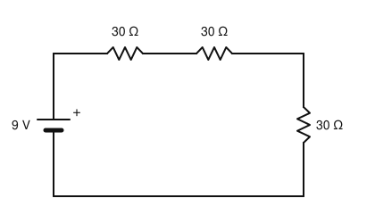
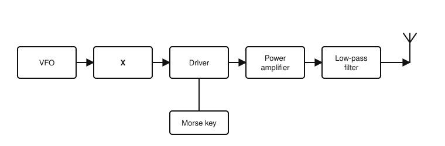
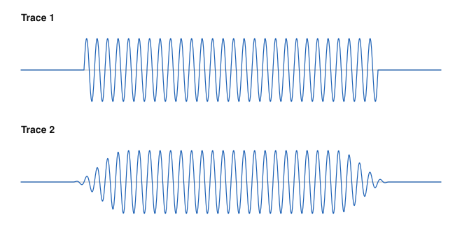

# IRTS HAREC Practice Exam — Set 3

60 questions · 2 hours · pass mark 60% **in each section** (at least 18/30 in Section A and 18/30 in Section B).
Only ONE answer is correct for each question. Answers and short explanations are at the end.

> Unofficial practice paper based on the IRTS HAREC Exam Syllabus (Rev 2.0.2), the IRTS Sample Exam Paper 2022 and the IRTS HAREC Study Guide (4.0.3).
> Page numbers in the answer key are the **printed** page numbers of the Study Guide; in a PDF viewer, add 24 (e.g. p. 343 is PDF page 367).

---

## Section A: Technical

### A.1 Safety (5 questions)

**1.** A current through the body as small as about ______ can cause ventricular fibrillation of the heart.

- A) 5 µA
- B) 0.5 mA
- C) 50 mA
- D) 5 A

**2.** The protective earthing system used in Ireland is known as:

- A) TN-C-S
- B) TT
- C) IT
- D) TN-S only

**3.** The main (master) power switch for an amateur station should be:

- A) A single pole switch in the neutral only
- B) A single pole switch in the earth wire
- C) A push button on the transceiver
- D) A double pole switch that breaks both live and neutral

**4.** To avoid a touch hazard, no part of an antenna should be closer to, or lower than ______ above, the level on which people can stand.

- A) 0.5 m
- B) 2.4 m
- C) 1.2 m
- D) 1.8 m

**5.** The recommended first aid for an RF burn is:

- A) Apply ice directly
- B) Apply butter
- C) Cool the skin with tepid running water
- D) Leave it uncovered and do nothing

### A.2 Interference and Immunity (4 questions)

**6.** "Detection" in audio equipment that causes RF breakthrough happens when:

- A) RF is rectified by a non-linear junction (e.g. a transistor or diode) in the audio circuit
- B) The audio equipment is switched off
- C) The transmitter SWR is too low
- D) The audio amplifier is fully shielded

**7.** Which of these is a spurious emission from a transmitter?

- A) The wanted carrier
- B) The modulation sidebands within the necessary bandwidth
- C) The received signal
- D) Harmonics of the operating frequency

**8.** A low-pass filter at a transmitter's output is used to:

- A) Attenuate signals below the operating frequency
- B) Attenuate harmonics above the cut-off frequency
- C) Increase the output power
- D) Reduce the SWR

**9.** If a linear amplifier is producing splatter because it is overdriven, the remedy is to:

- A) Increase the drive further
- B) Remove the low-pass filter
- C) Reduce the drive level to within the amplifier's linear range
- D) Use a shorter feeder

### A.3 Electrical, Electromagnetic, and Radio Theory (4 questions)

**10.** A 5 V supply is connected across a 1 kΩ resistor. The current is:

- A) 0.5 mA
- B) 5 mA
- C) 50 mA
- D) 5 A

**11.** The period of the 50 Hz Irish mains supply is:

- A) 20 ms
- B) 50 ms
- C) 2 ms
- D) 0.2 s

**12.** A power ratio of 100 expressed in decibels is:

- A) 10 dB
- B) 100 dB
- C) 3 dB
- D) 20 dB

**13.** Radio waves in a vacuum travel at approximately:

- A) 300 m/s
- B) 3 000 km/s
- C) 300 000 km/s (3 × 10⁸ m/s)
- D) 3 × 10¹² m/s

### A.4 Components and Circuits (3 questions)

**14.** In the circuit shown, what current flows?

- A) 100 mA
- B) 300 mA
- C) 33 mA
- D) 900 mA

**15.** Two 10 µH inductors are connected in series (no mutual coupling). The total inductance is:

- A) 5 µH
- B) 10 µH
- C) 20 µH
- D) 100 µH

**16.** Which amplifier class is the most efficient, but is unsuitable for SSB because it is non-linear?

- A) Class A
- B) Class AB
- C) Class B
- D) Class C

### A.5 Transmitters and Receivers (4 questions)

**17.** An AM transmitter is modulated with audio up to 3 kHz. Its RF bandwidth is about:

- A) 3 kHz
- B) 6 kHz
- C) 1.5 kHz
- D) 16 kHz

**18.** Automatic Gain Control (AGC) in a receiver:

- A) Keeps the output level reasonably constant despite varying signal strength
- B) Controls the transmitter power
- C) Removes the carrier
- D) Sets the image frequency

**19.** The squelch control on an FM receiver:

- A) Increases the deviation
- B) Changes the frequency step
- C) Adjusts the RF gain of the transmitter
- D) Mutes the audio when no signal is present

**20.** The block diagram shows a CW transmitter. What is the stage marked "X"?

- A) Mixer
- B) Product detector
- C) Buffer amplifier
- D) Frequency discriminator

### A.6 Antennas and Transmission Lines (4 questions)

**21.** Standing waves on a transmission line are caused by:

- A) A perfectly matched load
- B) A mismatch between the line impedance and the load impedance
- C) Using coaxial cable
- D) Low transmitter power

**22.** The feed point impedance of a half-wave folded dipole is approximately:

- A) 36 Ω
- B) 50 Ω
- C) 73 Ω
- D) 300 Ω

**23.** The radials of a quarter-wave ground plane antenna:

- A) Act as an artificial ground (counterpoise)
- B) Are directors
- C) Radiate most of the signal
- D) Increase the height of the antenna

**24.** The front-to-back ratio of a directional antenna is:

- A) The ratio of its length to its width
- B) The ratio of the impedance at the front to that at the back
- C) The ratio of power radiated in the forward direction to that radiated in the opposite direction
- D) The SWR measured at the front of the antenna

### A.7 Propagation (4 questions)

**25.** During periods of high solar activity, the MUF generally:

- A) Falls
- B) Rises
- C) Is unchanged
- D) Drops to zero

**26.** Meteor scatter propagation is mainly used on:

- A) 160 m
- B) 80 m
- C) 40 m
- D) VHF bands such as 6 m and 2 m

**27.** For HF sky-wave communication, a low angle of radiation generally results in:

- A) A longer skip distance
- B) A shorter skip distance
- C) No sky-wave propagation
- D) Only ground-wave propagation

**28.** The distance that can be covered on VHF using line-of-sight propagation is increased mainly by:

- A) Using a lower frequency within the band
- B) Using AM instead of FM
- C) Raising the antenna height
- D) Using a longer feeder

### A.8 Measurements (2 questions)

**29.** Before measuring the resistance of a component in a circuit with an ohmmeter, you should:

- A) Switch the circuit on
- B) Switch off and de-energise the circuit
- C) Connect the ohmmeter in series
- D) Set the meter to the AC voltage range

**30.** The figure shows the RF envelopes of two CW transmissions on an oscilloscope. Which is likely to cause key clicks?

- A) Trace 2
- B) Both
- C) Neither
- D) Trace 1

---

## Section B: Operating Rules, Procedures, and Regulations

### B.1 Phonetic Alphabet (1 question)

**31.** The call sign EI9JQ is correctly spoken as:

- A) Echo India Niner Juliett Quebec
- B) Echo India Nine Jack Queen
- C) Easy Item Nine Juliett Quebec
- D) Echo India Niner Japan Queen

### B.2 Q-Codes (3 questions)

**32.** "QRL?" means:

- A) Are you ready?
- B) Is the frequency busy (are you busy)?
- C) Who is calling me?
- D) Shall I send slower?

**33.** "QSL" (as a statement) means:

- A) I am changing frequency
- B) My location is...
- C) I am being interfered with
- D) I confirm reception

**34.** "QRV" (as a statement) means:

- A) I am busy
- B) I have nothing for you
- C) I am ready
- D) Increase power

### B.3 International Distress Signs, Emergency Traffic and Natural Disaster Communications (3 questions)

**35.** "QUF" relates to:

- A) Reception of a distress signal
- B) A request for a QSL card
- C) Changing frequency
- D) Fading

**36.** The Irish emergency centre of activity on the 20 m band is:

- A) 14.100 MHz
- B) 14.230 MHz
- C) 14.200 MHz
- D) 14.300 MHz

**37.** The Principal Response Agencies (PRA) in Ireland are:

- A) Civil Defence, Red Cross and Order of Malta
- B) An Garda Síochána, the Health Services Executive and the Local Authorities
- C) The IRTS, AREN and ComReg
- D) The Defence Forces only

### B.4 Call Signs (3 questions)

**38.** Which call sign does NOT comply with the normal ITU rules?

- A) EI6XYZ
- B) M6A
- C) EI2ABCDE
- D) 2E3RGD

**39.** The suffix used by an Irish station operating on a boat is:

- A) /MM
- B) /M
- C) /P
- D) /B

**40.** The prefix for Austria is:

- A) AU
- B) OA
- C) AT
- D) OE

### B.5 Radio Spectrum Allocation in Ireland and IARU Band Plans (4 questions)

**41.** The band edges of the 2 m band in Ireland are:

- A) 144.000–148.000 MHz
- B) 144.000–146.000 MHz
- C) 145.000–146.000 MHz
- D) 140.000–146.000 MHz

**42.** On which of these bands is maritime mobile operation permitted?

- A) 20 m
- B) 60 m
- C) 30 m
- D) 6 m

**43.** In the IARU R1 80 m band plan, the segment 3500–3510 kHz is for:

- A) All modes, SSB contest preferred
- B) Digimodes
- C) CW, with priority for intercontinental operation
- D) Beacons only

**44.** The power limit on the 4 m band (69.900–70.500 MHz) from a fixed station is:

- A) 400 W
- B) 10 W
- C) 100 W
- D) 50 W (17 dBW)

### B.6 Social Responsibility of Radio Amateur Operation and the Code of Conduct (3 questions)

**45.** Which is an example of self-regulation in amateur radio?

- A) ComReg licence fees
- B) The IARU band plans, developed by consensus and widely followed
- C) The Wireless Telegraphy Act
- D) Garda enforcement

**46.** A former CB operator should know that CB jargon on the amateur bands:

- A) Is generally not used and may not be understood
- B) Is the standard language of amateur radio
- C) Is required by ComReg
- D) Replaces Q-codes

**47.** You hear another amateur giving technically wrong information on air. The best approach is to:

- A) Interrupt and tell them they are wrong
- B) Report them to ComReg
- C) Offer polite, constructive help if you want to correct it
- D) Transmit over them

### B.7 Operating Procedures and Non-Interference (5 questions)

**48.** A report of "59 plus 20" means:

- A) Readable with difficulty, S9
- B) S5, 20 kHz off frequency
- C) Strength 9, readability 5, 20 W
- D) Perfectly readable, S-meter reads 20 dB over S9

**49.** On VHF/UHF, a "CQ DX" call is intended for stations more than about ______ away.

- A) 300 km
- B) 30 km
- C) 3000 km
- D) 10 km

**50.** What should you say on phone before calling CQ on an apparently clear frequency?

- A) "Break break"
- B) "Is this frequency in use? This is EI5ABC"
- C) "CQ contest"
- D) "Mayday"

**51.** You are using a band allocated to amateurs on a secondary basis and a non-amateur primary user starts transmitting. You must:

- A) Continue — you were there first
- B) Increase power
- C) Stop using the frequency
- D) Report them to the IARU

**52.** In Morse, someone sends "QRL?" on the frequency you are using. A suitable reply is:

- A) QRZ
- B) QRT
- C) CQ
- D) Y (or C, R, QRL)

### B.8 ITU Radio Regulations (2 questions)

**53.** International communications between amateur stations are limited to:

- A) Any subject at all
- B) Communications incidental to the purposes of the amateur service and remarks of a personal character
- C) Business messages only
- D) Emergency messages only

**54.** May ordinary amateur transmissions be encoded to obscure their meaning?

- A) No, except control signals between earth command stations and amateur satellites
- B) Yes, always
- C) Yes, on HF only
- D) Yes, if both stations agree

### B.9 CEPT Regulations (3 questions)

**55.** What is the difference between Irish CEPT Class 1 and Class 2 licences?

- A) Class 2 cannot use HF
- B) Class 1 has double the power
- C) Same privileges in Ireland; Class 1 requires Morse proficiency and gets a shorter call sign
- D) Class 2 is valid only in Ireland

**56.** An Irish licensee visiting Wales under CEPT arrangements uses the prefix:

- A) GW/
- B) W/
- C) 2W/
- D) MW/

**57.** An Irish licensee (EI5ABC) visiting Ontario, Canada, would use:

- A) VE/EI5ABC
- B) EI5ABC/VE3
- C) EI5ABC/CAN
- D) CA/EI5ABC

### B.10 Irish Laws, Regulations, and Licence Conditions (3 questions)

**58.** Applications for new or amended Irish Amateur Station Licences are made via:

- A) The ComReg eLicensing website
- B) The IRTS
- C) An Garda Síochána
- D) The local post office

**59.** A special event call sign must be applied for at least ______ before the event.

- A) One week
- B) Six months
- C) One month
- D) One year

**60.** Which requires an additional authorisation from ComReg?

- A) Using a commercial CE-marked transceiver
- B) Operating /M
- C) Using CW on 80 m
- D) Operating a repeater or beacon

---

## Answer Key

| Q | Ans | Explanation (Study Guide page) |
|---|-----|-------------|
| 1 | C | About 50 mA can cause fibrillation (p. 293) |
| 2 | A | TN-C-S (p. 296) |
| 3 | D | Double pole: breaks live and neutral (p. 295) |
| 4 | B | 2.4 m (p. 304) |
| 5 | C | Tepid running water, not ice (p. 294) |
| 6 | A | Rectification of RF in non-linear junctions (p. 283) |
| 7 | D | Harmonics are spurious emissions (p. 287) |
| 8 | B | LPF removes harmonics (p. 286) |
| 9 | C | Reduce drive (p. 287) |
| 10 | B | 5/1000 = 5 mA (p. 22) |
| 11 | A | T = 1/50 = 20 ms (p. 44) |
| 12 | D | 100× = 20 dB (p. 117) |
| 13 | C | Speed of light (p. 70) |
| 14 | A | R = 3 × 30 = 90 Ω; I = 9/90 = 0.1 A (p. 30) |
| 15 | C | Series inductors add (p. 90) |
| 16 | D | Class C (p. 136) |
| 17 | B | AM bandwidth = 2 × highest audio frequency (p. 156) |
| 18 | A | AGC function (p. 196) |
| 19 | D | Squelch mutes the noise when there is no signal (p. 198) |
| 20 | C | A buffer isolates the VFO from load changes in later stages (p. 175) |
| 21 | B | Caused by mismatch (p. 217) |
| 22 | D | ≈ 300 Ω (p. 237) |
| 23 | A | Counterpoise (p. 239) |
| 24 | C | Definition of front-to-back ratio (p. 246) |
| 25 | B | More ionisation gives a higher MUF (p. 258) |
| 26 | D | VHF (p. 267) |
| 27 | A | Lower angle gives longer skip (p. 264) |
| 28 | C | Height extends the radio horizon (p. 261) |
| 29 | B | Never measure resistance on a live circuit (p. 273) |
| 30 | D | Trace 1 has abrupt rise and fall times (p. 277) |
| 31 | A | Correct ITU/ICAO spelling (p. 334) |
| 32 | B | QRL? = is the frequency busy? (p. 346) |
| 33 | D | QSL = I confirm reception (p. 347) |
| 34 | C | QRV = I am ready (p. 347) |
| 35 | A | QUF = I have received the distress signal from... (p. 347) |
| 36 | D | 14.300 MHz (p. 343) |
| 37 | B | Garda, HSE, Local Authorities (p. 352) |
| 38 | C | Suffix has more than 4 characters (p. 337) |
| 39 | A | /MM (p. 330) |
| 40 | D | Austria = OE (p. 323) |
| 41 | B | 144–146 MHz (p. 343) |
| 42 | A | /MM not allowed on 160, 60, 30, 6, 4 m or 70 cm (p. 343) |
| 43 | C | CW, priority for intercontinental (p. 339) |
| 44 | D | 4 m: 50 W (p. 343) |
| 45 | B | Band plans are self-regulation (p. 357) |
| 46 | A | CB jargon is not used on the amateur bands (p. 358) |
| 47 | C | Comprehension and politeness (p. 357) |
| 48 | D | 59 + 20 dB (p. 369) |
| 49 | A | > 300 km on VHF/UHF (p. 364) |
| 50 | B | Ask if the frequency is in use, with your call sign (p. 363) |
| 51 | C | Secondary users must not interfere with primary users (p. 370) |
| 52 | D | Y / C / R / QRL (p. 362) |
| 53 | B | ITU RR Art. 25.2 (p. 315) |
| 54 | A | No secret encoding, except satellite control (p. 315) |
| 55 | C | Same rights in Ireland; different call sign type (p. 320) |
| 56 | D | Wales = MW/ (p. 323) |
| 57 | B | Canada uses a suffix: EI5ABC/VE3 (p. 323) |
| 58 | A | eLicensing (p. 328) |
| 59 | C | At least one month (p. 329) |
| 60 | D | Automatic/remote stations need additional authorisation (p. 331) |
