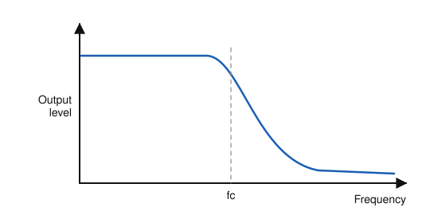
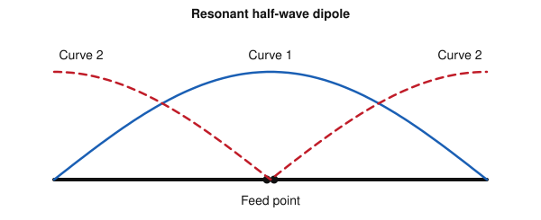
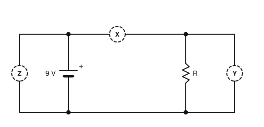

# IRTS HAREC Practice Exam — Set 6

60 questions · 2 hours · pass mark 60% **in each section** (at least 18/30 in Section A and 18/30 in Section B).
Only ONE answer is correct for each question. Answers and short explanations are at the end.

> Unofficial practice paper based on the IRTS HAREC Exam Syllabus (Rev 2.0.2), the IRTS Sample Exam Paper 2022 and the IRTS HAREC Study Guide (4.0.3).
> Page numbers in the answer key are the **printed** page numbers of the Study Guide; in a PDF viewer, add 24 (e.g. p. 343 is PDF page 367).

---

## Section A: Technical

### A.1 Safety (5 questions)

**1.** Ignoring any safety margin, the maximum power that can be drawn from the 230 V mains through a 5 A fuse is about:

- A) 500 W
- B) 690 W
- C) 1150 W
- D) 2990 W

**2.** Before relying on a voltmeter to confirm that a circuit is dead, you should:

- A) First check the meter on a known live source to prove it works
- B) Set it to the resistance range
- C) Touch the circuit to feel for voltage
- D) Assume the meter is working

**3.** The RCD protecting your station should be tested by pressing its test button:

- A) Never
- B) Once every 10 years
- C) Only after a lightning strike
- D) Regularly — at least twice a year

**4.** Static dischargers (lightning arrestors) fitted in antenna feeders mainly protect against:

- A) A direct lightning strike
- B) Transient high voltages from nearby lightning strikes and static build-up
- C) High SWR
- D) Mains faults

**5.** A transmitter runs 100 W PEP on uncompressed SSB, transmitting 50% of the time. The average power, relevant for EMF assessment, is about:

- A) 100 W
- B) 50 W
- C) 10 W
- D) 1 W

### A.2 Interference and Immunity (4 questions)

**6.** Excessive deviation of an FM transmitter results in:

- A) Excessive bandwidth and interference to adjacent channels
- B) A lower carrier frequency
- C) Lower power output
- D) Reduced harmonics

**7.** RF current flowing on the outside of a coax braid causes interference in the house. A good remedy is:

- A) Removing the earth connection
- B) Increasing the power
- C) Using a longer coax
- D) Fitting a common-mode choke (current balun)

**8.** A strong nearby signal reduces a receiver's sensitivity to the wanted weak signal. This is called:

- A) Image response
- B) Blocking (desensitisation)
- C) Selectivity
- D) Squelch

**9.** For a shielded enclosure to be effective, it should:

- A) Be made of plastic
- B) Have large ventilation holes
- C) Be a continuous conductive enclosure with good joints, connected to earth
- D) Be painted on the inside

### A.3 Electrical, Electromagnetic, and Radio Theory (4 questions)

**10.** 10 V is applied across a 50 Ω resistor. The power dissipated is:

- A) 0.2 W
- B) 2 W
- C) 5 W
- D) 500 W

**11.** The approximate wavelength of a 145 MHz signal is:

- A) 2.07 m
- B) 20.7 m
- C) 0.2 m
- D) 145 m

**12.** An absolute power of 26 dBW is approximately:

- A) 400 W
- B) 260 W
- C) 100 W
- D) 1000 W

**13.** Two sine waves of the same frequency are 90° out of phase. This is a difference of:

- A) Half a cycle
- B) A full cycle
- C) A quarter of a cycle
- D) An eighth of a cycle

### A.4 Components and Circuits (3 questions)

**14.** A 100 Ω resistor has 10 V across it. Which power rating should you choose?

- A) 0.25 W
- B) 0.5 W
- C) 1 W
- D) 2 W

**15.** The graph shows the frequency response of a filter. It is a:

- A) High-pass filter
- B) Low-pass filter
- C) Band-pass filter
- D) Band-stop filter

**16.** In a step-down transformer, compared with the primary, the secondary has:

- A) A lower voltage and can supply a higher current
- B) A higher voltage and a higher current
- C) A higher voltage and a lower current
- D) The same voltage and current

### A.5 Transmitters and Receivers (4 questions)

**17.** Which mode transmits a full carrier together with both sidebands?

- A) SSB
- B) CW
- C) AM
- D) FT8

**18.** In an SSB receiver, the Carrier Insertion Oscillator (CIO):

- A) Generates the transmit carrier
- B) Sets the AGC time constant
- C) Suppresses the image
- D) Re-inserts the missing carrier for demodulation

**19.** A double-conversion superheterodyne receiver is used to obtain:

- A) Good image rejection (high first IF) and good selectivity (low second IF)
- B) Higher transmitter power
- C) A wider bandwidth for SSB
- D) FM demodulation without a discriminator

**20.** Which is a method of achieving good transmitter frequency stability?

- A) Using a high SWR
- B) Crystal control or a phase-locked loop (PLL) synthesiser
- C) Overdriving the amplifier
- D) Using a long feeder

### A.6 Antennas and Transmission Lines (4 questions)

**21.** The typical velocity factor of parallel (ladder) line is:

- A) 0.1–0.2
- B) 0.5
- C) 0.85–0.95
- D) 1.5

**22.** The figure shows the distribution of current and voltage along a resonant half-wave dipole. Curve 2 (dashed) represents:

- A) Current
- B) Radiated power
- C) Feeder loss
- D) Voltage

**23.** A Yagi director is:

- A) Longer than the driven element and behind it
- B) Shorter than the driven element and in front of it
- C) The element connected to the feeder
- D) A ground radial

**24.** A vertical antenna radiates a signal with:

- A) Vertical polarisation
- B) Horizontal polarisation
- C) Circular polarisation
- D) No polarisation

### A.7 Propagation (4 questions)

**25.** During daytime, the F layer often splits into:

- A) The D and E layers
- B) The troposphere and stratosphere
- C) The F1 and F2 layers
- D) The E and Es layers

**26.** For a single-hop sky wave, the skip distance increases when:

- A) The reflecting layer is higher and the radiation angle is lower
- B) The radiation angle is higher
- C) The reflecting layer is lower
- D) The power is reduced

**27.** UHF tropospheric propagation is usually enhanced during:

- A) Thunderstorms
- B) Solar flares
- C) Heavy rain
- D) Settled, high-pressure weather

**28.** Long-distance openings on the 10 m band depend strongly on:

- A) The time of day only
- B) The stage of the solar cycle
- C) The SWR of your antenna
- D) The mode used

### A.8 Measurements (2 questions)

**29.** You want to measure the current through resistor R. At which position should the ammeter be connected?

- A) Y
- B) Z
- C) Either Y or Z
- D) X

**30.** To measure a transmitter's RF output power without radiating, you would use:

- A) An RF power meter connected to a dummy load
- B) An ohmmeter across the antenna socket
- C) An oscilloscope on the mains
- D) An S-meter

---

## Section B: Operating Rules, Procedures, and Regulations

### B.1 Phonetic Alphabet (1 question)

**31.** The ITU phonetic word for the letter W is:

- A) William
- B) Washington
- C) Whiskey
- D) Water

### B.2 Q-Codes (3 questions)

**32.** A QSL card is:

- A) A licence document
- B) A paper card confirming a contact
- C) A frequency chart
- D) A signal report form

**33.** "QRG?" means:

- A) What is my exact frequency?
- B) What is your location?
- C) Who is calling me?
- D) Are you ready?

**34.** A station sends "QTH Wicklow". This means:

- A) Wicklow is calling
- B) Change frequency to Wicklow
- C) Wicklow is interfering
- D) My location is Wicklow

### B.3 International Distress Signs, Emergency Traffic and Natural Disaster Communications (3 questions)

**35.** Which of these is an emergency centre of activity used in Ireland on the 17 m band?

- A) 18.100 MHz
- B) 18.110 MHz
- C) 18.160 MHz
- D) 18.068 MHz

**36.** If you hear the words "emergency", "MAYDAY", "SOS" or "QUF", you should:

- A) Stop transmitting and listen
- B) Continue your QSO
- C) Call the station to ask for details
- D) Move to another band

**37.** Without further emergency training, a radio amateur in an emergency:

- A) Is in charge of the scene
- B) Is not a first responder and has no authority over the served agency
- C) Can give orders to the emergency services
- D) Should take over the agency's radio system

### B.4 Call Signs (3 questions)

**38.** A visitor's call sign issued by ComReg to a licensed amateur from a non-CEPT country under a reciprocal agreement has which format?

- A) EI/W1ABC
- B) EJ9ABC
- C) EI5ABC/V
- D) The letter V just after the number, e.g. EI9VAB

**39.** The IARU guide recommends that the "/" in a call sign is spoken as:

- A) "Stroke"
- B) "Over"
- C) "Dash"
- D) "Break"

**40.** The prefix for Sweden is:

- A) SW
- B) SM
- C) SE
- D) S5

### B.5 Radio Spectrum Allocation in Ireland and IARU Band Plans (4 questions)

**41.** The band edges of the 17 m band in Ireland are:

- A) 18.000–18.168 MHz
- B) 18.068–18.200 MHz
- C) 18.068–18.168 MHz
- D) 18.100–18.168 MHz

**42.** The power limit on the 2 m band from a fixed station is:

- A) 400 W (26 dBW)
- B) 50 W (17 dBW)
- C) 100 W (20 dBW)
- D) 25 W (14 dBW)

**43.** The power limit in the 1.810–1.850 MHz part of the 160 m band from a fixed station is:

- A) 10 W
- B) 50 W
- C) 100 W
- D) 400 W (26 dBW)

**44.** For SSB voice on the 60 m band you should use:

- A) LSB, as on all bands below 10 MHz
- B) USB
- C) AM
- D) SSB is not allowed on 60 m

### B.6 Social Responsibility of Radio Amateur Operation and the Code of Conduct (3 questions)

**45.** Which is one of the basic principles of the amateur radio code of conduct?

- A) Competition at any cost
- B) Secrecy
- C) Tolerance of other people's differing opinions
- D) Using high power whenever possible

**46.** How do radio amateurs usually address each other?

- A) By first name (or nickname) and call sign
- B) By surname and title
- C) By licence number
- D) Anonymously

**47.** You have used a frequency for half an hour, and suddenly another station starts a QSO on it. The most likely explanation is:

- A) Deliberate jamming
- B) Your transmitter has drifted
- C) ComReg has reallocated the frequency
- D) Propagation has changed and brought you into range of each other

### B.7 Operating Procedures and Non-Interference (5 questions)

**48.** An RST report of 339 means:

- A) Perfectly readable, weak, perfect tone
- B) Readable with considerable difficulty, weak signals, perfect tone
- C) Unreadable, strong, perfect tone
- D) Barely readable, moderate signals, poor tone

**49.** You want contacts only with stations outside Europe. A suitable phone call is:

- A) "CQ CQ CQ from EI5ABC"
- B) "CQ Europe from EI5ABC"
- C) "CQ local from EI5ABC"
- D) "CQ DX CQ DX CQ DX outside Europe, this is EI5ABC EI5ABC EI5ABC standing by"

**50.** In many contests and in pile-ups, signal reports are:

- A) Often given as 59 / 599 regardless of actual conditions
- B) Never exchanged
- C) Always measured precisely
- D) Sent in dB only

**51.** You are using a frequency in a Morse QSO and hear "QRL?". You reply:

- A) QRZ?
- B) CQ
- C) QRL (or C, R, Y)
- D) Nothing

**52.** The recommended first point of contact in Ireland for reporting deliberate interference to the amateur bands is:

- A) The European Commission
- B) The IRTS IARUMS officer (or the IRTS IARU Liaison Officer)
- C) The ITU in Geneva
- D) Your neighbour

### B.8 ITU Radio Regulations (2 questions)

**53.** ITU Region 2 covers:

- A) The Americas (including Greenland)
- B) Europe and Africa
- C) Asia and Oceania
- D) Antarctica only

**54.** The emission designators F1D, F2D and J2D refer to:

- A) Speech
- B) Television
- C) Morse by ear
- D) Data, e.g. packet radio, files or telemetry

### B.9 CEPT Regulations (3 questions)

**55.** When operating in a CEPT country under T/R 61-01, the power limits that apply are:

- A) Always the Irish limits
- B) No limits
- C) Those of the visited country (and never more than your own licence permits)
- D) Those of the IARU

**56.** An Irish licensee visiting Northern Ireland under CEPT arrangements uses:

- A) GI/EI5ABC
- B) MI/EI5ABC
- C) NI/EI5ABC
- D) EI5ABC/NI

**57.** The prefix for Croatia is:

- A) 9A
- B) HR
- C) CR
- D) 9H

### B.10 Irish Laws, Regulations, and Licence Conditions (3 questions)

**58.** The amateur station licensing law in Ireland is the:

- A) Broadcasting Act 1960
- B) Communications Act 1998
- C) Radio Act 2015
- D) Wireless Telegraphy (Amateur Station Licence) Regulations 2009

**59.** The nominated holder of a club licence must:

- A) Be the club's treasurer
- B) Be over 65
- C) Hold a valid Amateur Station Licence in their own name and be responsible for operation under the club licence
- D) Not hold a personal licence

**60.** If a licence is revoked by ComReg, the licence fees:

- A) Are not refunded
- B) Are refunded in full
- C) Are refunded pro rata
- D) Are transferred to a club

---

## Answer Key

| Q | Ans | Explanation (Study Guide page) |
|---|-----|-------------|
| 1 | C | 5 A × 230 V = 1150 W (p. 298) |
| 2 | A | Prove the meter on a known live source first (p. 299) |
| 3 | D | At least twice a year (p. 295) |
| 4 | B | Transients from nearby strikes (p. 300) |
| 5 | C | Uncompressed SSB ≈ 10 W average at 100 W PEP (p. 309) |
| 6 | A | Excess deviation widens the bandwidth (p. 290) |
| 7 | D | Common-mode choke (p. 285) |
| 8 | B | Blocking/desensitisation (p. 205) |
| 9 | C | Continuous earthed conductive shield (p. 286) |
| 10 | B | P = V²/R = 100/50 = 2 W (p. 23) |
| 11 | A | 300/145 ≈ 2.07 m (p. 40) |
| 12 | A | 26 dBW ≈ 400 W (p. 118) |
| 13 | C | 90° = a quarter cycle (p. 44) |
| 14 | D | P = V²/R = 1 W; choose a higher rating (2 W) (p. 25) |
| 15 | B | Passes below fc, attenuates above (p. 110) |
| 16 | A | Step-down: lower voltage, higher current (p. 128) |
| 17 | C | AM (p. 156) |
| 18 | D | The CIO re-inserts the carrier (p. 195) |
| 19 | A | High 1st IF for image rejection, low 2nd IF for selectivity (p. 189) |
| 20 | B | Crystal/PLL (p. 174) |
| 21 | C | Mostly air dielectric (p. 210) |
| 22 | D | Voltage is maximum at the ends; current (curve 1) is maximum at the centre (p. 230) |
| 23 | B | Director: shorter, in front (p. 243) |
| 24 | A | Vertical (p. 229) |
| 25 | C | F1 and F2 (p. 259) |
| 26 | A | Higher layer + lower angle = longer skip (p. 264) |
| 27 | D | High pressure (p. 267) |
| 28 | B | Solar cycle (p. 256) |
| 29 | D | An ammeter goes in series: position X (p. 273) |
| 30 | A | Power meter + dummy load (p. 281) |
| 31 | C | Whiskey (p. 334) |
| 32 | B | QSL card (p. 349) |
| 33 | A | QRG? (p. 346) |
| 34 | D | QTH = location (p. 347) |
| 35 | C | 18.160 MHz (p. 345) |
| 36 | A | Stop and listen (p. 354) |
| 37 | B | You are not a first responder and not in charge (p. 353) |
| 38 | D | Visitor calls have a V after the number (p. 337) |
| 39 | A | "Stroke" (ComReg uses "slash") (p. 322) |
| 40 | B | Sweden = SM (p. 323) |
| 41 | C | 18.068–18.168 MHz (p. 343) |
| 42 | A | 2 m: 400 W (p. 343) |
| 43 | D | 400 W below 1.850 MHz (p. 343) |
| 44 | B | 60 m is the exception: USB (p. 341) |
| 45 | C | Tolerance (p. 356) |
| 46 | A | First name and call sign (p. 358) |
| 47 | D | Changing propagation (p. 357) |
| 48 | B | R3 S3 T9 (p. 369) |
| 49 | D | CQ DX with an area (p. 365) |
| 50 | A | 59/599 in contests and pile-ups (p. 369) |
| 51 | C | QRL / C / R / Y (p. 362) |
| 52 | B | IRTS IARUMS officer (p. 371) |
| 53 | A | Americas (p. 314) |
| 54 | D | Data (p. 317) |
| 55 | C | Visited country's limits (p. 322) |
| 56 | B | MI/ (p. 323) |
| 57 | A | Croatia = 9A (p. 323) |
| 58 | D | S.I. 192 of 2009 (p. 326) |
| 59 | C | Club licence rules (p. 329) |
| 60 | A | No refund (p. 328) |
