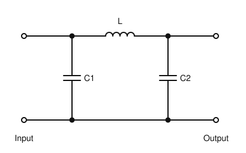
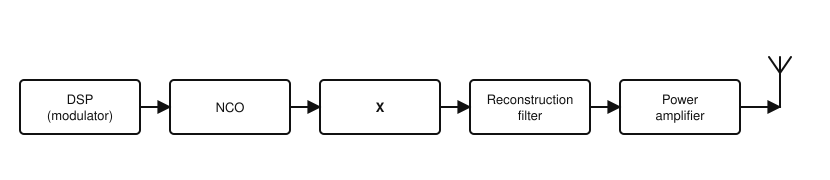
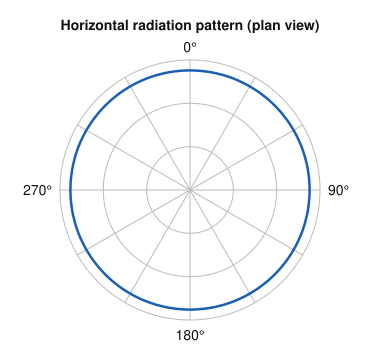

# IRTS HAREC Practice Exam — Set 9

60 questions · 2 hours · pass mark 60% **in each section** (at least 18/30 in Section A and 18/30 in Section B).
Only ONE answer is correct for each question. Answers and short explanations are at the end.

> Unofficial practice paper based on the IRTS HAREC Exam Syllabus (Rev 2.0.2), the IRTS Sample Exam Paper 2022 and the IRTS HAREC Study Guide (4.0.3).
> Page numbers in the answer key are the **printed** page numbers of the Study Guide; in a PDF viewer, add 24 (e.g. p. 343 is PDF page 367).

---

## Section A: Technical

### A.1 Safety (5 questions)

**1.** A 1500 W amplifier power supply runs from the 230 V mains. Which plug fuse is appropriate?

- A) 3 A
- B) 5 A
- C) 1 A
- D) 13 A

**2.** Before touching an antenna element, you should:

- A) Be confident that it is not energised, because RF can arc to the skin and cause burns
- B) Touch it quickly while transmitting at low power
- C) Wet your hands for better contact
- D) Use only your left hand

**3.** Before working on a high-voltage power supply, the smoothing capacitors should be discharged using:

- A) A screwdriver held in your hand
- B) The bleeder resistor alone
- C) A shorting stick
- D) The mains switch

**4.** When refuelling a vehicle fitted with a mobile station, you should:

- A) Keep transmitting to test the antenna
- B) Switch off the engine and the radio equipment
- C) Switch to low power
- D) Disconnect the antenna only

**5.** Does compliance with your licence power limits guarantee compliance with the ICNIRP exposure limits?

- A) Yes, always
- B) Yes, on HF only
- C) Yes, below 100 W
- D) No — exposure also depends on the antenna type, location and distance from people

### A.2 Interference and Immunity (4 questions)

**6.** Your own transmitted audio is distorted because RF is getting into the microphone lead. A suitable remedy is:

- A) Increasing the microphone gain
- B) Increasing the transmitter power
- C) Fitting ferrite chokes on the microphone lead and improving earthing / reducing common-mode current
- D) Using a longer microphone lead

**7.** Limits for spurious emissions from Irish amateur stations are set in:

- A) The ComReg Amateur Station Licence Guidelines
- B) The IARU Ethics guide
- C) The ICNIRP guidelines
- D) The RoHS Directive

**8.** Splatter from an SSB transmitter is commonly caused by:

- A) Using a dummy load
- B) Excessive microphone gain or speech processing overdriving the transmitter
- C) A low SWR
- D) Using a low-pass filter

**9.** To reduce interference to a neighbour's TV, your transmitting antenna should be:

- A) As close as possible to their TV antenna
- B) Mounted on their chimney
- C) Indoors next to their wall
- D) As far as practical from their TV antenna and downlead

### A.3 Electrical, Electromagnetic, and Radio Theory (4 questions)

**10.** A 12 V transceiver draws 20 A on transmit. Its input power is:

- A) 240 W
- B) 1.67 W
- C) 32 W
- D) 0.6 W

**11.** The average value of a pure sine wave over one complete cycle is:

- A) Its peak value
- B) Zero
- C) 0.707 of its peak value
- D) Twice its peak value

**12.** A wavelength of about 70 cm corresponds to a frequency of about:

- A) 70 MHz
- B) 4.3 MHz
- C) 430 MHz
- D) 4.3 GHz

**13.** The SI unit of magnetic field strength (H) is:

- A) V/m
- B) Tesla per volt
- C) Watt
- D) A/m (amperes per metre)

### A.4 Components and Circuits (3 questions)

**14.** The resonant frequency of an LC circuit increases if:

- A) The inductance or capacitance is decreased
- B) The inductance is increased
- C) The capacitance is increased
- D) A resistor is added in series

**15.** The circuit shown is a:

- A) High-pass filter
- B) Band-stop filter
- C) Low-pass (pi) filter
- D) Band-pass filter

**16.** An advantage of digital (DSP) filters over analogue LC filters is:

- A) They need no power
- B) Very steep, reproducible responses that can be changed in software
- C) They work at any power level in the transmitter output
- D) They never introduce delay

### A.5 Transmitters and Receivers (4 questions)

**17.** The figure shows part of an SDR transmitter using direct digital synthesis. What is block "X"?

- A) ADC
- B) BFO
- C) Mixer
- D) DAC

**18.** A receiver's signal-to-noise ratio (SNR) compares:

- A) The power of the wanted signal with the noise power
- B) The signal frequency with the IF
- C) The input voltage with the output voltage
- D) The AGC level with the squelch level

**19.** The sensitivity of a receiver can be improved by:

- A) A wider IF filter
- B) A noisier mixer
- C) A low-noise RF amplifier (preamplifier)
- D) Removing the antenna

**20.** An FM transmitter has a peak deviation of 2.5 kHz and audio up to 3 kHz. Using Carson's rule, its bandwidth is:

- A) 5.5 kHz
- B) 11 kHz
- C) 6 kHz
- D) 16 kHz

### A.6 Antennas and Transmission Lines (4 questions)

**21.** Balanced open-wire feeder should be kept away from metal objects because:

- A) Nearby metal upsets the balance of the line, causing radiation and losses
- B) It will short-circuit the transmitter
- C) It will become magnetised
- D) It will increase the velocity factor

**22.** With a doublet fed by ladder line, an ATU at the transmitter is used to:

- A) Make the antenna resonant on all bands
- B) Remove standing waves from the ladder line
- C) Increase the antenna gain
- D) Match the impedance at the line input to the transmitter

**23.** Because of the velocity factor, the physical length of a quarter-wave coax section is:

- A) Longer than a quarter-wave in free space
- B) Shorter than a quarter-wave in free space
- C) Equal to a quarter-wave in free space
- D) Exactly half a wavelength

**24.** The figure shows the horizontal radiation pattern of an antenna. It is typical of:

- A) A 3-element Yagi
- B) A horizontal half-wave dipole
- C) A quarter-wave vertical ground plane
- D) A parabolic dish

### A.7 Propagation (4 questions)

**25.** The critical frequency is:

- A) The highest frequency that is reflected back to earth when sent vertically upwards
- B) The lowest frequency that can be used
- C) The frequency of the strongest beacon
- D) The frequency of the mains

**26.** The range of 2 m line-of-sight communication is increased mainly by:

- A) Using a lower SWR
- B) Using AM
- C) Lower antenna height
- D) Raising the antenna height at either end

**27.** Sporadic E occurs in the:

- A) F2 layer
- B) E layer
- C) D layer
- D) Troposphere

**28.** Why are the higher HF bands (e.g. 15 m and 10 m) usually open only during daylight?

- A) The D layer reflects them at night
- B) The troposphere blocks them at night
- C) Sunlight is needed to ionise the F2 layer enough to return these higher frequencies
- D) Noise is lower at night

### A.8 Measurements (2 questions)

**29.** On an AC voltage range, a typical multimeter displays:

- A) The peak-to-peak value
- B) The RMS value
- C) The peak value
- D) The instantaneous value

**30.** To measure transmitter output power you would connect:

- A) An ammeter across the output
- B) An ohmmeter to the antenna socket
- C) An S-meter
- D) An RF power meter between the transmitter and a dummy load (or the antenna)

---

## Section B: Operating Rules, Procedures, and Regulations

### B.1 Phonetic Alphabet (1 question)

**31.** The call sign EJ4XY is correctly spoken as:

- A) Echo Juliett Four X-ray Yankee
- B) Echo Japan Four X-ray Yellow
- C) Easy Juliett Four Xylophone Yankee
- D) Echo Juliett Fower Xmas Yankee

### B.2 Q-Codes (3 questions)

**32.** A station sends "QRS 10". This means:

- A) Increase your power by 10 W
- B) Wait 10 minutes
- C) Send more slowly, at 10 words per minute
- D) Change frequency by 10 kHz

**33.** The abbreviation "BK" is used to:

- A) Book a sked
- B) Indicate a beacon
- C) Mean "back to you" in contests
- D) Interrupt (break) a transmission in progress

**34.** The abbreviation "MSG" means:

- A) Mains supply ground
- B) Message
- C) Maritime signal
- D) Mobile station

### B.3 International Distress Signs, Emergency Traffic and Natural Disaster Communications (3 questions)

**35.** Which of these bands contains emergency centres of activity used in Ireland?

- A) 2 m
- B) 160 m
- C) 30 m
- D) 6 m

**36.** During a well-publicised emergency, using 3.660 MHz for a social QSO is:

- A) Allowed if you use low power
- B) Allowed on CW
- C) Not allowed
- D) Allowed after midnight

**37.** In emergency communications, a "net" is:

- A) A type of antenna
- B) The internet
- C) An insulated feeder
- D) A communications network of stations

### B.4 Call Signs (3 questions)

**38.** An Irish licensee visiting England under CEPT arrangements uses the prefix:

- A) G/
- B) M/
- C) 2E/
- D) ENG/

**39.** The suffix (third section) of a normal Irish call sign has:

- A) Exactly three letters
- B) Two digits
- C) One to four letters
- D) Five characters

**40.** The prefix for Ukraine is:

- A) UT
- B) UK
- C) UA
- D) UR

### B.5 Radio Spectrum Allocation in Ireland and IARU Band Plans (4 questions)

**41.** The band edges of the 4 m band in Ireland are:

- A) 70.000–70.500 MHz
- B) 69.000–70.000 MHz
- C) 70.000–71.000 MHz
- D) 69.900–70.500 MHz

**42.** In Ireland, the 70 cm band (430–440 MHz) has:

- A) Secondary status
- B) Primary status
- C) No amateur allocation
- D) Secondary status below 432 MHz only

**43.** You should not transmit on 21.150 MHz because:

- A) It is within the beacon-exclusive range 21.149–21.151 MHz
- B) It is outside the band
- C) It is the 15 m emergency frequency
- D) It is reserved for contests

**44.** On the 80 m band, CW may be used:

- A) Only between 3500 and 3510 kHz
- B) Only between 3500 and 3600 kHz
- C) Anywhere you are allowed to transmit, since "all modes" includes CW
- D) Nowhere — 80 m is SSB only

### B.6 Social Responsibility of Radio Amateur Operation and the Code of Conduct (3 questions)

**45.** Which is NOT one of the basic principles of the code of conduct?

- A) Friendly spirit
- B) Tolerance
- C) Politeness
- D) Secrecy

**46.** A good radio amateur starts by:

- A) Listening a lot
- B) Calling CQ as often as possible
- C) Buying a linear amplifier
- D) Transmitting on every band

**47.** Is it acceptable to identify with just the suffix of your call sign (e.g. "5ABC")?

- A) Yes, it saves time
- B) No — you must use your exact, complete call sign
- C) Yes, on VHF
- D) Yes, in contests

### B.7 Operating Procedures and Non-Interference (5 questions)

**48.** An RS report of 57 means:

- A) Readable with difficulty, strong
- B) Unreadable, moderately strong
- C) Perfectly readable, moderately strong signals
- D) Barely readable, weak

**49.** You are in a QSO and someone asks in Morse "QRL?". Which is NOT a suitable reply?

- A) CQ
- B) C
- C) QRL
- D) R

**50.** To indicate that you are ending a QSO and leaving the station in Morse, you might send:

- A) CQ
- B) QRZ?
- C) KN
- D) <SK> together with QRT or CL

**51.** Amateur equipment marketed or sold in the EU must carry the CE mark, but equipment that is:

- A) Bought second-hand is exempt
- B) Built by a licensed amateur, or a self-assembly kit, is excluded
- C) Imported from the USA is exempt
- D) Used for less than 1 hour a day is exempt

**52.** According to the IARU guide, which subject is acceptable on the air?

- A) Religion
- B) Politics
- C) Your antenna experiments
- D) Advertising your business

### B.8 ITU Radio Regulations (2 questions)

**53.** Stations with a secondary allocation:

- A) Have priority over primary users
- B) Can claim protection from primary users
- C) May interfere with primary users at night
- D) Must not cause harmful interference to primary users and cannot claim protection from them

**54.** PSK31 sent via an SSB transmitter is typically designated:

- A) J2B (or G1B)
- B) A3E
- C) F3E
- D) J3E

### B.9 CEPT Regulations (3 questions)

**55.** The role of CEPT is to:

- A) Issue amateur licences in Ireland
- B) Help European administrations harmonise telecommunications, radio spectrum and postal regulations
- C) Run the IARU band plans
- D) Set the ICNIRP limits

**56.** The prefix for Greece is:

- A) GR
- B) GE
- C) SV
- D) SX

**57.** The prefix for Spain is:

- A) ES
- B) SP
- C) SN
- D) EA

### B.10 Irish Laws, Regulations, and Licence Conditions (3 questions)

**58.** Every 5 years, Irish licensees must:

- A) Confirm to ComReg (via eLicensing) that their licence details are up to date and correct
- B) Re-sit the HAREC exam
- C) Apply for a new call sign
- D) Have their station inspected

**59.** To use power levels above the normal licence limits for experimental purposes, you need:

- A) Nothing — you can use any power for experiments
- B) Permission from the IRTS
- C) A formal additional authorisation from ComReg
- D) A CEPT Class 1 licence

**60.** The /M suffix applies to:

- A) Operation away from home in a field
- B) Operation from a station installed in a land-based vehicle
- C) Operation while walking with a handheld
- D) Operation from a second address

---

## Answer Key

| Q | Ans | Explanation (Study Guide page) |
|---|-----|-------------|
| 1 | D | 1500/230 ≈ 6.5 A, so 13 A (p. 297) |
| 2 | A | RF arcs and burns (p. 304) |
| 3 | C | Shorting stick (p. 298) |
| 4 | B | Switch off the engine and the radio (p. 299) |
| 5 | D | Power limits ≠ exposure compliance (p. 305) |
| 6 | C | Chokes and earthing (p. 284) |
| 7 | A | ComReg guidelines (p. 290) |
| 8 | B | Overdrive / excessive gain (p. 289) |
| 9 | D | Maximise separation (p. 284) |
| 10 | A | 12 × 20 = 240 W (p. 23) |
| 11 | B | Average over a full cycle = 0 (p. 42) |
| 12 | C | 300/0.7 ≈ 430 MHz (p. 40) |
| 13 | D | A/m (p. 80) |
| 14 | A | Smaller L or C = higher frequency (p. 103) |
| 15 | C | The series L passes low frequencies; the shunt Cs short high frequencies to ground (p. 108) |
| 16 | B | DSP advantages (p. 111) |
| 17 | D | NCO + DAC = DDS, followed by a reconstruction filter (p. 183) |
| 18 | A | Definition of SNR (p. 202) |
| 19 | C | Low-noise preamplifier (p. 190) |
| 20 | B | 2 × (2.5 + 3) = 11 kHz (p. 155) |
| 21 | A | Nearby metal upsets the balance (p. 210) |
| 22 | D | The ATU matches the line input to the transmitter (p. 220) |
| 23 | B | VF < 1, so the section is physically shorter (p. 208) |
| 24 | C | Omnidirectional in the horizontal plane (p. 240) |
| 25 | A | Definition of critical frequency (p. 269) |
| 26 | D | Height (p. 261) |
| 27 | B | E layer (p. 260) |
| 28 | C | F2 ionisation needs sunlight (p. 260) |
| 29 | B | RMS (p. 273) |
| 30 | D | Power meter + load (p. 274) |
| 31 | A | Correct phonetics (p. 335) |
| 32 | C | QRS 10 = 10 wpm (p. 346) |
| 33 | D | BK = break (p. 349) |
| 34 | B | Message (p. 349) |
| 35 | A | 2 m (144.525, 144.800, 144.850 MHz) (p. 345) |
| 36 | C | Not during a publicised emergency (p. 344) |
| 37 | D | Network of stations (p. 352) |
| 38 | B | England = M/ (p. 323) |
| 39 | C | 1–4 letters (p. 337) |
| 40 | A | Ukraine = UT (p. 323) |
| 41 | D | 69.900–70.500 MHz (p. 343) |
| 42 | B | Primary (p. 343) |
| 43 | A | Beacon range (p. 344) |
| 44 | C | CW is allowed throughout (p. 341) |
| 45 | D | Secrecy is not a principle (p. 356) |
| 46 | A | Listen (p. 359) |
| 47 | B | Full call sign (p. 359) |
| 48 | C | R5 S7 (p. 368) |
| 49 | A | CQ is not a reply (p. 362) |
| 50 | D | <SK> plus QRT/CL (p. 366) |
| 51 | B | Home-built and kits are excluded (p. 333) |
| 52 | C | Technical topics are fine (p. 361) |
| 53 | D | Secondary rules (p. 316) |
| 54 | A | J2B / G1B (p. 317) |
| 55 | B | Role of CEPT (p. 320) |
| 56 | C | Greece = SV (p. 323) |
| 57 | D | Spain = EA (p. 323) |
| 58 | A | 5-year confirmation (p. 328) |
| 59 | C | Additional authorisation (p. 331) |
| 60 | B | Land-based vehicle only (p. 329) |
