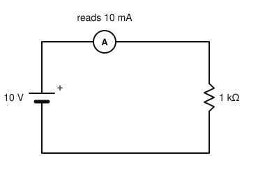
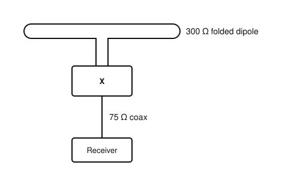
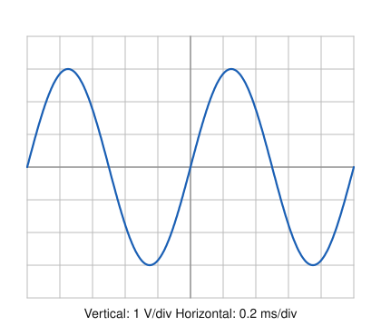

# IRTS HAREC Practice Exam — Set 10

60 questions · 2 hours · pass mark 60% **in each section** (at least 18/30 in Section A and 18/30 in Section B).
Only ONE answer is correct for each question. Answers and short explanations are at the end.

> Unofficial practice paper based on the IRTS HAREC Exam Syllabus (Rev 2.0.2), the IRTS Sample Exam Paper 2022 and the IRTS HAREC Study Guide (4.0.3).
> Page numbers in the answer key are the **printed** page numbers of the Study Guide; in a PDF viewer, add 24 (e.g. p. 343 is PDF page 367).

---

## Section A: Technical

### A.1 Safety (5 questions)

**1.** A 200 W device runs from the 230 V mains. Which plug fuse gives the best protection?

- A) 3 A
- B) 5 A
- C) 10 A
- D) 13 A

**2.** Changes to your station's mains supply and protective earth should be carried out or certified by:

- A) Any radio amateur
- B) The IRTS
- C) A qualified electrician registered with Safe Electric, who issues a completion certificate
- D) ComReg

**3.** When erecting a mast, you should make sure that:

- A) It falls towards power lines if it fails
- B) If it falls, it cannot touch overhead power lines, people or property
- C) It is not guyed
- D) It is as close as possible to the house wiring

**4.** With a handheld transceiver, good practice to reduce exposure is to:

- A) Hold the antenna against your head
- B) Use the maximum power at all times
- C) Wrap the antenna around your wrist
- D) Keep the antenna away from your head and face, e.g. by using a speaker-microphone

**5.** Besides tissue heating, the ICNIRP guidelines are concerned that RF at frequencies up to about 10 MHz may cause:

- A) Electrostimulation of nerves (induced currents)
- B) Ionisation
- C) Radioactivity
- D) Magnetisation of bones

### A.2 Interference and Immunity (4 questions)

**6.** RF breakthrough into an audio amplifier from an SSB transmitter is typically heard as:

- A) A clean FM signal
- B) Distorted speech or "thumping" that follows your transmissions
- C) Nothing
- D) A constant 50 Hz hum only

**7.** The ALC line between a linear amplifier and its transceiver is used to:

- A) Supply power to the amplifier
- B) Carry audio
- C) Switch bands
- D) Reduce the transceiver's drive if the amplifier would be overdriven

**8.** Which combination is the usual approach to HF interference to TV?

- A) High-pass filter at the transmitter, low-pass filter at the TV
- B) No filters
- C) Low-pass filter at the transmitter output, high-pass filter at the TV antenna input
- D) Band-pass filter in the mains lead

**9.** A common-mode choke at an antenna feed point helps to:

- A) Stop RF currents flowing on the outside of the coax braid and radiating near the house
- B) Increase the SWR
- C) Lower the antenna's resonant frequency
- D) Increase the transmitter power

### A.3 Electrical, Electromagnetic, and Radio Theory (4 questions)

**10.** A 400 W amplifier runs for 3 hours. How much energy does it use?

- A) 133 Wh
- B) 400 Wh
- C) 1.2 kWh
- D) 12 kWh

**11.** The metric prefix "pico" means:

- A) 10⁻¹²
- B) 10⁻⁹
- C) 10⁻⁶
- D) 10¹²

**12.** An absolute power of 17 dBW is approximately:

- A) 17 W
- B) 50 W
- C) 100 W
- D) 25 W

**13.** The polarisation of a radio wave is defined by the orientation of its:

- A) Magnetic field
- B) Direction of travel
- C) Frequency
- D) Electric field

### A.4 Components and Circuits (3 questions)

**14.** In the circuit shown, the ammeter reads 10 mA. What power is dissipated in the resistor?

- A) 10 W
- B) 0.1 W
- C) 1 W
- D) 0.01 W

**15.** As the losses in a tuned circuit increase, its Q factor:

- A) Increases
- B) Stays the same
- C) Becomes infinite
- D) Decreases (and the bandwidth increases)

**16.** The basic electrodes of a triode valve (in addition to the heater) are:

- A) Cathode, control grid and anode (plate)
- B) Base, collector and emitter
- C) Gate, drain and source
- D) Primary and secondary

### A.5 Transmitters and Receivers (4 questions)

**17.** In a simple FM transmitter, the modulation is commonly applied:

- A) To the power amplifier's supply voltage
- B) To the antenna
- C) To the oscillator, varying its frequency (e.g. with a varactor diode)
- D) To the low-pass filter

**18.** Image response in a superheterodyne receiver is unwanted reception of a signal:

- A) On the same frequency as the wanted signal
- B) Twice the IF away from the wanted signal (on the other side of the local oscillator)
- C) At the audio frequency
- D) At the second harmonic of the LO

**19.** A product detector is used to demodulate:

- A) SSB and CW
- B) FM only
- C) AM broadcast only
- D) Television

**20.** Harmonic distortion in an amplifier is caused by:

- A) Perfect linearity
- B) A low SWR
- C) Using a dummy load
- D) Non-linearity of the amplifier

### A.6 Antennas and Transmission Lines (4 questions)

**21.** You want to connect a 300 Ω folded dipole to 75 Ω coax as shown. What should block "X" be?

- A) A 1:1 balun
- B) A 9:1 unun
- C) A 4:1 balun
- D) Nothing — connect directly

**22.** For a half-wave dipole cut for 7 MHz (40 m), the radiating far field begins at roughly:

- A) 40 m (about one wavelength) from the antenna
- B) 1 m from the antenna
- C) 4 km from the antenna
- D) 400 km from the antenna

**23.** The approximate length of a half-wave dipole for 3.65 MHz is:

- A) 20 m
- B) 39 m
- C) 82 m
- D) 10 m

**24.** The difference between EIRP and ERP is that:

- A) EIRP is always smaller than ERP
- B) ERP is measured at the transmitter
- C) They are always identical
- D) ERP uses a half-wave dipole as reference, EIRP an isotropic radiator, so EIRP = ERP + 2.15 dB

### A.7 Propagation (4 questions)

**25.** Solar activity over the 11-year cycle is commonly tracked by:

- A) The phase of the Moon
- B) The SWR
- C) The sunspot number (and solar flux)
- D) The Earth's temperature

**26.** Signals sent vertically, or at very steep angles, that are bent a little by the ionosphere but do not return to Earth are known as:

- A) Escape waves
- B) Ground waves
- C) Space waves
- D) Sporadic E

**27.** The ionosphere is ionised mainly by:

- A) Lightning
- B) Radio transmitters
- C) Cosmic dust
- D) Ultraviolet and X-ray radiation from the Sun

**28.** For line-of-sight propagation, when the distance doubles, the received field strength:

- A) Doubles
- B) Halves
- C) Stays the same
- D) Falls to zero

### A.8 Measurements (2 questions)

**29.** Measuring the voltage across a high-resistance circuit with a voltmeter that has a low internal resistance will:

- A) Read correctly
- B) Damage the circuit permanently
- C) Load the circuit and give a reading that is too low
- D) Read too high

**30.** The oscilloscope is set to 1 V/div vertical and 0.2 ms/div horizontal. What is the frequency of the signal?

- A) 1 Hz
- B) 200 Hz
- C) 1 MHz
- D) 1 kHz

---

## Section B: Operating Rules, Procedures, and Regulations

### B.1 Phonetic Alphabet (1 question)

**31.** According to the ICAO recommendation, the number 5 is pronounced:

- A) FIVE
- B) FIFE
- C) PANTA
- D) FIEF

### B.2 Q-Codes (3 questions)

**32.** "QRL" sent without a question mark, in reply to "QRL?", means:

- A) The frequency is in use
- B) I am ready
- C) Increase power
- D) Who is calling me?

**33.** "QRP" (as an instruction) means:

- A) Increase power
- B) Stop transmitting
- C) Send slower
- D) Decrease power

**34.** "CQ" means:

- A) Confirm QSO
- B) Change frequency
- C) A general call to all stations
- D) Close down

### B.3 International Distress Signs, Emergency Traffic and Natural Disaster Communications (3 questions)

**35.** "MAYDAY" spoken on the radio indicates:

- A) A routine weather report
- B) Grave and imminent danger to life — a distress call
- C) A contest call
- D) A request for a QSL card

**36.** The emergency centres of activity in the band plans are:

- A) Reserved exclusively for emergencies at all times
- B) Only for ComReg use
- C) Beacon frequencies
- D) Centres of activity (traffic may be found about ±20 kHz away) that are not reserved but must be kept clear during emergencies

**37.** According to the ITU, the use of amateur stations to pass international messages on behalf of third parties is:

- A) Permitted in emergencies and for disaster relief
- B) Forbidden even in emergencies
- C) Permitted at any time
- D) Permitted only on 2 m

### B.4 Call Signs (3 questions)

**38.** Regarding Irish call signs, which is true?

- A) They are issued for 5 years
- B) They can be transferred to a family member
- C) They are issued for life; revoked call signs are not reissued
- D) They change when you move house

**39.** An Irish licensee wants to operate from an offshore island using the EJ prefix. They:

- A) Do not need to apply — they simply change EI to EJ
- B) Must apply to ComReg one month in advance
- C) Must use EJ/EI5ABC
- D) Must hold a Class 1 licence

**40.** The prefix for Hungary is:

- A) HU
- B) HG
- C) HB9
- D) HA

### B.5 Radio Spectrum Allocation in Ireland and IARU Band Plans (4 questions)

**41.** The band edges of the 20 m band in Ireland are:

- A) 14.000–14.350 MHz
- B) 14.000–14.250 MHz
- C) 14.000–14.400 MHz
- D) 14.100–14.350 MHz

**42.** On which band are contests permitted but maritime mobile operation NOT permitted?

- A) 80 m
- B) 160 m
- C) 40 m
- D) 20 m

**43.** The emergency centres of activity on the 4 m band used in Ireland are:

- A) 70.000 and 70.100 MHz
- B) 69.900 and 70.500 MHz
- C) 70.200 and 70.450 MHz
- D) 70.325 and 70.350 MHz

**44.** The WARC bands, on which contests are not held, are:

- A) 160 m, 80 m and 40 m
- B) 6 m, 4 m and 2 m
- C) 30 m, 17 m and 12 m
- D) 20 m, 15 m and 10 m

### B.6 Social Responsibility of Radio Amateur Operation and the Code of Conduct (3 questions)

**45.** Many on-air conflicts between operators are caused by:

- A) Lack of awareness of operating procedures, or changing propagation
- B) ComReg regulations
- C) Too many band plans
- D) Use of the phonetic alphabet

**46.** The IARU Ethics and Operating Procedures guide recommends that "/" in a call sign is pronounced:

- A) "Dash"
- B) "Bar"
- C) "Over"
- D) "Stroke"

**47.** Which is the correct way to begin a transmission?

- A) "Hello Mike, this is Louis"
- B) "Hi everyone"
- C) "EI6XYZ from EI5ABC"
- D) "5ABC here"

### B.7 Operating Procedures and Non-Interference (5 questions)

**48.** Your receiver's S-meter shows 10 dB over S9 and the signal is perfectly readable. You report:

- A) 5 and 10
- B) 59 plus 10 (10 over 59)
- C) 5 9 10
- D) 69

**49.** In Morse, the recommended way to ask whether a frequency is in use is:

- A) QRL? DE EI5ABC
- B) CQ?
- C) QRZ?
- D) QSY?

**50.** The principle that only one station transmits at a time in a QSO is known as:

- A) Duplex
- B) Splatter
- C) Diversity
- D) Simplex

**51.** In general, licensed amateur stations are permitted to communicate with:

- A) Anyone who can hear them
- B) Ships and aircraft
- C) Other licensed amateur stations (with exceptions for emergencies)
- D) Broadcast stations

**52.** Regarding changes to regulations (frequencies, power limits, modes), the licensee:

- A) Will be personally informed by ComReg
- B) Is required to keep up to date with them
- C) Can ignore them until the next 5-year confirmation
- D) Need only follow the regulations in force when the licence was issued

### B.8 ITU Radio Regulations (2 questions)

**53.** The ITU Radio Regulations require amateur stations to transmit their call sign:

- A) At short intervals during their transmissions
- B) Once a day
- C) Only at the start of a contact
- D) Only when asked

**54.** In the ITU emission designator J3E, the "3" means:

- A) Three sidebands
- B) Digital information without a subcarrier
- C) A single channel containing analogue information
- D) Telephony

### B.9 CEPT Regulations (3 questions)

**55.** In Ireland, the HAREC certificate is issued by:

- A) The IRTS
- B) The IARU
- C) CEPT
- D) ComReg

**56.** The prefix for Slovenia is:

- A) SL
- B) S5
- C) OM
- D) SV

**57.** The prefix for Luxembourg is:

- A) LX
- B) LU
- C) LB
- D) LY

### B.10 Irish Laws, Regulations, and Licence Conditions (3 questions)

**58.** An Irish Amateur Station Licence permits:

- A) Broadcasting to the public
- B) Operation from any address worldwide
- C) Keeping and operating an amateur station, at the addresses in the licence, using the bands, modes and powers specified
- D) Commercial messaging

**59.** A special event call sign is issued for a temporary period of:

- A) Exactly one day
- B) Five years
- C) The licensee's lifetime
- D) Usually a few days and up to a year

**60.** Under the current ComReg guidelines (09/45 R6), unanswered CQ calls:

- A) Must be logged
- B) No longer need to be logged
- C) Must be reported to ComReg
- D) Are not permitted

---

## Answer Key

| Q | Ans | Explanation (Study Guide page) |
|---|-----|-------------|
| 1 | A | 200/230 ≈ 0.87 A, so 3 A (lowest option) (p. 297) |
| 2 | C | Qualified electrician / Safe Electric certificate (p. 295) |
| 3 | B | Fall zone clear of power lines, people and property (p. 299) |
| 4 | D | Keep the antenna away from your head (p. 294) |
| 5 | A | Electrostimulation below ~10 MHz (p. 304) |
| 6 | B | Detected RF heard as distorted speech/thumps (p. 283) |
| 7 | D | ALC reduces drive (p. 289) |
| 8 | C | LPF at the TX, HPF at the TV (p. 286) |
| 9 | A | Stops common-mode current (p. 284) |
| 10 | C | 0.4 kW × 3 h = 1.2 kWh (p. 26) |
| 11 | A | 10⁻¹² (p. 15) |
| 12 | B | 17 dBW ≈ 50 W (p. 118) |
| 13 | D | Electric field (p. 86) |
| 14 | B | P = I²R = 0.01² × 1000 = 0.1 W (p. 23) |
| 15 | D | More loss = lower Q, wider bandwidth (p. 112) |
| 16 | A | Cathode, grid, anode (p. 125) |
| 17 | C | Vary the oscillator frequency (p. 180) |
| 18 | B | Image is 2 × IF away (p. 203) |
| 19 | A | SSB/CW (p. 198) |
| 20 | D | Non-linearity (p. 174) |
| 21 | C | 300:75 = 4:1, and the balun also converts balanced to unbalanced (p. 221) |
| 22 | A | ≈ 1λ ≈ 40 m (p. 226) |
| 23 | B | 143/3.65 ≈ 39 m (p. 231) |
| 24 | D | EIRP = ERP + 2.15 dB (p. 250) |
| 25 | C | Sunspot number / solar flux (p. 257) |
| 26 | A | They leave the planet (p. 264) |
| 27 | D | Solar UV/X-rays (p. 255) |
| 28 | B | 1/d in the far field (p. 262) |
| 29 | C | Loading effect (p. 273) |
| 30 | D | One cycle = 5 div × 0.2 ms = 1 ms, so f = 1 kHz (p. 276) |
| 31 | B | FIFE (p. 334) |
| 32 | A | The frequency is in use (p. 346) |
| 33 | D | Decrease power (p. 346) |
| 34 | C | General call (p. 349) |
| 35 | B | Distress (p. 350) |
| 36 | D | Centres of activity, not reserved (p. 344) |
| 37 | A | Emergencies/disaster relief (p. 350) |
| 38 | C | For life; not reissued (p. 336) |
| 39 | A | No application needed (p. 337) |
| 40 | D | Hungary = HA (p. 323) |
| 41 | A | 14.000–14.350 MHz (p. 343) |
| 42 | B | 160 m: contests yes, /MM no (p. 343) |
| 43 | D | 70.325 and 70.350 MHz (p. 345) |
| 44 | C | WARC bands (p. 342) |
| 45 | A | Lack of awareness / propagation changes (p. 357) |
| 46 | D | Stroke (p. 322) |
| 47 | C | Call signs, called station first (p. 359) |
| 48 | B | 59+10 (p. 369) |
| 49 | A | QRL? DE call (p. 362) |
| 50 | D | Simplex (p. 360) |
| 51 | C | Other amateurs (p. 361) |
| 52 | B | Keep up to date (p. 370) |
| 53 | A | Short intervals (p. 318) |
| 54 | C | Single analogue channel (p. 317) |
| 55 | D | ComReg (p. 320) |
| 56 | B | Slovenia = S5 (p. 323) |
| 57 | A | Luxembourg = LX (p. 323) |
| 58 | C | Scope of the licence (p. 327) |
| 59 | D | A few days, up to a year (p. 329) |
| 60 | B | CQ logging requirement removed in R6 (p. 331) |
