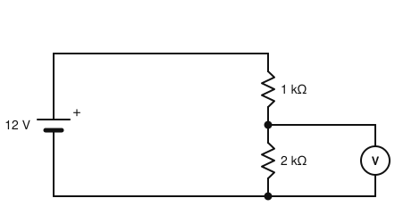
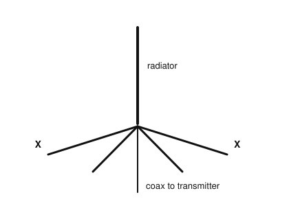
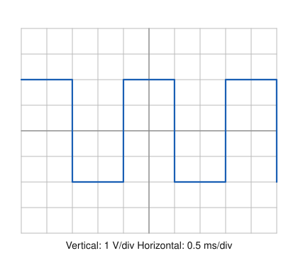

# IRTS HAREC Practice Exam — Set 11

60 questions · 2 hours · pass mark 60% **in each section** (at least 18/30 in Section A and 18/30 in Section B).
Only ONE answer is correct for each question. Answers and short explanations are at the end.

> Unofficial practice paper based on the IRTS HAREC Exam Syllabus (Rev 2.0.2), the IRTS Sample Exam Paper 2022 and the IRTS HAREC Study Guide (4.0.3).
> Page numbers in the answer key are the **printed** page numbers of the Study Guide; in a PDF viewer, add 24 (e.g. p. 343 is PDF page 367).

---

## Section A: Technical

### A.1 Safety (5 questions)

**1.** What is the most common cause of fatal electrical accidents?

- A) Ordinary 230 V mains circuits
- B) 12 V vehicle batteries
- C) RF from handheld radios
- D) Static electricity

**2.** An RCD (or ELCB) cuts the power when:

- A) The supply voltage drops below 200 V
- B) The load draws more than 13 A
- C) The currents in the live and neutral conductors become unequal by its rated amount
- D) The earth wire is disconnected

**3.** Where is the correct place for lightning protection of an antenna system?

- A) Inside the shack next to the transceiver
- B) Inside the transceiver
- C) In the mains plug
- D) Outdoors, not inside the house

**4.** Ground rods for a tower should be at least:

- A) 300 mm long and 5 mm in diameter
- B) 1500–2400 mm long and at least 12.5 mm in diameter
- C) 10 m long and 50 mm in diameter
- D) Any size, as long as they are copper

**5.** According to the RSGB pre-assessed configurations, a 40–160 m half-wave dipole fed with up to 400 W average power is likely to comply with ICNIRP if it is mounted at least ______ above most kinds of ground and nobody can remain closer than 2.2 m:

- A) 6.4 m
- B) 1 m
- C) 2.4 m
- D) 25 m

### A.2 Interference and Immunity (4 questions)

**6.** An unwanted emission at a whole-number multiple of the operating frequency is called:

- A) A parasitic oscillation
- B) A harmonic
- C) Cross-modulation
- D) An image

**7.** Interference picked up by a neighbour's equipment via its loudspeaker or mains cables is best tackled by:

- A) Increasing your transmitter power
- B) Moving to a higher band only
- C) Using an SWR meter
- D) Common-mode chokes (ferrites) or filters on the affected cables at the victim equipment

**8.** Radio equipment sold in the EU must meet the Radio Equipment Directive, which is:

- A) ICNIRP 2020
- B) Directive 2014/30/EU
- C) Directive 2014/53/EU
- D) T/R 61-02

**9.** Overmodulation of an AM transmitter results in:

- A) Splatter: distortion and a wider bandwidth that interferes with nearby frequencies
- B) A cleaner signal
- C) Lower SWR
- D) Reduced harmonics

### A.3 Electrical, Electromagnetic, and Radio Theory (4 questions)

**10.** A fully charged 12 V, 100 Ah battery stores approximately:

- A) 12 Wh
- B) 100 Wh
- C) 1.2 kWh
- D) 12 kWh

**11.** The mains supply in Ireland is nominally:

- A) 110 V, 60 Hz
- B) 230 V, 50 Hz
- C) 400 V, 60 Hz
- D) 230 V, 60 Hz

**12.** The ITU frequency band from 30 MHz to 300 MHz is called:

- A) HF
- B) UHF
- C) MF
- D) VHF

**13.** An absolute power of 32 dBW is approximately:

- A) 320 W
- B) 1000 W
- C) 1.6 kW
- D) 3.2 kW

### A.4 Components and Circuits (3 questions)

**14.** In the circuit shown, what does the (ideal) voltmeter V read?

- A) 4 V
- B) 6 V
- C) 8 V
- D) 12 V

**15.** Silvered mica capacitors are valued in RF circuits mainly for their:

- A) Very large capacitance
- B) Stability and low loss
- C) Ability to handle mains voltage
- D) Low cost

**16.** An electrolytic capacitor must be connected:

- A) With the correct polarity
- B) Only in AC circuits
- C) Only in RF circuits
- D) In series with an inductor

### A.5 Transmitters and Receivers (4 questions)

**17.** The driver stage of a transmitter:

- A) Generates the carrier frequency
- B) Filters out harmonics
- C) Measures the output power
- D) Amplifies the signal to the level needed to drive the power amplifier

**18.** In a superheterodyne receiver, the difference between the local oscillator frequency and the signal frequency is the:

- A) Intermediate frequency (IF)
- B) Image frequency
- C) Audio frequency
- D) Beat frequency of the BFO

**19.** Compared with AM, an SSB voice transmission:

- A) Uses twice the bandwidth
- B) Transmits a full carrier
- C) Uses about half the bandwidth and no carrier power
- D) Cannot be used on HF

**20.** A dummy load is used to:

- A) Increase antenna gain
- B) Test or adjust a transmitter without radiating a signal
- C) Measure field strength
- D) Store energy

### A.6 Antennas and Transmission Lines (4 questions)

**21.** In the ground plane antenna shown, the elements marked "X" are the:

- A) Directors
- B) Radials, forming an artificial ground (counterpoise)
- C) Traps
- D) Reflectors

**22.** Which type of feeder normally has the lowest loss?

- A) Thin coaxial cable
- B) Twisted mains flex
- C) Waveguide at HF
- D) Open-wire (ladder) line

**23.** A trap in a trap dipole is:

- A) A parallel LC circuit that isolates the outer part of the antenna on the higher band
- B) A resistor that absorbs power
- C) A lightning arrestor
- D) A coaxial balun

**24.** To obtain an ERP of 400 W from a 100 W transmitter, the net gain of feeder plus antenna must be:

- A) 3 dB
- B) 12 dB
- C) 6 dB
- D) 20 dB

### A.7 Propagation (4 questions)

**25.** Which ionospheric layer remains at night and supports long-distance HF contacts?

- A) D layer
- B) F (F2) layer
- C) E layer
- D) Troposphere

**26.** A roughly 27-day variation in HF conditions is linked to:

- A) The Moon's phases
- B) Seasonal weather
- C) The 11-year solar cycle
- D) The rotation of the Sun

**27.** Short-lived summer openings on 6 m across Europe are usually due to:

- A) Sporadic E
- B) Ground wave
- C) EME
- D) D-layer absorption

**28.** Compared with the optical horizon, the radio horizon at VHF is:

- A) Much closer
- B) Exactly the same
- C) Somewhat further away, because of atmospheric refraction
- D) Unlimited

### A.8 Measurements (2 questions)

**29.** The oscilloscope is set to 1 V/div vertical and 0.5 ms/div horizontal. What is the frequency of the square wave?

- A) 250 Hz
- B) 500 Hz
- C) 2 kHz
- D) 4 kHz

**30.** To measure the voltage of a battery with a multimeter, you should:

- A) Select a current range and connect it in series
- B) Select the resistance range
- C) Select an AC range and connect it in series
- D) Select a suitable DC voltage range and connect it across the terminals

---

## Section B: Operating Rules, Procedures, and Regulations

### B.1 Phonetic Alphabet (1 question)

**31.** In the phonetic alphabet, "Uniform" represents the letter:

- A) Y
- B) V
- C) U
- D) W

### B.2 Q-Codes (3 questions)

**32.** "QRM?" (as a question) means:

- A) Are you ready?
- B) Are you being interfered with?
- C) What is my frequency?
- D) Shall I send faster?

**33.** A station says "QSL via buro". This means:

- A) Change frequency
- B) Please wait
- C) Send your QTH
- D) I will confirm our contact by sending a card via the bureau

**34.** In telegraphy, how do you turn a Q-code into a question?

- A) Add a question mark after it
- B) Send it twice
- C) Send it in reverse
- D) Add K before it

### B.3 International Distress Signs, Emergency Traffic and Natural Disaster Communications (3 questions)

**35.** Which is the correct voice distress call?

- A) SOS SOS SOS
- B) CQ emergency
- C) MAYDAY MAYDAY MAYDAY
- D) QRT QRT QRT

**36.** The IARU Region 1 80 m emergency centre of activity is 3.760 MHz. Which frequency is used in Ireland?

- A) 3.700 MHz
- B) 3.660 MHz
- C) 3.630 MHz
- D) 3.760 MHz

**37.** Emergency traffic may be found within about ______ of an emergency centre of activity.

- A) ±1 kHz
- B) ±500 kHz
- C) ±5 MHz
- D) ±20 kHz

### B.4 Call Signs (3 questions)

**38.** In the normal ITU format, the third section of a call sign (the suffix):

- A) Has not more than four characters, the last of which must be a letter
- B) Must be exactly three digits
- C) Must start with a number
- D) May have any number of characters

**39.** An Irish licensee, EI5ABC, operating in Denmark under CEPT arrangements, signs:

- A) EI5ABC/DK
- B) OZ/EI5ABC
- C) DK/EI5ABC
- D) EI5ABC/OZ

**40.** The national prefix for Czechia is:

- A) CZ
- B) CS
- C) CK
- D) OK

### B.5 Radio Spectrum Allocation in Ireland and IARU Band Plans (4 questions)

**41.** Which of these bands has NO emergency centre of activity used in Ireland?

- A) 12 m
- B) 20 m
- C) 17 m
- D) 40 m

**42.** The 17 m band (18.068–18.168 MHz) is allocated in Ireland on a:

- A) Secondary basis, 15 W EIRP
- B) Secondary basis, 100 W
- C) Primary basis, 400 W
- D) Primary basis, 50 W

**43.** The propagation beacon range 24.929–24.931 MHz is in the:

- A) 10 m band
- B) 12 m band
- C) 15 m band
- D) 17 m band

**44.** In the IARU R1 80 m band plan, 3555 kHz is:

- A) The SSB QRP centre of activity
- B) The emergency centre of activity
- C) A beacon frequency
- D) The CW QRS (slow Morse) centre of activity

### B.6 Social Responsibility of Radio Amateur Operation and the Code of Conduct (3 questions)

**45.** The code-of-conduct principle of "comprehension" means:

- A) Others may not share your knowledge; if you correct them, do it positively and politely
- B) You must understand every language
- C) You must comprehend the licence conditions
- D) Only experts may transmit

**46.** ComReg recognises self-regulation in amateur radio by:

- A) Running the IRTS
- B) Assigning frequencies for each QSO
- C) Recommending compliance with the IARU Region 1 band plans instead of setting its own mode segments
- D) Monitoring all contacts

**47.** Between radio amateurs, surnames are:

- A) Always required
- B) Used rarely — first names (or nicknames) and call signs are normal
- C) Used instead of call signs
- D) Forbidden by law

### B.7 Operating Procedures and Non-Interference (5 questions)

**48.** The S value in a signal report should normally be taken from:

- A) The transmitter power
- B) Your own estimate of the distance
- C) The SWR meter
- D) Your receiver's S meter

**49.** When answering a CQ, why is it usually not necessary to repeat your own call sign many times?

- A) The CQ station will repeat back what they heard, giving you a chance to correct it
- B) Call signs are optional
- C) ComReg forbids it
- D) It wastes battery power

**50.** Why should you ask "Is this frequency in use?" even when the frequency sounds clear?

- A) It is required for every over
- B) To test your microphone
- C) A station you cannot hear may be using it, and its partner may hear you
- D) To measure the SWR

**51.** Some countries suggest that stations identify at least every:

- A) 30 seconds
- B) 5 minutes
- C) 2 hours
- D) 24 hours

**52.** Conducting business on the air in Ireland is:

- A) Allowed at weekends
- B) Allowed on VHF
- C) Allowed if the business is radio-related
- D) Not allowed — amateur radio is of a non-pecuniary character

### B.8 ITU Radio Regulations (2 questions)

**53.** The amateur service is carried out by duly authorised persons interested in radio technique solely with a personal aim and:

- A) Without pecuniary interest
- B) For commercial gain
- C) On behalf of broadcasters
- D) Only for emergency services

**54.** In the emission designator J3E, the letter E indicates:

- A) Digital data
- B) Morse by ear
- C) Telephony (voice)
- D) Facsimile

### B.9 CEPT Regulations (3 questions)

**55.** Under CEPT T/R 61-01, the duration of a "short visit" is:

- A) Always exactly 30 days
- B) Always one year
- C) Unlimited
- D) Defined by each country, usually up to 3 months

**56.** The USA has adopted:

- A) Both T/R 61-01 and T/R 61-02
- B) Only T/R 61-01 (so Irish CEPT licensees can operate there as visitors)
- C) Only T/R 61-02
- D) Neither

**57.** The national prefix for Switzerland is:

- A) HB9
- B) SZ
- C) CH
- D) SW

### B.10 Irish Laws, Regulations, and Licence Conditions (3 questions)

**58.** If the address of your amateur station changes:

- A) Nothing needs to be done
- B) You must re-sit the HAREC exam
- C) An amendment to the licence is required
- D) You get a new call sign

**59.** The land mobile power limit in the contiguous part of the 60 m band is:

- A) 50 W
- B) 15 W EIRP (12 dBW)
- C) 10 W
- D) 200 W PEP

**60.** In the station logbook, the power level is recorded in:

- A) dBW or W
- B) Amperes
- C) Volts
- D) S units

---

## Answer Key

| Q | Ans | Explanation (Study Guide page) |
|---|-----|-------------|
| 1 | A | Ordinary 230 V circuits are the most common cause of fatal accidents (p. 295) |
| 2 | C | It trips on a live/neutral current imbalance, usually 30 mA (p. 295) |
| 3 | D | Lightning protection belongs outdoors (p. 300) |
| 4 | B | 1500–2400 mm long, ≥ 12.5 mm diameter (p. 300) |
| 5 | A | 6.4 m height and 2.2 m separation at 400 W (p. 309) |
| 6 | B | Harmonics are integer multiples of the wanted frequency (p. 287) |
| 7 | D | Common-mode currents on the cables are choked at the victim equipment (p. 284) |
| 8 | C | RED = 2014/53/EU (the EMC Directive is 2014/30/EU) (p. 332) |
| 9 | A | Overmodulation produces splatter (p. 290) |
| 10 | C | 12 V × 100 Ah = 1200 Wh = 1.2 kWh (p. 26) |
| 11 | B | 230 V, 50 Hz (p. 17) |
| 12 | D | VHF = 30–300 MHz (p. 82) |
| 13 | C | 30 dBW = 1 kW, +2 dB ≈ ×1.6 → about 1.6 kW (p. 118) |
| 14 | C | I = 12/3000 = 4 mA; V = 4 mA × 2 kΩ = 8 V (p. 29) |
| 15 | B | Silvered mica is stable and low-loss (p. 94) |
| 16 | A | Electrolytics are polarised (p. 94) |
| 17 | D | The driver raises the level for the PA (p. 175) |
| 18 | A | The mixer difference output is the IF (p. 188) |
| 19 | C | SSB: one sideband, carrier suppressed (p. 142) |
| 20 | B | It absorbs the power instead of radiating it (p. 186) |
| 21 | B | Elevated radials act as a counterpoise (p. 239) |
| 22 | D | Open-wire line has very low loss (p. 206) |
| 23 | A | Parallel-resonant traps "cut off" the outer sections on the higher band (p. 238) |
| 24 | C | ×4 = 6 dB (p. 250) |
| 25 | B | The F2 layer persists at night (p. 259) |
| 26 | D | The Sun rotates about every 27 days (p. 257) |
| 27 | A | Sporadic E is typical in summer on 10, 6 and 4 m (p. 260) |
| 28 | C | Refraction bends VHF waves slightly beyond the optical horizon (p. 261) |
| 29 | B | One cycle = 4 div × 0.5 ms = 2 ms → 500 Hz (p. 274) |
| 30 | D | Voltmeter: in parallel, on a DC range above the expected value (p. 272) |
| 31 | C | Uniform = U (p. 335) |
| 32 | B | QRM? = are you being interfered with? (p. 346) |
| 33 | D | QSL card via the bureau (p. 348) |
| 34 | A | Simply add "?" (p. 348) |
| 35 | C | MAYDAY is the radiotelephony distress signal (p. 350) |
| 36 | B | Ireland uses 3.660 MHz (p. 343) |
| 37 | D | Centres of activity: about ±20 kHz (p. 344) |
| 38 | A | Up to four characters, ending in a letter (p. 336) |
| 39 | B | Visited country prefix + "/" + own call (p. 322) |
| 40 | D | Czechia = OK (p. 323) |
| 41 | A | Bands with emergency CoAs: 80, 40, 20, 17, 15, 4, 2 m and 70 cm (p. 345) |
| 42 | C | 17 m: primary, 400 W, no contests (p. 343) |
| 43 | B | 12 m = 24.890–24.990 MHz (p. 344) |
| 44 | D | 3555 kHz = CW QRS centre of activity (p. 339) |
| 45 | A | Offer helpful, constructive criticism politely (p. 356) |
| 46 | C | ComReg 09/45 recommends the IARU R1 band plans (p. 357) |
| 47 | B | First name + call sign is the norm (p. 358) |
| 48 | D | Report the S-meter reading (p. 368) |
| 49 | A | The calling station repeats back your call (p. 366) |
| 50 | C | There may be no propagation path from the transmitting station to you (p. 363) |
| 51 | B | A 5-minute rule is suggested in some countries (p. 361) |
| 52 | D | Non-pecuniary character (p. 361) |
| 53 | A | ITU definition: without pecuniary interest (p. 315) |
| 54 | C | E = telephony (p. 317) |
| 55 | D | Set by each country, usually up to 3 months (p. 322) |
| 56 | B | The USA adopted only T/R 61-01 (p. 320) |
| 57 | A | Switzerland = HB9 (p. 323) |
| 58 | C | The licence details must be updated (amendment) (p. 328) |
| 59 | B | The 15 W EIRP limit also applies to /M (p. 329) |
| 60 | A | Power level (dBW or W) (p. 331) |
