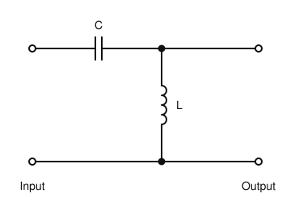
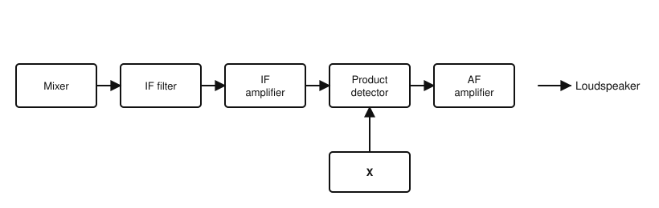
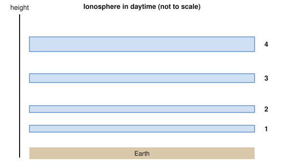

# IRTS HAREC Practice Exam — Set 12

60 questions · 2 hours · pass mark 60% **in each section** (at least 18/30 in Section A and 18/30 in Section B).
Only ONE answer is correct for each question. Answers and short explanations are at the end.

> Unofficial practice paper based on the IRTS HAREC Exam Syllabus (Rev 2.0.2), the IRTS Sample Exam Paper 2022 and the IRTS HAREC Study Guide (4.0.3).
> Page numbers in the answer key are the **printed** page numbers of the Study Guide; in a PDF viewer, add 24 (e.g. p. 343 is PDF page 367).

---

## Section A: Technical

### A.1 Safety (5 questions)

**1.** A 1.2 kW amplifier power supply runs from the 230 V mains. Which plug fuse is appropriate?

- A) 3 A
- B) 5 A
- C) 13 A
- D) 30 A

**2.** Why should you never rely on bleeder resistors alone to discharge high-voltage capacitors?

- A) They are a frequent point of failure
- B) They increase the voltage
- C) They are only fitted to valve receivers
- D) They discharge too quickly

**3.** Keeping one hand behind your back when working on high voltages helps to:

- A) Keep your balance
- B) Avoid a current path from one hand, across your chest, to the other
- C) Earth the equipment
- D) Reduce RF exposure

**4.** You get RF burns from the metal case of your transceiver or microphone. A likely cause is:

- A) The mains fuse is too small
- B) The SWR is exactly 1:1
- C) The antenna is too high
- D) Improperly earthed equipment carrying RF (e.g. common-mode current from the coax)

**5.** With a high-gain Yagi or dish antenna, particular care is needed to ensure that people cannot be:

- A) Behind the reflector
- B) Below the rotator
- C) Directly in front of the beam at close range
- D) In another room of the house

### A.2 Interference and Immunity (4 questions)

**6.** Electromagnetic compatibility (EMC) means:

- A) Equipment that works only with the same brand
- B) The ability of equipment to work properly in its electromagnetic environment without causing intolerable disturbance to others
- C) Compatibility with the mains voltage
- D) Connecting coax of the same impedance

**7.** Intermodulation is:

- A) The mixing of two or more signals in a non-linear device, producing new, unwanted frequencies
- B) Fading caused by multipath
- C) Distortion of the audio only
- D) The modulation of a carrier by speech

**8.** For a ferrite ring to be effective as a common-mode choke at HF, it usually helps to:

- A) Glue it to the transceiver
- B) Use it only on the mains plug
- C) Paint it
- D) Pass several turns of the cable through the ring

**9.** A receiver is overloaded by strong signals outside the band you are listening to. What may help?

- A) A longer feeder
- B) Turning up the AF gain
- C) A band-pass filter at the receiver input (or an attenuator)
- D) A higher-gain antenna

### A.3 Electrical, Electromagnetic, and Radio Theory (4 questions)

**10.** A current of 0.5 A flows through a 220 Ω resistor. The voltage across it is:

- A) 440 V
- B) 110 V
- C) 220.5 V
- D) 2.3 mV

**11.** A signal has a wavelength of 2 m. Its frequency is about:

- A) 150 MHz
- B) 15 MHz
- C) 600 MHz
- D) 1.5 MHz

**12.** A loss of 10 dB corresponds to a power ratio of:

- A) 0.5
- B) 0.25
- C) 2
- D) 0.1

**13.** Quantisation in an analogue-to-digital converter (ADC) means:

- A) Taking samples at regular time intervals
- B) Filtering the input
- C) Rounding each sample to one of a finite set of digital values
- D) Converting digital back to analogue

### A.4 Components and Circuits (3 questions)

**14.** A tuned circuit resonant at 3.6 MHz has a Q of 100. Its bandwidth is about:

- A) 3.6 kHz
- B) 36 kHz
- C) 360 kHz
- D) 100 kHz

**15.** The circuit shown is a:

- A) Low-pass filter
- B) Band-stop filter
- C) Band-pass filter
- D) High-pass filter

**16.** A light-emitting diode (LED) is normally operated:

- A) Reverse biased, with no resistor
- B) Directly across the mains
- C) Forward biased, with a series current-limiting resistor
- D) Only on AC

### A.5 Transmitters and Receivers (4 questions)

**17.** In a superheterodyne receiver, rejection of the image frequency is mainly provided by:

- A) Selective filtering before the mixer (RF stages)
- B) The audio amplifier
- C) The AGC
- D) The S meter

**18.** Compared with FM, the duty cycle placed on a transmitter's power amplifier by CW is:

- A) Higher — CW is a continuous carrier
- B) Lower — the carrier is keyed on and off
- C) Exactly the same
- D) Zero

**19.** In the receiver shown, block "X" feeds the product detector. When receiving CW or SSB, X is the:

- A) Local oscillator for the first mixer
- B) Squelch
- C) Discriminator
- D) Beat frequency oscillator (BFO)

**20.** In an FM receiver, the limiter:

- A) Limits the audio volume
- B) Limits the bandwidth to 3 kHz
- C) Removes amplitude variations (noise) before the discriminator
- D) Limits transmitter power

### A.6 Antennas and Transmission Lines (4 questions)

**21.** Common-mode current on a coaxial feeder flows:

- A) Only on the inner conductor
- B) On the outside surface of the braid
- C) Only inside the dielectric
- D) Only in the antenna

**22.** A disadvantage of open-wire (parallel) feeder compared with coax is that it:

- A) Has higher loss
- B) Cannot handle high power
- C) Is unbalanced
- D) Must be kept away from metal objects and other conductors

**23.** The feed point impedance of a quarter-wave vertical with radials on the ground is roughly:

- A) 36 Ω
- B) 300 Ω
- C) 600 Ω
- D) 2000 Ω

**24.** To make a resonant half-wave dipole work on a lower frequency, it must be:

- A) Shorter
- B) Fed with higher power
- C) Longer
- D) Mounted vertically

### A.7 Propagation (4 questions)

**25.** In the daytime ionosphere shown, which numbered layer mainly absorbs lower HF signals?

- A) Layer 4
- B) Layer 3
- C) Layer 2
- D) Layer 1

**26.** The maximum usable frequency (MUF) on a given HF path is usually:

- A) Higher in daytime than at night
- B) Higher at night than in daytime
- C) The same at all times
- D) Below 1 MHz

**27.** Reliable 2 m FM contacts over a few tens of kilometres normally use:

- A) Sky wave via the F2 layer
- B) Line-of-sight (space wave) propagation
- C) EME
- D) Ground wave over the sea only

**28.** During an auroral opening on 2 m, stations in Ireland usually point their beams:

- A) South
- B) Straight up
- C) Northwards, towards the aurora
- D) At the Moon

### A.8 Measurements (2 questions)

**29.** To measure a 13.8 V DC supply on a multimeter with ranges 2 V, 20 V and 200 V DC, you should choose:

- A) The 2 V range
- B) The 200 mA range
- C) The resistance range
- D) The 20 V DC range

**30.** An SWR meter shows 100 W forward and 0 W reflected power. The SWR is:

- A) Infinite
- B) 1:1
- C) 2:1
- D) 100:1

---

## Section B: Operating Rules, Procedures, and Regulations

### B.1 Phonetic Alphabet (1 question)

**31.** "Sierra Papa Five Kilo X-ray" spells the call sign:

- A) SP5KX
- B) SB5KX
- C) CP5KX
- D) SP5QX

### B.2 Q-Codes (3 questions)

**32.** "QSY?" means:

- A) Is my signal fading?
- B) What is your location?
- C) Shall I change frequency?
- D) Who is calling me?

**33.** The operational abbreviation "TX" means:

- A) Thanks
- B) Telex
- C) Text message
- D) Transmitter

**34.** "QRN" means you are bothered by:

- A) Interference from other stations
- B) Static or noise of natural (atmospheric) origin
- C) Fading
- D) A busy frequency

### B.3 International Distress Signs, Emergency Traffic and Natural Disaster Communications (3 questions)

**35.** Which of these is one of Ireland's Principal Emergency Services (PES)?

- A) The Fire Service
- B) The Irish Red Cross
- C) Civil Defence
- D) The Order of Malta

**36.** The Irish emergency centre of activity 14.300 MHz is in the:

- A) 40 m band
- B) 17 m band
- C) 20 m band
- D) 15 m band

**37.** You own a repeater but have no emergency communications training. What can you do?

- A) Nothing — only trained operators can help
- B) Pass emergency traffic yourself
- C) Switch it off during emergencies
- D) Offer it to an approved emergency communications organisation such as AREN

### B.4 Call Signs (3 questions)

**38.** A call sign such as EI9VAB is issued to:

- A) A special event station
- B) A licensed visitor from a non-CEPT country under a reciprocal agreement
- C) A repeater
- D) A club

**39.** A German licensee (DL1ABC) visiting the Aran island of Inishmore under CEPT arrangements uses:

- A) EJ/DL1ABC
- B) EI/DL1ABC
- C) DL1ABC/EJ
- D) EJ1ABC

**40.** The national prefix for Romania is:

- A) RO
- B) YR
- C) YO
- D) RA

### B.5 Radio Spectrum Allocation in Ireland and IARU Band Plans (4 questions)

**41.** Which band is allocated on a secondary basis in Ireland but still permits contests?

- A) 60 m
- B) 30 m
- C) 6 m
- D) 17 m

**42.** Is maritime mobile operation permitted on the 2 m band?

- A) No
- B) Yes, at up to 10 W
- C) Yes, at up to 400 W
- D) Only in harbours

**43.** In the IARU R1 80 m band plan, 3690 kHz is the:

- A) Emergency centre of activity
- B) CW QRP centre of activity
- C) Digital voice centre of activity
- D) SSB QRP centre of activity

**44.** In the simplified 80 m band plan, 3600–3650 kHz is:

- A) All modes, SSB contest preferred
- B) CW only
- C) Beacons
- D) Narrow-band digimodes only

### B.6 Social Responsibility of Radio Amateur Operation and the Code of Conduct (3 questions)

**45.** Conflicts between amateurs can arise mainly because:

- A) ComReg assigns the same frequency to everyone
- B) The radio spectrum is a space shared by everyone with their own interests and goals
- C) Band plans do not exist
- D) Amateurs may only use one band

**46.** Contesting aims to:

- A) Make the longest possible QSOs
- B) Test antennas only
- C) Make many error-free, correctly logged contacts
- D) Jam other stations

**47.** In written amateur communications, the usual greeting "73" means:

- A) Best regards
- B) Love and kisses
- C) Goodbye forever
- D) Thank you for the QSO

### B.7 Operating Procedures and Non-Interference (5 questions)

**48.** The T in an RST report describes:

- A) The time of the contact
- B) The temperature
- C) The transmitter power
- D) The tone quality of a Morse or digital signal

**49.** On HF, a "DX" station is usually one that is:

- A) In the same town
- B) On another continent
- C) Using digital modes
- D) Operating mobile

**50.** You call CQ DX and a station that is not DX for you answers. You should:

- A) Ignore them
- B) Tell them off
- C) Be obliging: make a quick QSO and then call DX again
- D) Report them

**51.** From an operating point of view, during a contest the best practice is to identify:

- A) At each QSO (not necessarily each over)
- B) Never
- C) Once per hour
- D) Only at the end of the contest

**52.** The Wireless Telegraphy regulations make it illegal to cause harmful interference to other users, notably:

- A) Other amateurs on CW
- B) Broadcast listeners only
- C) CB users
- D) Radionavigation and radiocommunications services

### B.8 ITU Radio Regulations (2 questions)

**53.** In ITU emission designators, the first letter G means:

- A) Amplitude modulation
- B) Frequency modulation
- C) Phase modulation
- D) Single sideband

**54.** How many of the amateur bands in the exam syllabus are allocated on a secondary basis?

- A) Four (5, 10, 50 and 70 MHz)
- B) None
- C) All of them
- D) Two

### B.9 CEPT Regulations (3 questions)

**55.** In most countries, a CEPT licence is treated as equivalent to:

- A) A listening permit
- B) The highest national amateur licence, subject to conditions
- C) A CB licence
- D) A broadcasting licence

**56.** The national prefix for Estonia is:

- A) EE
- B) ET
- C) YL
- D) ES

**57.** The national prefix for Slovakia is:

- A) SK
- B) OK
- C) OM
- D) S5

### B.10 Irish Laws, Regulations, and Licence Conditions (3 questions)

**58.** Who issues Amateur Station Licences in Ireland?

- A) ComReg
- B) The IRTS
- C) The Department of Communications
- D) CEPT

**59.** Which of these needs a formal additional authorisation from ComReg?

- A) Operating /M
- B) Using CW
- C) Logging in UTC
- D) An Internet gateway or other automatic/remote station

**60.** The logbook must record, for each day, the times in UTC of:

- A) Every over
- B) The first and last transmissions, and changes of band, mode or power
- C) Only CQ calls
- D) Meals

---

## Answer Key

| Q | Ans | Explanation (Study Guide page) |
|---|-----|-------------|
| 1 | C | 1200/230 ≈ 5.2 A; a 13 A fuse allows up to about 2990 W (p. 298) |
| 2 | A | Bleeder resistors often fail; always use a shorting stick (p. 298) |
| 3 | B | Prevents a hand-to-hand path across the chest (p. 293) |
| 4 | D | RF on improperly earthed equipment, often common-mode current (p. 294) |
| 5 | C | Fields are concentrated in front of directional antennas (p. 306) |
| 6 | B | Definition of EMC (p. 282) |
| 7 | A | Non-linear mixing creates intermodulation products (p. 288) |
| 8 | D | Multiple turns increase the choking impedance (p. 285) |
| 9 | C | Front-end filtering keeps strong out-of-band signals out (p. 286) |
| 10 | B | V = IR = 0.5 × 220 = 110 V (p. 22) |
| 11 | A | f = 300/λ = 300/2 = 150 MHz (p. 40) |
| 12 | D | −10 dB = one tenth (p. 116) |
| 13 | C | Quantisation maps each sample to a discrete level (p. 58) |
| 14 | B | BW = f/Q = 3600 kHz / 100 = 36 kHz (p. 102) |
| 15 | D | Series C blocks low frequencies; shunt L shorts low frequencies to ground (p. 108) |
| 16 | C | LEDs need forward bias and current limiting (p. 120) |
| 17 | A | The image must be removed before the mixer (p. 203) |
| 18 | B | FM is 100% duty; CW is keyed (p. 171) |
| 19 | D | The BFO/CIO feeds the product detector (p. 195) |
| 20 | C | FM carries information in frequency, so amplitude noise is clipped (p. 195) |
| 21 | B | Common-mode current flows on the outside of the shield (p. 214) |
| 22 | D | Nearby conductors upset the balance of parallel lines (p. 209) |
| 23 | A | About half of a dipole's 73 Ω (p. 241) |
| 24 | C | Length is proportional to wavelength (p. 231) |
| 25 | D | The lowest layer, the D layer, absorbs low HF in daytime (p. 259) |
| 26 | A | Solar ionisation in daytime raises the MUF (p. 269) |
| 27 | B | VHF relies on line-of-sight propagation (p. 261) |
| 28 | C | Signals scatter off the aurora to the north (p. 257) |
| 29 | D | Choose the lowest range above the expected value (p. 272) |
| 30 | B | No reflected power = perfect match (p. 274) |
| 31 | A | S-P-5-K-X (p. 334) |
| 32 | C | QSY? = shall I change frequency? (p. 347) |
| 33 | D | TX = transmitter (p. 349) |
| 34 | B | QRN = atmospherics (p. 346) |
| 35 | A | PES: Garda, Ambulance Service, Fire Service (and the Irish Coast Guard) (p. 352) |
| 36 | C | 20 m = 14.000–14.350 MHz (p. 343) |
| 37 | D | You can make equipment available without passing traffic (p. 351) |
| 38 | B | Visitor call signs have V after the number (p. 337) |
| 39 | A | EJ/ for Irish offshore islands (p. 322) |
| 40 | C | Romania = YO (p. 323) |
| 41 | C | 6 m: secondary, 100 W, contests yes (p. 343) |
| 42 | B | 2 m permits /MM; the /MM limit is 10 W (p. 343) |
| 43 | D | 3690 kHz = SSB QRP CoA (p. 339) |
| 44 | A | All modes, SSB contest preferred (p. 339) |
| 45 | B | The spectrum is shared by all (p. 357) |
| 46 | C | Many error-free logged contacts (p. 358) |
| 47 | A | 73 = best regards (p. 358) |
| 48 | D | T = tone (CW/digital) (p. 369) |
| 49 | B | DX on HF = another continent (p. 364) |
| 50 | C | Be obliging and polite (p. 365) |
| 51 | A | Identify at each QSO (p. 361) |
| 52 | D | Notably radionavigation and radiocommunications services (p. 370) |
| 53 | C | G = phase modulation (p. 317) |
| 54 | A | 5, 10, 50 and 70 MHz (p. 316) |
| 55 | B | Equivalent to the highest licence, with conditions (p. 321) |
| 56 | D | Estonia = ES (p. 323) |
| 57 | C | Slovakia = OM (p. 323) |
| 58 | A | ComReg issues the licences (p. 327) |
| 59 | D | Automatic or remote stations need authorisation (p. 331) |
| 60 | B | First/last transmissions and changes (p. 331) |
