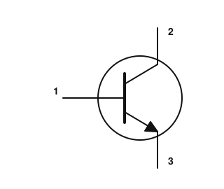
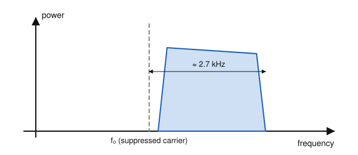
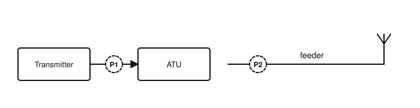

# IRTS HAREC Practice Exam — Set 16

60 questions · 2 hours · pass mark 60% **in each section** (at least 18/30 in Section A and 18/30 in Section B).
Only ONE answer is correct for each question. Answers and short explanations are at the end.

> Unofficial practice paper based on the IRTS HAREC Exam Syllabus (Rev 2.0.2), the IRTS Sample Exam Paper 2022 and the IRTS HAREC Study Guide (4.0.3).
> Page numbers in the answer key are the **printed** page numbers of the Study Guide; in a PDF viewer, add 24 (e.g. p. 343 is PDF page 367).

---

## Section A: Technical

### A.1 Safety (5 questions)

**1.** Why should you not fit a 13 A fuse in the plug of a device that draws only 1 A?

- A) It would blow immediately
- B) It is illegal in Ireland
- C) It would not protect against faults drawing less than 13 A
- D) It increases RF interference

**2.** Why should a low-resistance DC path to ground (through an RF choke) be provided at the output of a valve linear amplifier?

- A) To increase the output power
- B) To stop a failed DC blocking capacitor putting high DC voltage on the antenna
- C) To tune the antenna
- D) To reduce harmonics

**3.** Short-circuiting a high-capacity battery:

- A) Is a good way to test it
- B) Recharges it
- C) Is harmless at 12 V
- D) Risks fire or explosion

**4.** For mobile operation, the Study Guide recommends carrying:

- A) A suitable fire extinguisher
- B) A spare antenna only
- C) A frequency counter
- D) A dummy load

**5.** If you set up a station at a public event (e.g. a field day), regarding RF exposure you have:

- A) No responsibility
- B) Responsibility only for licensed visitors
- C) A duty of care towards the general public
- D) Responsibility only if ComReg is present

### A.2 Interference and Immunity (4 questions)

**6.** Older passive infrared (PIR) sensors in alarms or security lights may:

- A) Improve your reception
- B) Be falsely triggered by nearby transmissions because they lack immunity
- C) Cause key clicks
- D) Absorb harmonics

**7.** Which antenna is generally less prone to causing EMC problems in the house?

- A) An end-fed half-wave very close to the radio room
- B) A magnetic loop on the desk
- C) A Yagi pointed at the neighbour's house
- D) A symmetrical half-wave dipole placed away from the house

**8.** Bending parallel (open-wire) feeder sharply or running it near metal can cause:

- A) Unequal currents and feedline radiation
- B) Lower losses
- C) Better matching
- D) Higher velocity factor

**9.** Operating a transmitter or amplifier with its covers or shields removed is:

- A) Recommended for cooling
- B) Fine on HF
- C) Unsafe and likely to cause EMC problems
- D) Required for tuning

### A.3 Electrical, Electromagnetic, and Radio Theory (4 questions)

**10.** A heater draws 2 A from 230 V. Its resistance is:

- A) 460 Ω
- B) 232 Ω
- C) 0.0087 Ω
- D) 115 Ω

**11.** Direct current (DC):

- A) Flows in one direction only
- B) Reverses direction 50 times a second
- C) Exists only in antennas
- D) Is the same as RF

**12.** A Software Defined Radio (SDR) used as a broadband receiver can:

- A) Only receive one narrow channel
- B) Only transmit
- C) Digitise and display a wide range of frequencies at once
- D) Work without an antenna

**13.** The wavelength of a 3.6 MHz signal is about:

- A) 8.3 m
- B) 83 m
- C) 36 m
- D) 1080 m

### A.4 Components and Circuits (3 questions)

**14.** The inductance of a coil is increased by:

- A) Adding more turns or a ferrite/iron core
- B) Using thicker insulation
- C) Removing turns
- D) Increasing the current

**15.** In a purely inductive AC circuit, the current:

- A) Leads the voltage by 90°
- B) Is in phase with the voltage
- C) Lags the voltage by 90°
- D) Is zero

**16.** In the bipolar transistor symbol shown, terminal 3 (with the arrow) is the:

- A) Base
- B) Collector
- C) Gate
- D) Emitter

### A.5 Transmitters and Receivers (4 questions)

**17.** The figure shows the spectrum of a voice transmission. Which mode is it?

- A) LSB
- B) AM
- C) USB
- D) FM

**18.** In many SSB transmitters, the signal is generated at a fixed frequency and moved to the operating frequency by:

- A) A frequency multiplier
- B) A mixer fed by a VFO
- C) The ALC
- D) A low-pass filter

**19.** The S meter reading in a receiver is typically derived from:

- A) The signal level (e.g. via the AGC)
- B) The transmitter power
- C) The SWR
- D) The audio volume control

**20.** In a fully digital SDR transmitter, the RF signal is generated directly by:

- A) A crystal oscillator and frequency multiplier
- B) A valve oscillator
- C) A balanced modulator
- D) Direct digital synthesis (an NCO and a DAC)

### A.6 Antennas and Transmission Lines (4 questions)

**21.** For the feeder to run with low SWR, where should an ATU be placed?

- A) At the transmitter
- B) At the antenna feed point
- C) Halfway along the feeder
- D) In the mains supply

**22.** The loss of a transmission line increases with:

- A) Lower frequency and shorter length
- B) Lower SWR
- C) Higher frequency, greater length and higher SWR
- D) Lower power

**23.** A Yagi radiates 100 W ERP forwards and 1 W ERP backwards. Its front-to-back ratio is:

- A) 20 dB
- B) 10 dB
- C) 100 dB
- D) 3 dB

**24.** The gain of a parabolic dish antenna increases when:

- A) The frequency is lowered
- B) The dish is made smaller
- C) The feeder is longer
- D) The dish is made larger (or the frequency raised)

### A.7 Propagation (4 questions)

**25.** The critical frequency is measured by sending signals:

- A) Horizontally along the ground
- B) Vertically upwards (vertical incidence)
- C) To the Moon
- D) Through a waveguide

**26.** Fading of HF signals can distort SSB or AM because:

- A) The transmitter drifts
- B) The SWR changes
- C) Different frequencies within the signal can fade differently (selective fading)
- D) The D layer reflects them

**27.** The D layer is found at a height of roughly:

- A) 60–90 km
- B) 10 km
- C) 300 km
- D) 1000 km

**28.** For VHF line-of-sight paths, the radio horizon distance increases when:

- A) The frequency is lowered to HF
- B) AM is used
- C) The weather is rainy
- D) The antennas are raised higher

### A.8 Measurements (2 questions)

**29.** To measure the SWR on the feeder to the antenna, the SWR meter should be placed at:

- A) P1
- B) P2
- C) Either P1 or P2 — the reading is the same
- D) Inside the ATU

**30.** Why can an ohmmeter damage some solid-state components?

- A) It draws mains current
- B) It measures in parallel
- C) Its internal battery voltage may exceed the components' limits
- D) It produces RF

---

## Section B: Operating Rules, Procedures, and Regulations

### B.1 Phonetic Alphabet (1 question)

**31.** The ITU code word for the letter J is spelled:

- A) Juliet
- B) Juliett
- C) Julia
- D) Jupiter

### B.2 Q-Codes (3 questions)

**32.** In CW, "QRU?" is sometimes used as a polite way of suggesting that:

- A) The contact could end soon
- B) The other station should increase power
- C) The frequency is busy
- D) An emergency is in progress

**33.** "QRS?" (as a question) means:

- A) Shall I stop?
- B) Shall I send faster?
- C) Shall I increase power?
- D) Shall I send more slowly?

**34.** The abbreviation "DX" means:

- A) Direct transmission
- B) Data exchange
- C) Long distance, usually another continent
- D) Distress

### B.3 International Distress Signs, Emergency Traffic and Natural Disaster Communications (3 questions)

**35.** Who decides whether the ITU emergency third-party provision applies to amateur stations in a country?

- A) The IARU
- B) The national administration
- C) The ITU Secretary-General
- D) The local club

**36.** Compared with a home installation, an emergency station should be:

- A) Larger and fixed
- B) Only for VHF
- C) Used only at night
- D) Portable and able to be set up and operated anywhere quickly

**37.** In an emergency, your primary task is:

- A) Communication — getting the message through by any suitable means
- B) Showing off your equipment
- C) Making as many QSOs as possible
- D) Testing your antennas

### B.4 Call Signs (3 questions)

**38.** Which is a valid normal Irish call sign with a one-letter suffix?

- A) EI3
- B) EI-F
- C) EI3F
- D) 3EIF

**39.** Which of these complies with the normal ITU call sign rules?

- A) 26A
- B) M6A
- C) 2EABCD
- D) EI4RGD7

**40.** The national prefix for Sweden is:

- A) SM
- B) SW
- C) SE
- D) OH

### B.5 Radio Spectrum Allocation in Ireland and IARU Band Plans (4 questions)

**41.** Which band is limited to 50 W (17 dBW) for a fixed station?

- A) 4 m
- B) 6 m
- C) 2 m
- D) 10 m

**42.** The emergency centre of activity used in Ireland on the 15 m band is:

- A) 21.150 MHz
- B) 21.200 MHz
- C) 21.450 MHz
- D) 21.360 MHz

**43.** Why does the IARU R1 band plan say that contests should not take place on the WARC bands?

- A) They are reserved for beacons
- B) Because of their small bandwidth
- C) They are secondary everywhere
- D) They have no propagation

**44.** You may transmit on the beacon-exclusive frequencies only if:

- A) You use CW
- B) It is night time
- C) You are authorised by ComReg and part of a recognised beacon group
- D) You use less than 5 W

### B.6 Social Responsibility of Radio Amateur Operation and the Code of Conduct (3 questions)

**45.** Which language may be used on the amateur bands?

- A) English only
- B) Irish only
- C) Esperanto only
- D) Any language of choice — though English is most widely used

**46.** In Ireland, identifying your transmissions with anything other than your exact assigned call sign is:

- A) Against the regulations (illegal)
- B) Acceptable on VHF
- C) Acceptable in contests
- D) Encouraged for privacy

**47.** Does the amateur radio community have its own police to enforce the rules?

- A) Yes, the IARU police
- B) Yes, the IRTS
- C) No — only the authorities can deal with breaches of the law
- D) Yes, any licensee can act

### B.7 Operating Procedures and Non-Interference (5 questions)

**48.** If your receiver has no S meter, you should report signal strength:

- A) As S9 always
- B) Using the descriptions in the S table
- C) As 0
- D) In watts

**49.** Which is an acceptable short Morse reply to a CQ, for example in a contest-style QSO?

- A) CQ EI6XYZ
- B) QRZ? QRZ?
- C) SK EI6XYZ
- D) EI6XYZ

**50.** In Morse, EI5ABC calling W1ZZZ sends:

- A) W1ZZZ DE EI5ABC
- B) EI5ABC DE W1ZZZ
- C) DE W1ZZZ EI5ABC
- D) EI5ABC W1ZZZ K

**51.** A series of short overs in a QSO is usually considered:

- A) Several separate contacts
- B) Illegal
- C) A single transmission
- D) A contest exchange

**52.** Adding "PSE" before K at the end of a Morse CQ call is:

- A) Required by the IARU
- B) Optional and courteous, but not recommended in the IARU and ITU guides
- C) Illegal
- D) A distress signal

### B.8 ITU Radio Regulations (2 questions)

**53.** ITU Region 3 includes:

- A) Europe
- B) South America
- C) Africa
- D) Asia east of and including Iran, and most of Oceania

**54.** The first letter J in J3E means:

- A) Amplitude modulation, single sideband, suppressed carrier
- B) Frequency modulation
- C) Phase modulation
- D) Double sideband with carrier

### B.9 CEPT Regulations (3 questions)

**55.** Regarding T/R 61-01 and T/R 61-02:

- A) Every country in the world has adopted both
- B) No country outside Europe has adopted either
- C) Some countries have adopted only one of them, and a few neither
- D) They are binding EU law

**56.** Canadian amateurs visiting the USA:

- A) Use a W prefix
- B) Continue to use the Canadian approach of adding a suffix
- C) Need a US exam
- D) Use the prefix VE/

**57.** When visiting a country that uses regional indicators (e.g. England = M), you should:

- A) Use them, even if not shown in T/R 61-01, unless the country makes them optional for visitors
- B) Never use them
- C) Use only your Irish call sign
- D) Use them only on VHF

### B.10 Irish Laws, Regulations, and Licence Conditions (3 questions)

**58.** Requests for changes to Irish licence details should be made:

- A) By post to the IRTS
- B) By phone to the Gardaí
- C) At the exam centre
- D) Via the ComReg eLicensing website

**59.** If an amateur station on a vessel interferes with the ship's own radio station, the amateur station must:

- A) Reduce power to 1 W
- B) Change band
- C) Cease use until the cause has been remedied
- D) Continue, as amateurs have priority

**60.** The /P (portable) suffix:

- A) Is required when away from home
- B) Used to exist in Irish regulations but is no longer permitted
- C) Is required by CEPT
- D) Is permitted on VHF only

---

## Answer Key

| Q | Ans | Explanation (Study Guide page) |
|---|-----|-------------|
| 1 | C | Use the lowest suitable rating for the highest protection (p. 297) |
| 2 | B | Protects against a shorted anode blocking capacitor (p. 298) |
| 3 | D | Never short-circuit a high-capacity battery (p. 299) |
| 4 | A | Mobile and battery safety (p. 299) |
| 5 | C | Duty of care to the public (p. 302) |
| 6 | B | Older sensors may lack immunity (p. 283) |
| 7 | D | Symmetrical designs, away from equipment, are less prone (p. 284) |
| 8 | A | The currents are no longer equal and opposite (p. 284) |
| 9 | C | Never operate with covers removed (p. 286) |
| 10 | D | R = V/I = 230/2 = 115 Ω (p. 22) |
| 11 | A | DC vs AC (p. 17) |
| 12 | C | SDR as a broadband receiver (p. 64) |
| 13 | B | λ = 300/3.6 ≈ 83 m (p. 40) |
| 14 | A | Turns and core material raise inductance (p. 89) |
| 15 | C | Inductive: current lags (p. 92) |
| 16 | D | The arrow marks the emitter; pointing out = NPN (p. 122) |
| 17 | C | Energy only above the suppressed carrier = upper sideband (p. 147) |
| 18 | B | Mixing with a VFO translates the frequency (p. 177) |
| 19 | A | S meter (p. 197) |
| 20 | D | RF DDS (p. 184) |
| 21 | B | An ATU only matches what is on its transmitter side (p. 220) |
| 22 | C | Line loss (attenuation) (p. 206) |
| 23 | A | 100:1 = 20 dB (p. 248) |
| 24 | D | Gain depends on the dish size in wavelengths (p. 249) |
| 25 | B | Highest frequency returned at vertical incidence (p. 269) |
| 26 | C | Multipath fading (p. 269) |
| 27 | A | Lowest ionospheric layer (p. 259) |
| 28 | D | Higher antennas see further (p. 261) |
| 29 | B | Measure on the feeder side of the ATU (p. 274) |
| 30 | C | Ohmmeters apply their own voltage (p. 273) |
| 31 | B | Juliett — with double T (p. 335) |
| 32 | A | Have you anything (more) for me? (p. 346) |
| 33 | D | QRS? = decrease sending speed? (p. 346) |
| 34 | C | DX = long distance (p. 349) |
| 35 | B | National administrations determine applicability (p. 350) |
| 36 | D | Day-to-day vs emergency communication (p. 353) |
| 37 | A | Communication, by whatever means (p. 354) |
| 38 | C | EI + digit + 1–4 letters (p. 337) |
| 39 | B | M (letter) – 6 – A (p. 336) |
| 40 | A | Sweden = SM (p. 323) |
| 41 | A | 4 m: 50 W; 6 m: 100 W (p. 343) |
| 42 | D | 21.360 MHz (IARU R1) (p. 345) |
| 43 | B | WARC bands are narrow (p. 342) |
| 44 | C | Beacons need special authorisation (p. 344) |
| 45 | D | Anyone can converse in their language of choice (p. 359) |
| 46 | A | Use the exact call sign (p. 359) |
| 47 | C | Self-discipline, but only the authorities enforce (p. 357) |
| 48 | B | Use the S table if there is no meter (p. 369) |
| 49 | D | Just your call sign may suffice (p. 366) |
| 50 | A | The called station first (p. 360) |
| 51 | C | For identification purposes (p. 361) |
| 52 | B | PSE is optional (p. 364) |
| 53 | D | Region 3 (p. 314) |
| 54 | A | J = SSB suppressed carrier (p. 317) |
| 55 | C | CEPT only makes recommendations (p. 320) |
| 56 | B | A quirk noted in the Study Guide (p. 323) |
| 57 | A | Use regional indicators (p. 323) |
| 58 | D | eLicensing (p. 328) |
| 59 | C | The ship's station takes priority (p. 330) |
| 60 | B | Irish regulations no longer allow /P (p. 330) |
