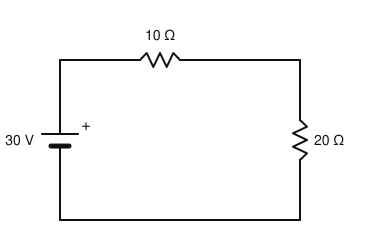
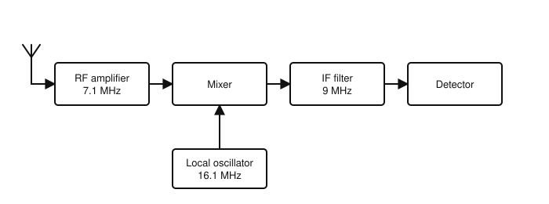
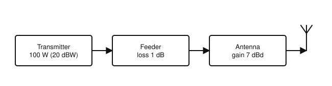

# IRTS HAREC Practice Exam — Set 18

60 questions · 2 hours · pass mark 60% **in each section** (at least 18/30 in Section A and 18/30 in Section B).
Only ONE answer is correct for each question. Answers and short explanations are at the end.

> Unofficial practice paper based on the IRTS HAREC Exam Syllabus (Rev 2.0.2), the IRTS Sample Exam Paper 2022 and the IRTS HAREC Study Guide (4.0.3).
> Page numbers in the answer key are the **printed** page numbers of the Study Guide; in a PDF viewer, add 24 (e.g. p. 343 is PDF page 367).

---

## Section A: Technical

### A.1 Safety (5 questions)

**1.** In a 230 V mains plug, the NEUTRAL conductor is coloured:

- A) Brown
- B) Green with a yellow stripe
- C) Red
- D) Blue

**2.** Ignoring any margin, the maximum power drawn from 230 V mains through a 3 A fuse is about:

- A) 300 W
- B) 690 W
- C) 1150 W
- D) 2990 W

**3.** Another name for an RCD is:

- A) An Earth Leakage Circuit Breaker (ELCB)
- B) A Miniature Circuit Breaker (MCB)
- C) A bleeder resistor
- D) A static discharger

**4.** Short "rubber duck" antennas on handheld transceivers are:

- A) Dangerous to touch at any power
- B) Only for receiving
- C) Designed to be touch-safe, but should still be kept away from the head and face
- D) Always above ICNIRP limits

**5.** How does ICNIRP build a safety margin into its exposure limits?

- A) By ignoring heating effects
- B) By measuring only at night
- C) By using the FCC limits
- D) By reducing the level that could cause harm by a factor of at least 2 and up to 50

### A.2 Interference and Immunity (4 questions)

**6.** Fitting chokes on the cables of equipment suffering breakthrough:

- A) Increases your transmitter's harmonics
- B) Increases the EMC immunity of the affected equipment
- C) Is illegal
- D) Only works on the mains plug

**7.** For a VHF or UHF station, instead of an HF low-pass filter you should use:

- A) An appropriate band-pass filter
- B) A high-pass filter on the transmitter
- C) No filter at all
- D) An audio filter

**8.** Coaxial transmission lines benefit from a connection to a good earth, notably:

- A) Only at the antenna
- B) Only at the transceiver
- C) Never
- D) Where they enter the building

**9.** An overactive ALC circuit fed with an overdriven signal may cause:

- A) Lower SWR
- B) Better audio
- C) Sudden clipping, non-linearity and further harmonic distortion
- D) Less power consumption

### A.3 Electrical, Electromagnetic, and Radio Theory (4 questions)

**10.** The difference between EMF and terminal voltage is that EMF is:

- A) Always lower than the terminal voltage
- B) The total voltage generated by the source, before losses in its internal resistance
- C) Measured in amperes
- D) Only found in AC circuits

**11.** The metric prefix "mega" means:

- A) 10⁶ (one million)
- B) 10³
- C) 10⁹
- D) 10⁻⁶

**12.** A sine wave has a peak value of 325 V. Its RMS value is about:

- A) 162 V
- B) 460 V
- C) 650 V
- D) 230 V

**13.** Speech (audio) is a non-sinusoidal signal made up of:

- A) A single sine wave
- B) Only DC
- C) Many sinusoidal components of different frequencies
- D) Square waves only

### A.4 Components and Circuits (3 questions)

**14.** In the circuit shown, what power is dissipated in the 20 Ω resistor?

- A) 10 W
- B) 20 W
- C) 30 W
- D) 45 W

**15.** The reactance of a capacitor decreases when:

- A) The frequency or the capacitance increases
- B) The frequency decreases
- C) The capacitance decreases
- D) A resistor is added in series

**16.** A transformer:

- A) Works equally well on DC
- B) Converts AC to DC
- C) Transfers AC energy between windings by mutual induction; it does not work on steady DC
- D) Is a type of capacitor

### A.5 Transmitters and Receivers (4 questions)

**17.** An oscillator on 48 MHz followed by a frequency tripler gives:

- A) 16 MHz
- B) 96 MHz
- C) 51 MHz
- D) 144 MHz

**18.** The receiver shown is tuned to 7.1 MHz with the local oscillator at 16.1 MHz and a 9 MHz IF. What is the image frequency?

- A) 1.9 MHz
- B) 9 MHz
- C) 16.1 MHz
- D) 25.1 MHz

**19.** In a transmitter, a mixer followed by a filter is used to:

- A) Rectify the signal
- B) Translate the signal to the wanted frequency (selecting the sum or the difference)
- C) Measure the SWR
- D) Remove the audio

**20.** To make CW signals audible in a superheterodyne receiver, you need:

- A) A BFO
- B) A squelch
- C) A discriminator
- D) A limiter

### A.6 Antennas and Transmission Lines (4 questions)

**21.** The characteristic impedance of the coax most commonly used for amateur transmitting is:

- A) 300 Ω
- B) 600 Ω
- C) 50 Ω
- D) 1 Ω

**22.** With a high SWR and no ATU, many modern solid-state transceivers will:

- A) Increase their output power
- B) Change frequency
- C) Switch to AM
- D) Reduce their output power to protect the final amplifier

**23.** The radiator of a quarter-wave ground plane antenna for 7 MHz is about:

- A) 2.5 m long
- B) 10 m long
- C) 20 m long
- D) 40 m long

**24.** Using the figure, what is the ERP?

- A) 26 dBW (400 W)
- B) 28 dBW (630 W)
- C) 20 dBW (100 W)
- D) 13 dBW (20 W)

### A.7 Propagation (4 questions)

**25.** HF contacts over many thousands of kilometres are normally made by:

- A) Ground wave
- B) Line of sight
- C) Sky wave, using one or more hops via the ionosphere
- D) Tropospheric ducting

**26.** After sunset, the MUF on a given HF path usually:

- A) Falls
- B) Rises sharply
- C) Stays the same
- D) Becomes infinite

**27.** In daytime on MF (e.g. the 160 m band), most coverage is by:

- A) Sky wave via F2
- B) Ground wave
- C) EME
- D) Sporadic E

**28.** In the daily cycle, ionisation of the ionosphere is greatest:

- A) At midnight
- B) Just before dawn
- C) During a lunar eclipse
- D) Around midday

### A.8 Measurements (2 questions)

**29.** Why should an ideal voltmeter have a high resistance (impedance)?

- A) So that it can measure current
- B) To protect the battery
- C) So that it does not draw a significant current and affect the voltage being measured
- D) So that it can be connected in series

**30.** To measure resistance, the meter is connected:

- A) In series with a live circuit
- B) In parallel with the (de-energised) component
- C) Across the mains
- D) To the antenna

---

## Section B: Operating Rules, Procedures, and Regulations

### B.1 Phonetic Alphabet (1 question)

**31.** The phonetic word for the letter X is:

- A) X-ray
- B) Xylophone
- C) Xmas
- D) Xerox

### B.2 Q-Codes (3 questions)

**32.** "QRN?" (as a question) means:

- A) Are you ready?
- B) Shall I reduce power?
- C) Are you bothered by atmospherics (static)?
- D) Have you anything for me?

**33.** "QSB?" (as a question) means:

- A) Shall I change frequency?
- B) Is my signal fading?
- C) Can you confirm?
- D) Shall I stop?

**34.** At the end of a transmission, "K" means:

- A) Kilohertz
- B) Keep off
- C) Kill transmitter
- D) Over — an invitation for the other operator to transmit

### B.3 International Distress Signs, Emergency Traffic and Natural Disaster Communications (3 questions)

**35.** Which of these is a Voluntary Emergency Service you should treat as a served agency?

- A) An Garda Síochána
- B) Mountain Rescue
- C) The Fire Service
- D) The Ambulance Service

**36.** In Ireland, 144.800 MHz is listed as an emergency centre of activity used for:

- A) APRS
- B) SSB voice
- C) CW
- D) Television

**37.** As an emergency communications volunteer, you:

- A) Can give orders to the emergency services
- B) Can demand resources from the agency
- C) Have no authority — you cannot make decisions for others
- D) Are in charge

### B.4 Call Signs (3 questions)

**38.** The first (nationality) section of a call sign may be:

- A) Only a single digit
- B) Only three letters
- C) Any symbols
- D) Letter-number, number-letter or letter-letter (e.g. 2E, EI)

**39.** According to ComReg, the /MM suffix is spoken as:

- A) "Slash maritime mobile"
- B) "Mike Mike"
- C) "Marine"
- D) "Portable"

**40.** The national prefix for Luxembourg is:

- A) LU
- B) LX
- C) LB
- D) LY

### B.5 Radio Spectrum Allocation in Ireland and IARU Band Plans (4 questions)

**41.** ComReg document 09/45 specifies permitted emission designators for:

- A) Every amateur frequency
- B) Only 2 m
- C) Some frequencies that are unique to Ireland
- D) No frequencies at all

**42.** The emergency centre of activity 433.775 MHz is in the:

- A) 2 m band
- B) 4 m band
- C) 6 m band
- D) 70 cm band

**43.** In the contiguous 60 m band, the 15 W limit is expressed as:

- A) EIRP
- B) PEP at the transmitter
- C) Average power
- D) DC input

**44.** On the 17 m band:

- A) Contests are permitted and /MM is not
- B) Contests are not permitted, but /MM is
- C) Neither contests nor /MM are permitted
- D) Both are permitted

### B.6 Social Responsibility of Radio Amateur Operation and the Code of Conduct (3 questions)

**45.** The broad support amateurs give to the IARU band plans is an example of:

- A) Government regulation
- B) Commercial pressure
- C) Self-discipline
- D) ITU enforcement

**46.** On the air, the short word "call" is often used to mean:

- A) Call sign
- B) A telephone call
- C) A CQ
- D) A QSL card

**47.** Spelling "ON9UN" as "Oscar November Nine… Ocean Nancy Nine…" in the same transmission:

- A) Is recommended for clarity
- B) Is required in contests
- C) Is the ITU standard
- D) Should be avoided — do not mix different spellings in one sentence

### B.7 Operating Procedures and Non-Interference (5 questions)

**48.** In Morse, an RST of 589 means:

- A) Unreadable, strong, perfect tone
- B) Perfectly readable, weak, poor tone
- C) Perfectly readable, strong signals, perfect tone
- D) Readable with difficulty, strong, perfect tone

**49.** Which of these is NOT an acceptable phone reply to a CQ from EI5ABC (you are EI6XYZ)?

- A) "EI5ABC from EI6XYZ, over"
- B) "CQ CQ CQ from EI6XYZ"
- C) "This is EI6XYZ, over"
- D) "EI6XYZ"

**50.** Some contests, such as the UKEICC, ask participants:

- A) Not to send an RS or RST report
- B) To send 599 always
- C) To use only AM
- D) To identify every 5 seconds

**51.** When shopping for radio equipment, you should be aware that:

- A) All equipment for sale is legal
- B) Only the seller is responsible for interference
- C) ComReg tests every radio sold
- D) It is easy to buy equipment that does not meet legal non-interference requirements

**52.** IARUMS recommends that interference reports are first sent to:

- A) The ITU
- B) The European Commission
- C) The national IARU society — the IRTS in Ireland
- D) The offending station

### B.8 ITU Radio Regulations (2 questions)

**53.** Greenland belongs to ITU Region:

- A) 1
- B) 2
- C) 3
- D) None

**54.** In the designator A1A, the final A means:

- A) Aural telegraphy, decoded by ear (e.g. Morse)
- B) Amplitude
- C) Automatic reception
- D) Analogue speech

### B.9 CEPT Regulations (3 questions)

**55.** Under CEPT arrangements, a visitor must respect:

- A) Only their home rules
- B) Only ITU rules
- C) Nothing beyond the band plan
- D) Technical and operational restrictions imposed by national, local or public authorities

**56.** A Danish licensee, OZ5ABC, visiting mainland Ireland signs:

- A) OZ5ABC/EI
- B) EJ/OZ5ABC
- C) EI/OZ5ABC
- D) EI5ABC

**57.** The national prefix for Finland is:

- A) FI
- B) OH
- C) SF
- D) FN

### B.10 Irish Laws, Regulations, and Licence Conditions (3 questions)

**58.** The bands, modes and powers in an Irish licence are generally those specified in:

- A) Annex 1 of the ComReg Amateur Station Licence Guidelines 09/45
- B) The IARU Region 2 band plan
- C) The FCC rules
- D) T/R 61-02

**59.** Regarding ComReg document 09/45, you are legally required to:

- A) Use the version current when you passed your exam
- B) Ignore revisions
- C) Know and use the most recent revision
- D) Use only the IARU version

**60.** When operating maritime mobile in international waters, you must obey:

- A) Only Irish rules
- B) Your Irish licence conditions, the rules of the vessel's country of registration and those of the ITU region
- C) No rules
- D) Only the ship's rules

---

## Answer Key

| Q | Ans | Explanation (Study Guide page) |
|---|-----|-------------|
| 1 | D | Live brown, neutral blue, earth green/yellow (p. 297) |
| 2 | B | 3 A × 230 V = 690 W (p. 298) |
| 3 | A | RCD / ELCB (p. 295) |
| 4 | C | Touch-safe, but keep them away from your head (p. 294) |
| 5 | D | Large reduction factors (p. 302) |
| 6 | B | Chokes increase immunity (p. 285) |
| 7 | A | Band-pass filter for VHF/UHF (p. 286) |
| 8 | D | For electrical safety and EMC (p. 286) |
| 9 | C | Distortion from ALC action (p. 289) |
| 10 | B | Terminal voltage = EMF minus internal losses (p. 19) |
| 11 | A | mega = 10⁶ (p. 14) |
| 12 | D | 325 × 0.707 ≈ 230 V (p. 38) |
| 13 | C | Audio is a combination of sinusoids (p. 48) |
| 14 | B | I = 30/30 = 1 A; P = I²R = 1 × 20 = 20 W (p. 30) |
| 15 | A | Xc = 1/(2πfC) (p. 95) |
| 16 | C | Transformers need a changing current (p. 127) |
| 17 | D | 48 × 3 = 144 MHz (p. 181) |
| 18 | D | Image = LO + IF = 16.1 + 9 = 25.1 MHz (p. 203) |
| 19 | B | The mixer makes sum and difference; the filter selects one (p. 170) |
| 20 | A | The BFO produces the beat note (p. 191) |
| 21 | C | 50 Ω (75 Ω is common for TV) (p. 206) |
| 22 | D | Mismatch protection (p. 219) |
| 23 | B | λ/4 ≈ 42.9/4 ≈ 10.7 m (p. 238) |
| 24 | A | 20 − 1 + 7 = 26 dBW = 400 W (p. 251) |
| 25 | C | Multi-hop sky wave (p. 265) |
| 26 | A | Ionisation decreases at night (p. 269) |
| 27 | B | D-layer absorption blocks sky wave in daytime (p. 263) |
| 28 | D | Ionisation follows the Sun (p. 255) |
| 29 | C | High resistance avoids loading the circuit (p. 273) |
| 30 | B | In parallel, on a dead circuit (p. 273) |
| 31 | A | X = X-ray (p. 335) |
| 32 | C | QRN? = atmospherics? (p. 346) |
| 33 | B | QSB = fading (p. 347) |
| 34 | D | K = invitation to transmit (p. 349) |
| 35 | B | Mountain Rescue is a VES (p. 352) |
| 36 | A | AX.25 APRS (p. 345) |
| 37 | C | Know who you are not (p. 353) |
| 38 | D | One or two characters, at least one a letter (p. 336) |
| 39 | A | IARU recommends "stroke" (p. 330) |
| 40 | B | Luxembourg = LX (p. 323) |
| 41 | C | For widely used bands ComReg defers to the IARU plans (p. 338) |
| 42 | D | 70 cm (simplex FM voice) (p. 345) |
| 43 | A | 15 W EIRP (p. 343) |
| 44 | B | 17 m: no contests, /MM yes (p. 343) |
| 45 | C | Self-regulation and self-discipline (p. 357) |
| 46 | A | "Call" = call sign (p. 359) |
| 47 | D | Use one standard phonetic alphabet (p. 358) |
| 48 | C | R5 S8 T9 (p. 369) |
| 49 | B | Answering is not a CQ (p. 366) |
| 50 | A | No signal reports are exchanged in that contest (p. 369) |
| 51 | D | Look for CE marks and conformity statements (p. 370) |
| 52 | C | Report via the IRTS (p. 371) |
| 53 | B | Region 2: the Americas including Greenland (p. 314) |
| 54 | A | A = aural telegraphy (p. 317) |
| 55 | D | CEPT licence conditions (p. 322) |
| 56 | C | EI/ on the mainland (p. 322) |
| 57 | B | Finland = OH (p. 323) |
| 58 | A | Annex 1 of 09/45 (p. 327) |
| 59 | C | Keep up with the latest revision (R6 at the time of the guide) (p. 327) |
| 60 | B | Multiple sets of rules apply (p. 330) |
