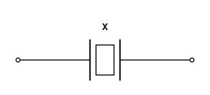
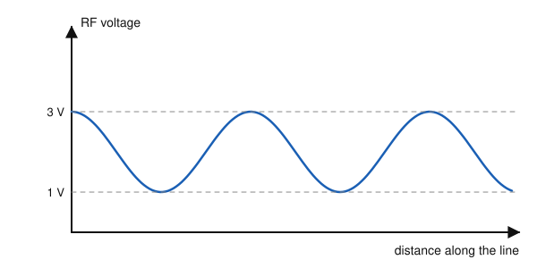
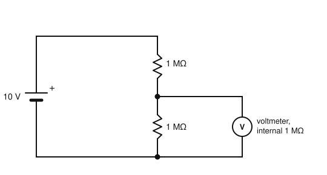

# IRTS HAREC Practice Exam — Set 19

60 questions · 2 hours · pass mark 60% **in each section** (at least 18/30 in Section A and 18/30 in Section B).
Only ONE answer is correct for each question. Answers and short explanations are at the end.

> Unofficial practice paper based on the IRTS HAREC Exam Syllabus (Rev 2.0.2), the IRTS Sample Exam Paper 2022 and the IRTS HAREC Study Guide (4.0.3).
> Page numbers in the answer key are the **printed** page numbers of the Study Guide; in a PDF viewer, add 24 (e.g. p. 343 is PDF page 367).

---

## Section A: Technical

### A.1 Safety (5 questions)

**1.** The protective EARTH conductor in a mains cable is coloured:

- A) Blue
- B) Brown
- C) Green with a yellow stripe
- D) Black

**2.** Before working on a high-voltage power supply that has been switched off, you should:

- A) Use a shorting stick to discharge the smoothing capacitors, even if bleeder resistors are fitted
- B) Start work immediately
- C) Touch the capacitors to test them
- D) Rely on the bleeder resistors

**3.** According to the Study Guide, the correct place for lightning protection is:

- A) Inside the shack, next to the radio
- B) In the mains fuse box
- C) Inside the transceiver
- D) Outdoors, not inside the house

**4.** When thunderstorms are forecast, you should:

- A) Keep operating on low power
- B) Disconnect and ground all feeders, preferably outside the building
- C) Touch the feeder to discharge it
- D) Raise the antenna

**5.** The primary adverse effect of RF EMF exposure is:

- A) Hair loss
- B) Magnetisation of the blood
- C) Heating of human tissue
- D) Radioactivity

### A.2 Interference and Immunity (4 questions)

**6.** Many EMC problems are reduced when power reduction cures them. What should you do next?

- A) Resume full power immediately
- B) Take further steps to identify the cause before resuming higher power
- C) Remove your earth
- D) Change band permanently

**7.** Magnetic loop antennas, despite their small size, can cause EMC issues because:

- A) They radiate only harmonics
- B) They need high SWR
- C) They have surprisingly large near fields and invite close proximity
- D) They are always unbalanced

**8.** The "Donald Duck" effect on nearby FM channels is caused by:

- A) Key clicks
- B) Low power
- C) A correct deviation setting
- D) Splatter from an overdeviated or distorted FM transmission

**9.** An amplifier that oscillates at a frequency unrelated to its working frequency suffers from:

- A) Parasitic oscillation
- B) Harmonic distortion
- C) Selective fading
- D) Back-EMF

### A.3 Electrical, Electromagnetic, and Radio Theory (4 questions)

**10.** Conventional current flows:

- A) From negative to positive
- B) From positive to negative
- C) Only in insulators
- D) Only in AC circuits

**11.** A 100 W lamp is used for 5 hours. The energy used is:

- A) 20 Wh
- B) 500 kWh
- C) 105 Wh
- D) 0.5 kWh

**12.** Increasing the power by 20 dB means multiplying it by:

- A) 20
- B) 10
- C) 100
- D) 200

**13.** The phase difference between two signals is measured in:

- A) Degrees (or radians)
- B) Hertz
- C) Volts
- D) Seconds squared

### A.4 Components and Circuits (3 questions)

**14.** Adding a second identical resistor in parallel with an existing one:

- A) Doubles the total resistance
- B) Halves the total resistance
- C) Has no effect
- D) Makes it zero

**15.** The component marked "X" in the oscillator circuit shown is a:

- A) Capacitor
- B) Zener diode
- C) Quartz crystal
- D) Fuse

**16.** Zener diodes are used to:

- A) Amplify RF
- B) Emit light
- C) Rectify mains at high current
- D) Set and stabilise the output voltage of power supplies

### A.5 Transmitters and Receivers (4 questions)

**17.** Over-deviation of an FM transmitter causes:

- A) Lower bandwidth
- B) Better audio quality
- C) Reduced power
- D) Excessive bandwidth and interference to adjacent channels

**18.** In a superhet receiver, the IF filter mainly determines the receiver's:

- A) Sensitivity to image signals
- B) Selectivity (adjacent-channel rejection)
- C) Output power
- D) Frequency stability

**19.** A squelch circuit:

- A) Silences the audio output when no signal is present
- B) Increases the volume
- C) Removes static from SSB
- D) Tunes the antenna

**20.** Compared with a dedicated hardware filter, filtering in a DSP/SDR receiver is done:

- A) By changing quartz crystals
- B) With LC circuits only
- C) Mathematically in software on the digitised signal
- D) By the antenna

### A.6 Antennas and Transmission Lines (4 questions)

**21.** Ladder line (open-wire feeder) typically has, compared with coax:

- A) Higher losses
- B) Lower losses, but it must be kept away from metal objects
- C) A characteristic impedance of 50 Ω
- D) No velocity factor

**22.** The figure shows the voltage along a feeder. What is the SWR?

- A) 3:1
- B) 1:1
- C) 2:1
- D) 4:1

**23.** A folded dipole has a feed-point impedance of about:

- A) 50 Ω
- B) 73 Ω
- C) 600 Ω
- D) 300 Ω

**24.** Compared with a half-wave dipole, the gain of the dipole itself expressed in dBi is:

- A) 0 dBi
- B) 2.15 dBi
- C) −2.15 dBi
- D) 10 dBi

### A.7 Propagation (4 questions)

**25.** The sunspot cycle lasts about:

- A) 1 year
- B) 27 days
- C) 11 years
- D) 100 years

**26.** Sporadic E, which allows VHF contacts up to about 2500 km, occurs mainly:

- A) Only in winter nights
- B) Only at solar minimum
- C) From May to July, in the mornings and just before noon
- D) Never in Europe

**27.** The F2 layer:

- A) Absorbs HF signals in daytime
- B) Is the lowest layer
- C) Exists only in winter
- D) Is the highest layer and the main one for long-distance HF

**28.** Signals in the VHF and UHF bands are usually limited to:

- A) Worldwide coverage
- B) Roughly line-of-sight distances, except during special propagation
- C) Ground-wave ranges of thousands of km
- D) Skip distances only

### A.8 Measurements (2 questions)

**29.** In the figure, a voltmeter with an internal resistance of 1 MΩ is connected across the lower resistor. What does it read?

- A) 5 V
- B) 10 V
- C) 3.3 V
- D) 0 V

**30.** A dummy load is used to:

- A) Test a transmitter without radiating a signal
- B) Increase the antenna gain
- C) Measure frequency
- D) Decode digital modes

---

## Section B: Operating Rules, Procedures, and Regulations

### B.1 Phonetic Alphabet (1 question)

**31.** The phonetic word for the letter Q is:

- A) Queen
- B) Quebec
- C) Quality
- D) Quiet

### B.2 Q-Codes (3 questions)

**32.** "QTH" means:

- A) My time is…
- B) My frequency is…
- C) My location is…
- D) My name is…

**33.** "QRT" (as a statement) means:

- A) Stop your transmission
- B) Increase power
- C) Send faster
- D) Who is calling?

**34.** "QRP" (as a statement) means:

- A) Increase your power
- B) I am ready
- C) Stop sending
- D) Decrease your power

### B.3 International Distress Signs, Emergency Traffic and Natural Disaster Communications (3 questions)

**35.** On phone, the international distress signal is:

- A) SOS
- B) PAN PAN
- C) SECURITE
- D) MAYDAY

**36.** In Morse telegraphy, the distress signal is:

- A) MAYDAY
- B) SOS, sent without the usual spaces between characters
- C) CQD
- D) QRRR

**37.** In Ireland, the 2 m emergency centres of activity include:

- A) 144.300 MHz
- B) 145.500 MHz
- C) 144.525 MHz
- D) 146.000 MHz

### B.4 Call Signs (3 questions)

**38.** The holder of EI5ABC operating from a car should sign:

- A) EI5ABC/M
- B) EI5ABC/P
- C) EI5ABC/MOBILE
- D) M/EI5ABC

**39.** The national prefix for Belgium is:

- A) BE
- B) BG
- C) ON
- D) BL

**40.** A call sign beginning "GW" or "MW" indicates a licensee in:

- A) Scotland
- B) Northern Ireland
- C) Guernsey
- D) Wales

### B.5 Radio Spectrum Allocation in Ireland and IARU Band Plans (4 questions)

**41.** Is maritime mobile operation permitted on the 6 m band?

- A) Yes, at 10 W
- B) No
- C) Yes, at 100 W
- D) Only on CW

**42.** Which band is NOT a secondary allocation in Ireland?

- A) 5 MHz (60 m)
- B) 10 MHz (30 m)
- C) 70 MHz (4 m)
- D) 14 MHz (20 m)

**43.** The maximum land mobile power on the 2 m band is:

- A) 50 W
- B) 10 W
- C) 400 W
- D) 25 W

**44.** The emergency centre of activity used in Ireland on the 20 m band is:

- A) 14.100 MHz
- B) 14.300 MHz
- C) 14.230 MHz
- D) 14.000 MHz

### B.6 Social Responsibility of Radio Amateur Operation and the Code of Conduct (3 questions)

**45.** Radio amateurs say that they "work" each other. This means they:

- A) Are employed by each other
- B) Repair each other's equipment
- C) Make contacts with one another
- D) Compete in contests only

**46.** When offering criticism to another amateur, you should:

- A) Aim to politely explain the issue, avoiding strong or impolite language
- B) Criticise them publicly on the air
- C) Ignore them entirely
- D) Report them to the Gardaí

**47.** Since "73" already stands for best regards, writing "best 73" or "73s" is:

- A) Required
- B) The IARU standard
- C) Rude
- D) Not necessary

### B.7 Operating Procedures and Non-Interference (5 questions)

**48.** A Morse RST report of 599 means:

- A) Weak signal, poor tone
- B) Perfectly readable, extremely strong signal, perfect tone
- C) Unreadable
- D) Readable with difficulty

**49.** Before calling CQ on a frequency, you should:

- A) Listen first and ask whether the frequency is in use
- B) Transmit a long carrier
- C) Call immediately
- D) Change mode

**50.** In Morse, the procedure signal sent before your call sign when answering a station is:

- A) K
- B) AR
- C) DE
- D) SK

**51.** When choosing a frequency to call on, you should:

- A) Pick one right next to a strong station
- B) Use the lowest edge of the band
- C) Transmit over a weak station
- D) Avoid selecting frequencies too close to another nearby transmission

**52.** An "over" on phone is usually ended with:

- A) "Over" or "K"
- B) "Roger"
- C) "Mayday"
- D) "73"

### B.8 ITU Radio Regulations (2 questions)

**53.** Ireland is in ITU Region:

- A) 1
- B) 2
- C) 3
- D) 4

**54.** In the designator F3E, the 3 indicates:

- A) Data
- B) No modulation
- C) A single channel of analogue information
- D) Two channels

### B.9 CEPT Regulations (3 questions)

**55.** Under T/R 61-01, how long may a visitor generally operate in a CEPT country without a local licence?

- A) Unlimited
- B) Up to three months (short visits)
- C) One day
- D) One year

**56.** T/R 61-02 deals with:

- A) The HAREC exam certificate, allowing a local licence to be issued abroad
- B) Temporary operation
- C) Band plans
- D) Beacons

**57.** The national prefix for Portugal is:

- A) PT
- B) PO
- C) P5
- D) CT

### B.10 Irish Laws, Regulations, and Licence Conditions (3 questions)

**58.** Your log must record, for each contact:

- A) The other station's home address
- B) Date, time (UTC), frequency/band, mode, call sign of the other station and power
- C) The weather
- D) The topic of conversation

**59.** When requested by ComReg, a licensee must:

- A) Ignore the request
- B) Pay a fine
- C) Make the station and logbook available for inspection
- D) Surrender the call sign

**60.** Log times are recorded in UTC. Compared with Irish time, UTC is:

- A) The same in winter and one hour behind in summer
- B) Always one hour ahead
- C) Always the same
- D) Two hours behind in summer

---

## Answer Key

| Q | Ans | Explanation (Study Guide page) |
|---|-----|-------------|
| 1 | C | Earth = green/yellow (p. 297) |
| 2 | A | Capacitors can hold charge for months; bleeders often fail (p. 298) |
| 3 | D | Lightning protection belongs outdoors (p. 300) |
| 4 | B | Disconnect and ground (p. 300) |
| 5 | C | Thermal effects (p. 303) |
| 6 | B | Find the cause first (p. 284) |
| 7 | C | Large near fields (p. 284) |
| 8 | D | FM splatter (p. 288) |
| 9 | A | Internal feedback loop (p. 290) |
| 10 | B | Electron flow is opposite to conventional current (p. 16) |
| 11 | D | 100 × 5 = 500 Wh = 0.5 kWh (p. 26) |
| 12 | C | 20 dB = ×100 (p. 116) |
| 13 | A | One cycle = 360° (p. 44) |
| 14 | B | R/2 for two equal resistors in parallel (p. 30) |
| 15 | C | Crystal symbol: a plate between two electrodes (p. 113) |
| 16 | D | Voltage stabilisation (p. 121) |
| 17 | D | Too much deviation spreads the signal (p. 153) |
| 18 | B | IF filters set selectivity (p. 188) |
| 19 | A | Squelch (p. 198) |
| 20 | C | Digital filtering (p. 199) |
| 21 | B | Parallel lines have low loss (p. 209) |
| 22 | A | SWR = Vmax/Vmin = 3/1 (p. 219) |
| 23 | D | About 4 × 73 ≈ 300 Ω (p. 237) |
| 24 | B | 0 dBd = 2.15 dBi (p. 250) |
| 25 | C | About 11 years (p. 256) |
| 26 | C | Irregular thick E-layer clouds (p. 260) |
| 27 | D | F2 supports DX (p. 259) |
| 28 | B | Line of sight (p. 266) |
| 29 | C | 1 MΩ ∥ 1 MΩ = 0.5 MΩ; 10 × 0.5/1.5 ≈ 3.3 V — the meter loads the circuit (p. 273) |
| 30 | A | Non-radiating load (p. 274) |
| 31 | B | Q = Quebec (p. 335) |
| 32 | C | QTH = location (p. 347) |
| 33 | A | QRT = stop transmitting (p. 346) |
| 34 | D | QRP = decrease power (also low-power operation) (p. 346) |
| 35 | D | Voice = MAYDAY; Morse = SOS (p. 350) |
| 36 | B | ··· — — — ··· (p. 350) |
| 37 | C | 144.525 (SSB), 144.800, 144.850 MHz (p. 345) |
| 38 | A | /M = land mobile (p. 329) |
| 39 | C | Belgium = ON (p. 323) |
| 40 | D | W = Wales (p. 323) |
| 41 | B | No /MM on 6 m (p. 343) |
| 42 | D | Secondary: 5, 10, 50, 70 MHz (p. 343) |
| 43 | A | Land mobile limit 50 W (p. 343) |
| 44 | B | 14.300 MHz (p. 343) |
| 45 | C | To work = to make contacts (p. 358) |
| 46 | A | Helpful, constructive criticism (p. 357) |
| 47 | D | Etiquette in written communication (p. 358) |
| 48 | B | R5 S9 T9 (p. 369) |
| 49 | A | Listen before transmitting (p. 362) |
| 50 | C | DE = from / this is (p. 360) |
| 51 | D | Operating procedure (p. 362) |
| 52 | A | Invitation to transmit (p. 360) |
| 53 | A | Region 1: Europe, Africa, Middle East, former USSR (p. 314) |
| 54 | C | 3 = analogue (p. 317) |
| 55 | B | Temporary visits, not exceeding 3 months (p. 322) |
| 56 | A | Harmonised Amateur Radio Examination Certificate (p. 320) |
| 57 | D | Portugal = CT (p. 322) |
| 58 | B | Logbook contents (p. 331) |
| 59 | C | Inspection (p. 331) |
| 60 | A | UTC matches Irish winter time (p. 331) |
