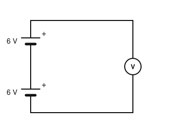
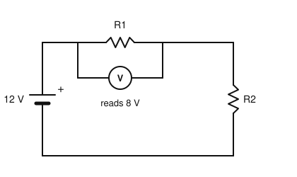
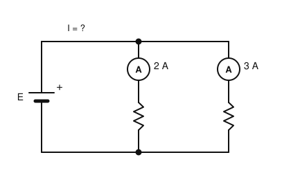
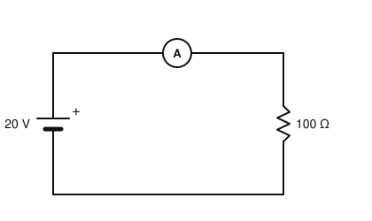

# IRTS HAREC Chapter Practice — Chapter 3: Electrical and Electronic Principles

48 questions on Study Guide chapter 3 (printed pages 12–27), grouped by the guide's own subsections.
Read the chapter first, then try the questions. Answers, explanations and page numbers are at the end.

> Unofficial practice material based on the IRTS HAREC Study Guide (4.0.3). Syllabus section: A.3.
> Page numbers are the **printed** page numbers of the Study Guide; in a PDF viewer, add 24.

---

### 3.1 The Nature of Electricity

**1.** Which subatomic particle carries a negative electric charge?

- A) Proton
- B) Neutron
- C) Electron
- D) Photon

**2.** In a metal conductor such as copper, the primary charge carriers are:

- A) Electrons
- B) Neutrons
- C) Protons
- D) Holes

**3.** An electric current is best described as:

- A) The rate at which energy is used
- B) The pressure that pushes charges
- C) The opposition to the flow of charge
- D) A flow of charge carriers, such as electrons

### 3.2 Dimensions, Units, and Metric Prefixes

**4.** The SI unit symbol for frequency is:

- A) hz
- B) Hz
- C) HZ
- D) hZ

**5.** Which of these is the correct unit symbol for the second?

- A) S
- B) Sc
- C) sec
- D) s

**6.** Which unit is used for inductance?

- A) Farad (F)
- B) Henry (H)
- C) Ohm (Ω)
- D) Hertz (Hz)

**7.** Reactance and impedance are both measured in:

- A) Farads
- B) Henries
- C) Ohms
- D) Siemens

**8.** The metric prefix µ (micro) means a factor of:

- A) 10⁻⁶
- B) 10⁻¹²
- C) 10⁻⁹
- D) 10⁻³

**9.** Which prefix symbol stands for one thousand million (10⁹)?

- A) G
- B) M
- C) k
- D) m

**10.** Which of these is written correctly for one thousand hertz?

- A) 1 KHz
- B) 1 khz
- C) 1 kHz
- D) 1 KHZ

**11.** What is 1.5 kΩ + 750 Ω?

- A) 751.5 Ω
- B) 1650 Ω
- C) 2.25 Ω
- D) 2250 Ω

**12.** What is 500 mV + 2.5 V?

- A) 502.5 V
- B) 3 V
- C) 2.55 V
- D) 7.5 V

### 3.3 Current

**13.** By convention, "conventional current" is said to flow:

- A) From the negative to the positive terminal
- B) Only in AC circuits
- C) From the positive to the negative terminal
- D) In both directions at once

**14.** Which of these materials is an insulator?

- A) Salt water
- B) Mica
- C) Carbon
- D) Aluminium

**15.** Which of these is a good conductor?

- A) Silver
- B) Glass
- C) Dry air
- D) Distilled water

**16.** The best-known semiconductor material is:

- A) Mercury
- B) Copper
- C) Mica
- D) Silicon

**17.** What is special about the current through a p-n junction?

- A) It does not depend on voltage
- B) It flows only in AC circuits
- C) It depends on the direction in which the current wants to flow
- D) It is always zero

**18.** The mains supply in an Irish domestic socket has a frequency of:

- A) 50 Hz
- B) 60 Hz
- C) 100 Hz
- D) 230 Hz

**19.** Direct current (DC) is current that:

- A) Reverses direction 50 times a second
- B) Always has a constant value
- C) Can only come from the mains
- D) Flows in one direction only

### 3.4 Sources of Electricity and Electromotive Force

**20.** Why does the terminal voltage of a real battery fall when a load is connected?

- A) Because the emf increases
- B) Because of its internal resistance
- C) Because AC is produced
- D) Because the load generates voltage

**21.** Two 6 V batteries are connected in series (positive of one to negative of the other). The total voltage is:

- A) 6 V
- B) 3 V
- C) 36 V
- D) 12 V

**22.** Connecting two identical batteries in parallel:

- A) Keeps the voltage the same but increases the current capacity
- B) Doubles the voltage
- C) Halves the voltage
- D) Creates an AC supply

**23.** Why is caution needed when connecting voltage sources in parallel?

- A) Their voltages add up
- B) Their internal resistance becomes zero
- C) Small differences in terminal voltage can cause a circulating current between them
- D) They stop supplying current

**24.** The current that flows when the two terminals of a voltage source are joined by a wire is limited by:

- A) The load resistance
- B) The internal resistance of the source
- C) The voltmeter
- D) Nothing at all

**25.** What does the voltmeter connected across the two batteries shown read?

- A) 6 V
- B) 12 V
- C) 0 V
- D) 3 V

### 3.5 Voltage

**26.** The potential difference (PD) between two points in a circuit is also called:

- A) Current
- B) Resistance
- C) Voltage
- D) Power

### 3.6 Difference Between Electromotive Force and Voltage

**27.** The emf of a source is equal to its terminal voltage when:

- A) The source is short-circuited
- B) An AC load is connected
- C) The maximum current flows
- D) No current is flowing

**28.** A voltmeter used to measure emf or PD must have:

- A) A very low internal resistance
- B) A high internal resistance
- C) Its own battery
- D) A resistance equal to the load

### 3.7 Voltage and Current in Series and Parallel Circuits

**29.** In a series circuit:

- A) The same current flows through every component
- B) The voltage across every component is the same
- C) The current divides between the components
- D) Each component has its own source

**30.** A 12 V battery feeds two resistors in series. 8 V is measured across the first. What is the voltage across the second?

- A) 20 V
- B) 8 V
- C) 4 V
- D) 12 V

**31.** In a parallel circuit with two branches drawing 2 A and 3 A, the current from the source is:

- A) 1 A
- B) 5 A
- C) 6 A
- D) 2.5 A

**32.** In a parallel circuit, the voltage across each branch is:

- A) The same in every branch
- B) Different in each branch
- C) Zero
- D) Shared in proportion to resistance

**33.** The way current and voltage are distributed in a circuit is described by:

- A) The inverse square law
- B) Lenz's law
- C) Faraday's law
- D) Kirchhoff's current and voltage laws

**34.** In the circuit shown, the voltmeter across R1 reads 8 V. What is the voltage across R2?

- A) 20 V
- B) 8 V
- C) 4 V
- D) 12 V

**35.** In the circuit shown, the branch ammeters read 2 A and 3 A. What current I does the battery supply?

- A) 5 A
- B) 1 A
- C) 6 A
- D) 2.5 A

### 3.8 Resistance

**36.** Resistance is:

- A) The rate of flow of charge
- B) The opposition to the flow of current
- C) The pressure that drives current
- D) The energy stored in a circuit

### 3.9 Ohm's Law

**37.** According to Ohm's law, if the resistance stays the same and the voltage is doubled, the current:

- A) Halves
- B) Stays the same
- C) Doubles
- D) Quadruples

**38.** A 20 V battery is connected across a 100 Ω resistor. What current flows?

- A) 0.2 A
- B) 2 A
- C) 5 A
- D) 2000 A

**39.** A current of 0.5 A flows through a 24 Ω resistor. The voltage across it is:

- A) 48 V
- B) 0.02 V
- C) 24.5 V
- D) 12 V

**40.** If the voltage is kept constant and the resistance increases, the current:

- A) Increases
- B) Decreases
- C) Stays the same
- D) Reverses

**41.** What does the ammeter in the circuit shown read?

- A) 2 A
- B) 20 mA
- C) 5 A
- D) 200 mA

### 3.10 Electric Power and Energy

**42.** Power is the rate at which:

- A) Voltage rises
- B) Charge is stored
- C) Resistance changes
- D) Energy is transferred or used

**43.** A 20 V source drives 0.2 A through a resistor. The power dissipated is:

- A) 100 W
- B) 0.01 W
- C) 4 W
- D) 40 W

**44.** A current of 2 A flows through a 10 Ω resistor. The power dissipated is:

- A) 40 W
- B) 20 W
- C) 5 W
- D) 200 W

**45.** A 50 Ω dummy load has 100 V across it. The power it dissipates is:

- A) 5000 W
- B) 2 W
- C) 500 W
- D) 200 W

**46.** A 12 V battery is rated at 8 A⋅h. How much energy can it store?

- A) 96 Wh
- B) 1.5 Wh
- C) 20 Wh
- D) 8 kWh

**47.** An 8 A⋅h battery can supply approximately:

- A) 8 A for 8 hours
- B) 1 A for 1 hour
- C) 4 A for 2 hours
- D) 16 A for 2 hours

**48.** A 1000 W linear amplifier is used for 1 hour. How much energy does it use?

- A) 1 Wh
- B) 1 kWh
- C) 1 MWh
- D) 1000 kWh

---

## Answer Key

| Q | Ans | Explanation (Study Guide page) |
|---|-----|-------------|
| 1 | C | The proton is positive (+) and the electron is negative (−) (p. 12) |
| 2 | A | In metals, electrons move from atom to atom and form the current (p. 12) |
| 3 | D | A flow of charge carriers such as electrons in a metal is an electric current (p. 12) |
| 4 | B | Hertz is written Hz: the H must be a capital (p. 13) |
| 5 | D | Lowercase s is the second; uppercase S is the siemens (p. 13) |
| 6 | B | Inductance L is measured in henry, H; capacitance in farad (p. 14) |
| 7 | C | Resistance, reactance and impedance all use the ohm, Ω (p. 14) |
| 8 | A | Micro = one millionth = 10⁻⁶ (p. 15) |
| 9 | A | Giga, G, is 10⁹; mega, M, is 10⁶ (p. 15) |
| 10 | C | Kilo is a lowercase k and hertz is Hz, so kHz (p. 15) |
| 11 | D | Convert to the same prefix first: 1500 Ω + 750 Ω = 2250 Ω (p. 15) |
| 12 | B | 500 mV = 0.5 V; 0.5 + 2.5 = 3 V (p. 15) |
| 13 | C | Electrons flow from − to +, but conventional current is said to flow from + to − (p. 16) |
| 14 | B | Glass, Perspex, rubber, mica, most plastics, oil, air and distilled water are insulators (p. 16) |
| 15 | A | Almost all metals are good conductors, including silver, copper and gold (p. 16) |
| 16 | D | Silicon is the best-known semiconductor (p. 16) |
| 17 | C | A p-n junction conducts according to the direction of the current, which is how a diode works (p. 16) |
| 18 | A | Irish domestic AC completes 50 cycles per second (p. 17) |
| 19 | D | DC flows in one direction; its amount may still change (p. 17) |
| 20 | B | The internal resistance causes a voltage drop when current is drawn (p. 18) |
| 21 | D | In series the total source voltage is the sum of the individual voltages (p. 18) |
| 22 | A | In parallel each source has the same voltage, and the current drain is shared (p. 18) |
| 23 | C | Different terminal voltages drive a circulating current between the sources (p. 18) |
| 24 | B | The internal resistance limits the short circuit current (p. 18) |
| 25 | B | Batteries in series add their voltages: 6 + 6 = 12 V (p. 18) |
| 26 | C | The PD between any two points is the voltage (p. 19) |
| 27 | D | Emf equals the terminal PD when no current flows (p. 19) |
| 28 | B | A high internal resistance stops the meter drawing significant current (p. 19) |
| 29 | A | The same current flows through each component of a series circuit (p. 20) |
| 30 | C | The voltages across the components add up to the source voltage: 12 − 8 = 4 V (p. 20) |
| 31 | B | The source current equals the sum of the branch currents (p. 21) |
| 32 | A | All branches of a parallel circuit have the same voltage (p. 21) |
| 33 | D | Kirchhoff's laws describe current and voltage distribution (p. 20) |
| 34 | C | In a series circuit the voltages add up to the source voltage: 12 − 8 = 4 V (p. 20) |
| 35 | A | The current entering a junction equals the sum of the branch currents: 2 + 3 = 5 A (p. 21) |
| 36 | B | Resistance is the opposition to the flow of current, measured in ohms (Ω) (p. 21) |
| 37 | C | Current is directly proportional to voltage (p. 22) |
| 38 | A | I = V/R = 20/100 = 0.2 A (200 mA) (p. 22) |
| 39 | D | V = I × R = 0.5 × 24 = 12 V (p. 22) |
| 40 | B | Current is inversely proportional to resistance (p. 22) |
| 41 | D | I = V/R = 20 V / 100 Ω = 0.2 A = 200 mA (p. 22) |
| 42 | D | Power tells us how fast energy is transferred or used (p. 23) |
| 43 | C | P = V × I = 20 × 0.2 = 4 W (p. 25) |
| 44 | A | P = I²R = 2 × 2 × 10 = 40 W (p. 24) |
| 45 | D | P = V²/R = 10 000/50 = 200 W (p. 25) |
| 46 | A | Energy = 8 A⋅h × 12 V = 96 Wh (0.096 kWh) (p. 26) |
| 47 | C | 8 A⋅h = 8 A for 1 h, 4 A for 2 h, 16 A for 30 min (p. 26) |
| 48 | B | W = P × t = 1000 W × 1 h = 1000 Wh = 1 kWh (p. 26) |
