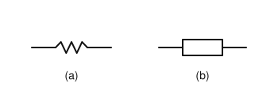
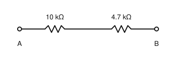
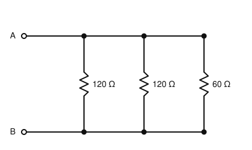
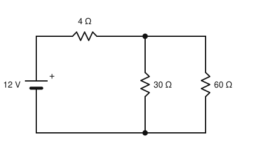

# IRTS HAREC Chapter Practice — Chapter 4: Resistors in Circuits

28 questions on Study Guide chapter 4 (printed pages 28–37), grouped by the guide's own subsections.
Read the chapter first, then try the questions. Answers, explanations and page numbers are at the end.

> Unofficial practice material based on the IRTS HAREC Study Guide (4.0.3). Syllabus section: A.4.
> Page numbers are the **printed** page numbers of the Study Guide; in a PDF viewer, add 24.

---

### 4.1 Circuits

**1.** On a circuit diagram, the lines joining the component symbols represent:

- A) The voltage at each point
- B) The direction of the magnetic field
- C) The conductors that connect the components
- D) Where the current is zero

### 4.2 Resistors

**2.** A resistor does its work by:

- A) Storing energy in a magnetic field
- B) Dissipating energy as heat
- C) Storing charge on two plates
- D) Amplifying the current

**3.** A nominal 100 Ω resistor has a tolerance of 10%. Its actual resistance may be anywhere between:

- A) 99 Ω and 101 Ω
- B) 95 Ω and 105 Ω
- C) 90 Ω and 110 Ω
- D) 10 Ω and 1000 Ω

**4.** Which two symbols may be used for a resistor on a circuit diagram?

- A) Two parallel lines, or a curl
- B) A coil, or a dashed box
- C) A circle with an arrow, or a triangle
- D) A zig-zag line, or a rectangle

**5.** A potentiometer is:

- A) A type of variable resistor, such as a volume control
- B) A fixed resistor with very high power rating
- C) A meter that measures potential difference
- D) A resistor made from a semiconductor junction

**6.** The two circuit symbols (a) and (b) shown both represent a:

- A) Capacitor
- B) Inductor
- C) Fuse
- D) Resistor

### 4.2.1 Resistor Power Rating

**7.** What may happen if the power rating of a resistor is exceeded?

- A) It may burn out and fail
- B) Its resistance falls to zero and it saves energy
- C) It starts to oscillate
- D) Its tolerance improves

**8.** A 5 kΩ resistor carries a current of 10 mA. How much power does it dissipate?

- A) 0.05 W
- B) 0.5 W
- C) 5 W
- D) 50 W

**9.** A 1 MΩ resistor has 1.5 kV across it. It dissipates 2.25 W. Which resistor would be suitable?

- A) 1 MΩ rated 0.5 W
- B) 1 MΩ rated 1 W
- C) 1 MΩ rated 2 W
- D) 1 MΩ rated 5 W

**10.** A 100 Ω resistor has 10 V across it. What is the minimum power rating it needs?

- A) 0.1 W
- B) 1 W
- C) 10 W
- D) 100 W

### 4.2.2 Resistors Connected in Series

**11.** Resistors of 10 kΩ and 4.7 kΩ are connected in series. What is the equivalent resistance?

- A) 3.2 kΩ
- B) 5.3 kΩ
- C) 14.7 kΩ
- D) 47 kΩ

**12.** The equivalent resistance of resistors in series is always:

- A) Less than the smallest resistance
- B) Equal to the average resistance
- C) Equal to the smallest resistance
- D) Greater than the largest resistance

**13.** Resistors of 1.2 kΩ and 800 Ω are connected in series. What is the total resistance?

- A) 2 kΩ
- B) 801.2 Ω
- C) 480 Ω
- D) 1.28 kΩ

**14.** What is the resistance between A and B in the circuit shown?

- A) 14.7 kΩ
- B) 3.2 kΩ
- C) 5.3 kΩ
- D) 47 kΩ

### 4.2.3 Resistors Connected in Parallel

**15.** Resistors of 120 Ω, 120 Ω and 60 Ω are connected in parallel. What is the equivalent resistance?

- A) 30 Ω
- B) 60 Ω
- C) 100 Ω
- D) 300 Ω

**16.** The equivalent resistance of resistors in parallel is always:

- A) Greater than the largest resistance
- B) Less than the smallest resistance
- C) Equal to their sum
- D) Equal to the largest resistance

**17.** Two 100 Ω resistors are connected in parallel. What is the equivalent resistance?

- A) 200 Ω
- B) 100 Ω
- C) 50 Ω
- D) 25 Ω

**18.** When calculating parallel resistance, the sum 1/R1 + 1/R2 + … gives:

- A) The equivalent resistance directly
- B) The power dissipated
- C) The total current
- D) 1/Req, which still has to be inverted

**19.** What is the resistance between A and B in the parallel circuit shown?

- A) 300 Ω
- B) 100 Ω
- C) 30 Ω
- D) 60 Ω

### 4.2.4 Multiple Resistors in a Circuit

**20.** To find the overall resistance of a circuit with series and parallel resistors, you should first:

- A) Calculate the equivalent resistance of the parallel resistances
- B) Add up all the resistances
- C) Calculate the power in each resistor
- D) Measure the battery voltage

**21.** What kind of calculator is provided in the HAREC exam?

- A) None; calculators are not allowed
- B) A simple calculator that adds, subtracts, multiplies and divides
- C) A scientific calculator with square roots
- D) A programmable calculator

### 4.2.5 Worked Example: Current, Voltage, and Power with Multiple Resistors

**22.** A 12 V battery feeds a 4 Ω resistor in series with 30 Ω and 60 Ω in parallel. What is the total resistance?

- A) 94 Ω
- B) 64 Ω
- C) 34 Ω
- D) 24 Ω

**23.** In the same circuit (12 V, 4 Ω in series with 30 Ω ∥ 60 Ω, total 24 Ω), what current flows from the battery?

- A) 3 A
- B) 2 A
- C) 0.5 A
- D) 0.2 A

**24.** In the same circuit, 0.5 A flows through the 4 Ω resistor. What voltage is across the 30 Ω and 60 Ω parallel pair?

- A) 2 V
- B) 6 V
- C) 10 V
- D) 12 V

**25.** With 10 V across a 30 Ω and a 60 Ω resistor in parallel, which statement is true?

- A) Both carry the same current
- B) The 60 Ω resistor carries half the current of the 30 Ω resistor
- C) The 60 Ω resistor carries twice the current of the 30 Ω resistor
- D) The 60 Ω resistor dissipates more power

**26.** The 12 V circuit draws 0.5 A in total. What is the total power dissipated?

- A) 3 W
- B) 24 W
- C) 1 W
- D) 6 W

**27.** What current does the battery supply in the circuit shown?

- A) 0.13 A
- B) 0.5 A
- C) 3 A
- D) 0.2 A

**28.** In the circuit shown, what is the voltage across the 30 Ω resistor?

- A) 2 V
- B) 12 V
- C) 6 V
- D) 10 V

---

## Answer Key

| Q | Ans | Explanation (Study Guide page) |
|---|-----|-------------|
| 1 | C | Lines represent the conductors that connect components to each other (p. 28) |
| 2 | B | Resistors dissipate energy as heat, which is why they get warm (p. 28) |
| 3 | C | 10% of 100 Ω is 10 Ω, so 90–110 Ω (p. 28) |
| 4 | D | The zig-zag (ANSI) and the rectangle (IEC, the more recent) are both used (p. 28) |
| 5 | A | Pots are variable resistors changed by turning a knob or moving a slider (p. 29) |
| 6 | D | A resistor is drawn as a zig-zag line or as a rectangle (p. 28) |
| 7 | A | Exceeding the maximum power rating may burn out the component (p. 29) |
| 8 | B | P = I²R = 0.01² × 5000 = 0.5 W (p. 29) |
| 9 | D | The rating must exceed the dissipation: 5 W would do, 2 W might burn out (p. 29) |
| 10 | B | P = V²/R = 100/100 = 1 W (p. 29) |
| 11 | C | In series the resistances add: 10 + 4.7 = 14.7 kΩ (p. 30) |
| 12 | D | Series resistors increase the total, which is always greater than the largest one (p. 30) |
| 13 | A | Convert to the same prefix: 1200 Ω + 800 Ω = 2000 Ω = 2 kΩ (p. 30) |
| 14 | A | Series resistances add: 10 kΩ + 4.7 kΩ = 14.7 kΩ (p. 30) |
| 15 | A | 1/R = 1/120 + 1/120 + 1/60 = 4/120, so R = 30 Ω (p. 30) |
| 16 | B | Parallel resistors reduce the total, below the smallest one (p. 31) |
| 17 | C | 1/R = 1/100 + 1/100 = 2/100, so R = 50 Ω (p. 31) |
| 18 | D | The sum of the inverses is 1/Req; you must invert it to get Req (p. 31) |
| 19 | C | 1/120 + 1/120 + 1/60 = 4/120, so R = 30 Ω (p. 30) |
| 20 | A | First the parallel combinations, then the series total, then Ohm's law (p. 32) |
| 21 | B | A simple calculator without squares or square roots is provided (p. 31) |
| 22 | D | 30 ∥ 60 = 20 Ω; 20 + 4 = 24 Ω (p. 33) |
| 23 | C | I = 12 V / 24 Ω = 0.5 A (p. 33) |
| 24 | C | The 4 Ω resistor drops 0.5 × 4 = 2 V, leaving 12 − 2 = 10 V across the parallel pair (p. 34) |
| 25 | B | Same voltage, twice the resistance, half the current (167 mA vs 333 mA) (p. 35) |
| 26 | D | P = V × I = 12 × 0.5 = 6 W, also the sum of the powers in each resistor (p. 34) |
| 27 | B | 30 Ω ∥ 60 Ω = 20 Ω; total 4 + 20 = 24 Ω; 12 V / 24 Ω = 0.5 A (p. 33) |
| 28 | D | 0.5 A through 4 Ω drops 2 V, leaving 12 − 2 = 10 V across the parallel pair (p. 34) |
