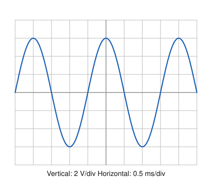
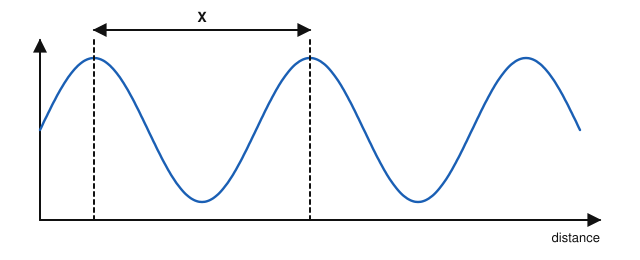
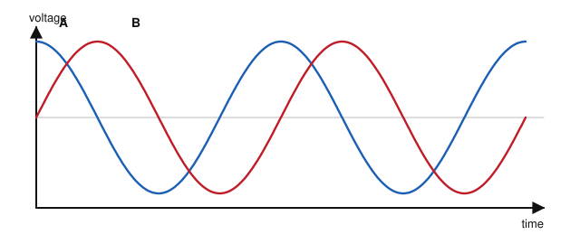
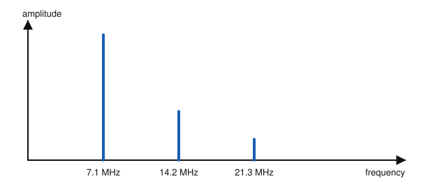

# IRTS HAREC Chapter Practice — Chapter 5: Alternating Current and Sinusoidal Signals

37 questions on Study Guide chapter 5 (printed pages 38–47), grouped by the guide's own subsections.
Read the chapter first, then try the questions. Answers, explanations and page numbers are at the end.

> Unofficial practice material based on the IRTS HAREC Study Guide (4.0.3). Syllabus section: A.3.
> Page numbers are the **printed** page numbers of the Study Guide; in a PDF viewer, add 24.

---

### 5.1 Sinusoidal Signals

**1.** A plot with time on its horizontal axis is called a plot in the:

- A) Frequency domain
- B) Time domain
- C) Spatial domain
- D) Phase domain

**2.** At what angle does a sine wave that starts at zero reach its positive peak?

- A) 270°
- B) 180°
- C) 90°
- D) 45°

**3.** To describe a sinusoidal signal completely, you need to know its:

- A) Wavelength and colour
- B) Phase only
- C) Average value only
- D) Amplitude and its period or frequency

### 5.1.1 Amplitude

**4.** The amplitude (peak voltage) of a sinusoidal signal is:

- A) The maximum voltage in either direction of flow
- B) The voltage between the positive and negative peaks
- C) The average voltage of a whole cycle
- D) The rms voltage

### 5.1.2 Period and Frequency

**5.** A signal has a period of 1 ms. What is its frequency?

- A) 1 kHz
- B) 100 Hz
- C) 1 Hz
- D) 1 MHz

**6.** A frequency of 1 Hz means:

- A) One volt per second
- B) One cycle per minute
- C) One cycle per second
- D) One metre per second

**7.** A signal with an identifiable period is called:

- A) A random signal
- B) A DC signal
- C) A noise signal
- D) A periodic signal

**8.** What is the frequency of the signal shown on the oscilloscope?

- A) 500 Hz
- B) 2 kHz
- C) 250 Hz
- D) 5 kHz

### 5.1.3 Wavelength and Frequency

**9.** The wavelength of a signal is:

- A) The time taken by one cycle
- B) The distance it travels in one period
- C) The height of the wave
- D) The number of cycles per second

**10.** Radio waves in a vacuum travel at approximately:

- A) 300 000 m/s
- B) 3 000 000 m/s
- C) 300 000 000 m/s
- D) 30 000 000 000 m/s

**11.** What is the wavelength of a 50 MHz signal?

- A) 0.6 m
- B) 6 m
- C) 60 m
- D) 15 m

**12.** What frequency corresponds to a wavelength of 30 m?

- A) 1 MHz
- B) 9 MHz
- C) 10 MHz
- D) 90 MHz

**13.** What is the approximate wavelength of a 3650 kHz signal?

- A) 8.2 m
- B) 1.1 km
- C) 820 m
- D) 82 m

**14.** The distance between two successive crests of a wave is its:

- A) Wavelength
- B) Amplitude
- C) Period
- D) Peak-to-peak value

**15.** In the figure, the distance X between two successive crests of the wave is its:

- A) Amplitude
- B) Wavelength
- C) Frequency
- D) Period

### 5.1.4 Instantaneous and Average Values

**16.** The average value of one half-cycle of a sine wave is about:

- A) 0.636 × VPK
- B) 0.707 × VPK
- C) 1.414 × VPK
- D) 2.828 × VPK

**17.** The average value of a complete cycle of a sine wave is:

- A) 0.636 × VPK
- B) Zero
- C) 0.707 × VPK
- D) Equal to the peak value

### 5.1.5 rms, Effective Voltage, Peak-to-Peak Voltage, Power

**18.** A sine wave has a peak voltage of 100 V. Its rms voltage is about:

- A) 63.6 V
- B) 70.7 V
- C) 141.4 V
- D) 200 V

**19.** The voltage normally shown by an AC voltmeter is the:

- A) Peak voltage
- B) Peak-to-peak voltage
- C) Average voltage of a whole cycle
- D) rms (effective) voltage

**20.** The abbreviation rms stands for:

- A) Radio mean signal
- B) Rated maximum supply
- C) Root mean square
- D) Relative modulation strength

**21.** A sine wave measures 10 V rms. Its peak-to-peak voltage is about:

- A) 14.1 V
- B) 20 V
- C) 7.07 V
- D) 28.3 V

**22.** A 500 Ω resistor is connected to the 230 V rms mains. How much power does it dissipate?

- A) 0.46 W
- B) 105.8 W
- C) 115 W
- D) 211.6 W

**23.** Why is the rms value so useful?

- A) It makes AC calculations, such as power, as easy as for DC
- B) It is always zero
- C) It equals the peak-to-peak voltage
- D) It removes harmonics

**24.** What is the peak-to-peak voltage of the signal shown on the oscilloscope?

- A) 6 V
- B) 3 V
- C) 12 V
- D) 24 V

### 5.2 Alternating Current

**25.** The peak voltage of the Irish 230 V rms mains supply is about:

- A) 163 V
- B) 230 V
- C) 325 V
- D) 650 V

**26.** The period of the 50 Hz mains supply is:

- A) 2 ms
- B) 20 ms
- C) 50 ms
- D) 200 ms

**27.** The peak-to-peak voltage of the Irish mains supply is about:

- A) 230 V
- B) 325 V
- C) 460 V
- D) 650 V

### 5.3 Phase

**28.** Two signals of the same frequency cross the zero line a quarter of a cycle apart. Their phase difference is:

- A) 360°
- B) 180°
- C) 90°
- D) 45°

**29.** Signal X crosses zero 90° before signal Y. We say that:

- A) X leads Y by 90°
- B) X lags Y by 90°
- C) X and Y are in phase
- D) X has twice the frequency of Y

**30.** Compare the two signals shown. Which statement is true?

- A) They are in phase
- B) A lags B by 180°
- C) A and B have different frequencies
- D) A leads B by 90°

### 5.4 Harmonics

**31.** A harmonic is a signal whose frequency is:

- A) Slightly different from another signal
- B) Unrelated to any other signal
- C) Always half of another signal
- D) An exact multiple of another signal's frequency

**32.** The second harmonic of a 7.1 MHz signal is at:

- A) 3.55 MHz
- B) 7.1 MHz
- C) 14.2 MHz
- D) 21.3 MHz

**33.** The fundamental frequency is also known as the:

- A) First harmonic
- B) Zero harmonic
- C) Second harmonic
- D) Carrier harmonic

**34.** Why do excessive harmonics from a transmitter matter?

- A) They cause interference and may put signals outside the allowed bands
- B) They improve range
- C) They reduce the SWR
- D) They only affect the receiver

**35.** The spectrum shows a transmitter on 7.1 MHz. The line at 14.2 MHz is the:

- A) Second harmonic
- B) Image frequency
- C) Third harmonic
- D) Intermediate frequency

### 5.5 Modulated Sinusoidal Signals

**36.** A pure, unmodulated sine wave used as a carrier:

- A) Carries speech
- B) Carries no information on its own
- C) Contains many harmonics
- D) Is always at 50 Hz

**37.** The process of impressing information, such as speech, on a carrier is called:

- A) Rectification
- B) Quantisation
- C) Resonance
- D) Modulation

---

## Answer Key

| Q | Ans | Explanation (Study Guide page) |
|---|-----|-------------|
| 1 | B | Plots that show time on the horizontal axis are time-domain plots (p. 38) |
| 2 | C | Zero at 0°, peak at 90°, zero at 180°, negative peak at 270° (p. 39) |
| 3 | D | Amplitude plus period or frequency; everything else follows from the sine shape (p. 39) |
| 4 | A | Amplitude, VPEAK or VMAX, is the maximum voltage in either direction (p. 39) |
| 5 | A | f = 1/period = 1/0.001 s = 1000 Hz (p. 40) |
| 6 | C | 1 Hz is exactly one cycle in one second (p. 40) |
| 7 | D | Signals with an identifiable period are periodic; all sinusoids are periodic (p. 40) |
| 8 | A | One cycle spans 4 divisions × 0.5 ms = 2 ms, so f = 1/2 ms = 500 Hz (p. 40) |
| 9 | B | Wavelength is the distance travelled in one period, e.g. crest to crest (p. 40) |
| 10 | C | The speed of light, c, is about 300 000 000 m/s (p. 41) |
| 11 | B | λ = 300/f(MHz) = 300/50 = 6 m (p. 42) |
| 12 | C | f(MHz) = 300/λ = 300/30 = 10 MHz (p. 42) |
| 13 | D | Convert to MHz first: 3.65 MHz; λ = 300/3.65 ≈ 82 m (p. 42) |
| 14 | A | Wavelength is the distance between successive crests (p. 40) |
| 15 | B | The wavelength is the distance between two successive crests (p. 40) |
| 16 | A | VAVG = 0.636 × VPK for a half-cycle (p. 42) |
| 17 | B | The positive and negative halves cancel, so the average over a whole cycle is zero (p. 42) |
| 18 | B | VRMS = 0.707 × VPK (p. 42) |
| 19 | D | AC voltmeters normally indicate the effective, rms, value (p. 42) |
| 20 | C | rms = root mean square (p. 42) |
| 21 | D | VPP = 2.828 × VRMS (p. 43) |
| 22 | B | P = VRMS²/R = 230²/500 ≈ 105.8 W (p. 43) |
| 23 | A | Using VRMS lets you apply Ohm's law and the power formulas as for DC (p. 43) |
| 24 | C | Each peak is 3 divisions × 2 V = 6 V from the centre, so peak-to-peak is 12 V (p. 43) |
| 25 | C | VPK = 1.414 × 230 ≈ 325 V (p. 44) |
| 26 | B | 1 s / 50 = 0.02 s = 20 ms (p. 44) |
| 27 | D | VPP = 2.828 × 230 ≈ 650 V (p. 44) |
| 28 | C | One cycle is 360°, so ¼ cycle is 90° (p. 44) |
| 29 | A | The one that crosses first leads; the other lags (p. 44) |
| 30 | D | A reaches its peak a quarter of a cycle (90°) before B (p. 44) |
| 31 | D | A harmonic is at an exact multiple of the fundamental (p. 45) |
| 32 | C | Second harmonic = 2 × fundamental (p. 45) |
| 33 | A | The fundamental is the first harmonic (p. 45) |
| 34 | A | Unwanted harmonics cause interference and may be illegal out-of-band emissions (p. 45) |
| 35 | A | A frequency twice the fundamental is the second harmonic; 21.3 MHz is the third (p. 45) |
| 36 | B | A pure sine wave carries no information other than its presence (p. 45) |
| 37 | D | Impressing information on the carrier is modulation (p. 45) |
