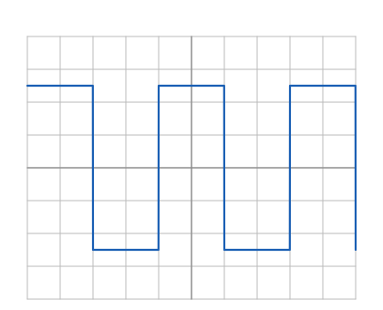
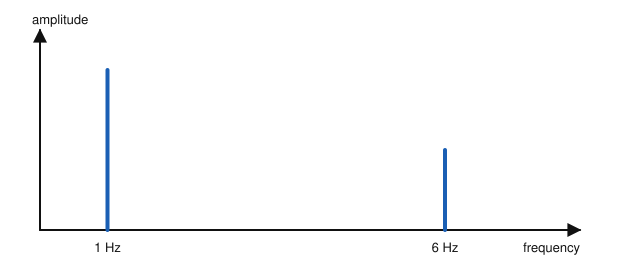
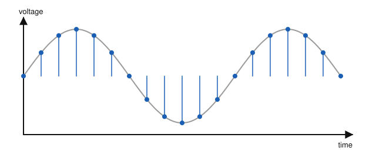

# IRTS HAREC Chapter Practice — Chapter 6: Digital Signal Processing and Non-Sinusoidal Signals

46 questions on Study Guide chapter 6 (printed pages 48–69), grouped by the guide's own subsections.
Read the chapter first, then try the questions. Answers, explanations and page numbers are at the end.

> Unofficial practice material based on the IRTS HAREC Study Guide (4.0.3). Syllabus section: A.3.
> Page numbers are the **printed** page numbers of the Study Guide; in a PDF viewer, add 24.

---

### 6.1 Non-Sinusoidal Signals

**1.** A square wave is:

- A) Sinusoidal and periodic
- B) Non-sinusoidal and non-periodic
- C) Sinusoidal but non-periodic
- D) Non-sinusoidal but periodic

**2.** Most of the signals that carry information in radio, such as speech, are:

- A) Pure sine waves
- B) Square waves
- C) Non-periodic
- D) DC

**3.** Why must a square wave not be fed directly to an antenna?

- A) It has no harmonics
- B) Its sudden changes create many unwanted harmonics that cause interference
- C) It is too weak
- D) It only contains DC

**4.** Which range of audio frequencies contributes most to the intelligibility of speech?

- A) 300 Hz–2.7 kHz
- B) 20 Hz–300 Hz
- C) 5 kHz–12 kHz
- D) 12 kHz–20 kHz

**5.** The range of perfect human hearing is about:

- A) 300 Hz–3 kHz
- B) 50 Hz–8 kHz
- C) 20 Hz–20 kHz
- D) 1 kHz–100 kHz

**6.** Why must the waveform shown never be fed directly to an antenna?

- A) It has no frequency
- B) It contains many unwanted harmonics
- C) It is too weak
- D) It is a DC signal

### 6.2 Digital Signal Processing

**7.** Digital Signal Processing (DSP) uses:

- A) Valves to amplify RF
- B) Mechanical relays
- C) Only crystal filters
- D) Software to transform a digital representation of the signal

**8.** Because of cost and complexity, DSP in many radios works at:

- A) The intermediate frequency (IF)
- B) Microwave frequencies only
- C) The mains frequency
- D) DC

**9.** Before analogue data can be processed by DSP, it must be:

- A) Amplified to 100 W
- B) Digitised by an analogue to digital converter
- C) Converted to a square wave
- D) Modulated onto a carrier

**10.** Converting the digital output of a DSP back into an analogue signal is called:

- A) Sampling
- B) Quantisation
- C) Synthesis or generation
- D) Aliasing

### 6.2.1 Time and Frequency Domains

**11.** A plot with frequency on its horizontal axis and amplitude on its vertical axis is a:

- A) Time domain plot
- B) Frequency domain plot
- C) Spatial domain plot
- D) Circuit diagram

**12.** A waterfall display on a modern receiver is an example of a:

- A) Frequency domain plot
- B) Time domain plot
- C) Block diagram
- D) Circuit diagram

**13.** A 1 Hz sine wave with amplitude ±4 is added to a 6 Hz sine wave with amplitude ±2. The result:

- A) Is a pure sine wave
- B) Is a square wave
- C) Has a frequency of 7 Hz only
- D) Is periodic but no longer sinusoidal, varying between −6 and 6

**14.** Can a real-world signal be converted between the time and frequency domains without losing detail?

- A) No, detail is always lost
- B) Only for sine waves
- C) Only once
- D) Yes, any number of times

**15.** The plot shown, with frequency on its horizontal axis, is a:

- A) Time domain plot
- B) Smith chart
- C) Frequency domain plot
- D) Radiation pattern

### 6.2.2 Fast Fourier Transform (FFT)

**16.** The Fourier transform converts a signal into:

- A) A square wave
- B) A combination of sinusoidal signals
- C) A DC voltage
- D) A sequence of bits

**17.** What does FFT stand for?

- A) Frequency Filter Transfer
- B) Final Frequency Tuning
- C) Fast Fourier Transform
- D) Fixed Function Transistor

**18.** The main difference between a Fourier transform and an FFT is that the FFT:

- A) Works with digitised (sampled and quantised) signals
- B) Works only on sine waves
- C) Cannot be reversed
- D) Only works in the time domain

**19.** At its simplest, an FFT takes a digitised signal in the time domain and calculates:

- A) Its frequency domain
- B) Its rms voltage
- C) Its SWR
- D) Its sampling rate

### 6.3.1 Sampling

**20.** Sampling means:

- A) Rounding a measurement to a number
- B) Measuring the amplitude of a continuous analogue signal at very short intervals
- C) Filtering out high frequencies
- D) Mixing two signals

**21.** In general, taking more samples per second makes the sampling:

- A) Less accurate
- B) Slower to process but no different
- C) More accurate
- D) Impossible to quantise

**22.** What process is shown by the dots taken at regular intervals from the analogue signal?

- A) Modulation
- B) Filtering
- C) Amplification
- D) Sampling

### 6.3.2 Quantisation

**23.** Converting an analogue sample into a number is called:

- A) Synthesis
- B) Aliasing
- C) Modulation
- D) Quantisation

**24.** Why is an ADC always a physical device, not software alone?

- A) Because the law requires it
- B) Because software cannot store numbers
- C) Because it needs a valve
- D) Because sampling and quantisation are implemented in hardware

### 6.3.3 Sampling Rate and Resolution

**25.** The sampling rate of an ADC determines its:

- A) Bandwidth
- B) Resolution
- C) Supply voltage
- D) Power output

**26.** The resolution of an ADC is expressed in:

- A) Hertz
- B) Ohms
- C) Bits
- D) Watts

**27.** Increasing the resolution of an ADC:

- A) Reduces the bandwidth
- B) Increases the signal-to-noise ratio and dynamic range
- C) Lowers the sampling rate
- D) Causes aliasing

**28.** The dynamic range of a converter is the ratio between:

- A) The highest and lowest frequencies
- B) The sampling rate and resolution
- C) The input and output impedance
- D) The loudest and quietest signals it can work with

### 6.3.4 Minimum Sampling Rate

**29.** The minimum sampling rate (Nyquist rate) must be at least:

- A) Twice the highest frequency in the signal
- B) Equal to the highest frequency in the signal
- C) Half the highest frequency in the signal
- D) Ten times the lowest frequency in the signal

**30.** To digitise audio up to 20 kHz perfectly, the sampling rate must be at least:

- A) 10 kHz
- B) 20 kHz
- C) 40 kHz
- D) 200 kHz

**31.** To sample a 144 MHz VHF signal directly, the sampling rate would need to be at least:

- A) 72 MHz
- B) 288 MHz
- C) 144 MHz
- D) 1.44 GHz

**32.** Sampling a signal below the minimum sampling rate introduces unwanted artefacts called:

- A) Harmonics
- B) Aliasing
- C) Key clicks
- D) Fading

**33.** What is the purpose of an anti-aliasing filter in front of an ADC?

- A) To remove frequencies higher than half the sampling rate
- B) To amplify weak signals
- C) To remove DC
- D) To increase the resolution

### 6.3.5 Oversampling

**34.** Sampling at a higher rate than the minimum sampling rate is called:

- A) Undersampling
- B) Aliasing
- C) Quantising
- D) Oversampling

**35.** One benefit of oversampling is that it:

- A) Increases transmitter power
- B) Removes the need for a DAC
- C) Reduces the impact of quantisation errors and noise
- D) Causes aliasing

### 6.4 DAC and Direct Digital Synthesis

**36.** Direct Digital Synthesis (DDS) typically combines a DAC with:

- A) A crystal filter
- B) A numerically controlled oscillator (NCO)
- C) A valve amplifier
- D) An SWR bridge

**37.** After a DAC, a reconstruction filter is used. What type of filter is it?

- A) High-pass
- B) Notch
- C) Band-stop
- D) Low-pass

**38.** The NCO in a DDS relies on:

- A) A high-precision reference clock
- B) A thermionic valve
- C) The mains frequency
- D) An SWR meter

### 6.5 Software Defined Radio

**39.** Software Defined Radio (SDR) uses:

- A) Valves exclusively
- B) Only analogue filters
- C) Software (algorithms) to implement key radio functions
- D) No hardware at all

**40.** Which function still cannot be done by software alone in an SDR?

- A) Noise reduction
- B) Final stage high power amplification
- C) Filtering of audio
- D) Demodulation

### 6.5.1 SDR as a Broadband Receiver

**41.** An SDR used as a broadband receiver is typically used to:

- A) Listen to one station at a time with the best audio
- B) Measure SWR
- C) Transmit on many bands
- D) Display a waterfall of an entire band or several bands

**42.** Why can a broadband SDR for waterfall displays be inexpensive?

- A) It has low requirements of resolution and dynamic range
- B) It works only at audio frequencies
- C) It has no ADC
- D) It uses valves

### 6.5.2 Modern Transceivers and SDR

**43.** A fully digital SDR receiver uses:

- A) A crystal set
- B) Only analogue superheterodyne stages
- C) Direct sampling of the RF signal from the antenna
- D) A valve detector

**44.** A hybrid SDR typically uses a superheterodyne front end to deliver to the DSP:

- A) RF at the operating frequency
- B) Mains frequency AC
- C) A good quality lower IF
- D) Only CW signals

**45.** Since about when have traditional, all-analogue transceivers not been commercially produced?

- A) 2020
- B) 2005
- C) 1985
- D) 1965

**46.** An older transceiver that uses DSP only to improve the received audio is:

- A) Not a form of SDR, as the DSP does not work with the RF signal
- B) A hybrid SDR
- C) A fully digital SDR
- D) A direct sampling receiver

---

## Answer Key

| Q | Ans | Explanation (Study Guide page) |
|---|-----|-------------|
| 1 | D | It has sudden transitions (not a sine) but repeats regularly (periodic) (p. 49) |
| 2 | C | Most signals used in radio are non-periodic: their shape changes with the information (p. 48) |
| 3 | B | Sudden amplitude changes form many unwanted harmonic signals (p. 49) |
| 4 | A | 300 Hz–2.7 kHz, used extensively in SSB (p. 50) |
| 5 | C | Perfect human hearing detects audio from 20 Hz to 20 kHz (p. 50) |
| 6 | B | A square wave is made of many harmonics that would be radiated (p. 49) |
| 7 | D | DSP uses software to filter, remove noise, etc. on digitised data (p. 51) |
| 8 | A | DSP usually works at lower intermediate frequencies, with conversion to and from RF (p. 51) |
| 9 | B | Analogue data must first be digitised, using an ADC (p. 52) |
| 10 | C | The reverse of digitisation is synthesis; a common technique is DDS (p. 52) |
| 11 | B | Frequencies on the horizontal axis make it a frequency-domain plot (p. 53) |
| 12 | A | A waterfall display is a useful frequency-domain plot (p. 56) |
| 13 | D | The sum is a single periodic, non-sinusoidal signal between −6 and 6 (p. 53) |
| 14 | D | Real-world signals can be converted between domains any number of times without losing detail (p. 53) |
| 15 | C | Frequency on the horizontal axis means a frequency domain plot (p. 53) |
| 16 | B | It extracts the pure frequencies, converting any signal into sinusoids (p. 50) |
| 17 | C | FFT = Fast Fourier Transform, the practical algorithm used in DSP (p. 57) |
| 18 | A | FFT works with digitised signals (p. 57) |
| 19 | A | FFT calculates the frequency domain from the time domain (p. 57) |
| 20 | B | Sampling measures the amplitude at very short intervals (p. 58) |
| 21 | C | The more samples taken per second, the more accurate the sampling (p. 59) |
| 22 | D | Sampling measures the amplitude of the analogue signal at regular intervals (p. 58) |
| 23 | D | Quantisation turns the sample into digital data (p. 59) |
| 24 | D | Sampling and quantisation are done in hardware (p. 60) |
| 25 | A | Sampling rate determines the bandwidth (p. 60) |
| 26 | C | Resolution is the number of bits per sample (p. 60) |
| 27 | B | The higher the resolution, the higher the SNR and dynamic range (p. 60) |
| 28 | D | Dynamic range measures the loudest vs. quietest signal it can handle, in dB (p. 61) |
| 29 | A | Minimum sampling rate = 2 × highest frequency (p. 61) |
| 30 | C | 2 × 20 kHz = 40 kHz (p. 62) |
| 31 | B | 2 × 144 MHz = 288 MHz (p. 62) |
| 32 | B | Under-sampling causes aliasing (p. 62) |
| 33 | A | It removes frequencies above half the sampling rate so they do not appear as aliases (p. 62) |
| 34 | D | Oversampling is genuinely useful in practice (p. 63) |
| 35 | C | Oversampling reduces quantisation errors and the influence of noise (p. 63) |
| 36 | B | DDS combines an NCO and a DAC (p. 52) |
| 37 | D | The reconstruction filter is a low-pass filter that smooths the AC (p. 64) |
| 38 | A | The NCO relies on a high-precision reference clock (p. 64) |
| 39 | C | SDR implements in software the functions traditionally done by components (p. 64) |
| 40 | B | Software cannot do final high-power amplification and is poor at rejecting strong out-of-band signals (p. 65) |
| 41 | D | A broadband receiver receives a whole band at once, ideal for waterfall displays (p. 65) |
| 42 | A | Waterfall-only use has low resolution and dynamic range needs (p. 66) |
| 43 | C | Fully digital receivers use direct sampling of the RF (p. 67) |
| 44 | C | The analogue superhet delivers a good lower IF to the DSP (p. 68) |
| 45 | B | Hybrid designs since about 1995; all-analogue not produced since about 2005 (p. 67) |
| 46 | A | DSP that only augments the AF is not SDR (p. 69) |
