# IRTS HAREC Chapter Practice — Chapter 8: Resonant Circuits and Components

70 questions on Study Guide chapter 8 (printed pages 88–115), grouped by the guide's own subsections.
Read the chapter first, then try the questions. Answers, explanations and page numbers are at the end.

> Unofficial practice material based on the IRTS HAREC Study Guide (4.0.3). Syllabus section: A.4.
> Page numbers are the **printed** page numbers of the Study Guide; in a PDF viewer, add 24.

---

### 8.1 Resonant Components: Inductors

**1.** An inductor stores energy in:

- A) An electric field
- B) A chemical reaction
- C) A magnetic field
- D) A dielectric

**2.** How does the inductance of a coil change if more turns are added?

- A) It decreases
- B) It becomes zero
- C) It stays the same
- D) It increases

**3.** Increasing the spacing between the turns of a coil will:

- A) Decrease its inductance
- B) Increase its inductance
- C) Not change its inductance
- D) Turn it into a capacitor

**4.** Inserting a ferrite core into a coil will:

- A) Decrease its inductance
- B) Increase its inductance
- C) Have no effect
- D) Turn the inductance negative

**5.** A brass core in a coil:

- A) Decreases the inductance
- B) Increases the inductance
- C) Has no effect
- D) Makes the coil resonant

**6.** The unit of inductance is the:

- A) Farad
- B) Ohm
- C) Henry
- D) Tesla

### 8.1.1 Back Electromotive Force

**7.** The voltage an inductor generates to oppose a change of current is called:

- A) Leakage current
- B) Back emf
- C) Dielectric strength
- D) Resonance

**8.** When DC passes through an inductor, its back emf:

- A) Lasts all the time
- B) Reverses the current
- C) Never appears
- D) Only lasts during the initial surge

### 8.1.2 Inductors in Series and Parallel

**9.** Inductors of 22 mH and 10 mH are connected in series. The total inductance is:

- A) 6.9 mH
- B) 12 mH
- C) 32 mH
- D) 220 mH

**10.** Two 20 mH inductors are connected in parallel. The total inductance is:

- A) 10 mH
- B) 20 mH
- C) 40 mH
- D) 400 mH

**11.** What is the inductance between A and B in the circuit shown?

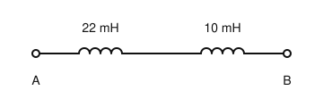

- A) 6.9 mH
- B) 12 mH
- C) 32 mH
- D) 220 mH

### 8.1.3 Inductive Reactance

**12.** As the frequency increases, the reactance of an inductor:

- A) Decreases
- B) Increases
- C) Stays the same
- D) Becomes negative

**13.** What is the approximate reactance of a 1 µH inductor at 2 MHz?

- A) 1.3 Ω
- B) 13 Ω
- C) 79 Ω
- D) 130 Ω

**14.** In a pure inductor carrying AC, the current:

- A) Is in phase with the voltage
- B) Lags the voltage by 180°
- C) Leads the voltage by 90°
- D) Lags the voltage by 90°

**15.** Does the inductance of a coil change with frequency?

- A) No; inductance is a property of its construction, but its reactance changes
- B) Yes, it falls with frequency
- C) Yes, it rises with frequency
- D) Only at DC

### 8.2 Resonant Components: Capacitors

**16.** A capacitor stores energy in:

- A) A magnetic field
- B) Its resistance
- C) An electric field
- D) A coil of wire

**17.** Which change increases the capacitance of a capacitor?

- A) Moving the plates further apart
- B) Using smaller plates
- C) Using a dielectric with a lower dielectric constant
- D) Moving the plates closer together

**18.** The unit of capacitance is the:

- A) Henry
- B) Farad
- C) Coulomb
- D) Siemens

**19.** Besides capacitance and tolerance, a capacitor is rated for its:

- A) Maximum working voltage
- B) Inductance
- C) Turns ratio
- D) Resonant frequency

### 8.2.1 Dielectrics

**20.** A dielectric is:

- A) A good conductor
- B) A magnetic material
- C) A semiconductor
- D) An insulator that can hold a static electric field

**21.** Which dielectric is used in tuning capacitors with fixed and moving plates?

- A) Paper
- B) Metal oxide
- C) Air
- D) Electrolyte

**22.** Electrolytic capacitors are damaged if:

- A) Their polarity is reversed
- B) They are used at DC
- C) They are kept cool
- D) They are used below their working voltage

### 8.2.2 Behaviour of Capacitors in AC and DC

**23.** Once a capacitor connected to DC has charged:

- A) It passes DC freely
- B) Its capacitance doubles
- C) It generates AC
- D) It blocks DC, apart from a small leakage current

**24.** The small current that flows through the dielectric of a charged capacitor is called:

- A) Back emf
- B) Leakage current
- C) Eddy current
- D) Bias current

### 8.2.3 Capacitors in Series and Parallel

**25.** Capacitors of 120 pF and 60 pF are connected in series. The total capacitance is:

- A) 40 pF
- B) 60 pF
- C) 90 pF
- D) 180 pF

**26.** Capacitors of 150 pF, 300 pF and 50 pF are connected in parallel. The total capacitance is:

- A) 30 pF
- B) 150 pF
- C) 300 pF
- D) 500 pF

**27.** Connecting capacitors in series:

- A) Increases the total capacitance
- B) Gives the average capacitance
- C) Reduces the total capacitance below the smallest one
- D) Has no effect

**28.** What is the capacitance between A and B in the circuit shown?

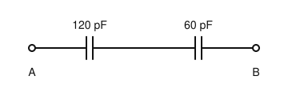

- A) 180 pF
- B) 40 pF
- C) 60 pF
- D) 90 pF

### 8.2.4 Capacitive Reactance

**29.** As the frequency increases, the reactance of a capacitor:

- A) Increases
- B) Stays the same
- C) Decreases
- D) Becomes infinite

**30.** What is the approximate reactance of a 1 nF capacitor at 2 MHz?

- A) 790 Ω
- B) 79 Ω
- C) 32 Ω
- D) 13 Ω

**31.** In a pure capacitor carrying AC, the current:

- A) Lags the voltage by 90°
- B) Leads the voltage by 180°
- C) Is in phase with the voltage
- D) Leads the voltage by 90°

**32.** The figure shows the voltage and current in a component; the current leads the voltage by 90°. The component is:

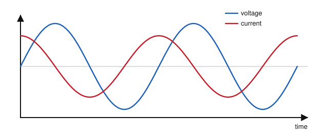

- A) A resistor
- B) An inductor
- C) A diode
- D) A capacitor

### 8.3.1 Reactance

**33.** A circuit has 13 Ω inductive reactance and 79 Ω capacitive reactance. Its total reactance is:

- A) 92 Ω, inductive
- B) 66 Ω, capacitive
- C) 66 Ω, inductive
- D) Zero

**34.** A circuit whose total reactance is a positive number is said to be:

- A) Inductive
- B) Capacitive
- C) Resonant
- D) Purely resistive

### 8.3.2 Resonance

**35.** A series LC circuit is resonant when:

- A) Its resistance is zero
- B) Its inductance equals its capacitance
- C) Its inductive reactance equals its capacitive reactance
- D) Its frequency is zero

**36.** The resonant frequency of an LC circuit depends on:

- A) Only the inductance
- B) Only the capacitance
- C) Both the inductance and the capacitance
- D) Only the resistance

**37.** If the capacitance in a tuned circuit is increased, its resonant frequency:

- A) Falls
- B) Rises
- C) Stays the same
- D) Doubles

**38.** Adjusting the resonance of a circuit with variable capacitors and inductors is the principle of:

- A) An SWR meter
- B) A rectifier
- C) A dummy load
- D) An antenna tuning unit (ATU)

### 8.3.3 Impedance

**39.** Impedance is:

- A) Resistance only
- B) The combination of resistance and reactance
- C) Reactance only
- D) The inverse of conductance only

**40.** The impedance of a resonant circuit is:

- A) Purely reactive
- B) Always zero
- C) Always infinite
- D) Purely resistive

**41.** The characteristic impedance of the coaxial cable commonly used in amateur stations is:

- A) 50 Ω
- B) 75 Ω
- C) 300 Ω
- D) 600 Ω

### 8.4.1 Series and Parallel LC Circuits

**42.** A series LC circuit, connected in series with a load, at resonance has:

- A) A high impedance and blocks the signal
- B) Infinite resistance
- C) A low impedance and passes the signal
- D) No effect

**43.** A parallel LC circuit at resonance has:

- A) A low impedance; it is an acceptor
- B) A high impedance; it is a rejector
- C) Zero impedance
- D) A negative impedance

**44.** A series LC circuit connected in parallel with a load acts as a:

- A) Band-pass filter
- B) Band-stop filter
- C) Low-pass filter
- D) High-pass filter

**45.** The series LC circuit shown is connected across the line, in parallel with the load. It acts as a:

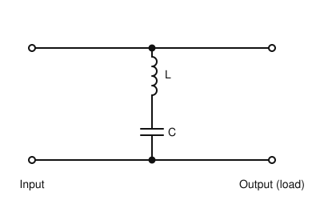

- A) Band-pass filter
- B) Low-pass filter
- C) Band-stop filter
- D) High-pass filter

**46.** At its resonant frequency, the parallel LC circuit shown in the signal path:

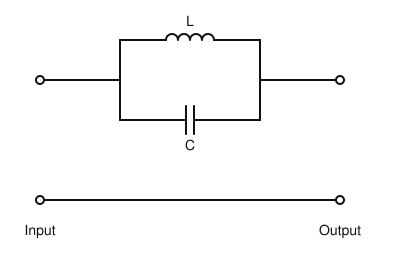

- A) Has a high impedance and blocks that frequency
- B) Has a low impedance and passes that frequency
- C) Has zero impedance
- D) Turns AC into DC

### 8.4.2 Filters

**47.** A filter that passes low frequencies and stops high frequencies is a:

- A) High-pass filter
- B) Band-stop filter
- C) Low-pass filter
- D) Notch filter

**48.** A band-stop filter with a very sharp transition, used to remove a narrow range of frequencies, is called a:

- A) Notch filter
- B) Pi filter
- C) Roofing filter
- D) T filter

**49.** The half-power (−3 dB) bandwidth of a circuit is where the signal voltage has fallen to about:

- A) 50% of its peak
- B) 10% of its peak
- C) 25% of its peak
- D) 70.7% of its peak

**50.** The shape factor of a filter is the ratio of its:

- A) −6 dB and −60 dB bandwidths
- B) Input and output impedances
- C) Inductance and capacitance
- D) Resonant frequency and bandwidth

**51.** A low-pass Pi filter is named after:

- A) Its inventor
- B) The number 3.14
- C) The Greek letter Π, which its circuit layout resembles
- D) Its use with PIN diodes

**52.** The response curve shown is that of a:

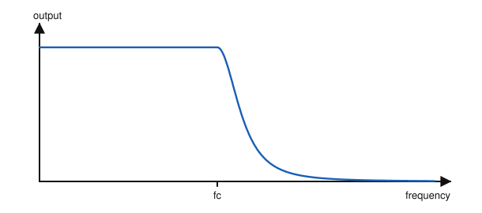

- A) High-pass filter
- B) Band-stop filter
- C) Band-pass filter
- D) Low-pass filter

**53.** The response curve shown, which falls away below fc, is that of a:

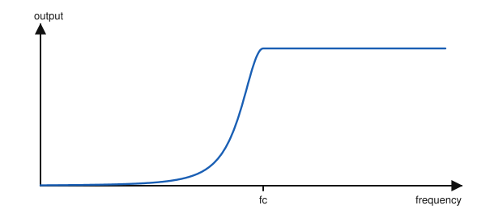

- A) Low-pass filter
- B) High-pass filter
- C) Notch filter
- D) Band-pass filter

**54.** The circuit shown, with a capacitor in series and an inductor to ground, is a:

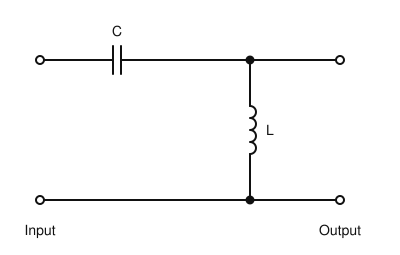

- A) High-pass filter
- B) Low-pass filter
- C) Band-stop filter
- D) Rectifier

**55.** A filter with the very narrow, deep dip shown is called a:

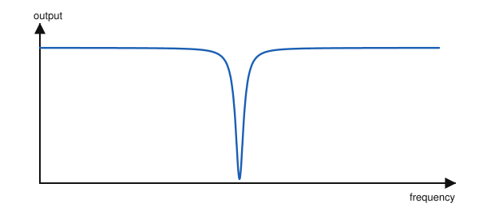

- A) Roofing filter
- B) Low-pass filter
- C) Notch filter
- D) Pi filter

**56.** The filter shown, with C1, L and C2, is known as a:

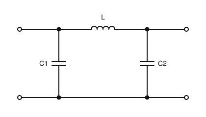

- A) Pi filter
- B) T filter
- C) Notch filter
- D) Crystal filter

### 8.4.3 Digital Filters

**57.** Which digital filter type can represent traditional electronic filter designs and give a very sharp transition?

- A) FIR
- B) IIR
- C) FFT
- D) DDS

**58.** Why are analogue band-pass filters still needed in front of an SDR receiver?

- A) The law requires them
- B) Digital filters cannot filter audio
- C) Analogue filters are always sharper
- D) Digital filters cannot handle strong out-of-band signals before the ADC

### 8.4.4 Q factor

**59.** A circuit with a high Q factor has:

- A) A wide bandwidth
- B) No resonance
- C) A narrow bandwidth
- D) High losses

**60.** A filter resonates at 7 MHz and has a half-power bandwidth of 70 kHz. Its Q is:

- A) 10
- B) 100
- C) 490
- D) 1000

**61.** The unit of Q factor is:

- A) It has no unit; it is a ratio
- B) Hertz
- C) Decibel
- D) Ohm

**62.** What is the Q factor of the resonant circuit whose response is shown?

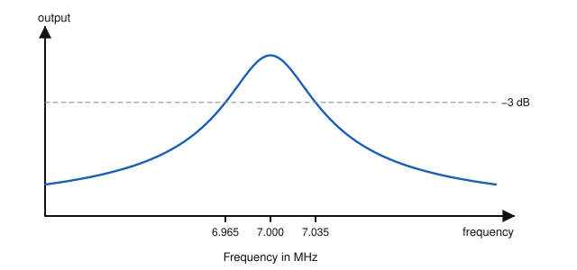

- A) 7
- B) 70
- C) 1000
- D) 100

### 8.5 Quartz Crystals

**63.** A quartz crystal that deforms when a voltage is applied, and generates a voltage when squeezed, shows:

- A) The Hall effect
- B) The Doppler effect
- C) The skin effect
- D) The piezo-electric effect

**64.** Crystal overtones are:

- A) Even harmonics of the fundamental
- B) Frequencies below the fundamental
- C) Odd harmonics (3rd, 5th, …) of the fundamental
- D) Random frequencies

**65.** Quartz crystals are widely used because they:

- A) Resonate only at a very exact frequency, making accurate filters and stable oscillators
- B) Have a very low Q
- C) Pass DC
- D) Amplify signals

### 8.6 Oscillators

**66.** An electronic oscillator generates:

- A) DC from AC
- B) AC at a desired frequency from a DC supply
- C) Power from heat
- D) Square waves only

**67.** Which oscillator is used to make received CW signals audible?

- A) Master oscillator
- B) Numerically controlled oscillator
- C) Variable frequency oscillator (VFO)
- D) Beat frequency oscillator (BFO)

**68.** In an SSB receiver, the suppressed carrier is restored by the:

- A) Crystal filter
- B) Master oscillator
- C) Carrier insertion oscillator (CIO)
- D) AGC

**69.** A practical oscillator can be made from an amplifier and:

- A) A resonant circuit providing positive feedback
- B) A resistor providing negative feedback
- C) A rectifier
- D) A fuse

**70.** The oscillator in a receiver that is mixed with the incoming signal to change its frequency is the:

- A) Beat frequency oscillator
- B) Local oscillator (LO)
- C) Carrier oscillator
- D) Master oscillator

---

## Answer Key

| Q | Ans | Explanation (Study Guide page) |
|---|-----|-------------|
| 1 | C | An inductor stores energy in a magnetic field; a capacitor in an electric field (p. 88) |
| 2 | D | Inductance increases with the number of turns and the coil diameter (p. 89) |
| 3 | A | Inductance decreases if the spacing between turns is increased (p. 89) |
| 4 | B | Ferrite cores increase inductance; brass cores decrease it (p. 89) |
| 5 | A | Brass cores decrease inductance (p. 89) |
| 6 | C | Inductance is in henry (H); mH and µH are common (p. 89) |
| 7 | B | Back (counter) emf opposes the current trying to pass through the inductor (p. 89) |
| 8 | D | With DC the opposition only lasts until the current stabilises; with AC it is continuous (p. 89) |
| 9 | C | Inductors in series add, like resistors: 22 + 10 = 32 mH (p. 90) |
| 10 | A | Inductors in parallel combine like resistors in parallel: 20 ∥ 20 = 10 mH (p. 90) |
| 11 | C | Inductors in series add: 22 + 10 = 32 mH (p. 90) |
| 12 | B | XL = 2πfL rises with frequency (p. 91) |
| 13 | B | XL = 2 × 3.14 × 2 000 000 × 0.000 001 ≈ 12.6 ≈ 13 Ω (p. 91) |
| 14 | D | Back emf makes the current lag the voltage by 90° (p. 92) |
| 15 | A | Inductance stays the same; inductive reactance increases with frequency (p. 91) |
| 16 | C | A capacitor stores electrical energy in an electric field (p. 93) |
| 17 | D | Larger plates, closer spacing and a higher dielectric constant all increase capacitance (p. 93) |
| 18 | B | Capacitance is in farad (F); µF, nF and pF are common (p. 93) |
| 19 | A | Capacitors have a maximum working voltage they can support (p. 93) |
| 20 | D | A dielectric is an insulator in which charges separate under an electric field (p. 94) |
| 21 | C | Air variable capacitors let the effective plate area vary (p. 94) |
| 22 | A | Electrolytics are polarised and are easily damaged by reversed polarity (p. 94) |
| 23 | D | After the initial surge, a capacitor blocks DC; a small leakage current remains (p. 94) |
| 24 | B | This is the leakage current (p. 94) |
| 25 | A | Series capacitors combine like parallel resistors: 1/(1/120 + 1/60) = 40 pF (p. 95) |
| 26 | D | Capacitors in parallel add: 150 + 300 + 50 = 500 pF (p. 96) |
| 27 | C | Series capacitors reduce the value below the smallest capacitance (p. 95) |
| 28 | B | In series: 1/(1/120 + 1/60) = 40 pF (p. 95) |
| 29 | C | XC = 1/(2πfC) falls as frequency rises (p. 96) |
| 30 | B | XC = 1/(2 × 3.14 × 2 000 000 × 0.000 000 001) ≈ 79 Ω (p. 97) |
| 31 | D | In a capacitor the current leads the voltage by 90°, the opposite of an inductor (p. 97) |
| 32 | D | In a capacitor the current leads the voltage by 90°; in an inductor it lags (p. 97) |
| 33 | B | X = XL − XC = 13 − 79 = −66 Ω; negative means capacitive (p. 98) |
| 34 | A | More inductive than capacitive reactance gives a positive X: inductive (p. 98) |
| 35 | C | At resonance XL = XC and the total reactance is zero (p. 98) |
| 36 | C | fres = 1/(2π√(LC)), so it depends on both L and C (p. 99) |
| 37 | A | fres = 1/(2π√(LC)): more C gives a lower frequency (p. 100) |
| 38 | D | ATUs use variable L and C to match impedances (p. 100) |
| 39 | B | Impedance (Z, in ohms) combines resistance and reactance (p. 100) |
| 40 | D | With no reactance at resonance, the impedance is purely resistive (p. 100) |
| 41 | A | Common coaxial cable is 50 Ω (p. 100) |
| 42 | C | A series LC is an acceptor: low impedance at resonance (p. 103) |
| 43 | B | A parallel LC is a rejector: high impedance at resonance (p. 103) |
| 44 | B | Connecting LC circuits in parallel with the load reverses their behaviour: series LC becomes band-stop (p. 105) |
| 45 | C | At resonance its low impedance shorts the resonant frequency away from the load (p. 105) |
| 46 | A | A parallel LC circuit has a high impedance at resonance (p. 103) |
| 47 | C | Low-pass passes low frequencies, stops high ones (p. 108) |
| 48 | A | A sharp band-stop filter is a notch filter (p. 108) |
| 49 | D | Half power corresponds to 0.7071 of the peak voltage (p. 107) |
| 50 | A | Shape factor compares the −6 dB and −60 dB bandwidths (p. 108) |
| 51 | C | T and Pi filters are named after the letters their layout resembles (p. 109) |
| 52 | D | It passes frequencies below fc and stops those above (p. 108) |
| 53 | B | It stops frequencies below fc and passes those above (p. 108) |
| 54 | A | The series capacitor blocks low frequencies and the inductor shunts them to ground (p. 108) |
| 55 | C | A sharp band-stop filter that removes a narrow range is a notch filter (p. 108) |
| 56 | A | Its layout resembles the Greek letter π; this one is low-pass (p. 109) |
| 57 | B | IIR filters can represent any RLC design and give sharp transitions (p. 111) |
| 58 | D | Strong nearby signals must be filtered before they reach the ADC (p. 111) |
| 59 | C | High Q = narrow bandwidth; low Q = wide bandwidth (p. 112) |
| 60 | B | Q = fres / B = 7 000 000 / 70 000 = 100 (p. 112) |
| 61 | A | Q is a ratio and has no unit (p. 112) |
| 62 | D | Q = resonant frequency / bandwidth = 7000 kHz / 70 kHz = 100 (p. 112) |
| 63 | D | This is the piezo-electric effect (p. 113) |
| 64 | C | Crystals can resonate on overtones, the odd harmonics (p. 113) |
| 65 | A | Their very exact resonance makes accurate filters and stable oscillators (p. 113) |
| 66 | B | Oscillators generate AC at the desired frequency from DC (p. 113) |
| 67 | D | The BFO is mixed with the IF to produce an audible CW tone (p. 115) |
| 68 | C | The CIO restores the carrier suppressed by the SSB transmitter (p. 115) |
| 69 | A | An amplifier with positive feedback through a resonant circuit (LC or crystal) (p. 115) |
| 70 | B | The local oscillator is mixed with the incoming signal (p. 114) |
