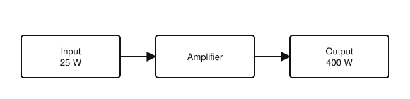
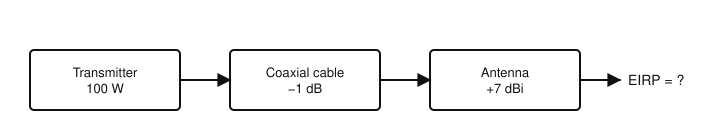

# IRTS HAREC Chapter Practice — Chapter 9: Power Ratios and Decibels

27 questions on Study Guide chapter 9 (printed pages 116–119), grouped by the guide's own subsections.
Read the chapter first, then try the questions. Answers, explanations and page numbers are at the end.

> Unofficial practice material based on the IRTS HAREC Study Guide (4.0.3). Syllabus section: A.3.
> Page numbers are the **printed** page numbers of the Study Guide; in a PDF viewer, add 24.

---

### 9.1 Decibel

**1.** The decibel (dB) expresses:

- A) A ratio between two quantities
- B) An absolute power in watts
- C) A voltage
- D) A frequency

**2.** An amplifier makes its output signal ten times as strong as its input. Its gain is:

- A) 1 dB
- B) 3 dB
- C) 10 dB
- D) 100 dB

**3.** Why are decibels so convenient for working out the power through a transmitter, feeder and antenna?

- A) They do not depend on power
- B) They are always whole numbers
- C) They are measured in watts
- D) They can be added instead of multiplying the ratios

**4.** A power gain of 3 dB is approximately a power ratio of:

- A) 1.5
- B) 2
- C) 3
- D) 30

**5.** A power gain of 6 dB is approximately a power ratio of:

- A) 2
- B) 4
- C) 6
- D) 60

**6.** A power gain of 9 dB is approximately a power ratio of:

- A) 90
- B) 9
- C) 8
- D) 3

**7.** A power ratio of 1000 is:

- A) 10 dB
- B) 20 dB
- C) 30 dB
- D) 1000 dB

**8.** A loss of 3 dB means the power is:

- A) Doubled
- B) Reduced to a tenth
- C) Reduced to a quarter
- D) Halved

**9.** A loss of 10 dB means the power falls to:

- A) One tenth
- B) A quarter
- C) Half
- D) One hundredth

**10.** A loss of 6 dB means the power falls to about:

- A) Half
- B) One tenth
- C) One sixth
- D) A quarter

**11.** 0 dB corresponds to a power ratio of:

- A) 0
- B) 1
- C) 10
- D) 100

### 9.2.1 Power Ratios in Watts as Decibels

**12.** An amplifier outputs 1000 W when driven with 10 W. Its power gain is:

- A) 10 dB
- B) 20 dB
- C) 30 dB
- D) 100 dB

**13.** An amplifier outputs 400 W with 25 W of drive. Its gain is about:

- A) 24 dB
- B) 16 dB
- C) 12 dB
- D) 6 dB

**14.** What is the gain of the amplifier shown?

- A) 6 dB
- B) 16 dB
- C) 12 dB
- D) 24 dB

### 9.2.2 Power Ratios using Voltage or Current as Decibels

**15.** An amplifier has 10 V at its input and 1000 V at its output (same impedance). The power gain is:

- A) 20 dB
- B) 30 dB
- C) 40 dB
- D) 100 dB

**16.** When a power ratio is calculated from a voltage or current ratio, the dB value from the table must be:

- A) Multiplied by two
- B) Halved
- C) Squared
- D) Left as it is

### 9.3 Absolute Power in Decibel-Watts

**17.** The unit dBW means decibels relative to:

- A) 1 mW
- B) 1 W
- C) 1 kW
- D) 1 V

**18.** 0 dBW is:

- A) 0 W
- B) 1 W
- C) 10 W
- D) 100 W

**19.** 20 dBW is:

- A) 1000 W
- B) 200 W
- C) 100 W
- D) 20 W

**20.** 26 dBW is about:

- A) 26 W
- B) 100 W
- C) 400 W
- D) 1000 W

**21.** 30 dBW is:

- A) 1 kW
- B) 100 W
- C) 30 W
- D) 1.5 kW

**22.** 17 dBW is about:

- A) 170 W
- B) 50 W
- C) 25 W
- D) 17 W

**23.** 32 dBW is about:

- A) 320 W
- B) 1 kW
- C) 3.2 kW
- D) 1.5 kW

**24.** A power of 10 mW expressed in dBm is:

- A) 1 dBm
- B) −10 dBm
- C) 20 dBm
- D) 10 dBm

### 9.4 Effective Power

**25.** A 100 W transmitter feeds a cable with 1 dB loss and an antenna with 7 dBi gain. The EIRP is:

- A) 26 dBW (400 W)
- B) 20 dBW (100 W)
- C) 28 dBW (630 W)
- D) 27 dBW (500 W)

**26.** To find the effective power at the end of a chain of devices, you:

- A) Add the transmitter power in dBW and all the dB gains and losses
- B) Multiply all the dB values
- C) Take the largest dB value
- D) Divide by the number of devices

**27.** What is the EIRP of the station shown?

- A) 26 dBW (400 W)
- B) 28 dBW
- C) 20 dBW (100 W)
- D) 13 dBW

---

## Answer Key

| Q | Ans | Explanation (Study Guide page) |
|---|-----|-------------|
| 1 | A | A decibel is a relative unit for expressing ratios (p. 116) |
| 2 | C | A power ratio of 10 is 10 dB (p. 116) |
| 3 | D | Because the scale is logarithmic, gains and losses in dB simply add (p. 116) |
| 4 | B | 3 dB ≈ ×2 (p. 117) |
| 5 | B | 6 dB = 3 dB + 3 dB ≈ ×4 (p. 117) |
| 6 | C | 9 dB = 3 + 3 + 3 dB ≈ ×8 (p. 117) |
| 7 | C | 30 dB = ×1000 (p. 117) |
| 8 | D | −3 dB ≈ half the power (p. 117) |
| 9 | A | −10 dB = one tenth (p. 117) |
| 10 | D | −6 dB ≈ a quarter (p. 117) |
| 11 | B | 0 dB means no change: a ratio of one (p. 117) |
| 12 | B | 1000/10 = 100 = 20 dB (p. 117) |
| 13 | C | 400/25 = 16 = 4 × 4, and each ×4 is 6 dB, so 6 + 6 = 12 dB (p. 117) |
| 14 | C | 400/25 = 16 = 4 × 4; each ×4 is 6 dB, so 12 dB (p. 117) |
| 15 | C | Voltage ratio 100 = 20 dB, multiplied by two = 40 dB (p. 118) |
| 16 | A | Power goes with the square of voltage, so the dB figure is doubled (p. 117) |
| 17 | B | dBW is dB relative to 1 W (p. 118) |
| 18 | B | 0 dB = ratio of 1; 1 × 1 W = 1 W (p. 118) |
| 19 | C | 20 dB = ×100, so 100 W (p. 118) |
| 20 | C | 26 dBW = 20 dBW + 6 dB = 100 W × 4 = 400 W (p. 118) |
| 21 | A | 30 dB = ×1000, so 1 kW (p. 118) |
| 22 | B | 17 dBW = 20 − 3 dB = 100 W / 2 = 50 W (p. 118) |
| 23 | D | 32 dBW ≈ 1.5 kW (Table 9-B) (p. 118) |
| 24 | D | dBm is relative to 1 mW: 10 mW = 10 dBm (p. 118) |
| 25 | A | 20 dBW − 1 dB + 7 dBi = 26 dBW = 400 W (p. 119) |
| 26 | A | Add the dBW output and all the dB gains (and subtract the losses) (p. 119) |
| 27 | A | 100 W = 20 dBW; 20 − 1 + 7 = 26 dBW = 400 W (p. 119) |
