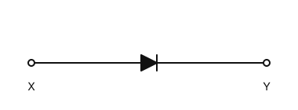
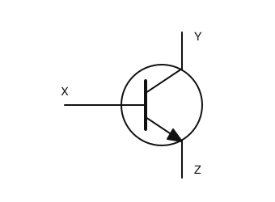
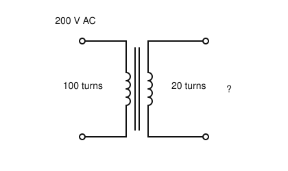
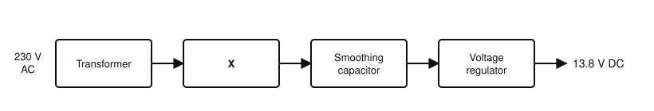
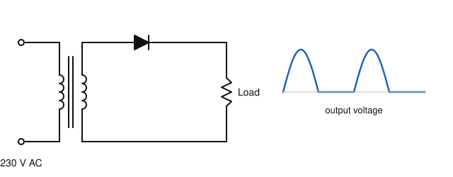
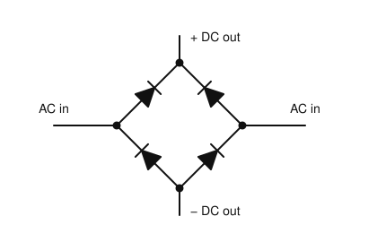

# IRTS HAREC Chapter Practice — Chapter 10: Other Components and Circuits

57 questions on Study Guide chapter 10 (printed pages 120–139), grouped by the guide's own subsections.
Read the chapter first, then try the questions. Answers, explanations and page numbers are at the end.

> Unofficial practice material based on the IRTS HAREC Study Guide (4.0.3). Syllabus section: A.4.
> Page numbers are the **printed** page numbers of the Study Guide; in a PDF viewer, add 24.

---

### 10.1 Diodes

**1.** A diode is made by joining:

- A) Two n-type materials
- B) An n-type and a p-type semiconductor, forming one junction
- C) Two metal plates with a dielectric
- D) A coil and a capacitor

**2.** A diode conducts current:

- A) In one direction only, shown by the arrowhead of its symbol
- B) Equally in both directions
- C) Only at radio frequencies
- D) Only when light falls on it

**3.** Which type of diode is used to set and stabilise the output voltage of a power supply?

- A) LED
- B) Photodiode
- C) Rectifying diode
- D) Zener diode

**4.** Rectifying (power) diodes are used to:

- A) Detect light
- B) Emit light
- C) Convert AC into DC
- D) Store charge

**5.** In the diode symbol shown, conventional current flows easily:

- A) From Y to X
- B) From X to Y
- C) In both directions
- D) In neither direction

### 10.1.1 Forward Voltage (Bias Voltage)

**6.** The forward (bias) voltage of a silicon diode is about:

- A) 0.1–0.2 V
- B) 0.6–0.7 V
- C) 1.5–2 V
- D) 12 V

### 10.1.2 Peak Inverse Voltage

**7.** If the peak inverse voltage (PIV) of a diode is exceeded:

- A) It breaks down and lets current flow backwards, usually damaging it
- B) It conducts better in the forward direction
- C) Its forward voltage doubles
- D) Nothing happens

### 10.1.3 Leakage Current

**8.** The small current that flows through a diode in the reverse direction is called:

- A) Bias current
- B) Forward current
- C) Leakage current
- D) Eddy current

### 10.1.4 Power Rating

**9.** When choosing a diode for a circuit, which limit must be considered along with PIV?

- A) Its colour code
- B) Its turns ratio
- C) Its Q factor
- D) Its maximum power rating

### 10.2 Transistors

**10.** The three terminals of a bipolar junction transistor (BJT) are the:

- A) Anode, cathode and grid
- B) Gate, source and drain
- C) Base, collector and emitter
- D) Primary, secondary and core

**11.** How many semiconducting junctions does a bipolar transistor have?

- A) Two
- B) One
- C) Three
- D) None

**12.** Depending on how the n-type and p-type materials are arranged, a BJT is either:

- A) N-channel or P-channel
- B) NPN or PNP
- C) Triode or pentode
- D) Class A or class B

**13.** In the transistor symbol shown, terminal Z (with the arrow) is the:

- A) Emitter
- B) Base
- C) Collector
- D) Gate

### 10.2.1 Currents and Biasing in a BJT

**14.** To turn on a silicon BJT, the voltage applied between the base and emitter is about:

- A) 0.1 V
- B) 0.6–0.7 V
- C) 5 V
- D) 12 V

**15.** In a BJT, the emitter current IE is equal to:

- A) IC − IB
- B) IC / IB
- C) IC × IB
- D) IC + IB

### 10.2.2 Amplification Factor

**16.** The amplification factor (β) of a BJT is the ratio of:

- A) Collector current to base current
- B) Base current to collector current
- C) Output voltage to input voltage
- D) Emitter voltage to base voltage

**17.** Apart from amplifying, a BJT can also be used as:

- A) A rectifier for mains
- B) A crystal
- C) A capacitor
- D) An on-off switch controlled by its base current

### 10.2.3 BJT vs FET

**18.** What is the main difference between a BJT and a FET?

- A) A FET has no terminals
- B) A BJT is controlled by voltage, a FET by current
- C) A BJT is controlled by current, a FET by voltage
- D) A BJT only works at RF

### 10.3 Valves (Thermionic Devices)

**19.** In a triode valve, which electrode emits electrons when heated?

- A) Cathode
- B) Anode
- C) Grid
- D) Filament screen

**20.** In a triode, the current between cathode and anode is controlled by the voltage on the:

- A) Heater
- B) Control grid
- C) Glass envelope
- D) Plate cap

**21.** One advantage of valves over transistors in RF power amplifiers is that valves:

- A) Last forever
- B) Need no high voltage
- C) Are less affected by a mismatched load and can give high power inexpensively
- D) Are smaller

**22.** Before working inside switched-off valve equipment you must:

- A) Increase the bias voltage
- B) Earth the antenna only
- C) Remove the valves while hot
- D) Fully discharge its capacitors, which may hold high voltage for a long time

### 10.4 Integrated Circuits

**23.** Which of these is a digital integrated circuit?

- A) A microprocessor
- B) An audio amplifier IC
- C) A voltage regulator IC
- D) A mixer IC

**24.** Analogue integrated circuits, such as amplifiers and voltage regulators, are also called:

- A) Logic ICs
- B) FPGAs
- C) Linear ICs
- D) Chips

### 10.5 Transformers

**25.** A transformer has 100 turns on the primary and 20 turns on the secondary. With 200 V AC on the primary, the secondary voltage is:

- A) 10 V
- B) 40 V
- C) 1000 V
- D) 4000 V

**26.** Why does a transformer not work with steady DC?

- A) DC has too high a voltage
- B) It does, equally well
- C) DC damages the core
- D) A non-varying DC does not create the changing magnetic field needed

**27.** A transformer whose primary and secondary have the same number of turns, used for safety, is called:

- A) A step-up transformer
- B) A balun
- C) An autotransformer
- D) An isolation transformer

**28.** When a transformer steps the voltage up, the current in the secondary:

- A) Decreases in proportion
- B) Increases in proportion
- C) Stays the same
- D) Becomes DC

**29.** A transformer has a 10:1 turns ratio. The primary circuit has an impedance of 5 kΩ. The impedance on the secondary is:

- A) 500 Ω
- B) 50 Ω
- C) 5 Ω
- D) 50 kΩ

**30.** Typically, how much of the applied power is lost in a real transformer?

- A) About 90%
- B) About 50%
- C) About 5%
- D) None

**31.** What voltage appears across the secondary of the transformer shown?

- A) 1000 V AC
- B) 200 V AC
- C) 20 V AC
- D) 40 V AC

### 10.6 Power Supplies

**32.** What are the three main stages of a power supply converting 230 V AC to 13.5 V DC?

- A) Oscillator, mixer, filter
- B) Transformer (or switched mode), rectifier, voltage regulator
- C) Amplifier, detector, speaker
- D) Fuse, RCD, earth

**33.** Why are linear power supplies for high currents heavy and bulky?

- A) Because of their fans only
- B) Because of their batteries
- C) Because of the size and weight of the 50 Hz transformer
- D) Because they use valves

**34.** In the power supply shown, block X is the:

- A) Oscillator
- B) Rectifier
- C) Mixer
- D) Amplifier

### 10.6.2 Switched Mode Power Supply

**35.** How does a switched mode power supply manage to use a much smaller transformer?

- A) It uses a valve
- B) It uses no rectifier
- C) It runs at a lower voltage
- D) It runs the transformer at a much higher frequency

**36.** A common problem with switched mode power supplies in a radio station is:

- A) They can generate RF noise (EMC problems)
- B) They are too heavy
- C) They only supply AC
- D) They cannot supply 13.8 V

### 10.6.3 Rectifier

**37.** A single diode used as a rectifier gives:

- A) Full-wave rectification
- B) Pure, smooth DC
- C) Half-wave rectification
- D) Three-phase AC

**38.** A bridge rectifier uses:

- A) One diode
- B) Two diodes
- C) Four transistors
- D) Four diodes

**39.** What is the purpose of the smoothing capacitor after a rectifier?

- A) To block DC
- B) To reduce the variations in the output voltage
- C) To raise the frequency
- D) To limit the current to zero

**40.** The circuit shown, with one diode, gives the output voltage drawn on the right. It is a:

- A) Full-wave rectifier
- B) Bridge rectifier
- C) Voltage regulator
- D) Half-wave rectifier

**41.** The arrangement of four diodes shown is a:

- A) Bridge rectifier
- B) Half-wave rectifier
- C) Voltage doubler
- D) Zener regulator

### 10.6.4 Voltage Regulator (Stabiliser)

**42.** Voltage regulators (stabilisers) can be built from:

- A) Transistors and Zener diodes, or ready-made ICs
- B) Only valves
- C) Capacitors only
- D) Crystals

### 10.7 Amplifiers

**43.** An amplifier is fed with 10 W and outputs 1000 W. Its power gain is:

- A) 10, or 10 dB
- B) 1000, or 30 dB
- C) 100, or 20 dB
- D) 990 W

**44.** An amplifier whose gain does not depend on the power of the input signal is said to be:

- A) Stable
- B) Linear
- C) Efficient
- D) Broadband

**45.** Feeding an amplifier with more drive than it needs to reach its rated output is called:

- A) Biasing
- B) Matching
- C) Neutralising
- D) Overdriving

**46.** An amplifier that maintains the frequency of the input signal without adding its own oscillations is:

- A) Stable
- B) Efficient
- C) Linear
- D) Class C

### 10.7.2 Classes of Power Amplifiers

**47.** Which amplifier class conducts for the full input cycle and has the best linearity, but the poorest efficiency?

- A) Class C
- B) Class AB
- C) Class B
- D) Class A

**48.** Which amplifier class conducts for less than half of the input cycle?

- A) Class C
- B) Class AB
- C) Class B
- D) Class A

**49.** A class B amplifier conducts for:

- A) The full cycle
- B) Less than half of the cycle
- C) Half of the cycle
- D) None of the cycle

**50.** The typical efficiency of a class C amplifier is about:

- A) 25%
- B) 50%
- C) 65%
- D) 80%

**51.** The class of an amplifier is commonly set by:

- A) The supply frequency
- B) The bias voltage applied to the transistor or valve
- C) The size of the heat sink
- D) The type of connector

### 10.7.4 Distortion from Amplifier Non-Linearity

**52.** Overdriving an amplifier:

- A) Reduces its distortion
- B) Greatly increases its non-linearity and distortion
- C) Improves its efficiency without side effects
- D) Has no effect if ALC is fitted

**53.** Unwanted mixing products amplified by a non-linear amplifier are called:

- A) Intermodulation distortion (IMD)
- B) Harmonic distortion
- C) Key clicks
- D) Aliasing

### 10.7.5 AF Amplifiers

**54.** AF amplifiers used in radio for speech only need to cover about:

- A) 20 Hz–20 kHz
- B) 3–30 MHz
- C) 300 Hz–3 kHz
- D) 50 Hz only

**55.** Which amplifier classes are usually used for AF because speech needs very low distortion?

- A) C only
- B) B or C
- C) A or AB
- D) D or E

### 10.7.6 RF Amplifiers

**56.** Which signals can be amplified by a class C RF amplifier?

- A) SSB voice
- B) Any signal without distortion
- C) AM broadcast quality audio
- D) FM and CW

**57.** The most common RF power amplifier classes are:

- A) A and C
- B) AB and B
- C) D and E
- D) A only

---

## Answer Key

| Q | Ans | Explanation (Study Guide page) |
|---|-----|-------------|
| 1 | B | A diode has a single semiconducting p-n junction (p. 120) |
| 2 | A | The arrowhead shows the conventional current direction in which it conducts (p. 120) |
| 3 | D | Zener diodes set and stabilise voltages (p. 121) |
| 4 | C | Rectifying diodes convert (rectify) AC into DC (p. 120) |
| 5 | B | The arrow (triangle) points in the direction of conventional current: from anode X to cathode Y (p. 120) |
| 6 | B | A silicon diode needs about 0.6–0.7 V before it conducts (p. 121) |
| 7 | A | Exceeding PIV breaks the diode down, usually damaging it (p. 121) |
| 8 | C | A diode is not a perfect insulator in reverse: a small leakage current flows (p. 121) |
| 9 | D | Like resistors and transistors, diodes have a maximum power rating (p. 121) |
| 10 | C | A BJT has a base, a collector and an emitter (p. 122) |
| 11 | A | A diode has one junction; a bipolar transistor has two (p. 122) |
| 12 | B | A bipolar transistor is either NPN or PNP (p. 122) |
| 13 | A | The arrow marks the emitter; X is the base and Y the collector (p. 122) |
| 14 | B | About 0.6–0.7 V between base and emitter turns a silicon transistor on (p. 122) |
| 15 | D | IE = IC + IB (p. 123) |
| 16 | A | β = IC / IB, which can be many hundreds (p. 123) |
| 17 | D | A BJT can be an on-off switch controlled by its base (p. 123) |
| 18 | C | BJT: base current controls collector current. FET: small voltage changes control larger currents (p. 123) |
| 19 | A | The hot cathode emits electrons: thermionic emission (p. 125) |
| 20 | B | A small varying grid voltage controls a large cathode-anode current (p. 125) |
| 21 | C | Valves tolerate mismatched loads better and give high power relatively cheaply (p. 125) |
| 22 | D | Capacitors may hold lethal voltage for months or years (p. 126) |
| 23 | A | Logic gates, microprocessors, DSPs, ADCs and DACs are digital ICs (p. 126) |
| 24 | C | Traditional analogue ICs are sometimes referred to as linear ICs (p. 126) |
| 25 | B | Voltage ratio = turns ratio: 200 × 20/100 = 40 V (a step-down transformer) (p. 127) |
| 26 | D | Only a changing current induces an emf in the secondary (p. 127) |
| 27 | D | It passes AC without a physical connection, isolating the mains neutral (p. 128) |
| 28 | A | Nothing is gained: the current falls as the voltage rises (p. 128) |
| 29 | B | The impedance ratio is the square of the turns ratio: 5000/100 = 50 Ω (p. 128) |
| 30 | C | About 5% is lost, mostly as heat (p. 129) |
| 31 | D | The voltage follows the turns ratio: 200 V × 20/100 = 40 V (p. 127) |
| 32 | B | Reduce the voltage, rectify it to DC, then regulate it (p. 129) |
| 33 | C | High-current 50 Hz transformers are large and heavy (p. 130) |
| 34 | B | After the transformer, a rectifier converts AC to DC before smoothing and regulation (p. 129) |
| 35 | D | It drives an oscillator at up to 200 kHz; higher frequencies need smaller transformers (p. 130) |
| 36 | A | Their oscillator harmonics can generate RF noise if not filtered and shielded (p. 130) |
| 37 | C | One diode conducts only on alternate half-cycles: half-wave rectification (p. 131) |
| 38 | D | Four power diodes form a bridge rectifier giving full-wave output (p. 132) |
| 39 | B | It charges and discharges to top up the current, smoothing the voltage (p. 131) |
| 40 | D | A single diode passes only every other half-cycle: half-wave rectification (p. 131) |
| 41 | A | Four power diodes in this arrangement make a bridge (full-wave) rectifier (p. 132) |
| 42 | A | Regulators combine transistors and Zener diodes; ICs are also available (p. 133) |
| 43 | C | 1000/10 = 100 = 20 dB (p. 134) |
| 44 | B | Linearity: a constant gain regardless of input power (p. 134) |
| 45 | D | Exceeding the maximum drive level is overdriving (p. 135) |
| 46 | A | Stability means no unwanted oscillations (p. 135) |
| 47 | D | Class A: full cycle, best linearity, 25–30% efficient (p. 136) |
| 48 | A | Class C conducts for less than half the cycle: most efficient, least linear (p. 137) |
| 49 | C | Class B conducts for half the cycle (p. 137) |
| 50 | D | Class C: about 80% efficiency, best efficiency, high distortion (p. 136) |
| 51 | B | Biasing sets how much of the cycle the device conducts (p. 137) |
| 52 | B | Non-linearity dramatically increases when overdriven; ALC cannot fully prevent distortion (p. 137) |
| 53 | A | IMD amplifies unwanted signal mixing by-products (p. 137) |
| 54 | C | Speech needs about 300 Hz–3 kHz (p. 138) |
| 55 | C | Class A or AB is used for low distortion audio (p. 138) |
| 56 | D | Class C is fine for FM and many digital signals such as CW (p. 139) |
| 57 | B | Common RF power amplifier classes are AB and B (p. 139) |
