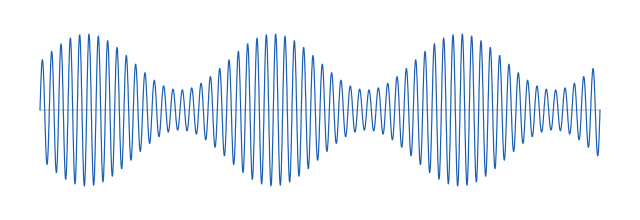
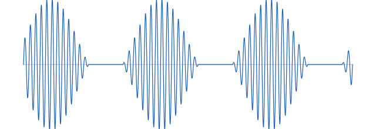
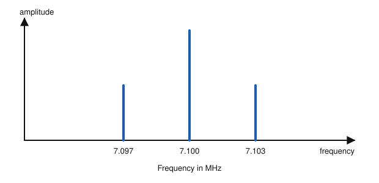
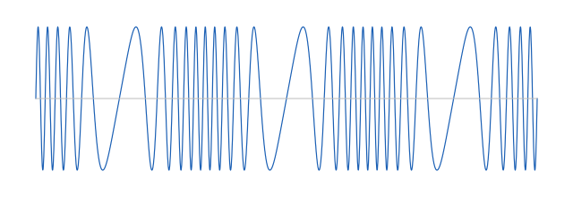
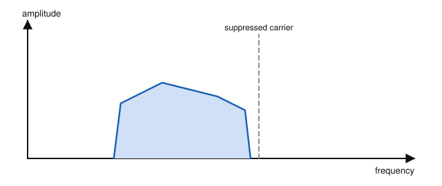
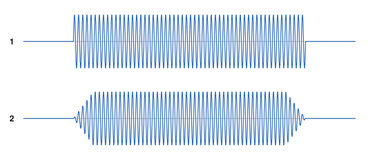

# IRTS HAREC Chapter Practice — Chapter 11: Modulation and Modes

55 questions on Study Guide chapter 11 (printed pages 140–169), grouped by the guide's own subsections.
Read the chapter first, then try the questions. Answers, explanations and page numbers are at the end.

> Unofficial practice material based on the IRTS HAREC Study Guide (4.0.3). Syllabus section: A.3.
> Page numbers are the **printed** page numbers of the Study Guide; in a PDF viewer, add 24.

---

### 11.1 Carrier, Signal, Modulation, Bandwidth, and Sidebands

**1.** In modulation, the information being impressed on the carrier is called the:

- A) Modulating signal
- B) Modulated signal
- C) Sideband
- D) Subcarrier

**2.** Most or all of the useful information in a modulated signal is carried in the:

- A) Carrier
- B) Sidebands
- C) Harmonics
- D) DC component

**3.** The bandwidth of a modulated signal spans:

- A) Twice the carrier frequency
- B) Only the carrier frequency
- C) The whole amateur band
- D) From the lowest to the highest frequency in its sidebands (plus the carrier, if sent)

### 11.2 Type of Modulation vs. Operating Mode

**4.** The ITU emission designator J3E describes:

- A) FM telephony
- B) Morse telegraphy
- C) Single sideband suppressed carrier telephony (SSB phone)
- D) Double sideband AM telephony

**5.** The VFO knob on a radio selects the:

- A) Carrier wave frequency
- B) Modulation index
- C) Bandwidth
- D) Emission designator

**6.** RTTY and FT8 both use frequency shift keying. Why will an RTTY decoder not decode FT8?

- A) FT8 uses AM
- B) FT8 is analogue
- C) The text is encoded very differently in the two operating modes
- D) RTTY is only used on VHF

### 11.3 Analogue vs Digital: Type of Information Being Transmitted

**7.** What is the main difference between a bit and a symbol?

- A) Bits are analogue
- B) A symbol can only represent two values
- C) They are the same
- D) A bit can only represent two values; a symbol can represent more than two

**8.** The digital equivalents of AM, FM and PM are called:

- A) SSB, DSB and VSB
- B) ASK, FSK and PSK
- C) USB, LSB and CW
- D) QAM, OFDM and DMR

### 11.3.2.1 Bit Rate, Symbol Rate (Baud Rate), and Words-per-Minute (WPM)

**9.** The symbol rate of a digital mode is measured in:

- A) WPM
- B) Bits per character
- C) Hertz
- D) Baud

**10.** The speed of Morse code (CW) is usually expressed in:

- A) Baud
- B) Words per minute (WPM)
- C) Bits per second
- D) Hertz

**11.** A common range of conversational CW speeds in amateur use is:

- A) 100–150 WPM
- B) 50–80 WPM
- C) 10–25 WPM
- D) 1–5 WPM

**12.** FT8 uses 8 tones. Its symbol rate is about:

- A) 6 baud
- B) 45 baud
- C) 170 baud
- D) 31 baud

### 11.4.1 Amplitude Modulation

**13.** In amplitude modulation (AM):

- A) The frequency of the carrier varies with the modulating signal
- B) The amplitude of the carrier varies with the modulating signal
- C) The phase of the carrier is reversed
- D) The carrier is switched on and off at random

**14.** A 30 Hz carrier is amplitude modulated by a 6 Hz signal. The modulated signal contains frequencies of:

- A) 24, 30 and 36 Hz
- B) 30 Hz only
- C) 6 and 30 Hz
- D) 30 and 180 Hz

**15.** In AM, if the modulating audio is 3 kHz wide, the overall bandwidth of the signal is:

- A) 1.5 kHz
- B) 3 kHz
- C) 6 kHz
- D) 12 kHz

**16.** An AM modulation index of 100% (m = 1) means:

- A) The carrier is suppressed
- B) No modulation
- C) Overmodulation
- D) Full modulation: the carrier amplitude reaches zero and twice its original value

**17.** What happens when the AM modulation index exceeds 100%?

- A) The signal becomes FM
- B) The carrier disappears without side effects
- C) The bandwidth halves
- D) Overmodulation: the signal is clipped and distorted

**18.** A disadvantage of AM is that:

- A) It needs complex hardware
- B) It cannot carry voice
- C) It is easily affected by noise and fading
- D) It has no sidebands

**19.** The RF signal shown is an example of:

- A) Frequency modulation
- B) Phase shift keying
- C) Amplitude modulation
- D) An unmodulated carrier

**20.** The AM envelope shown, cut off to zero with flat gaps, indicates:

- A) Overmodulation
- B) Correct 50% modulation
- C) An FM signal
- D) A pure carrier

**21.** What is the bandwidth of the AM signal whose spectrum is shown?

- A) 3 kHz
- B) 6 kHz
- C) 7.1 MHz
- D) 1.5 kHz

### 11.4.2 Frequency Modulation

**22.** In frequency modulation (FM), the amplitude of the modulated signal:

- A) Varies with the audio
- B) Does not change
- C) Doubles
- D) Falls to zero

**23.** The FM modulation index is:

- A) Peak deviation ÷ maximum modulating frequency
- B) Maximum modulating frequency ÷ peak deviation
- C) Carrier frequency ÷ bandwidth
- D) Peak deviation × carrier frequency

**24.** With a peak deviation of 2.5 kHz and audio up to 3 kHz, what bandwidth does Carson's rule give?

- A) 5.5 kHz
- B) 11 kHz
- C) 16 kHz
- D) 25 kHz

**25.** Carson's rule estimates FM bandwidth as:

- A) Peak deviation × 3
- B) Peak deviation + max modulating frequency
- C) 2 × max modulating frequency
- D) 2 × (peak deviation + max modulating frequency)

**26.** Amateur FM channels on the 70 cm band are spaced:

- A) 6.25 kHz
- B) 12.5 kHz
- C) 25 kHz
- D) 100 kHz

**27.** Compared with AM, FM is:

- A) Much less affected by noise, but needs more bandwidth
- B) More affected by noise
- C) Narrower in bandwidth
- D) Unable to carry speech

**28.** An FM signal produces sidebands:

- A) Many, each separated from the next by the modulating frequency
- B) Only one on each side of the carrier
- C) None
- D) Only below the carrier

**29.** The RF signal shown, with constant amplitude but cycles bunching together and spreading apart, is:

- A) AM
- B) SSB
- C) CW
- D) FM

### 11.5 AM (A3E)

**30.** The ITU designator A3E is:

- A) FM telephony
- B) SSB telephony
- C) Double sideband AM telephony
- D) Morse telegraphy

**31.** Why is AM (A3E) an inefficient mode?

- A) It has no carrier
- B) It needs complex receivers
- C) It cannot be received on HF
- D) Its carrier uses much power but carries no information, and it needs two sidebands

### 11.6 SSB (J3E)

**32.** Compared with AM, SSB (J3E):

- A) Transmits both sidebands and the carrier
- B) Transmits one sideband with a suppressed carrier, in less than half the bandwidth
- C) Needs twice the bandwidth
- D) Is a form of FM

**33.** The typical bandwidth of an SSB voice signal is about:

- A) 150 Hz
- B) 11 kHz
- C) 6 kHz
- D) 2.6 kHz

**34.** In LSB, the transmitted signal lies:

- A) Above the suppressed carrier frequency
- B) Centred on the carrier
- C) Below the suppressed carrier frequency
- D) On both sides of the carrier

**35.** SSB is a form of:

- A) Amplitude modulation
- B) Frequency modulation
- C) Phase modulation
- D) Pulse modulation

**36.** The spectrum shown, with all the speech energy below the suppressed carrier, is:

- A) USB
- B) AM
- C) LSB
- D) FM

### 11.7 FM (F3E)

**37.** Narrow-band FM phone on VHF uses a bandwidth of about:

- A) 3 kHz
- B) 11 kHz
- C) 25 kHz
- D) 200 kHz

**38.** In FM (F3E), can the carrier be removed as in SSB?

- A) Yes, always
- B) No; the FM carrier carries some information and is a necessary part of the signal
- C) Only on HF
- D) Only for data

### 11.8 CW, ASK, OOK (A1A)

**39.** CW transmits Morse code by:

- A) On-off keying of the carrier
- B) Shifting the frequency between two tones
- C) Shifting the phase by 180°
- D) Varying the amplitude with speech

**40.** The ITU designator of CW (Morse) for aural reception is:

- A) J3E
- B) A3E
- C) F1B
- D) A1A

**41.** A good choice of rise and fall time for CW is about:

- A) 0.5 ms
- B) 2 ms
- C) 6 ms
- D) 50 ms

**42.** CW keying with very short rise and fall times causes:

- A) Key clicks and excessive bandwidth
- B) A narrower signal
- C) Better readability with no side effects
- D) Frequency drift

**43.** The bandwidth of a well-formed CW signal should be about:

- A) 5–10 Hz
- B) 50–200 Hz
- C) 2.6 kHz
- D) 6 kHz

**44.** Techniques that smooth the CW keying waveform to reduce bandwidth are known as:

- A) Squelch
- B) Pre-emphasis
- C) Pulse shaping
- D) Clipping

**45.** Which of the two CW envelopes shown will cause key clicks?

- A) 1, because it switches on and off abruptly
- B) 2, because it rises gradually
- C) Both equally
- D) Neither

### 11.9 RTTY, FSK (F1B)

**46.** The most popular form of RTTY uses a frequency shift of:

- A) 50 Hz
- B) 3 kHz
- C) 850 Hz
- D) 170 Hz

**47.** The ITU designator of RTTY using FSK is:

- A) F1B
- B) A1A
- C) J3E
- D) G1B

**48.** Does RTTY use error correction?

- A) Yes, forward error correction like FT8
- B) Only at 45 baud
- C) Only on VHF
- D) No; noise or fading may corrupt the received text

### 11.10 FT8, FSK (J2B, J2D)

**49.** FT8 is described as a time-synced mode because:

- A) It needs a GPS receiver to work
- B) All transmissions begin and end at the same times
- C) It only works at night
- D) It uses Morse timing

**50.** What lets FT8 decode even somewhat corrupted transmissions?

- A) AM modulation
- B) High power
- C) Forward error correction
- D) Long antennas

**51.** The bandwidth of a single FT8 transmission is about:

- A) 50 Hz
- B) 500 Hz
- C) 3 kHz
- D) 11 kHz

**52.** How is an FT8 signal normally transmitted?

- A) Directly by the radio's FSK keying
- B) Using AM
- C) As an audio subcarrier from modem software, sent using SSB (USB)
- D) Using on-off keying

### 11.11 PSK, 2-PSK, 4-PSK (G1B)

**53.** Phase shift keying (PSK) changes the carrier's:

- A) Amplitude
- B) Frequency
- C) Polarisation
- D) Phase

**54.** 2-PSK shifts the phase of the carrier by:

- A) 360°
- B) 180°
- C) 90°
- D) 45°

**55.** The ITU designator for PSK generated directly in the radio is:

- A) F1B
- B) G1B
- C) A1A
- D) J3E

---

## Answer Key

| Q | Ans | Explanation (Study Guide page) |
|---|-----|-------------|
| 1 | A | The information is the modulating signal; the result is the modulated signal (p. 140) |
| 2 | B | The sidebands carry the information; the AM carrier carries none (p. 140) |
| 3 | D | Bandwidth runs from the lowest to the highest sideband frequency (p. 140) |
| 4 | C | J = SSB suppressed carrier, 3 = one analogue channel, E = telephony (p. 142) |
| 5 | A | The carrier frequency is selected with the main tuning knob, the VFO (p. 141) |
| 6 | C | Same modulation type, but very different encoding (p. 141) |
| 7 | D | A bit has two states; a symbol can have many (4 in 4-PSK, 8 in FT8) (p. 143) |
| 8 | B | Amplitude, frequency and phase shift keying (p. 143) |
| 9 | D | Symbol rate, or baud rate, is in baud: symbols per second (p. 144) |
| 10 | B | CW speed is in WPM, using a word of average length (PARIS) (p. 144) |
| 11 | C | Conversational CW is typically 10–25 WPM (p. 144) |
| 12 | A | FT8 sends just over 6 symbols per second (p. 144) |
| 13 | B | AM varies the carrier amplitude with the modulating signal (p. 145) |
| 14 | A | Carrier plus sidebands at 30 − 6 and 30 + 6 Hz (p. 147) |
| 15 | C | AM needs twice the bandwidth of the modulating signal: two 3 kHz sidebands (p. 148) |
| 16 | D | Full modulation gives the best signal-to-noise ratio without distortion (p. 149) |
| 17 | D | Above 100% the signal is clipped, distorted and may be unreadable (p. 149) |
| 18 | C | Atmospheric noise and fading readily affect AM amplitude (p. 151) |
| 19 | C | The amplitude of the carrier follows the modulating signal (p. 145) |
| 20 | A | A modulation index above 100% clips the envelope and causes splatter (p. 149) |
| 21 | B | The sidebands extend 3 kHz either side of the carrier: 7.097 to 7.103 MHz = 6 kHz (p. 148) |
| 22 | B | FM varies the frequency; the amplitude of the modulated signal stays constant (p. 151) |
| 23 | A | m = peak deviation / max modulating frequency (p. 153) |
| 24 | B | 2 × (2.5 + 3) = 11 kHz (p. 155) |
| 25 | D | FM bandwidth = 2 (peak deviation + max modulating frequency) (p. 155) |
| 26 | C | VHF channels are 12.5 kHz apart; 70 cm uses 25 kHz (p. 155) |
| 27 | A | FM is clear in noise because noise mainly affects amplitude, but it needs more bandwidth (p. 155) |
| 28 | A | FM generates many sidebands spaced at the modulating frequency (p. 151) |
| 29 | D | In FM the frequency varies while the amplitude stays the same (p. 151) |
| 30 | C | A = AM double sideband, 3 = one analogue channel, E = telephony (p. 156) |
| 31 | D | The strong carrier wastes power and two sidebands waste bandwidth (p. 156) |
| 32 | B | SSB sends only one sideband and suppresses the carrier: about 2.6 kHz (p. 157) |
| 33 | D | About 2.6 kHz, less than half of AM (p. 157) |
| 34 | C | LSB energy is below the carrier frequency; USB is above it (p. 157) |
| 35 | A | SSB is a form of AM (p. 157) |
| 36 | C | In LSB all the signal power lies below the carrier frequency (p. 157) |
| 37 | B | NBFM: about 11 kHz on VHF and 16 kHz on UHF (p. 158) |
| 38 | B | Unlike SSB, the FM carrier cannot be removed (p. 159) |
| 39 | A | CW is on-off keying (OOK), a form of amplitude shift keying (p. 159) |
| 40 | D | A1A: AM, one-channel digital without subcarrier, telegraphy by ear (p. 160) |
| 41 | C | Around 4–6 ms keeps CW within about 150 Hz (p. 162) |
| 42 | A | Too-sudden transitions widen the signal and cause key clicks (p. 162) |
| 43 | B | Well-formed CW is 50–200 Hz wide (p. 162) |
| 44 | C | Improving the waveform edges is pulse shaping (p. 162) |
| 45 | A | Very short rise and fall times spread the signal and cause key clicks (p. 162) |
| 46 | D | RTTY shifts by 170 Hz at 45 baud (p. 164) |
| 47 | A | F1B: FM, one digital channel without subcarrier, telegraphy for machine reception (p. 164) |
| 48 | D | RTTY has no error correction, unlike FT8 (p. 166) |
| 49 | B | Every 15-second period, transmissions start and end together (p. 166) |
| 50 | C | FT8 sends extra information for forward error correction (p. 166) |
| 51 | A | Each FT8 signal is only about 50 Hz wide (p. 167) |
| 52 | C | Modem software makes an audio FSK subcarrier that the transceiver sends on USB (J2B/J2D) (p. 166) |
| 53 | D | PSK shifts the phase of the carrier (p. 167) |
| 54 | B | 2-PSK uses a 180° shift; 4-PSK uses 90° shifts (p. 167) |
| 55 | B | G1B: phase modulation, single digital channel, telegraphy for automatic reception (p. 168) |
