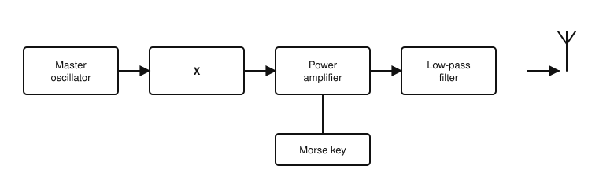
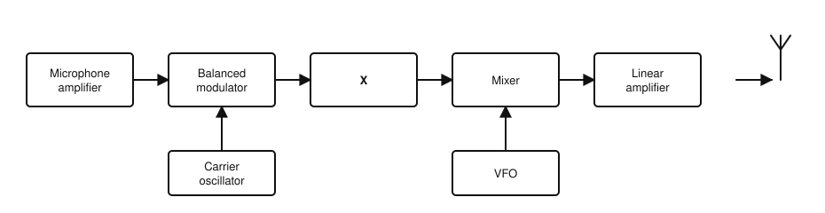
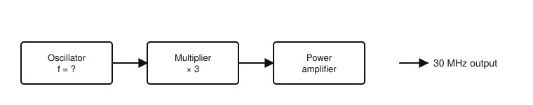
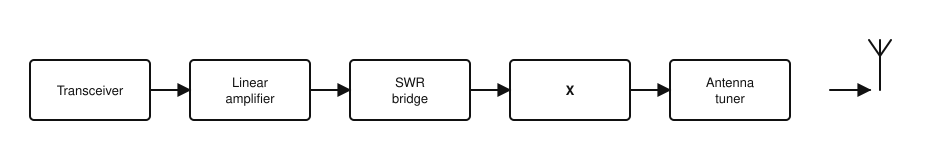

# IRTS HAREC Chapter Practice — Chapter 12: Transmitters

46 questions on Study Guide chapter 12 (printed pages 170–187), grouped by the guide's own subsections.
Read the chapter first, then try the questions. Answers, explanations and page numbers are at the end.

> Unofficial practice material based on the IRTS HAREC Study Guide (4.0.3). Syllabus section: A.5.
> Page numbers are the **printed** page numbers of the Study Guide; in a PDF viewer, add 24.

---

### 12.1 Output Power

**1.** Irish amateur power limits for almost all bands are specified as:

- A) Peak envelope power (PEP) at the output of the transmitter or amplifier
- B) Average power at the antenna
- C) EIRP in every band
- D) DC input power to the final stage

**2.** Peak envelope power (PEP) is:

- A) The DC power drawn from the supply
- B) The average power over several minutes
- C) The power averaged over one RF cycle at the crest of the modulation
- D) The power radiated in the best direction

**3.** For which mode is the average power normally much lower than the PEP?

- A) FM
- B) FSK during a long transmission
- C) A continuous carrier
- D) SSB

**4.** To measure the PEP of an SSB transmitter in line with Irish regulations, you should use:

- A) Normal speech
- B) A 1 kHz tone
- C) Silence
- D) A 50 Hz tone

### 12.2 Modulation Duty Cycle and Operational Duty Cycle

**5.** The modulation duty cycle of CW is about:

- A) 20%
- B) 40%
- C) 80%
- D) 100%

**6.** The modulation duty cycle of FM is:

- A) 20%
- B) 40%
- C) 50%
- D) 100%

**7.** The modulation duty cycle of uncompressed SSB speech is about:

- A) 20%
- B) 40%
- C) 60%
- D) 100%

**8.** Why might an amplifier only allow 50% of its rated PEP when used for RTTY?

- A) RTTY is AM
- B) RTTY needs less power
- C) RTTY is a high duty cycle mode, so the average power equals PEP
- D) The law limits RTTY to half power

**9.** The percentage of time the operator actually transmits during an averaging period is called the:

- A) Modulation duty cycle
- B) Efficiency
- C) Mode factor
- D) Operational duty cycle

### 12.3 Output Impedance

**10.** The nominal output impedance of commercial amateur transmitters is:

- A) 25 Ω
- B) 50 Ω
- C) 75 Ω
- D) 300 Ω

**11.** The circuit in a transmitter that matches the final amplifier to the 50 Ω load is the:

- A) Output network (Pi tank)
- B) Balanced modulator
- C) Buffer
- D) Frequency multiplier

### 12.4 Efficiency and Output Power

**12.** A transmitter with 60% efficiency produces 100 W of RF. Roughly how much power does it waste as heat?

- A) 166 W
- B) 100 W
- C) 66 W
- D) 40 W

**13.** The efficiency of a transmitter is mainly determined by:

- A) The length of the feeder
- B) The class of its final amplifier
- C) The microphone
- D) The SWR meter

### 12.5 Problems Affecting Transmitters

**14.** The ability of a transmitter to stay on the same frequency without drifting is its:

- A) Frequency stability
- B) Selectivity
- C) Linearity
- D) Sensitivity

**15.** By far the most common cause of non-linearity in a transmitter is:

- A) A low SWR
- B) A dummy load
- C) An overdriven amplifier
- D) A good earth

### 12.6 CW Transmitter

**16.** In a simple CW transmitter, which stage generates the carrier?

- A) Buffer/driver
- B) Morse key
- C) Power amplifier
- D) Master oscillator

**17.** What is the purpose of the buffer/driver stage in a CW transmitter?

- A) To match the antenna
- B) To key the transmitter
- C) To filter harmonics
- D) To isolate the master oscillator so its frequency stays stable

**18.** A CW signal whose frequency changes when the key is pressed, sounding like a bird, has:

- A) Chirp
- B) Key clicks
- C) Splatter
- D) Hum

**19.** Which amplifier class may be used in a CW transmitter despite its poor linearity?

- A) Class A
- B) Class C
- C) Class AB
- D) None

**20.** In the CW transmitter shown, stage X is the:

- A) Balanced modulator
- B) Buffer / driver
- C) Product detector
- D) Sideband filter

### 12.7 SSB Transmitter

**21.** In an SSB transmitter, the balanced modulator produces:

- A) A carrier only
- B) One sideband with full carrier
- C) Both sidebands without the carrier
- D) An FM signal

**22.** In an SSB transmitter, which stage removes the unwanted sideband?

- A) The mixer
- B) The filter (usually a crystal band-pass filter)
- C) The VFO
- D) The speech amplifier

**23.** Typical filter bandwidths used for SSB are:

- A) 150–500 Hz
- B) 6–10 kHz
- C) 1.8–2.4 kHz
- D) 12.5–25 kHz

**24.** In an SSB transmitter, the mixer combines the IF signal with the output of the:

- A) VFO, to translate it to the desired frequency
- B) Microphone
- C) ALC
- D) Dummy load

**25.** When two signals are mixed, the output contains:

- A) Only the higher frequency
- B) Only DC
- C) Only the difference frequency
- D) Their sum and difference frequencies (and harmonics)

**26.** Why must the final amplifier of an SSB transmitter be linear?

- A) To keep the frequency stable
- B) Non-linearity causes distortion, IMD and splatter
- C) To reduce the supply voltage
- D) It does not need to be linear

**27.** What does the automatic level control (ALC) do?

- A) Selects the sideband
- B) Controls the receiver volume
- C) Measures SWR
- D) Reduces the incoming audio level to avoid overdriving the amplifier

**28.** When transmitting digital modes through an SSB transmitter, how much ALC activity should be seen?

- A) As much as possible
- B) About half scale
- C) None
- D) Full scale

**29.** In the SSB transmitter shown, stage X is the:

- A) Limiter
- B) Frequency multiplier
- C) Discriminator
- D) Sideband filter

### 12.8 FM Transmitter

**30.** In an FM transmitter with a frequency multiplier, the oscillator for a 30 MHz output (tripler) runs at:

- A) 3 MHz
- B) 10 MHz
- C) 30 MHz
- D) 90 MHz

**31.** A frequency multiplier is:

- A) A low power amplifier whose output is tuned to a harmonic of its input
- B) A linear amplifier
- C) A mixer with a VFO
- D) A crystal filter

**32.** Why can a class C power amplifier be used in an FM transmitter?

- A) The amplitude of an FM signal does not carry the information
- B) FM needs very little power
- C) FM signals have no sidebands
- D) Class C is the most linear

**33.** In the FM transmitter shown, what frequency must the oscillator produce?

- A) 10 MHz
- B) 30 MHz
- C) 90 MHz
- D) 3 MHz

### 12.9 Digital Modes

**34.** The most common way to operate digital modes such as FT8 is:

- A) Morse key and BFO
- B) A dedicated RTTY teleprinter
- C) An FM transmitter with a multiplier
- D) A computer running modem software feeding an AF subcarrier to an SSB transmitter

**35.** Why must the audio level from a software modem be adjusted carefully?

- A) To change the frequency
- B) To make the computer quieter
- C) To avoid overdriving the transmitter amplifier and distorting the signal
- D) It does not matter

### 12.10 Modern Transmitters and SDR

**36.** Which function in a modern SDR transmitter still has to be done by analogue circuits?

- A) Modulation
- B) Pulse shaping of CW
- C) Final stage power amplification
- D) Audio compression

**37.** In a hybrid SDR transmitter, the DSP and DDS generate the signal at:

- A) The final RF directly
- B) Microwave frequencies
- C) Audio frequencies only
- D) A low IF, which analogue circuits then convert to RF

**38.** In a fully digital transmitter with RF DDS, what removes the by-products of the digital to analogue conversion?

- A) The microphone
- B) An analogue band-pass filter
- C) The ALC
- D) A Morse key

### 12.11 Transverter

**39.** A transverter is used to:

- A) Convert a transceiver to operate on a different band
- B) Change SSB to FM
- C) Measure output power
- D) Match the antenna

### 12.12 High Power Linear Amplifiers

**40.** An external high power linear amplifier used with many modes must be:

- A) A class C design
- B) Overdriven for maximum output
- C) Used without covers
- D) Of high quality and appropriately linear

**41.** Why must a high power amplifier never be operated with its covers removed?

- A) Lethal voltages and harmful exposure to intense EMF
- B) It would run too cool
- C) It would lose its linearity
- D) The ALC would stop working

### 12.13 HF Station

**42.** In an HF station, what does the low-pass filter after the transceiver do?

- A) Measures SWR
- B) Removes signals below 1.8 MHz
- C) Removes harmonics above 30 MHz
- D) Matches the antenna

**43.** What does the SWR bridge in an HF station indicate?

- A) The modulation depth
- B) Whether there is an impedance mismatch between the antenna system and the transmitter
- C) The receiver sensitivity
- D) The supply voltage

**44.** A dummy load is used to:

- A) Tune and test the transmitter without radiating a signal
- B) Increase the range of the antenna
- C) Filter harmonics
- D) Store energy for later

**45.** Where is it preferable to install an ATU?

- A) Between the microphone and the transceiver
- B) Inside the SWR meter
- C) Between the mains and the power supply
- D) Between the transmission line and the antenna

**46.** In the HF station shown, unit X is a filter that cuts off frequencies above 30 MHz. It is the:

- A) High-pass filter
- B) Notch filter
- C) Low-pass filter
- D) Band-stop filter

---

## Answer Key

| Q | Ans | Explanation (Study Guide page) |
|---|-----|-------------|
| 1 | A | Limits are PEP at the transmitter (or amplifier) output, with a few EIRP exceptions (p. 171) |
| 2 | C | PEP is averaged over a single RF cycle at the maximum of the modulation (p. 171) |
| 3 | D | In SSB the peaks occur only briefly, so average power is lower than PEP (p. 171) |
| 4 | B | A 1 kHz tone must be used for the PEP measurement (p. 171) |
| 5 | B | No power is sent in the gaps, about 60% of the time, so CW is 40% (p. 172) |
| 6 | D | FM transmits at full amplitude all the time: 100% (p. 173) |
| 7 | A | Unprocessed SSB speech: 20%; with compression about 40% (p. 172) |
| 8 | C | High duty cycle modes can overheat and damage the final stage at full PEP (p. 172) |
| 9 | D | Operational duty cycle depends on the operator and their habits (p. 172) |
| 10 | B | They are designed for a 50 Ω load, matching common coax (p. 174) |
| 11 | A | The output network, often a Pi tank, matches the amplifier to 50 Ω (p. 173) |
| 12 | C | It needs about 166 W in; 40% of that, about 66 W, becomes heat (p. 174) |
| 13 | B | The class of the final amplifier determines efficiency, typically 25–80% (p. 174) |
| 14 | A | Frequency stability: maintaining a precise frequency over time (p. 174) |
| 15 | C | Overdriving, for example with loud audio, is the main cause (p. 174) |
| 16 | D | The master oscillator generates the carrier at the required frequency (p. 176) |
| 17 | D | It stops the keying and the power amplifier from pulling the oscillator off frequency (p. 176) |
| 18 | A | Chirp: often poor supply regulation or poor buffer design (p. 176) |
| 19 | B | Class C is efficient and acceptable for CW, with careful filtering (p. 176) |
| 20 | B | The buffer isolates the master oscillator so its frequency stays stable (p. 176) |
| 21 | C | The balanced modulator produces both sidebands with the carrier suppressed (p. 178) |
| 22 | B | The filter removes the unwanted sideband (p. 178) |
| 23 | C | SSB filters are typically 1.8–2.4 kHz wide (p. 179) |
| 24 | A | The mixer combines the IF with the VFO to reach the output frequency (p. 179) |
| 25 | D | Mixing produces the sum and difference frequencies; a filter selects the wanted one (p. 179) |
| 26 | B | Non-linearity causes harmonic and intermodulation distortion and splatter (p. 180) |
| 27 | D | ALC turns down the audio drive when the amplifier is near overload (p. 180) |
| 28 | C | As a rule of thumb there should be no ALC activity on digital modes (p. 180) |
| 29 | D | After the balanced modulator, a filter removes the unwanted sideband (p. 178) |
| 30 | B | A ×3 multiplier needs a 10 MHz oscillator for 30 MHz (p. 182) |
| 31 | A | It is overdriven on purpose and tuned to a harmonic, often the 3rd (p. 181) |
| 32 | A | FM does not depend on amplitude, so linearity is less important (p. 182) |
| 33 | A | A ×3 multiplier needs 30 / 3 = 10 MHz from the oscillator (p. 182) |
| 34 | D | The software modem generates audio which the transceiver sends using SSB (p. 183) |
| 35 | C | Too high a level overdrives the amplifier and degrades the signal (p. 183) |
| 36 | C | Software cannot amplify to high power or filter strong out-of-band signals (p. 184) |
| 37 | D | Hybrid designs use DSP/DDS at IF and an analogue converter or mixer to reach RF (p. 185) |
| 38 | B | An analogue band-pass filter removes by-products and enforces the bandwidth (p. 185) |
| 39 | A | A transverter converts both transmit and receive to another band, e.g. 28 → 144 MHz (p. 186) |
| 40 | D | A non-linear amplifier distorts and causes harmful interference (p. 186) |
| 41 | A | Lethal voltages and intense fields make this dangerous (p. 186) |
| 42 | C | The low-pass filter cuts off frequencies above 30 MHz, suppressing harmonics (p. 187) |
| 43 | B | The SWR bridge indicates mismatch; ideally the SWR is close to 1:1 (p. 187) |
| 44 | A | It lets you test and tune without transmitting unnecessary signals (p. 187) |
| 45 | D | Preferably at the antenna, matching it to the transmission line (p. 187) |
| 46 | C | The low-pass filter attenuates harmonics above the HF bands (p. 187) |
