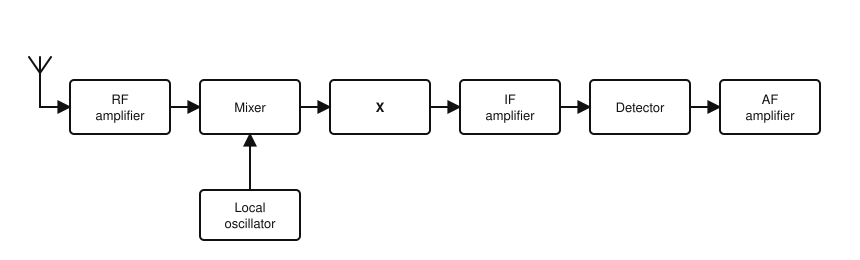
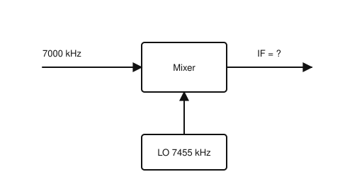
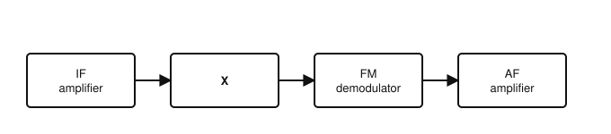
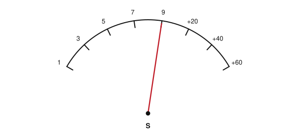

# IRTS HAREC Chapter Practice — Chapter 13: Receivers

51 questions on Study Guide chapter 13 (printed pages 188–205), grouped by the guide's own subsections.
Read the chapter first, then try the questions. Answers, explanations and page numbers are at the end.

> Unofficial practice material based on the IRTS HAREC Study Guide (4.0.3). Syllabus section: A.5.
> Page numbers are the **printed** page numbers of the Study Guide; in a PDF viewer, add 24.

---

### 13.1 Superheterodyne Receiver

**1.** In a superheterodyne receiver, the incoming RF signal is converted to a fixed intermediate frequency (IF) by:

- A) The local oscillator and mixer
- B) The detector and AF amplifier
- C) The RF amplifier alone
- D) The AGC

**2.** In a superheterodyne, the selectivity and gain of the receiver are mainly determined:

- A) At the antenna
- B) In the loudspeaker
- C) At the fixed IF
- D) In the power supply

### 13.2 Double Conversion Superheterodyne Receiver

**3.** A double conversion superheterodyne has:

- A) Two antennas
- B) Two IFs generated by two mixers
- C) Two detectors
- D) Two loudspeakers

**4.** In a double conversion superhet, the high first IF helps with ___ and the low second IF with ___.

- A) Selectivity; image rejection
- B) AGC; squelch
- C) Sensitivity; stability
- D) Image rejection; adjacent channel selectivity

### 13.3 Receiver Components

**5.** What is the job of the RF amplifier in a receiver?

- A) Drive the loudspeaker
- B) Generate the IF
- C) Demodulate the signal
- D) Increase the power of the weak signal from the antenna with low noise

**6.** Attenuators and AGC in front of the receiver stages are provided to:

- A) Increase sensitivity
- B) Generate a BFO tone
- C) Prevent overload of later stages by strong signals
- D) Improve the image frequency

**7.** A signal on 7000 kHz is mixed with a local oscillator on 7455 kHz. What IF results?

- A) 455 kHz
- B) 7000 kHz
- C) 7455 kHz
- D) 14 455 kHz

**8.** Besides the wanted IF, a mixer also produces:

- A) Only DC
- B) The sum frequency and harmonics, removed by the filter
- C) Nothing else
- D) A copy of the audio

**9.** The IF filter of a receiver is usually a:

- A) Low-pass filter
- B) High-pass filter
- C) Band-pass filter, sometimes called the roofing filter
- D) Notch filter

**10.** Which IF filter bandwidth would you choose to receive a single CW signal?

- A) 1.8–2.4 kHz
- B) 100–500 Hz
- C) 2.7–3 kHz
- D) 12.5 kHz

**11.** Why is a wider filter (2.7–3 kHz) used when receiving FT8?

- A) So the software can decode many FT8 signals at once
- B) To reduce noise
- C) Because FT8 is 3 kHz wide
- D) To stop image signals

**12.** Why can the IF amplifier provide more gain and selectivity than the RF stages?

- A) It works at audio frequencies
- B) It uses valves
- C) It has no filter
- D) It works at a single fixed frequency

**13.** The AF gain control on a receiver adjusts the:

- A) Volume (AF amplifier)
- B) RF amplifier
- C) Squelch
- D) IF frequency

**14.** In the superheterodyne receiver shown, block X between the mixer and the IF amplifier is usually a:

- A) Low-pass filter
- B) Band-pass (IF) filter
- C) Frequency multiplier
- D) Balanced modulator

**15.** In the figure, what is the intermediate frequency?

- A) 455 kHz
- B) 14 455 kHz
- C) 7455 kHz
- D) 7000 kHz

### 13.3.6 Detector (Demodulator)

**16.** What does the detector (demodulator) in a receiver do?

- A) Amplifies RF
- B) Removes the image frequency
- C) Generates the local oscillator signal
- D) Recovers the original modulating signal from the modulated signal

**17.** The simplest analogue AM detector uses:

- A) A crystal filter
- B) A diode, capacitor and resistor
- C) A transformer
- D) A PLL

### 13.3.7 Product Detector (CW and SSB)

**18.** A product detector, used for SSB and CW, works like a:

- A) Rectifier
- B) Limiter
- C) Frequency mixer
- D) Squelch

**19.** With a 455 kHz IF, a BFO for CW reception would be set to about:

- A) 455 kHz exactly
- B) 800 Hz
- C) 10.7 MHz
- D) 455.8 kHz

**20.** To demodulate SSB, the oscillator feeding the product detector is called the:

- A) Carrier insertion oscillator (CIO)
- B) Beat frequency oscillator
- C) Local oscillator
- D) VFO

### 13.3.8 FM Demodulator and Limiter

**21.** In an FM receiver, the stage before the FM demodulator that removes amplitude variations is the:

- A) BFO
- B) Product detector
- C) Limiter
- D) Balanced modulator

**22.** Two common types of FM demodulator are:

- A) Diode and crystal detectors
- B) Discriminators and phase locked loop (PLL) detectors
- C) Product detectors and BFOs
- D) Envelope detectors and mixers

**23.** In the FM receiver stages shown, block X, which removes amplitude variations, is the:

- A) AGC
- B) Product detector
- C) Limiter
- D) BFO

### 13.3.10 Automatic Gain Control (AGC)

**24.** The automatic gain control (AGC) of a receiver:

- A) Sets the transmitter power
- B) Keeps the output level roughly constant as signal strength changes
- C) Removes the image frequency
- D) Measures SWR

**25.** Many receivers use the AGC circuit to drive the:

- A) Squelch
- B) BFO
- C) S meter
- D) Loudspeaker directly

### 13.3.11 S Meter

**26.** Under the IARU standard, S9 on HF corresponds to an input of:

- A) 5 µV
- B) 5 mV
- C) 500 µV
- D) 50 µV

**27.** One S unit on an S meter corresponds to a power difference of:

- A) 1 dB
- B) 3 dB
- C) 6 dB
- D) 10 dB

**28.** Under the IARU standard, S9 on VHF corresponds to:

- A) 0.5 µV
- B) 5 µV
- C) 50 µV
- D) 500 µV

**29.** Under the IARU standard, the S9 reading shown on an HF receiver corresponds to an input of:

- A) 5 µV
- B) 0.5 µV
- C) 500 µV
- D) 50 µV

### 13.3.12 Squelch

**30.** The squelch control on an FM receiver:

- A) Silences the audio when no sufficiently strong signal is present
- B) Increases the RF gain
- C) Narrows the IF filter
- D) Sets the transmit deviation

**31.** What happens if the squelch threshold is set too high?

- A) Weak but audible signals will not be heard
- B) The receiver overloads
- C) Noise becomes louder
- D) The S meter stops working

### 13.4 SSB and CW Receiver

**32.** A complete analogue SSB and CW receiver uses which kind of detector?

- A) Diode envelope detector
- B) PLL detector
- C) FM discriminator
- D) Product detector with a CIO or BFO

### 13.5 FM Receiver

**33.** Which stage is found in an FM receiver but not in an SSB/CW receiver?

- A) Limiter
- B) Mixer
- C) IF amplifier
- D) AF amplifier

### 13.6 Modern Receivers and SDR

**34.** What is the first stage after the antenna in a direct sampling SDR receiver?

- A) DSP
- B) DDS
- C) An analogue band-pass filter
- D) AF amplifier

**35.** A direct sampling ADC working on HF (up to 30 MHz) must sample at least at:

- A) 30 MHz
- B) 60 MHz
- C) 144 MHz
- D) 288 MHz

**36.** In an SDR receiver, signal demodulation is performed by the:

- A) Mixer
- B) Band-pass filter
- C) AF amplifier
- D) DSP

**37.** Why does a hybrid SDR receiver use a low IF for its ADC?

- A) Because DSP cannot run at audio frequencies
- B) To increase image frequencies
- C) So the ADC can run at a low sampling rate with high resolution
- D) To avoid needing a mixer

### 13.7.1 Sensitivity and Signal-to-Noise Ratio (SNR)

**38.** Receiver sensitivity is usually stated as:

- A) The maximum signal it can handle
- B) The minimum input voltage (µV) needed for a given SNR, e.g. 10 dB
- C) The filter bandwidth
- D) The S meter reading at S9

**39.** Which receiver has the better sensitivity?

- A) One needing 0.5 µV for 10 dB SNR
- B) It cannot be compared
- C) Both the same
- D) One needing 0.16 µV for 10 dB SNR

### 13.7.2 Selectivity and Adjacent Channel Characteristics

**40.** The ability of a receiver to separate the wanted signal from nearby unwanted ones is its:

- A) Selectivity
- B) Sensitivity
- C) Stability
- D) Dynamic range

**41.** Using a filter much narrower than the passband needed by the mode may:

- A) Increase the noise level and cause ringing
- B) Always improve reception
- C) Increase the image frequency
- D) Increase transmit power

### 13.7.3 Dynamic Range

**42.** The dynamic range of a receiver is:

- A) The range of frequencies it covers
- B) Its IF bandwidth
- C) The ratio of the strongest to the weakest signal it can handle
- D) Its tuning step

**43.** An SDR shows an overload warning. Engaging the attenuator will:

- A) Increase sensitivity
- B) Fix the overload at the cost of some sensitivity
- C) Change the IF
- D) Have no effect

### 13.7.4 Image Frequency and Image Rejection

**44.** With the local oscillator at 7455 kHz and an IF of 455 kHz, the wanted signal is on 7000 kHz. What is the image frequency?

- A) 6545 kHz
- B) 7455 kHz
- C) 7910 kHz
- D) 8365 kHz

**45.** Image rejection requires:

- A) A squelch
- B) A lower AF gain
- C) A narrower AF filter
- D) A filter before the mixer, and a relatively high IF

**46.** With the mixer shown and a 455 kHz IF, which other incoming frequency would also produce the IF (the image frequency)?

- A) 6545 kHz
- B) 14 455 kHz
- C) 455 kHz
- D) 7910 kHz

### 13.7.5 Noise Figure and Factor

**47.** The degradation of SNR as a signal passes through an amplifier or a receiver is called its:

- A) Noise figure
- B) Image response
- C) Dynamic range
- D) Shape factor

### 13.7.6 Stability

**48.** Receiver stability depends mainly on:

- A) The antenna length
- B) The electrical and mechanical stability of tuned circuits, especially oscillators
- C) The squelch setting
- D) The loudspeaker

### 13.7.7 Desensitisation and Blocking

**49.** A weak station cannot be heard because a strong signal nearby reduces the receiver's sensitivity. This is:

- A) Image response
- B) Aliasing
- C) Squelch
- D) Desensitisation or blocking

### 13.7.8 Intermodulation

**50.** When the receiver amplifiers operate within their range, intermodulation mainly:

- A) Changes the IF
- B) Improves selectivity
- C) Raises the noise floor
- D) Has no effect at all

### 13.7.9 Cross-modulation

**51.** Cross-modulation is:

- A) Normal SSB demodulation
- B) A signal on the image frequency
- C) A harmonic of the local oscillator
- D) The transfer of modulation from a strong unwanted signal onto a weaker wanted signal

---

## Answer Key

| Q | Ans | Explanation (Study Guide page) |
|---|-----|-------------|
| 1 | A | The local oscillator and mixer convert the RF to a fixed IF (p. 189) |
| 2 | C | Selectivity and gain are set at the fixed IF (p. 189) |
| 3 | B | It converts twice: e.g. 10.7 MHz, then 455 kHz (p. 189) |
| 4 | D | High first IF: image rejection. Low second IF: good adjacent-channel selectivity (p. 189) |
| 5 | D | It boosts the weak RF signal with a low-noise design (p. 190) |
| 6 | C | They stop strong signals overloading the later stages and distorting the audio (p. 190) |
| 7 | A | fIF = |fOSC − fSIG| = 7455 − 7000 = 455 kHz (p. 192) |
| 8 | B | The sum (e.g. 14 455 kHz) and harmonics are removed by the IF filter (p. 192) |
| 9 | C | It selects the IF and removes everything outside the wanted bandwidth (p. 192) |
| 10 | B | CW: 100–500 Hz; SSB phone: 1.8–2.4 kHz; FM: 12.5 kHz (p. 193) |
| 11 | A | The modem software decodes all the 50 Hz FT8 signals in the passband (p. 193) |
| 12 | D | A fixed IF allows gain and selectivity to be maximised (p. 194) |
| 13 | A | AF gain is the volume control (p. 196) |
| 14 | B | The IF filter, usually a band-pass filter, sets the selectivity (p. 192) |
| 15 | A | IF = 7455 − 7000 = 455 kHz (p. 192) |
| 16 | D | The detector recovers the information impressed on the carrier (p. 194) |
| 17 | B | A simple diode circuit can demodulate AM (p. 194) |
| 18 | C | It mixes the IF signal with a locally generated sine wave (p. 195) |
| 19 | D | The BFO is offset from the IF (e.g. by 800 Hz) to produce an audible tone (p. 195) |
| 20 | A | For SSB it is the CIO, at the IF frequency (p. 195) |
| 21 | C | The limiter keeps the amplitude steady for the demodulator (p. 196) |
| 22 | B | Discriminators and PLL detectors are common FM demodulators (p. 195) |
| 23 | C | The limiter keeps the amplitude steady before the FM demodulator (p. 196) |
| 24 | B | AGC adjusts gain to maintain a constant output and prevent overload (p. 196) |
| 25 | C | The AGC circuit often drives the S meter (p. 197) |
| 26 | D | S9 = 50 µV on HF and 5 µV on VHF (50 Ω) (p. 197) |
| 27 | C | Each S unit is 6 dB, i.e. four times the power (p. 198) |
| 28 | B | S9 = 5 µV on VHF (p. 197) |
| 29 | D | S9 is 50 µV on HF and 5 µV on VHF (p. 197) |
| 30 | A | Squelch suppresses audio, and so noise, below a set threshold (p. 198) |
| 31 | A | Weak signals below the threshold will be silenced (p. 198) |
| 32 | D | SSB and CW receivers use a product detector fed by a CIO or BFO (p. 198) |
| 33 | A | The FM receiver has a limiter before its FM demodulator (p. 199) |
| 34 | C | An analogue band-pass filter removes strong out-of-band signals before the ADC (p. 200) |
| 35 | B | At least twice the highest frequency: 2 × 30 = 60 MHz (p. 200) |
| 36 | D | The DSP does all demodulation, replacing traditional detectors (p. 200) |
| 37 | C | A low IF allows high resolution, good SNR and dynamic range, economically (p. 201) |
| 38 | B | Sensitivity is the minimum signal voltage for a stated SNR, bandwidth and frequency (p. 202) |
| 39 | D | The lower the sensitivity figure, the better (p. 202) |
| 40 | A | Selectivity separates the wanted signal from interfering ones (p. 202) |
| 41 | A | Too narrow filters can increase noise and cause artefacts such as ringing (p. 202) |
| 42 | C | Typically 90–110 dB, from sensitivity up to overload (p. 203) |
| 43 | B | An attenuator resolves overload but reduces sensitivity (p. 203) |
| 44 | C | The image is the same distance on the other side of the LO: 7455 + 455 = 7910 kHz (p. 204) |
| 45 | D | A filter ahead of the mixer removes images; a high IF makes this practical (p. 204) |
| 46 | D | 7455 + 455 = 7910 kHz also mixes down to 455 kHz (p. 204) |
| 47 | A | Noise figure or factor; important on VHF and UHF (p. 204) |
| 48 | B | Oscillator stability, affected by heat, determines receiver stability (p. 205) |
| 49 | D | An overdriven internal amplifier reduces the response to weak signals (p. 205) |
| 50 | C | IMD adds low-level noise that reduces SNR and sensitivity (p. 205) |
| 51 | D | A non-linear stage, or AGC, imparts the strong signal's modulation on the wanted one (p. 205) |
