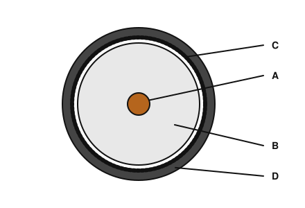
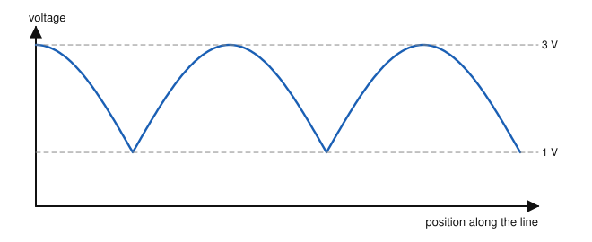
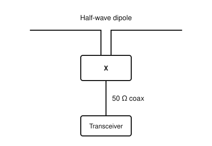

# IRTS HAREC Chapter Practice — Chapter 14: Transmission Lines

47 questions on Study Guide chapter 14 (printed pages 206–223), grouped by the guide's own subsections.
Read the chapter first, then try the questions. Answers, explanations and page numbers are at the end.

> Unofficial practice material based on the IRTS HAREC Study Guide (4.0.3). Syllabus section: A.6.
> Page numbers are the **printed** page numbers of the Study Guide; in a PDF viewer, add 24.

---

### 14.1 Characteristic Impedance

**1.** The characteristic impedance (Z0) of a transmission line is determined by:

- A) Its physical design: conductor size and spacing and the dielectric
- B) Its length
- C) The transmitter power
- D) The frequency only

**2.** If you cut a 50 Ω coaxial cable in half, the characteristic impedance of each piece is:

- A) 25 Ω
- B) It depends on the frequency
- C) 100 Ω
- D) 50 Ω

### 14.2 Line Loss (Attenuation)

**3.** Line loss in a transmission line:

- A) Decreases as frequency increases
- B) Does not depend on frequency
- C) Increases as frequency increases
- D) Depends only on SWR

**4.** Line loss is usually quoted in:

- A) Ω per metre
- B) dB per 100 m
- C) W per metre
- D) Percent per hour

**5.** RG-58 has a loss of about 7 dB per 100 m at 28 MHz. Of 100 W fed into 100 m of it, roughly how much reaches the antenna?

- A) About 20 W
- B) About 50 W
- C) About 90 W
- D) About 7 W

**6.** Power is lost in a transmission line because of:

- A) The velocity factor
- B) Resistance of the conductors and heating of the dielectric
- C) The characteristic impedance
- D) The connectors only

### 14.3 Velocity Factor

**7.** The velocity factor of common polyethylene coaxial cable is about:

- A) 1.5
- B) 0.95
- C) 0.66
- D) 0.33

**8.** The velocity factor of an open wire line is about:

- A) 0.5
- B) 0.66
- C) 0.85–0.9
- D) 1.2

**9.** What is the electrical half-wavelength at 14 MHz of coax with a velocity factor of 0.66?

- A) 3.5 m
- B) 7.1 m
- C) 10.7 m
- D) 21.4 m

**10.** The velocity factor of a line is always:

- A) Greater than 1
- B) Negative
- C) Exactly 1
- D) Between 0 and 1

### 14.4 Preventing Line Radiation

**11.** Why would a single bare wire make a poor transmission line?

- A) It has no velocity factor
- B) It has too low resistance
- C) It cannot carry RF
- D) It would act as an antenna and radiate along its length

**12.** Feedline radiation is undesirable because:

- A) It reduces the power left for the antenna and can bring RF into the shack
- B) It improves the SWR
- C) It is required by law
- D) It lowers the line loss

### 14.5 Parallel Lines

**13.** How does a parallel (open wire) line prevent radiation?

- A) By a metal shield
- B) By its velocity factor
- C) Its two conductors carry equal and opposite currents, so their fields cancel
- D) By being buried

**14.** Which is a typical characteristic impedance of a window line?

- A) 50 Ω
- B) 5 kΩ
- C) 5 Ω
- D) 450 Ω

**15.** How should parallel line be installed?

- A) Away from metal objects and the ground, without sharp bends
- B) Taped to a metal mast
- C) Coiled tightly
- D) Buried underground

**16.** Typical loss of a dry parallel line at 28 MHz is:

- A) 0.3–0.5 dB/100 m
- B) 3.5 dB/100 m
- C) 7 dB/100 m
- D) 20 dB/100 m

### 14.6 Coaxial Line

**17.** Why are coaxial cables so popular?

- A) They have the lowest loss of any line
- B) They tolerate being bent, buried and placed near metal or other cables
- C) They need no connectors
- D) They are balanced lines

**18.** At RF, where does the return current of the signal in a coaxial cable flow?

- A) On the outside of the shield
- B) In the jacket
- C) In the dielectric
- D) On the inside surface of the shield

**19.** Why must the outer jacket of a coaxial cable keep water out?

- A) Water is a conductor that improves the shield
- B) Water improves the velocity factor
- C) Water would irreversibly damage the shielding braid
- D) It does not matter

**20.** Compared with RG-58, RG-213 coaxial cable:

- A) Is thinner and has higher loss
- B) Is thicker, with lower loss and higher power handling
- C) Has a different impedance (75 Ω)
- D) Cannot be used outdoors

**21.** The PL-259 and SO-239 connectors are known as:

- A) N connectors
- B) UHF connectors
- C) BNC connectors
- D) SMA connectors

**22.** In the coaxial cable cross-section shown, which part is the shielding braid?

- A) A
- B) B
- C) C
- D) D

### 14.7 Waveguide

**23.** A waveguide carries RF by:

- A) Two parallel wires
- B) A centre conductor
- C) Reflecting the electromagnetic wave from its inner walls
- D) Optical fibre

**24.** Waveguides are used:

- A) On LF
- B) On HF
- C) Only for mains power
- D) At the higher end of UHF and above

**25.** Why must you never look into an active waveguide?

- A) Risk of serious injury, especially to the eyes
- B) It will detune the waveguide
- C) It reduces the power
- D) It causes key clicks

### 14.8 Common Mode Current

**26.** Common mode currents on a coaxial cable flow:

- A) On the outside of the shield
- B) On the inside of the shield
- C) On the centre conductor
- D) In the dielectric

**27.** Which of these can result from strong common mode currents?

- A) A lower noise level
- B) RF burns from microphones or keys, and equipment malfunction
- C) A better antenna pattern
- D) Lower SWR

**28.** Common mode currents can be reduced by:

- A) Removing the balun
- B) Longer coax
- C) Higher power
- D) Common mode chokes and a good RF earth

### 14.9 Impedance Matching and Transformation

**29.** For maximum power transfer, the transmitter output, the line and the antenna feed point impedances should:

- A) All be different
- B) Rise from transmitter to antenna
- C) All match
- D) Not matter

**30.** On a perfectly matched line:

- A) Standing waves are at their maximum
- B) The SWR is infinite
- C) All the power is reflected
- D) There is no reflected power and no standing wave

**31.** A 100 W transmitter feeds a mismatched line; the meter shows 20 W reflected. What is the forward power and net power?

- A) 100 W forward, 80 W net
- B) 120 W forward, 100 W net
- C) 80 W forward, 60 W net
- D) 120 W forward, 120 W net

**32.** Is all the reflected power on a mismatched line lost?

- A) No; it is eventually used by the load, apart from extra line losses
- B) Yes, all of it is lost
- C) Yes, it heats the antenna
- D) It is radiated by the transmitter

**33.** Standing waves on a mismatched line increase losses because they:

- A) Reduce the velocity factor
- B) Lower the frequency
- C) Increase the current and voltage on parts of the line
- D) Shorten the line

### 14.9.4 Standing Wave Ratio (VSWR)

**34.** SWR (VSWR) is the ratio of:

- A) The highest to the lowest voltage of the standing wave on the line
- B) Forward to reflected power
- C) Line loss to length
- D) Antenna gain to loss

**35.** A perfectly matched line has an SWR of:

- A) 0
- B) 2:1
- C) 1:1
- D) Infinite

**36.** Which kind of line tolerates a very high SWR with little extra loss?

- A) Thin coaxial cable
- B) Low-loss parallel line
- C) Any line equally
- D) A single wire

**37.** An SWR of 2:1 may cause problems mainly for:

- A) Dummy loads
- B) Valve amplifiers
- C) Receivers
- D) Some solid-state transmitters and amplifiers that cannot run full power

**38.** What is the SWR on the line whose voltage standing wave is shown?

- A) 1:1
- B) 3:1
- C) 2:1
- D) 4:1

### 14.10 Antenna Tuning Units

**39.** What does an antenna tuning unit (ATU) do?

- A) Transforms the antenna (and line) impedance to the transmitter's nominal 50 Ω
- B) Increases the antenna gain
- C) Changes the frequency
- D) Measures field strength

**40.** Why is the best place for an ATU at the antenna feed point?

- A) It is easier to adjust there
- B) It presents 50 Ω to the line, avoiding standing waves and extra line loss
- C) It increases the transmitter power
- D) It reduces the velocity factor

**41.** An ATU typically contains:

- A) Resistors and diodes
- B) Batteries
- C) Transistors and valves
- D) Variable or switched inductors and capacitors

### 14.11 Baluns and Chokes

**42.** Why is a balun used when feeding a dipole with coaxial cable?

- A) To change the frequency
- B) To raise the transmitter power
- C) To keep the signal inside the coax separate from common mode currents on the outside
- D) To lower the antenna height

**43.** A 1:1 current balun used to suppress common mode currents is also called a:

- A) Transformer balun
- B) Unun
- C) Common mode choke
- D) Stub

**44.** An "ugly balun" is made from:

- A) Ferrite beads
- B) A length of open wire line
- C) A 4:1 transformer
- D) Several turns of the coaxial feeder coiled at the antenna feed point

**45.** Compared with current baluns, voltage baluns:

- A) Do not provide common mode suppression
- B) Provide better common mode suppression
- C) Cannot transform impedance
- D) Only work on VHF

**46.** An unun with a 49:1 impedance ratio is used to match:

- A) A half-wave dipole
- B) An end-fed half-wave (EFHW) antenna
- C) A Yagi
- D) A quarter-wave ground plane

**47.** Unit X connects the balanced dipole to the unbalanced coaxial cable. It is a:

- A) Balun
- B) Trap
- C) Dummy load
- D) Low-pass filter

---

## Answer Key

| Q | Ans | Explanation (Study Guide page) |
|---|-----|-------------|
| 1 | A | Z0 depends on construction, not on length (p. 206) |
| 2 | D | Characteristic impedance does not depend on the length of the line (p. 206) |
| 3 | C | Losses increase with frequency; good cable is essential on VHF/UHF (p. 207) |
| 4 | B | Line loss is in dB per unit length, usually per 100 m (p. 207) |
| 5 | A | 7 dB is more than ×1/4 loss: only about 20 W arrives, 80 W becomes heat (p. 207) |
| 6 | B | Resistive (ohmic) and dielectric losses dissipate power as heat (p. 206) |
| 7 | C | Waves travel at about 66% of the speed of light in such coax (p. 208) |
| 8 | C | Open wire lines are faster: 0.85–0.9 (0.85–0.95) (p. 208) |
| 9 | B | Free-space λ/2 = 10.7 m; × 0.66 ≈ 7.1 m (p. 208) |
| 10 | D | It is a fraction of the speed of light, between 0 and 1 (p. 208) |
| 11 | D | A single wire radiates energy all along its length (p. 209) |
| 12 | A | It wastes power and can cause RF problems and interference (p. 209) |
| 13 | C | Balanced, opposite currents make the fields cancel (p. 209) |
| 14 | D | Typical parallel lines: 600, 450, 300 and 75 Ω (p. 210) |
| 15 | A | Nearby metal, the ground or sharp bends unbalance it and cause radiation (p. 210) |
| 16 | A | Parallel lines are very low loss: about 0.3–0.5 dB/100 m (p. 210) |
| 17 | B | Coax is very tolerant of its environment and easy to use (p. 211) |
| 18 | D | Due to skin effect the return current is on the inside skin of the shield (p. 212) |
| 19 | C | Even a small amount of water would irreversibly damage the braid (p. 212) |
| 20 | B | RG-213 is 10.3 mm, lower loss and handles more power; both are 50 Ω (p. 213) |
| 21 | B | UHF connectors: PL-259 plug and SO-239 socket, mostly used on HF (p. 213) |
| 22 | C | A is the centre conductor, B the dielectric, C the braid and D the outer jacket (p. 212) |
| 23 | C | Waveguides are tubes in which the wave reflects from the inner walls (p. 213) |
| 24 | D | They are used at upper UHF and microwave frequencies (p. 214) |
| 25 | A | Focused microwave energy can seriously injure, especially the eyes (p. 214) |
| 26 | A | The outside of the shield acts like an extra wire carrying common mode current (p. 212) |
| 27 | B | They can bring RF indoors, cause malfunctions and RF burns (p. 215) |
| 28 | D | Use chokes, keep things balanced, and provide a good RF earth if possible (p. 215) |
| 29 | C | All impedances should match for maximum transfer of power (p. 215) |
| 30 | D | With a matched resistive load, none is reflected; V and I are the same along the line (p. 216) |
| 31 | B | The re-reflected 20 W adds to forward power (120 W); net = 120 − 20 = 100 W (p. 217) |
| 32 | A | Reflected power is re-reflected and eventually absorbed or radiated by the load, except for line losses (p. 217) |
| 33 | C | Higher currents raise resistive loss; higher voltages raise dielectric loss (p. 218) |
| 34 | A | VSWR = Vmax / Vmin along the line (p. 219) |
| 35 | C | With no standing waves the ratio is 1:1 (p. 219) |
| 36 | B | Inherently low-loss parallel lines tolerate very high SWR (p. 219) |
| 37 | D | Some solid-state equipment cannot work at full power with SWR 2:1; valves cope better (p. 219) |
| 38 | B | SWR = highest voltage / lowest voltage = 3 V / 1 V = 3:1 (p. 219) |
| 39 | A | An ATU matches the impedance presented by the antenna system to the transmitter (p. 220) |
| 40 | B | At the antenna, the line sees a match and has no extra SWR losses (p. 220) |
| 41 | D | Adjustable L and C provide a choice of matches (L-match, T-match) (p. 220) |
| 42 | C | Without a balun, feedline radiation and a distorted pattern are likely (p. 221) |
| 43 | C | Used this way it is a common mode choke (p. 222) |
| 44 | D | Coiling the coax turns the outside of the shield into an inductor (p. 223) |
| 45 | A | Voltage baluns are inferior as baluns because they give no common mode suppression (p. 223) |
| 46 | B | 49:1 ununs are used with EFHW antennas, generally with an ATU (p. 223) |
| 47 | A | A balun (balancing unit) connects balanced antennas to unbalanced coax (p. 221) |
