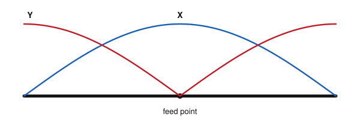
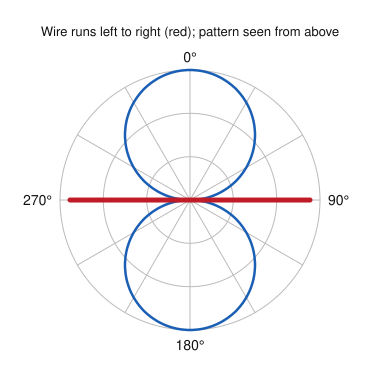
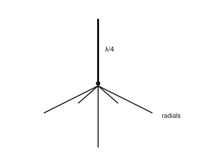
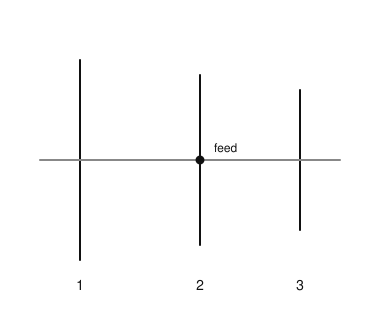
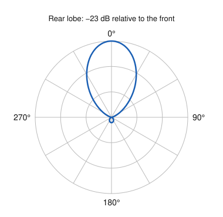
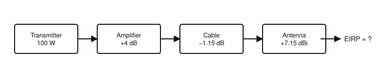

# IRTS HAREC Chapter Practice — Chapter 15: Antennas

66 questions on Study Guide chapter 15 (printed pages 224–253), grouped by the guide's own subsections.
Read the chapter first, then try the questions. Answers, explanations and page numbers are at the end.

> Unofficial practice material based on the IRTS HAREC Study Guide (4.0.3). Syllabus section: A.6.
> Page numbers are the **printed** page numbers of the Study Guide; in a PDF viewer, add 24.

---

### 15.1 How do Antennas Work?

**1.** A transmitting antenna:

- A) Converts RF AC into electromagnetic waves
- B) Converts DC into AC
- C) Amplifies the signal
- D) Filters harmonics

**2.** An antenna radiates because the RF AC:

- A) Heats the wire
- B) Accelerates and decelerates the electrons in the wire
- C) Creates a static field
- D) Reduces the resistance

### 15.2 Near and Far Antenna Fields

**3.** In which region around an antenna are the fields strongest and still attached to the antenna?

- A) Ionosphere
- B) Radiating near field
- C) Far field
- D) Reactive near field

**4.** For a half-wave dipole, the radiating far field begins at roughly:

- A) ¼ wavelength
- B) 10 wavelengths
- C) One wavelength from the antenna
- D) 100 m regardless of frequency

**5.** In the far field, doubling the distance from the antenna makes the field strength:

- A) Stay the same
- B) Fall to a quarter
- C) Halve
- D) Double

**6.** Why should the public not be in an antenna's reactive near field?

- A) It is too cold
- B) The fields are strongest there and hard to measure
- C) It blocks reception
- D) It is illegal to stand near any wire

### 15.3 Feed Point Impedance

**7.** The feed point impedance of an antenna is determined by:

- A) The antenna design, the frequency and the feed point position
- B) The feedline
- C) The transmitter
- D) The SWR meter

**8.** Ideally, the feed point impedance of an antenna fed with common coax should be close to:

- A) 5 Ω
- B) 50 Ω
- C) 300 Ω
- D) 5000 Ω

### 15.4 Construction Materials

**9.** Antennas can be made from tubing without losing performance because of:

- A) The Q factor
- B) The velocity factor
- C) Polarisation
- D) The skin effect: RF flows on the surface of conductors

**10.** A mesh can be used for a reflector antenna, such as a dish, if:

- A) The holes are much smaller than the wavelength
- B) The holes are larger than the wavelength
- C) It is made of plastic
- D) It is painted

### 15.5 Far Field Pattern

**11.** The radiation pattern of an antenna, compared with its receiving (capture) pattern, is:

- A) Opposite
- B) Unrelated
- C) Identical
- D) Always circular

**12.** The radiation pattern of an isotropic antenna is:

- A) A doughnut
- B) A narrow beam
- C) A figure of eight
- D) A perfect sphere

**13.** Antennas with a pattern strongly favouring one direction, like Yagis, are called:

- A) Isotropic antennas
- B) Beam antennas
- C) Ground planes
- D) Dummy loads

### 15.6 Polarisation

**14.** A vertical wire antenna produces waves that are:

- A) Vertically polarised
- B) Horizontally polarised
- C) Circularly polarised
- D) Unpolarised

**15.** For VHF line-of-sight contacts, the transmitting and receiving antennas should have:

- A) Opposite polarisation
- B) Circular polarisation only
- C) Any polarisation
- D) The same polarisation (orientation)

### 15.7 Half-wave Antenna

**16.** On a half-wave antenna, where is the voltage highest?

- A) At the centre
- B) A quarter wave from one end
- C) At the ends
- D) It is the same everywhere

**17.** On a half-wave antenna, where is the current highest?

- A) At the ends
- B) At the centre
- C) Only at the feed line
- D) Nowhere; it is zero

**18.** The approximate free-space half wavelength at 14 MHz is:

- A) 42.8 m
- B) 21.4 m
- C) 10.7 m
- D) 5.35 m

**19.** The practical length of a 14 MHz half-wave antenna, allowing for velocity factor and end effects, is about:

- A) 10.06 m
- B) 10.7 m
- C) 21.4 m
- D) 7.1 m

**20.** The feed point impedance of a resonant horizontal half-wave dipole in free space is about:

- A) 35 Ω
- B) 50 Ω
- C) 74 Ω
- D) 300 Ω

**21.** Why should you never touch the ends of an active half-wave antenna?

- A) It changes the polarisation
- B) The current is highest there
- C) They are always earthed
- D) The voltage is highest there and can cause RF burns

**22.** The figure shows two distributions along a half-wave dipole. Curve X, largest at the centre, shows the:

- A) Voltage
- B) Impedance
- C) Current
- D) Resistance

### 15.8 Half-Wave Dipole

**23.** A half-wave dipole is fed:

- A) At the centre
- B) At one end
- C) A quarter from one end
- D) Through a ground plane

**24.** A horizontal half-wave dipole radiates most strongly:

- A) Off its ends
- B) Equally in all directions
- C) Straight up
- D) Broadside, perpendicular to the wire

**25.** A horizontal dipole at λ/2 above perfect ground has its strongest radiation at about:

- A) 0° (the horizon)
- B) 30° above the horizon
- C) 60° above the horizon
- D) 90° (straight up)

**26.** A radiation plot viewed from above the antenna, showing directions around the horizon, is a:

- A) Vertical plane (elevation) plot
- B) Time domain plot
- C) Horizontal plane (azimuth) plot
- D) Smith chart

**27.** The horizontal pattern of a dipole is shown; the wire runs left to right. The dipole radiates most strongly:

- A) Off the ends of the wire
- B) Equally in all directions
- C) Only at 90°
- D) Broadside, perpendicular to the wire

### 15.9 Non-resonant Wire Antennas and Multiband Antennas

**28.** An antenna that is a little longer than an electrical half wavelength will show at its feed point:

- A) Inductive reactance
- B) Capacitive reactance
- C) No reactance
- D) Infinite resistance

**29.** Compared with a resonant antenna, a non-resonant antenna:

- A) Cannot radiate
- B) Is illegal
- C) Always has an SWR of 1:1
- D) Radiates equally well, but may need an ATU to match it

**30.** The G5RV antenna uses which component as an impedance transformer?

- A) A trap
- B) A length of parallel transmission line
- C) A 49:1 unun
- D) A gamma match

### 15.10 End-Fed Half-Wave Antenna

**31.** Why does an end-fed half-wave (EFHW) antenna need an impedance transformer?

- A) Its feed point impedance at the end is very high, thousands of ohms
- B) Its impedance is very low
- C) It is not resonant
- D) It has no polarisation

**32.** Why should the end of an EFHW antenna be kept away from the shack?

- A) It reduces its bandwidth
- B) Strong electric fields at the end can cause EMC problems
- C) It changes the frequency
- D) It needs sunlight

### 15.11 Folded Dipole

**33.** The feed point impedance of a folded dipole is about:

- A) 50 Ω
- B) 75 Ω
- C) 300 Ω
- D) 600 Ω

**34.** Compared with a simple dipole, a folded dipole:

- A) Has a narrower bandwidth
- B) Has a different radiation pattern
- C) Works better on harmonics
- D) Has a wider bandwidth

### 15.12 Trap Dipole

**35.** The traps in a dual-band trap dipole are:

- A) Series resonant circuits
- B) Baluns
- C) Resistors
- D) Parallel resonant circuits acting as band-stop filters at the higher band

**36.** On the lower band of a trap dipole, the traps:

- A) Act as inductors and add to the electrical length
- B) Isolate the outer wires
- C) Short the antenna
- D) Have no effect at all

### 15.13 Quarter-Wave Ground Plane Antenna (Vertical)

**37.** A quarter-wave ground plane antenna is also known as a:

- A) Dipole
- B) Yagi
- C) Monopole
- D) Loop

**38.** The horizontal radiation pattern of a quarter-wave vertical is:

- A) A figure of eight
- B) Omnidirectional
- C) A narrow beam
- D) Straight up only

**39.** Why is a quarter-wave vertical good for long-distance HF contacts?

- A) It has a high feed impedance
- B) It radiates straight up
- C) It is horizontally polarised
- D) It radiates at a shallow angle, about 20° above the horizon

**40.** The feed point impedance of a quarter-wave vertical with radials on the ground is about:

- A) 20 Ω
- B) 35 Ω
- C) 75 Ω
- D) 300 Ω

**41.** Drooping the elevated radials of a ground plane down at about 25–30°:

- A) Raises the feed point impedance to about 50 Ω
- B) Lowers it to 10 Ω
- C) Makes the antenna horizontal
- D) Removes the need for coax

**42.** In the horizontal plane, the antenna shown (a quarter-wave vertical with radials) radiates:

- A) Equally in all directions (omnidirectionally)
- B) Mostly straight up
- C) In a figure of eight
- D) Only towards the radials

### 15.14 Yagi-Uda Antenna

**43.** In a three-element Yagi, the element connected to the feed line is the:

- A) Reflector
- B) Director
- C) Driven element
- D) Boom

**44.** In a Yagi, the reflector is:

- A) Not part of the antenna
- B) Shorter than the driven element, at the front
- C) The same length, connected to the feeder
- D) About 5% longer than the driven element, at the back

**45.** In which direction does a Yagi radiate most strongly?

- A) Towards the reflector
- B) Towards the director(s), the front
- C) Equally all round
- D) Straight up

**46.** The feed point impedance of a three-element Yagi is about:

- A) 20 Ω
- B) 50 Ω
- C) 75 Ω
- D) 300 Ω

**47.** Which device is used to match a Yagi's low impedance to 50 Ω coax?

- A) Squelch
- B) Trap
- C) Gamma match
- D) Loading coil

**48.** In the Yagi shown (element 2 is fed), in which direction does it radiate most strongly?

- A) Towards element 1
- B) Towards element 3
- C) Along the elements
- D) Equally both ways

### 15.15 Directivity, Efficiency, and Gain

**49.** Gain differs from directivity because gain also accounts for:

- A) The antenna's losses (efficiency)
- B) The feedline length
- C) The transmitter power
- D) Polarisation

**50.** An antenna has a gain of 5 dBd. What is its gain in dBi?

- A) 2.85 dBi
- B) 5 dBi
- C) 7.15 dBi
- D) 10 dBi

**51.** The gain of a half-wave dipole in free space relative to an isotropic antenna is:

- A) 0 dB
- B) 2.15 dB
- C) 3 dB
- D) 7 dB

**52.** The theoretical free-space gain of a three-element Yagi is about:

- A) 2 dBd
- B) 0 dBi
- C) 20 dBd
- D) 7 dBd (about 9 dBi)

**53.** Adding more directors to a Yagi:

- A) Reduces its gain
- B) Raises its feed impedance to 300 Ω
- C) Makes it omnidirectional
- D) Increases its gain and lowers its angle of radiation

**54.** Which antennas are typically more than 95% efficient?

- A) Small magnetic loops
- B) Short loaded verticals close to ground
- C) Half-wave dipoles and Yagis
- D) Dummy loads

### 15.16 Front-to-Back Ratio

**55.** The front-to-back ratio of an antenna compares:

- A) The radiation in the forward direction with that from the back
- B) The gain in dBi and dBd
- C) The SWR at the front and back of the feeder
- D) The lengths of the reflector and director

**56.** A Yagi's rear lobe is 23 dB below its forward lobe. Its front-to-back ratio is:

- A) −23 dB
- B) 23 dB
- C) 46 dB
- D) 2.3 dB

**57.** What is the front-to-back ratio of the antenna whose pattern is shown?

- A) −23 dB
- B) 2.3 dB
- C) 23 dB
- D) 46 dB

### 15.17 Capture Area (Effective Aperture)

**58.** The capture area (effective aperture) of an antenna determines:

- A) The received power available at its terminals
- B) Its polarisation
- C) Its resonant frequency
- D) Its SWR

### 15.18 Parabolic Antenna

**59.** Parabolic (dish) antennas are mainly used:

- A) On LF and MF
- B) At UHF and microwave frequencies
- C) Only for reception of HF broadcasts
- D) For 160 m DX

**60.** A 1.2 m dish on 432 MHz gives about:

- A) 2 dBi
- B) 0 dBd
- C) 30 dBi
- D) 12 dBi (10 dBd)

### 15.19 Horn Antenna

**61.** A horn antenna can be regarded as:

- A) A trap dipole
- B) A folded dipole
- C) A flared-out waveguide
- D) A long wire

### 15.20 Effective Power: EIRP and ERP

**62.** EIRP uses which reference antenna?

- A) An isotropic antenna
- B) A half-wave dipole in free space
- C) A quarter-wave vertical
- D) A three-element Yagi

**63.** A 100 W (20 dBW) transmitter feeds a 4 dB amplifier, a cable with 1.15 dB loss and a 7.15 dBi antenna. The EIRP is:

- A) 27.85 dBW
- B) 20 dBW
- C) 30 dBW (1000 W)
- D) 32 dBW

**64.** How do you convert an EIRP figure to ERP?

- A) Add 2.15 dB
- B) Subtract 2.15 dB
- C) Multiply by 2
- D) They are the same

**65.** A station has an EIRP of 1 kW, but feeds 190 W to its antenna. How much power does the antenna actually radiate?

- A) 1 kW
- B) 2 kW
- C) 600 W
- D) No more than about 190 W, focused in one direction

**66.** What is the EIRP of the station shown?

- A) 27.85 dBW
- B) 30 dBW (1000 W)
- C) 20 dBW (100 W)
- D) 32.3 dBW

---

## Answer Key

| Q | Ans | Explanation (Study Guide page) |
|---|-----|-------------|
| 1 | A | Antennas convert RF AC into radio waves, and back again when receiving (p. 224) |
| 2 | B | Accelerating and decelerating charges radiate energy as an electromagnetic wave (p. 224) |
| 3 | D | The reactive near field immediately surrounds the antenna and holds the strongest fields (p. 225) |
| 4 | C | Reactive near field to ¼–½ λ; radiating near field to about 1 λ; far field beyond (p. 226) |
| 5 | C | In the far field the EMF strength halves as the distance doubles (p. 226) |
| 6 | B | Field strengths are strongest in the reactive near field, a safety concern (p. 226) |
| 7 | A | It depends on the antenna design, frequency and where the feed point is (p. 227) |
| 8 | B | It should match the line: close to 50 Ω for common coax (p. 227) |
| 9 | D | RF current flows only on or near the surface (skin effect) (p. 227) |
| 10 | A | Holes must be much smaller than the wavelength (at least 12 times smaller) (p. 228) |
| 11 | C | The transmit and receive patterns of an antenna are the same (p. 228) |
| 12 | D | The theoretical isotropic radiator radiates equally in all directions (p. 228) |
| 13 | B | Directional antennas such as Yagis are beam antennas (p. 228) |
| 14 | A | Wire antennas polarise waves in the direction of the wire (p. 229) |
| 15 | D | Matching orientation gives the strongest received signals, especially on VHF/UHF (p. 229) |
| 16 | C | Voltage is highest at the ends; current is highest at the centre (p. 229) |
| 17 | B | Current is highest at the centre and close to zero at the ends (p. 229) |
| 18 | C | λ = 300/14 = 21.4 m; λ/2 = 10.7 m (p. 230) |
| 19 | A | 10.7 × 0.99 × 0.95 ≈ 10.06 m (p. 231) |
| 20 | C | About 74 Ω in free space; typically 40–70 Ω at practical heights (p. 230) |
| 21 | D | High RF voltage at the ends can cause burns (p. 230) |
| 22 | C | Current is highest at the centre; voltage (Y) is highest at the ends (p. 229) |
| 23 | A | The wire is cut in the middle; each leg is λ/4 (p. 231) |
| 24 | D | Strongest perpendicular to the wire, front and back; weaker off the ends (p. 232) |
| 25 | B | The vertical-plane plot shows maximum radiation about 30° above the horizon (p. 233) |
| 26 | C | The horizontal plane plot is also called the azimuth plot (p. 234) |
| 27 | D | The lobes are at right angles to the wire, with nulls off the ends (p. 232) |
| 28 | A | Slightly long: inductive. Slightly short: capacitive (p. 235) |
| 29 | D | Both radiate equally well; the mismatch is handled by an ATU or transformer (p. 235) |
| 30 | B | The G5RV uses a section of parallel line as a transformer (p. 235) |
| 31 | A | At the end of a half-wave wire, the impedance is very high (1000–5000 Ω) (p. 236) |
| 32 | B | The strong near field at the end can interfere with nearby equipment (p. 236) |
| 33 | C | About 300 Ω, convenient for parallel line (p. 237) |
| 34 | D | Same pattern, but a wider bandwidth and higher impedance; it does not work well on harmonics (p. 237) |
| 35 | D | Parallel LC traps resonate on the higher band and isolate the outer wire sections (p. 238) |
| 36 | A | At the lower frequency, the traps look inductive, so the outer sections can be shorter (p. 238) |
| 37 | C | It is a vertical monopole working against a ground plane (p. 238) |
| 38 | B | It radiates equally all around its vertical element (p. 240) |
| 39 | D | Its low radiation angle suits sky-wave DX (p. 240) |
| 40 | B | About 35 Ω; drooping elevated radials 25–30° raises it to 50 Ω (p. 241) |
| 41 | A | Drooping radials brings the impedance to about 50 Ω for coax (p. 241) |
| 42 | A | A vertical ground plane is omnidirectional in the horizontal plane (p. 240) |
| 43 | C | Only the driven element (a half-wave dipole) is connected to the feeder (p. 242) |
| 44 | D | The longer reflector is at the back; shorter directors are at the front (p. 242) |
| 45 | B | The Yagi favours the front, where the directors are (p. 244) |
| 46 | A | About 20 Ω; a gamma match or folded dipole driven element helps match 50 Ω coax (p. 243) |
| 47 | C | A gamma match gives an almost perfect match to 50 Ω coax (p. 243) |
| 48 | B | Element 1 is the reflector and element 3 the director; the beam points towards the director (p. 244) |
| 49 | A | Gain = directivity less the antenna's inherent losses (p. 246) |
| 50 | C | dBi = dBd + 2.15 (p. 247) |
| 51 | B | A free-space half-wave dipole has 2.15 dBi (p. 247) |
| 52 | D | About 7 dBd, or 9 dBi (p. 247) |
| 53 | D | Each extra director adds gain (about 1 dBi each, up to about 12 on HF) (p. 248) |
| 54 | C | Large antennas such as dipoles and Yagis usually exceed 95% efficiency (p. 246) |
| 55 | A | Front-to-back ratio = forward intensity vs. rear intensity, in dB (p. 248) |
| 56 | B | The front-to-back ratio is about 23 dB, almost 4 S units (p. 248) |
| 57 | C | The rear lobe is 23 dB below the front, so the front-to-back ratio is 23 dB (p. 248) |
| 58 | A | The received power depends on the capture area; bigger antennas have more (p. 249) |
| 59 | B | Dishes are used at UHF and microwave frequencies, e.g. space communications (p. 249) |
| 60 | D | About 10 dBd or 12 dBi (p. 249) |
| 61 | C | Horns are opened-out waveguides used at microwave frequencies (p. 250) |
| 62 | A | EIRP references an isotropic antenna; ERP references a free-space half-wave dipole (p. 250) |
| 63 | C | 20 + 4 − 1.15 + 7.15 = 30 dBW = 1000 W (p. 251) |
| 64 | B | ERP = EIRP − 2.15 dB (p. 251) |
| 65 | D | An antenna cannot radiate more than it is fed; gain only focuses it (p. 252) |
| 66 | B | 20 dBW + 4 − 1.15 + 7.15 = 30 dBW = 1000 W (p. 251) |
