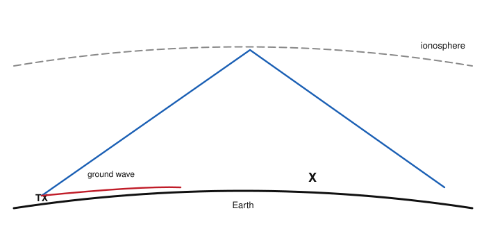
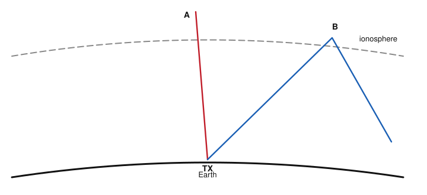

# IRTS HAREC Chapter Practice — Chapter 16: Propagation

48 questions on Study Guide chapter 16 (printed pages 254–271), grouped by the guide's own subsections.
Read the chapter first, then try the questions. Answers, explanations and page numbers are at the end.

> Unofficial practice material based on the IRTS HAREC Study Guide (4.0.3). Syllabus section: A.7.
> Page numbers are the **printed** page numbers of the Study Guide; in a PDF viewer, add 24.

---

### 16.1 Electromagnetic Wave

**1.** Compared with free space, the propagation velocity of radio waves in other media such as water is:

- A) A little lower
- B) Higher
- C) Exactly the same
- D) Zero

### 16.2.1 Daily Cycle and Grey Line

**2.** What ionises the gases of the ionosphere during the day?

- A) Cosmic rays from other galaxies
- B) The Sun's ultraviolet (UV) radiation
- C) Lightning
- D) Radio transmitters

**3.** The grey line is:

- A) The boundary between Europe and America
- B) The edge of the D layer at noon
- C) A type of antenna
- D) The transition between night and day, good for long-distance MF/HF

### 16.2.2 Solar Cycle

**4.** The solar cycle lasts approximately:

- A) 1 year
- B) 5½ years
- C) 11 years
- D) 27 days

**5.** During a solar minimum, which bands may remain unusable for long-distance contacts?

- A) 160 m and 80 m
- B) 40 m only
- C) 10 m and 12 m
- D) 2 m only

### 16.2.3 Sunspots and Flares

**6.** A high sunspot number usually indicates:

- A) A quiet Sun and poor propagation
- B) Night-time
- C) A geomagnetic storm only
- D) An active Sun, stronger ionisation and usually better propagation

**7.** Because the Sun rotates, conditions caused by an active sunspot may recur after about:

- A) 27 days
- B) 7 days
- C) 24 hours
- D) 11 years

**8.** The amount of electromagnetic radiation from the Sun falling on Earth is measured as the:

- A) Kp index
- B) Solar flux
- C) MUF
- D) Critical frequency

### 16.2.4 Geomagnetic Storms and Auroras

**9.** Particles ejected by a coronal mass ejection (CME) typically reach Earth in:

- A) 8 minutes
- B) They never reach Earth
- C) A year
- D) A few days

**10.** A severe geomagnetic storm can cause:

- A) Better VHF line of sight only
- B) A partial or complete radio blackout
- C) A lower noise level
- D) Sporadic E every time

### 16.3 Atmosphere and Ionospheric Layers

**11.** The lowest layer of the atmosphere, about 10 km thick and affecting VHF/UHF, is the:

- A) Troposphere
- B) Ionosphere
- C) Stratosphere
- D) F layer

**12.** Which ionospheric layer exists only during the day and absorbs LF and MF signals?

- A) F1 layer
- B) E layer
- C) D layer
- D) F2 layer

**13.** At night, the F1 and F2 layers:

- A) Disappear completely
- B) Merge into a single F layer at about 300–450 km
- C) Move down to 50 km
- D) Become the D layer

**14.** Which layer is most important for long-distance HF propagation?

- A) F layer (F2 by day)
- B) E layer
- C) D layer
- D) Troposphere

**15.** The maximum distance of a single hop from the F layer is about:

- A) 400 km
- B) 1000 km
- C) 4000 km
- D) 20 000 km

**16.** Why is the longest multi-hop propagation found on the night side of the Earth?

- A) The troposphere disappears
- B) The Sun is stronger
- C) The E layer is thickest
- D) There is no D layer absorption at night

### 16.4 Line-of-Sight Propagation and Radio Horizon

**17.** For line-of-sight propagation, the antennas of both stations should have:

- A) Different polarisation
- B) The same polarisation
- C) No polarisation
- D) Circular polarisation only

**18.** Moving a VHF station to the top of a hill will:

- A) Shorten its radio horizon
- B) Make no difference
- C) Extend its radio horizon
- D) Change its polarisation

**19.** In free space, if the distance from the antenna doubles, the signal power:

- A) Falls to a quarter
- B) Halves
- C) Stays the same
- D) Falls to an eighth

### 16.5 LF, MF, and HF Propagation Mechanism

**20.** Ground wave propagation works best on:

- A) HF above 20 MHz
- B) VHF and UHF
- C) Microwaves
- D) LF and MF

**21.** Ground wave signals can travel up to about:

- A) 20 km
- B) Around the world
- C) 2000 km
- D) Just beyond 200 km

**22.** Why can the IRTS Sunday news on 3.650 MHz be heard around Ireland during the day?

- A) Sporadic E
- B) Ground wave propagation
- C) Meteor scatter
- D) EME

**23.** Sky wave propagation uses:

- A) Refraction in the ionospheric layers
- B) Reflection from the troposphere only
- C) The Earth's surface only
- D) Satellites

### 16.6 LF and MF Propagation

**24.** A signal sent at too steep an angle that passes through the ionosphere and leaves the Earth is called the:

- A) Ground wave
- B) Sky wave
- C) Escape wave
- D) Space wave

**25.** The skip distance is:

- A) The distance from the transmitter to the nearest point reached by the sky wave
- B) The distance covered by the ground wave
- C) The height of the F layer
- D) The width of the dead zone

**26.** The region between the end of the ground wave and the first sky wave landing, where no signal is heard, is the:

- A) Fresnel zone
- B) Grey line
- C) Skip zone of maximum signal
- D) Dead zone

**27.** Signals that travel around the world the opposite, longer way are said to use the:

- A) Short path
- B) Long path
- C) Ground wave
- D) Escape wave

**28.** In the figure, region X, beyond the ground wave but before the sky wave returns to Earth, is the:

- A) Skip zone of maximum signal
- B) Grey line
- C) Dead zone
- D) Fresnel zone

**29.** In the figure, ray A, sent almost straight up and passing through the ionosphere, is called the:

- A) Escape wave
- B) Ground wave
- C) Space wave
- D) Sky wave

### 16.7 HF Propagation

**30.** How does HF propagation differ from LF/MF propagation?

- A) HF only uses ground wave
- B) HF has no sky wave
- C) HF does not benefit from ground wave propagation
- D) HF is not affected by the ionosphere

### 16.8 VHF and UHF Propagation Mechanisms

**31.** The main propagation mechanism for VHF and UHF is:

- A) Sky wave
- B) Line-of-sight
- C) Ground wave
- D) Long path

**32.** Repeaters are used on VHF/UHF to:

- A) Extend the practical communication range
- B) Reduce interference on HF
- C) Measure propagation
- D) Store messages

**33.** The tropospheric (space) wave extends the VHF line-of-sight range by about:

- A) 1500%
- B) 150%
- C) 15%
- D) 1.5%

**34.** A temperature inversion trapping VHF/UHF signals over 1000 km or more is called:

- A) Troposcatter
- B) Sporadic E
- C) Meteor scatter
- D) Tropospheric ducting

**35.** Sporadic E propagation is most likely:

- A) In winter at midnight
- B) In the morning to noon, May–August (northern hemisphere)
- C) Only at solar minimum
- D) Only on 160 m

**36.** Meteor scatter contacts are typically:

- A) Very long, lasting hours
- B) Only on HF
- C) Very brief, seconds to about a minute
- D) Only possible with SSB

**37.** Earth-Moon-Earth (EME) works on VHF/UHF because:

- A) The Moon transmits them back
- B) They are reflected by the D layer
- C) They follow the ground
- D) These frequencies pass through the ionosphere to reach the Moon

**38.** When an aurora is visible, VHF signals can:

- A) Be reflected over 2500–3000 km by auroral reflection
- B) Not be transmitted at all
- C) Only travel 1 km
- D) Become HF

**39.** Which propagation mechanism uses scattering in uneven humid layers of the troposphere for 100–500 km?

- A) Troposcatter
- B) Meteor scatter
- C) EME
- D) Ground wave

**40.** What distinguishes aircraft scatter from troposcatter?

- A) There is no difference
- B) Aircraft scatter only works at night
- C) Troposcatter needs aircraft
- D) Aircraft scatter does not depend on the weather and lasts only minutes

### 16.9 Fading

**41.** Fading is:

- A) Interference from another station
- B) A permanent loss of signal
- C) A fluctuation of the received signal strength
- D) Distortion caused by the transmitter

**42.** One cause of fading is:

- A) A correctly matched antenna
- B) Signals arriving by more than one path (multipath)
- C) A stable transmitter
- D) A narrow filter

### 16.10 Estimating and Predicting Propagation

**43.** The critical frequency is:

- A) The frequency of a beacon
- B) The lowest usable frequency
- C) The frequency of the grey line
- D) The highest frequency reflected back when beamed vertically upwards

**44.** The maximum usable frequency (MUF) for a path depends on:

- A) Transmitter power
- B) The state of ionisation and the angle needed to reach the receiver
- C) Antenna gain
- D) The receiver sensitivity

**45.** For a single hop from the F2 layer, the MUF is approximately:

- A) Three times the F2 critical frequency
- B) Equal to the critical frequency
- C) Ten times the critical frequency
- D) Half the critical frequency

**46.** Signals on frequencies above the MUF:

- A) Are reflected more strongly
- B) Become ground waves
- C) Pass through the ionised layer and are not reflected
- D) Are absorbed by the troposphere

**47.** The lowest usable frequency (LUF) depends on:

- A) Only the F2 layer height
- B) Absorption mainly in the D and E layers, noise, power and antenna gain
- C) Only the time of year
- D) The MUF only

**48.** If the LUF is higher than the MUF for a path:

- A) Every band is open
- B) The ground wave takes over
- C) Only VHF works
- D) No frequency supports communication on that path

---

## Answer Key

| Q | Ans | Explanation (Study Guide page) |
|---|-----|-------------|
| 1 | A | Radio waves are a little slower in media other than vacuum and air (p. 254) |
| 2 | B | Primarily UV radiation from the Sun ionises the atmosphere (p. 255) |
| 3 | D | The day/night transition often gives excellent long-distance propagation (p. 256) |
| 4 | C | About 11 years from maximum to maximum (p. 256) |
| 5 | C | Insufficient ionisation may leave the 10 and 12 m bands closed (p. 257) |
| 6 | D | More sunspots mean an active Sun and usually better HF propagation (p. 257) |
| 7 | A | Sunspots take about 27 days to rotate back to face Earth (p. 257) |
| 8 | B | A high solar flux indicates an active Sun (p. 257) |
| 9 | D | Radiation arrives in minutes; the particles take days (about 3.5 on average) (p. 258) |
| 10 | B | Geomagnetic storms can cause radio blackouts (p. 258) |
| 11 | A | The troposphere holds most water vapour and weather (p. 259) |
| 12 | C | The D layer (50–90 km) forms by day and disappears at sunset (p. 260) |
| 13 | B | At night there is a single F layer (p. 260) |
| 14 | A | The F (by night) and F2 (by day) layers refract HF back to Earth (p. 260) |
| 15 | C | A single F-layer hop can reach about 4000 km (p. 260) |
| 16 | D | Without D-layer absorption, hops can continue further (p. 261) |
| 17 | B | Matching orientation (vertical or horizontal) is beneficial (p. 261) |
| 18 | C | Height extends the line of sight and radio horizon (p. 261) |
| 19 | A | Inverse square law: power falls to ¼, voltage to ½ (p. 262) |
| 20 | D | LF and MF signals follow the curvature of the ground (p. 262) |
| 21 | D | Further than line-of-sight but much shorter than sky wave (p. 262) |
| 22 | B | The ground wave keeps 80 m usable for local contacts by day (p. 262) |
| 23 | A | Sky waves are refracted back to Earth by the ionosphere (p. 263) |
| 24 | C | Steep signals are not refracted enough and escape (p. 264) |
| 25 | A | The closest place reachable by a sky wave (p. 264) |
| 26 | D | Communication is not possible in the dead zone (p. 264) |
| 27 | B | Long path: the signal arrives from the "wrong" direction (p. 265) |
| 28 | C | No signal is heard in the dead zone (p. 264) |
| 29 | A | Steep rays are not bent enough to return and leave the Earth (p. 264) |
| 30 | C | On HF the dead zone extends from the radio horizon to the first hop (p. 265) |
| 31 | B | Line-of-sight, extended by repeaters on hills (p. 266) |
| 32 | A | Repeaters on hills receive and retransmit signals to extend range (p. 266) |
| 33 | C | Refraction in humid air bends the wave slightly: about 15% further (p. 266) |
| 34 | D | Warm air above cold forms a duct (p. 267) |
| 35 | B | Dense E-layer clouds form mostly May–August, morning till noon (p. 267) |
| 36 | C | Meteor trails decay quickly, so dedicated digital modes are used (p. 267) |
| 37 | D | The ionosphere absorbs HF but lets VHF/UHF pass to the Moon (p. 268) |
| 38 | A | Aurora can help VHF/UHF while it disturbs HF (p. 267) |
| 39 | A | Troposcatter, like light scattering in fog (p. 266) |
| 40 | D | Aircraft scatter depends on aircraft position, lasting a few minutes (p. 267) |
| 41 | C | Fading can be fast or slow; its Q-code is QSB (p. 269) |
| 42 | B | Multipath signals can reinforce or cancel one another (p. 269) |
| 43 | D | Also called the vertical incidence frequency (p. 269) |
| 44 | B | MUF does not depend on power or antenna gain (p. 269) |
| 45 | A | F2: about ×3; E layer: about ×5 (p. 269) |
| 46 | C | Frequencies higher than the MUF become escape waves (p. 269) |
| 47 | B | LUF is set by absorption and noise, and is influenced by power and antenna gain (p. 271) |
| 48 | D | With LUF above MUF, there is no usable frequency (p. 271) |
