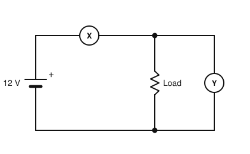
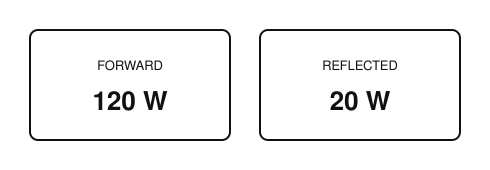
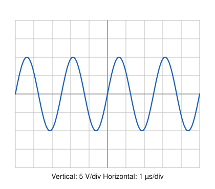
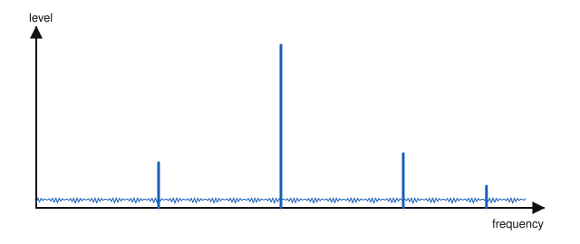

# IRTS HAREC Chapter Practice — Chapter 17: Measurements

31 questions on Study Guide chapter 17 (printed pages 272–281), grouped by the guide's own subsections.
Read the chapter first, then try the questions. Answers, explanations and page numbers are at the end.

> Unofficial practice material based on the IRTS HAREC Study Guide (4.0.3). Syllabus section: A.8.
> Page numbers are the **printed** page numbers of the Study Guide; in a PDF viewer, add 24.

---

### 17.1 Multimeter, Ammeter, Ohmmeter, Voltmeter

**1.** Which instrument measures current, resistance and voltage?

- A) Multimeter
- B) Ammeter
- C) Oscilloscope
- D) Frequency counter

**2.** To measure voltage, the meter is connected:

- A) In series with the circuit
- B) Only to the earth
- C) In parallel (across) the points being measured
- D) Through a capacitor

**3.** An ideal voltmeter should have:

- A) A very low resistance
- B) A very high impedance (resistance)
- C) Zero impedance
- D) An inductive impedance

**4.** To measure current, the meter is connected:

- A) To the antenna
- B) In parallel with the supply
- C) Across the load
- D) In series with the circuit

**5.** An ideal ammeter should have:

- A) A high resistance
- B) A capacitive impedance
- C) A low impedance (resistance)
- D) An infinite impedance

**6.** Why must resistance not be measured in a live circuit?

- A) It would reduce the resistance
- B) The ohmmeter applies its own voltage to the component
- C) It is only possible with AC
- D) The meter needs mains power

**7.** In the circuit shown, which meter is connected as an ammeter?

- A) Y
- B) Both
- C) X
- D) Neither

**8.** In the circuit shown, meter Y measures:

- A) The current through the load
- B) The resistance of the battery
- C) The power of the battery
- D) The voltage across the load

### 17.2 SWR and Power

**9.** An SWR meter shows 120 W forward and 20 W reflected power. The net power to the antenna is:

- A) 140 W
- B) 120 W
- C) 100 W
- D) 20 W

**10.** Another name for an SWR meter is:

- A) Reflectometer
- B) Ohmmeter
- C) Frequency counter
- D) Dummy load

**11.** An SWR meter shows an infinite SWR. You should:

- A) Increase power
- B) Add a longer coax
- C) Ignore it
- D) Turn the transmitter off immediately and investigate

**12.** On a cross-needle SWR meter, the SWR is read:

- A) From the forward needle only
- B) From a separate display
- C) From the reflected needle only
- D) Where the two needles intersect

**13.** Because an SWR meter contains diodes, it should be placed:

- A) After the low-pass filter
- B) Before any final low-pass filter
- C) At the antenna feed point only
- D) Inside the transceiver

**14.** The SWR and power meter shows the readings above. How much power is going to the antenna?

- A) 140 W
- B) 120 W
- C) 20 W
- D) 100 W

### 17.3 Oscilloscope

**15.** An oscilloscope displays signals in the:

- A) Time domain
- B) Frequency domain
- C) Impedance domain
- D) Power domain only

**16.** On an oscilloscope, the vertical axis usually shows:

- A) Frequency
- B) Time
- C) Amplitude (voltage)
- D) Phase

**17.** What is the peak voltage of the signal shown on the oscilloscope?

- A) 10 V
- B) 5 V
- C) 2 V
- D) 20 V

### 17.4 RF Envelope

**18.** The outline of a signal's time-domain plot, used to diagnose overmodulation, is the:

- A) Spectrum
- B) RF envelope
- C) Waterfall
- D) Smith chart

**19.** The two-tone test is used to check an SSB transmitter for:

- A) Amplitude linearity and overmodulation
- B) Frequency accuracy
- C) Antenna SWR
- D) Receiver sensitivity

### 17.5 Spectrum Analyser

**20.** A spectrum analyser displays a signal in the:

- A) Time domain
- B) Phase domain only
- C) Impedance domain
- D) Frequency domain

**21.** Which instrument best shows key clicks, splatter and spurious frequencies?

- A) Spectrum analyser
- B) Ammeter
- C) Dummy load
- D) Ohmmeter

**22.** Which instrument gives a display like the one shown, with frequency on the horizontal axis?

- A) Oscilloscope
- B) Spectrum analyser
- C) Multimeter
- D) Frequency counter

### 17.6 Signal Generator

**23.** A signal generator is used to:

- A) Absorb transmitter power
- B) Measure resistance
- C) Feed test signals into a device under test
- D) Display SWR

### 17.7 Frequency Counter

**24.** When must a dedicated frequency counter be used?

- A) Always with modern transceivers
- B) With home-built or older equipment, to confirm the transmit frequency
- C) Only on VHF
- D) Never; it is illegal

### 17.8 Field Strength Meter

**25.** A field strength meter is useful for:

- A) Measuring resistance
- B) Certifying EMF compliance with a hand-held reading
- C) Measuring DC current
- D) Checking relative field strength from a directional antenna and finding RF hotspots

### 17.9 Antenna Analyser

**26.** An antenna analyser combines:

- A) A dummy load and an ammeter
- B) A wide-range RF oscillator with a reflectometer (SWR meter)
- C) A frequency counter and an amplifier
- D) A filter and a balun

**27.** A vector network analyser (VNA) is a type of:

- A) Transceiver
- B) Power supply
- C) Dummy load
- D) Antenna analyser

### 17.10 Dummy Load

**28.** A dummy load is used to:

- A) Test a transmitter without radiating a signal
- B) Increase antenna gain
- C) Measure frequency
- D) Receive weak signals

**29.** A dummy load should present:

- A) An open circuit
- B) A highly inductive impedance
- C) A purely resistive impedance, usually 50 Ω
- D) A short circuit

**30.** What happens if a dummy load's power rating is exceeded?

- A) It radiates the signal
- B) It may overheat, leak or even burn
- C) The SWR improves
- D) Nothing

**31.** How can a dummy load help find the source of a high SWR?

- A) Substitute it for each component in turn, from the transmitter outwards
- B) Connect it in parallel with the antenna
- C) Use it as an antenna
- D) Connect it to the microphone

---

## Answer Key

| Q | Ans | Explanation (Study Guide page) |
|---|-----|-------------|
| 1 | A | A multimeter (multi-range meter) measures current, resistance and voltage (p. 272) |
| 2 | C | A voltmeter is connected across the circuit (p. 273) |
| 3 | B | A high resistance draws little current, so it does not disturb the voltage measured (p. 273) |
| 4 | D | The current must flow through the ammeter, so it goes in series (p. 273) |
| 5 | C | Low resistance avoids affecting the current measured (p. 273) |
| 6 | B | Ohmmeters use an internal battery; measure with the circuit unpowered (p. 273) |
| 7 | C | An ammeter goes in series with the circuit (X); a voltmeter goes across the load (Y) (p. 273) |
| 8 | D | A meter connected across (in parallel with) a component measures voltage (p. 273) |
| 9 | C | Net power = forward − reflected = 100 W (p. 274) |
| 10 | A | Also called an SWR bridge or reflectometer (p. 274) |
| 11 | D | Infinite SWR indicates a serious fault such as an open or short circuit (p. 276) |
| 12 | D | The crossing point of the forward and reflected needles gives the SWR (p. 274) |
| 13 | B | Diodes can create harmonics, so the low-pass filter goes after the meter (p. 276) |
| 14 | D | Net power = forward − reflected = 120 − 20 = 100 W (p. 274) |
| 15 | A | Horizontal axis is time; vertical is amplitude (voltage) (p. 276) |
| 16 | C | Vertical: amplitude; horizontal: time (p. 276) |
| 17 | A | 2 divisions × 5 V/div = 10 V peak (p. 276) |
| 18 | B | The RF envelope can be viewed on an oscilloscope (p. 277) |
| 19 | A | Two audio tones produce a steady pattern that shows flat-topping and non-linearity (p. 277) |
| 20 | D | The horizontal axis shows the frequencies in the signal (p. 278) |
| 21 | A | Spurious products appear as extra frequencies on a spectrum analyser (p. 278) |
| 22 | B | A spectrum analyser shows the signal in the frequency domain, revealing spurious signals (p. 278) |
| 23 | C | Test AF/RF signals are fed in, and the output is compared (p. 278) |
| 24 | B | You must know your transmitter is on a legal frequency (p. 279) |
| 25 | D | Uncalibrated hand-held meters cannot evaluate EMF compliance (p. 279) |
| 26 | B | It generates test signals and measures SWR, impedance, resistance and reactance (p. 280) |
| 27 | D | A VNA is a popular type of antenna analyser (p. 280) |
| 28 | A | Connecting a dummy load avoids unwanted emissions during tests (p. 281) |
| 29 | C | Known, purely resistive 50 Ω with minimal reactance (p. 281) |
| 30 | B | Dummy loads are rated by power and time (p. 281) |
| 31 | A | If the SWR is normal with the dummy load but high with the component, that component is suspect (p. 281) |
