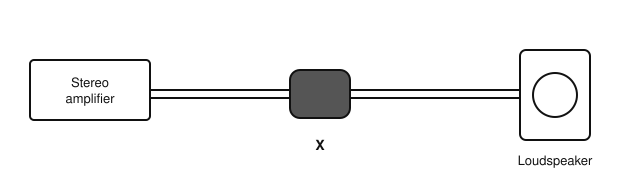

# IRTS HAREC Chapter Practice — Chapter 18: Electromagnetic Compatibility, Immunity, and Transmitter Interference

31 questions on Study Guide chapter 18 (printed pages 282–291), grouped by the guide's own subsections.
Read the chapter first, then try the questions. Answers, explanations and page numbers are at the end.

> Unofficial practice material based on the IRTS HAREC Study Guide (4.0.3). Syllabus section: A.2.
> Page numbers are the **printed** page numbers of the Study Guide; in a PDF viewer, add 24.

---

### 18.1 Electromagnetic Compatibility

**1.** Electromagnetic compatibility (EMC) is:

- A) The maximum power of a transmitter
- B) The avoidance of interference between pieces of electronic equipment
- C) A type of antenna
- D) The ability to receive weak signals

**2.** A security light turning on during your transmissions is an example of:

- A) Normal operation
- B) Good propagation
- C) An EMC problem
- D) A licence condition

### 18.1.1 Radiated and Conducted Emissions

**3.** Interference travelling as radio waves through the air is called:

- A) Conducted emissions
- B) Common mode current
- C) Ground wave
- D) Radiated emissions

**4.** RF currents carried along mains cables and power lines are:

- A) Conducted emissions
- B) Radiated emissions
- C) Harmonics
- D) Key clicks

**5.** Which of these can act as an unintended antenna?

- A) A ferrite ring
- B) A dummy load
- C) Headphone cables and PCB traces
- D) An earthed metal enclosure

### 18.1.3 Interference and Immunity

**6.** A device malfunctioning because it lacks immunity to a legitimate transmission is called:

- A) Breakthrough
- B) Splatter
- C) Key clicks
- D) Fading

**7.** Interference caused by excessive spurious emissions must be fixed:

- A) Only at the affected device
- B) At the transmitter
- C) By the neighbour
- D) By ComReg

**8.** EU EMC directives require equipment carrying the CE mark to have:

- A) A 30 MHz filter
- B) A built-in transmitter
- C) An RF earth
- D) Immunity from legitimate radio transmissions

### 18.1.4 Field Strength and EMC

**9.** The likelihood of interference is directly related to:

- A) The age of the operator
- B) The colour of the coax
- C) The strength of the EMF from the station's antenna
- D) The mode used only

**10.** Metal fences, pipes and wiring in an antenna's near field can:

- A) Improve the SWR
- B) Absorb and re-radiate RF, causing EMC problems
- C) Block all interference
- D) Have no effect

### 18.1.5 Prevention

**11.** If reducing transmit power cures an EMC problem, you should:

- A) Identify the cause before resuming higher power
- B) Increase power again
- C) Ignore it
- D) Switch to a longer antenna

**12.** Which antenna is generally less prone to EMC problems?

- A) A Yagi pointed at the neighbour's house
- B) An EFHW fed next to the radio room
- C) A small magnetic loop on the desk
- D) A symmetrical half-wave dipole away from the house

**13.** Many EMC problems are caused by:

- A) Low SWR
- B) A correctly matched antenna
- C) Using a dummy load
- D) Common mode currents on the outside of the feedline

**14.** To reduce common mode currents before they enter the radio room, use:

- A) A longer coax
- B) A choke, such as a 1:1 current balun
- C) A higher power
- D) A frequency counter

**15.** Interference is heard in a neighbour's loudspeakers. A simple remedy is to:

- A) Increase the volume
- B) Remove the speakers' earth
- C) Put ferrite rings on the speaker wires
- D) Use a longer antenna

**16.** An HF station should include a low-pass filter with a cut-off at about:

- A) 3 MHz
- B) 30 MHz
- C) 144 MHz
- D) 430 MHz

**17.** Why should parallel line not run close to the ground or metal objects?

- A) The currents may become unbalanced and the line radiates
- B) It increases the line's velocity factor
- C) It is illegal
- D) It lowers the SWR too much

**18.** Interference is heard from the loudspeaker shown. What is X, fitted on the speaker cable to cure it?

- A) A fuse
- B) A capacitor
- C) A ferrite ring (choke)
- D) An attenuator

### 18.1.5.1 Shielding and Earthing

**19.** Why should transmitters never be operated with their covers removed?

- A) Removing shielding causes EMC problems and is unsafe
- B) It improves cooling too much
- C) The frequency display stops
- D) It reduces power

**20.** In Ireland, an RF earth in a domestic installation should be:

- A) Unnecessary
- B) Kept completely separate from the house earth
- C) Connected to a water pipe
- D) Bonded to the house's protective earth and certified by a qualified electrician

**21.** Where is it particularly useful to connect a coax line's outer to a good earth?

- A) Inside the transceiver only
- B) At the microphone
- C) Where it enters the building
- D) At the antenna's far end

### 18.2 Transmitter Distortion

**22.** Harmonic distortion produces unwanted signals at:

- A) Only the input frequency
- B) Multiples of the input frequency
- C) Half the input frequency
- D) Random audio frequencies

**23.** Harmonic distortion of a 40 m signal can cause interference on:

- A) The 20 m band
- B) The 160 m band
- C) The 80 m band
- D) No other band

**24.** Mixing products amplified by a non-linear amplifier are called:

- A) Key clicks only
- B) Harmonics
- C) Fading
- D) Intermodulation distortion (IMD)

**25.** Key clicks are usually caused by:

- A) A good antenna match
- B) Too narrow a filter
- C) Improperly shaped CW keying with too short a rise time
- D) Low power

**26.** Splatter from an SSB transmitter mainly affects:

- A) Nothing; it is harmless
- B) Only the operator's own receiver
- C) Frequencies 10 times higher
- D) Nearby frequencies, through excessive bandwidth

**27.** As a rule of thumb, the primary cause of most transmitter distortion is:

- A) A low SWR
- B) Overdriven amplification
- C) A long antenna
- D) A narrow receive filter

**28.** An overactive ALC fed with overdriven signals may cause:

- A) Better audio
- B) Lower noise
- C) Clipping, non-linearity and harmonic distortion
- D) Lower SWR

### 18.2.1 Spurious Emissions

**29.** Which of these is a cause of spurious emissions?

- A) Parasitic oscillation in an amplifier
- B) A purely resistive dummy load
- C) A balanced dipole
- D) A properly shaped CW signal

**30.** Spurious emissions in excess of the regulatory limits are:

- A) Only a problem on VHF
- B) Allowed at night
- C) Allowed below 10 W
- D) Illegal and must be remedied at source

**31.** Can a high-quality transmitter be completely free of spurious emissions?

- A) Yes, always
- B) No; good filters reduce them but cannot remove them entirely
- C) Only on HF
- D) Only when using FM

---

## Answer Key

| Q | Ans | Explanation (Study Guide page) |
|---|-----|-------------|
| 1 | B | EMC means equipment works together without interference (p. 282) |
| 2 | C | Unexpected behaviour due to RF suggests an EMC issue (p. 282) |
| 3 | D | Radiated emissions travel as radio waves (p. 282) |
| 4 | A | Conducted emissions travel along connected wiring (p. 283) |
| 5 | C | Cables and conductive traces can transmit and receive RF (p. 282) |
| 6 | A | Breakthrough is caused by a lack of immunity, not by a faulty transmitter (p. 283) |
| 7 | B | Excessive spurious emissions need remediation on the transmitting side (p. 283) |
| 8 | D | CE-marked equipment must be immune to legitimate transmissions (p. 283) |
| 9 | C | Field strength depends on the antenna type, the power and the distance (p. 283) |
| 10 | B | They act as unexpected transmitting antennas (p. 284) |
| 11 | A | Lower power is a diagnostic step, not the final fix (p. 284) |
| 12 | D | Symmetrical antennas away from the house cause fewer problems (p. 284) |
| 13 | D | Common mode currents re-radiate along the line inside the house (p. 284) |
| 14 | B | Chokes (current baluns, ferrites) block common mode currents (p. 285) |
| 15 | C | Ferrite chokes on affected cables increase immunity (p. 285) |
| 16 | B | A 30 MHz low-pass filter attenuates harmonics above HF; VHF/UHF stations use a band-pass filter (p. 286) |
| 17 | A | Unequal currents cause feedline radiation (p. 284) |
| 18 | C | Ferrite rings on speaker or headphone leads increase immunity (p. 285) |
| 19 | A | Shielding keeps RF in; open equipment is also an electrical and EMF hazard (p. 286) |
| 20 | D | Safety regulations require bonding and certification (p. 287) |
| 21 | C | Earthing at the entry point helps safety and dissipates common mode currents (p. 286) |
| 22 | B | Harmonics are at integer multiples of the wanted frequency (p. 287) |
| 23 | A | 7 MHz × 2 = 14 MHz, in the 20 m band (p. 288) |
| 24 | D | IMD amplifies unwanted mixing products of the signal's frequencies (p. 288) |
| 25 | C | Abrupt keying edges spread energy over nearby frequencies (p. 288) |
| 26 | D | A distorted SSB signal may occupy over 7 kHz instead of 2.7 kHz (p. 288) |
| 27 | B | Overdriving, even with excessive audio input, causes most distortion (p. 290) |
| 28 | C | Sudden ALC adjustments can clip the signal (p. 289) |
| 29 | A | Parasitic oscillations from internal feedback create unrelated frequencies (p. 290) |
| 30 | D | Excessive spurious emissions breach the licence conditions (p. 290) |
| 31 | B | Regulations allow a small level of spurious emissions (p. 290) |
