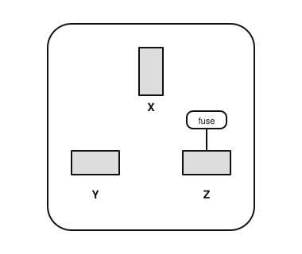

# IRTS HAREC Chapter Practice — Chapter 19: Safety

56 questions on Study Guide chapter 19 (printed pages 292–313), grouped by the guide's own subsections.
Read the chapter first, then try the questions. Answers, explanations and page numbers are at the end.

> Unofficial practice material based on the IRTS HAREC Study Guide (4.0.3). Syllabus section: A.1.
> Page numbers are the **printed** page numbers of the Study Guide; in a PDF viewer, add 24.

---

### 19.1 Radio Safety and The Irish Law

**1.** Under the Irish licence regulations, who is legally responsible for the safety of an amateur station and its operation?

- A) The licence holder
- B) ComReg
- C) The IRTS
- D) The equipment manufacturer

**2.** Non-ionising radiation emissions from your station must be within the limits of guidelines published by:

- A) The IEEE only
- B) The FCC
- C) The ARRL
- D) ICNIRP

**3.** If you operate several transmitters or antennas, the exposure limits apply to:

- A) Only the most powerful transmitter
- B) Each part of the station and to the aggregate emissions
- C) Only the antenna nearest the house
- D) None of them

### 19.2 Equipment Labelling and Access Control Requirements

**4.** ComReg regulations require that important controls which change system parameters are:

- A) Removed
- B) Painted red
- C) Accessible to qualified personnel only
- D) Located on the front panel

**5.** All wireless telegraphy equipment must be labelled with:

- A) The manufacturer's trademark, type designation and a serial number
- B) The owner's call sign only
- C) The date of purchase
- D) The maximum SWR

### 19.3 Electricity and The Human Body

**6.** Which small current through the body can cause fatal ventricular fibrillation?

- A) 0.5 mA
- B) 5 µA
- C) 50 mA
- D) 50 A only

**7.** Which current path through the body is the most dangerous?

- A) Through the hair
- B) From one finger to another on the same hand
- C) Through the foot only
- D) From one hand across the chest to the other hand

**8.** Someone is receiving an electric shock. Your first action should be to:

- A) Pull them away by the hand
- B) Shut off the power before touching the person
- C) Start CPR immediately
- D) Pour water on them

### 19.3.2 RF Burns

**9.** What is the most immediately hazardous biological effect of contact with RF currents?

- A) An RF burn
- B) Hair loss
- C) Hearing loss
- D) Radioactivity

**10.** How should you treat a minor RF burn?

- A) Cover with butter
- B) Apply ice directly
- C) Cool the skin with tepid running water
- D) Ignore it

**11.** Why avoid standing close to the ends of a transmitting half-wave dipole?

- A) The current is highest there
- B) The high RF voltage can cause an arc and an RF burn
- C) It will detune the receiver
- D) It is never dangerous

**12.** RF currents on the metal case of a transceiver are often caused by:

- A) Low power
- B) A correctly matched antenna
- C) Using a dummy load
- D) Improper earthing and common mode current on the coax

### 19.4.1 Supply Safety: Switches and RCDs

**13.** What is the most common cause of fatal electrical accidents?

- A) Ordinary 230 V circuits
- B) 12 V batteries
- C) RF from handhelds
- D) Static electricity

**14.** The station's main (master) switch should be:

- A) Single pole in the neutral
- B) Double pole, breaking both live and neutral
- C) In the earth lead only
- D) Hidden from family members

**15.** An RCD cuts the power when:

- A) The fuse blows
- B) The voltage rises above 230 V
- C) The SWR is high
- D) The live and neutral currents differ by the rated amount, usually 30 mA

**16.** How often should RCDs be tested with their test button?

- A) Never
- B) Every 10 years
- C) At least twice per year
- D) Only after a fault

### 19.4.2 Protective Earth

**17.** The earthing system used in Ireland is known as:

- A) IT
- B) TT
- C) TN-C-S
- D) TN-S only

**18.** How should station equipment be connected to the earthing point?

- A) Not at all, as 12 V equipment needs no earth
- B) Daisy-chained from one device to the next
- C) Through the coax only
- D) Each device directly to a common earthing point

**19.** Having multiple earths in a house that are not bonded together:

- A) Improves safety
- B) Can create lethal hazards
- C) Reduces noise safely
- D) Is required by regulations

**20.** Microphones and Morse keys should be:

- A) Fully insulated or properly connected to an earthed chassis
- B) Connected to the live conductor
- C) Wired to the antenna
- D) Left floating

### 19.4.3 Wiring, Plugs and Fuses

**21.** In a 230 V mains plug, the live conductor is:

- A) Green/yellow
- B) Blue
- C) Brown
- D) Black

**22.** In a 230 V mains plug, the neutral conductor is:

- A) Brown
- B) Red
- C) Green/yellow
- D) Blue

**23.** A device draws a maximum of 2.5 A from the mains. The best fuse is:

- A) 3 A
- B) 13 A
- C) 2 A
- D) 30 A

**24.** In a mains plug, the fuse is fitted in:

- A) The neutral lead
- B) The live lead only
- C) The earth lead
- D) Both live and neutral

**25.** Where should fuses be fitted on the output of a DC power supply?

- A) Only inside the radio
- B) At the far end of the cable
- C) As close to the source of power as possible
- D) Not needed for DC

**26.** What is the maximum power that can be drawn through a 13 A fuse on 230 V mains, with no margin?

- A) 2990 W
- B) 1150 W
- C) 690 W
- D) 13 kW

**27.** In the mains plug shown, terminal Z is next to the fuse. Which conductor connects to it?

- A) Blue (neutral)
- B) Green/yellow (earth)
- C) Black
- D) Brown (live)

**28.** In the mains plug shown, which colour of conductor connects to terminal Y?

- A) Brown
- B) Blue
- C) Green/yellow
- D) Red

### 19.4.5 Valve Equipment and High Voltage Power Supplies

**29.** A bleeder resistor in a high voltage power supply is connected across each smoothing capacitor to:

- A) Increase the output voltage
- B) Discharge the capacitors after the power is switched off
- C) Filter RF
- D) Act as a fuse

**30.** Before working on a high voltage power supply, you should always:

- A) Touch the capacitors to check
- B) Rely on the bleeder resistors
- C) Wait 5 seconds
- D) Use a shorting stick to discharge the smoothing capacitors

**31.** Micro switches on a valve power amplifier should:

- A) Bypass the fuse
- B) Switch the antenna
- C) Turn on the fan
- D) Disconnect the high voltage supply when the cover is removed

**32.** Why put an RF choke to ground at the output socket of a valve linear amplifier?

- A) To increase the output power
- B) So that a shorted DC blocking capacitor cannot put high DC voltage on the antenna
- C) To improve SWR
- D) To act as a filter for harmonics

### 19.4.6 Adjusting Live Equipment

**33.** Before using a voltmeter to confirm a circuit is dead, you should:

- A) Check the meter on a known live source first
- B) Set it to the ohms range
- C) Earth it
- D) Connect it in series

**34.** When adjusting live equipment, you should:

- A) Wear a metal watch
- B) Use both hands for stability
- C) Use one hand only and remove jewellery
- D) Stand on a wet floor

### 19.5 Mobile and Battery Safety

**35.** In a vehicle installation, fuses should be fitted:

- A) On the antenna only
- B) On both the positive and negative battery leads
- C) Only on the negative lead
- D) Nowhere

**36.** When refuelling a vehicle with mobile radio equipment, you should:

- A) Raise the antenna
- B) Keep transmitting
- C) Switch only the engine off
- D) Switch off the engine and the radio equipment

### 19.6 Antenna Safety and Lightning

**37.** Guy ropes for a mast should be anchored at a distance from the base of about:

- A) Twice the mast height
- B) 10% of the mast height
- C) 60–80% of the mast height
- D) Exactly the mast height

**38.** Towers and masts should be located how far from nearby power lines, people and property?

- A) Twice their own height
- B) Half their height
- C) 1 m
- D) It does not matter

**39.** When thunderstorms are forecast you should:

- A) Keep transmitting
- B) Disconnect and ground all feeders, preferably outside the building
- C) Disconnect only the microphone
- D) Raise the antenna

**40.** Static dischargers (lightning arrestors) in antenna feeders protect against:

- A) Harmonics
- B) A direct lightning strike
- C) High SWR
- D) Transient high voltages from a nearby strike

### 19.7 Chemicals

**41.** Soldering should be done:

- A) In a well-ventilated area, avoiding the fumes and wearing eye protection
- B) In a closed cupboard
- C) Without eye protection
- D) Only with leaded solder

### 19.8.1 Emissions and the Exposure Limits

**42.** The ICNIRP guidelines limit:

- A) The transmitter power
- B) The emissions of an antenna as such
- C) Exposure of people to EMF
- D) The bandwidth

**43.** Which group has the lower, more stringent ICNIRP exposure limits?

- A) Occupationally exposed workers
- B) The general public
- C) Radio amateurs only
- D) There is only one set of limits

**44.** Most ICNIRP limits are specified as:

- A) Time-averaged values over a period such as 6 or 30 minutes
- B) Peak values only
- C) DC values
- D) Daily totals

### 19.8.3 Nature of the Risks

**45.** The primary adverse effect of RF EMF exposure is:

- A) Magnetising the blood
- B) Radioactive contamination
- C) Heating of human tissue
- D) Hearing loss

**46.** To avoid a touch hazard, no part of an antenna should be lower than how far above where people can stand?

- A) 10 m
- B) 1 m
- C) 0.5 m
- D) 2.4 m

**47.** Which body parts are particularly vulnerable to RF heating at microwave frequencies?

- A) The feet
- B) The fingernails
- C) The hair
- D) The eyes

**48.** RF at frequencies up to about 10 MHz may also cause:

- A) Radioactivity
- B) Electrostimulation of the nervous system
- C) Sunburn
- D) Colour blindness

**49.** Why need small magnetic loop antennas particular care?

- A) They are always outdoors
- B) They cannot transmit
- C) Their near fields are intense and extend further than their size suggests
- D) They have no near field

### 19.8.4 Station Characteristics Influencing RF Emissions

**50.** Which station characteristics directly influence RF emissions?

- A) Power to the antenna, antenna gain and pattern, and the distance from it
- B) The callsign
- C) The colour of the antenna
- D) The make of microphone

**51.** Does staying within your licence power limits guarantee compliance with exposure limits?

- A) Only with a Yagi
- B) Yes, always
- C) Only on HF
- D) No

**52.** RF exposure calculators based only on far-field assumptions:

- A) Only work for dipoles
- B) Are always accurate
- C) May be inaccurate for predicting exposure in the near field
- D) Are illegal

### 19.8.5 Estimating and Modelling RF Field Strengths and Exposure

**53.** In the far radiating field, the field intensity:

- A) Doubles as the distance doubles
- B) Halves as the distance doubles
- C) Is constant
- D) Falls with the cube of the distance

**54.** According to the RSGB PAEC guidance, a 40–160 m dipole fed with up to 400 W average power is likely compliant if mounted at least:

- A) 6.4 m high, with no one closer than 2.2 m
- B) 1 m high
- C) 2.4 m high with no other condition
- D) 20 m high only

### 19.8.7 Practical Suggestions

**55.** Above what RF power should hand-held or body-worn devices with antennas close to the body be avoided?

- A) 0.5 W
- B) 50 W
- C) 5 W
- D) 100 W

**56.** Which is a sensible practical precaution for EMF safety?

- A) Mount antennas at head height
- B) Point Yagis at neighbours
- C) Use maximum power at all times
- D) Site antennas as high and as far away from people as practical

---

## Answer Key

| Q | Ans | Explanation (Study Guide page) |
|---|-----|-------------|
| 1 | A | The regulations make you legally responsible for your station's safety (p. 292) |
| 2 | D | ComReg Guidelines 09/45 specifically require the ICNIRP limits (p. 292) |
| 3 | B | Emissions from all parts of the station combined must comply (p. 292) |
| 4 | C | Access to important controls must be restricted (p. 293) |
| 5 | A | Labelling is a ComReg requirement (p. 293) |
| 6 | C | Currents as small as 50 mA can disturb the heart's rhythm (p. 293) |
| 7 | D | A hand-to-hand path crosses the heart; keep one hand behind your back (p. 293) |
| 8 | B | Switch off the power first, then make safe, call for help, and give CPR if qualified (p. 293) |
| 9 | A | RF burns come from direct or near contact with an energised conductor (p. 294) |
| 10 | C | Treat like any burn: cool with tepid water; seek medical help if deep (p. 294) |
| 11 | B | An arc can form before you even touch the conductor (p. 294) |
| 12 | D | Common mode currents can reach poorly earthed equipment, microphones and keys (p. 294) |
| 13 | A | Ordinary mains circuits cause most fatal electrical accidents (p. 295) |
| 14 | B | A double-pole switch breaks live and neutral; everyone should know where it is (p. 295) |
| 15 | D | An imbalance suggests current leaking to earth, perhaps through a person (p. 295) |
| 16 | C | Test them frequently: at least twice a year (p. 295) |
| 17 | C | Ireland uses TN-C-S with additional ESB bonding provisions (p. 296) |
| 18 | D | Avoid daisy-chaining; connect each device to a common point (bus bar) (p. 296) |
| 19 | B | All earths must be bonded to the house's protective earth (p. 296) |
| 20 | A | They must be insulated or earthed (p. 296) |
| 21 | C | Live brown, neutral blue, earth green/yellow (p. 297) |
| 22 | D | Neutral is blue (p. 297) |
| 23 | A | Use the lowest rating with a small margin above the maximum current (p. 297) |
| 24 | B | The fuse goes in the live lead, on the equipment side of the switch (p. 298) |
| 25 | C | Often on both positive and negative leads, close to the source (p. 298) |
| 26 | A | P = V × I = 230 × 13 = 2990 W (p. 298) |
| 27 | D | The fuse is in the live lead, and the live conductor is brown (p. 297) |
| 28 | B | Bottom left (viewed from the back) is neutral, which is blue; the top terminal X is earth (p. 297) |
| 29 | B | Bleeders often fail, so also use a shorting stick (p. 298) |
| 30 | D | Capacitors can hold a charge for months; never rely on bleeders (p. 298) |
| 31 | D | Interlocks disconnect high voltages automatically (p. 298) |
| 32 | B | The choke gives a DC path to ground while blocking RF (p. 298) |
| 33 | A | Prove the instrument works before trusting a zero reading (p. 299) |
| 34 | C | One hand only, no jewellery, and an RCD-protected supply (p. 299) |
| 35 | B | Fuse both battery leads; never short-circuit a high-capacity battery (p. 299) |
| 36 | D | Switch everything off when refuelling (p. 299) |
| 37 | C | Guys are secured 60–80% of the mast height away from the base (p. 299) |
| 38 | A | Allow for the mast falling (p. 299) |
| 39 | B | Antennas should be earthed when not in use (p. 300) |
| 40 | D | Nothing protects against a direct strike; arrestors help with nearby strikes (p. 300) |
| 41 | A | Ventilate, avoid fumes, protect your eyes; consider lead-free solder (p. 300) |
| 42 | C | ICNIRP focuses on exposure to humans, not emissions as such (p. 301) |
| 43 | B | The general public (including pregnant women) has stricter limits (p. 302) |
| 44 | A | Most are time-averaged; some 2020 limits are instantaneous peaks (p. 302) |
| 45 | C | Like a microwave oven, intense RF heats tissue (p. 303) |
| 46 | D | Keep antennas at least 2.4 m above any standing level (p. 304) |
| 47 | D | Never look into an active waveguide (p. 304) |
| 48 | B | Induced currents in nerves; unlikely without physical contact in amateur stations (p. 304) |
| 49 | C | Their small size gives a false sense of security (p. 304) |
| 50 | A | Power, gain/pattern, and near/far field distances determine emissions (p. 305) |
| 51 | D | Licence power compliance does not guarantee EMF compliance (p. 305) |
| 52 | C | Near fields are hard to predict and depend on surroundings (p. 306) |
| 53 | B | Field strength is inversely proportional to distance in the far field (p. 307) |
| 54 | A | For 100 W average: 3.7 m high and 1.2 m clearance (p. 309) |
| 55 | C | Avoid handhelds above 5 W near the head or body (p. 311) |
| 56 | D | Height and distance reduce exposure (p. 311) |
