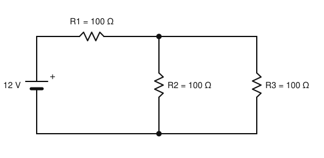
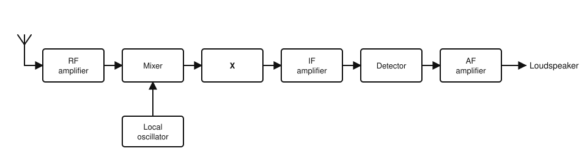
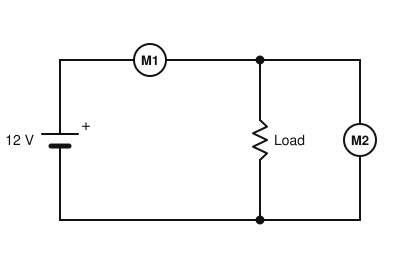

# IRTS HAREC Practice Exam — Set 1

60 questions · 2 hours · pass mark 60% **in each section** (at least 18/30 in Section A and 18/30 in Section B).
Only ONE answer is correct for each question. Answers and short explanations are at the end.

> Unofficial practice paper based on the IRTS HAREC Exam Syllabus (Rev 2.0.2), the IRTS Sample Exam Paper 2022 and the IRTS HAREC Study Guide (4.0.3).
> Page numbers in the answer key are the **printed** page numbers of the Study Guide; in a PDF viewer, add 24 (e.g. p. 343 is PDF page 367).

---

## Section A: Technical

### A.1 Safety (5 questions)

**1.** A linear amplifier power supply draws 2 kW from the 230 V mains. Which plug fuse gives the best protection?

- A) 3 A
- B) 5 A
- C) 13 A
- D) 30 A

**2.** In a 230 V mains plug used in Ireland, the LIVE conductor is coloured:

- A) Blue
- B) Brown
- C) Green with a yellow stripe
- D) Red

**3.** You find someone receiving an electric shock from a piece of equipment. What should you do FIRST?

- A) Pull the person away with your bare hands
- B) Start CPR immediately
- C) Call for help and wait
- D) Switch off the power before touching the person

**4.** A Residual Current Device (RCD) protecting a station circuit typically trips when the imbalance between live and neutral current reaches about:

- A) 30 mA
- B) 300 mA
- C) 3 A
- D) 13 A

**5.** According to the ICNIRP guidelines, the main adverse health effect of RF electromagnetic field exposure is:

- A) Ionisation of DNA
- B) Magnetisation of blood cells
- C) Heating of body tissue
- D) Hearing loss

### A.2 Interference and Immunity (4 questions)

**6.** Key clicks on a CW signal are caused by:

- A) Too slow a sending speed
- B) Keying envelope rise and fall times that are too fast
- C) Using a low-pass filter
- D) Too low an SWR

**7.** Overdriving a linear amplifier is most likely to cause:

- A) Splatter and spurious emissions on nearby frequencies
- B) A reduction of the received noise level
- C) Better audio quality
- D) Lower power consumption

**8.** Your HF transmissions are getting into a neighbour's TV through its antenna input. What should be fitted at the TV antenna input?

- A) A low-pass filter
- B) A capacitor in series with the mains lead
- C) An SWR meter
- D) A high-pass filter

**9.** The CE mark on radio transmitting equipment sold in the EU shows that the manufacturer states it complies with, among others:

- A) The ICNIRP 1998 guidelines only
- B) The IARU Region 1 band plan
- C) The Radio Equipment Directive
- D) The ITU Radio Regulations Article 25

### A.3 Electrical, Electromagnetic, and Radio Theory (4 questions)

**10.** A voltage of 12 V is applied across a 4 Ω resistor. What current flows?

- A) 0.33 A
- B) 3 A
- C) 16 A
- D) 48 A

**11.** What is the approximate wavelength of a 7 MHz signal?

- A) 4.3 m
- B) 21.4 m
- C) 42.9 m
- D) 2100 m

**12.** A power gain of 3 dB corresponds to a power ratio of about:

- A) 2
- B) 1.5
- C) 3
- D) 10

**13.** The ITU frequency range of the HF band is:

- A) 30–300 kHz
- B) 300 kHz–3 MHz
- C) 30–300 MHz
- D) 3–30 MHz

### A.4 Components and Circuits (3 questions)

**14.** In the circuit shown, what current is drawn from the 12 V battery?

- A) 40 mA
- B) 80 mA
- C) 120 mA
- D) 240 mA

**15.** As the frequency increases, the reactance of a capacitor:

- A) Increases
- B) Stays the same
- C) Decreases
- D) Becomes infinite at all frequencies above resonance

**16.** A transformer has a turns ratio of 10:1 (primary:secondary). With 230 V AC on the primary, the secondary voltage is about:

- A) 23 V
- B) 2.3 V
- C) 230 V
- D) 2300 V

### A.5 Transmitters and Receivers (4 questions)

**17.** In a superheterodyne receiver, most of the selectivity is provided by the:

- A) Audio amplifier
- B) Local oscillator
- C) S meter
- D) Intermediate frequency (IF) filter and amplifier

**18.** A receiver tuned to 14.2 MHz has an IF of 9 MHz with the local oscillator above the signal frequency. What is the image frequency?

- A) 5.2 MHz
- B) 23.2 MHz
- C) 32.2 MHz
- D) 41.2 MHz

**19.** The block diagram shows a superheterodyne receiver. What is the block marked "X" most likely to be?

- A) Beat frequency oscillator
- B) IF filter (e.g. a crystal filter)
- C) Low-pass filter for harmonics
- D) Balanced modulator

**20.** The purpose of Automatic Level Control (ALC) in a transmitter is to:

- A) Prevent the power amplifier from being overdriven
- B) Keep the receiver audio constant
- C) Measure the SWR
- D) Select the operating frequency

### A.6 Antennas and Transmission Lines (4 questions)

**21.** A quarter-wavelength of coaxial cable with a velocity factor of 0.66 is needed at 14 MHz. Its physical length is about:

- A) 5.4 m
- B) 3.5 m
- C) 8.1 m
- D) 10.7 m

**22.** An SWR of 1:1 on a transmission line means:

- A) The antenna is not radiating
- B) All the power is reflected back to the transmitter
- C) The feeder has very high losses
- D) The load impedance matches the line impedance and there is no reflected power

**23.** The feed point impedance of a resonant half-wave dipole in free space is approximately:

- A) 300 Ω
- B) 600 Ω
- C) 73 Ω
- D) 5 Ω

**24.** A transmitter produces 100 W (20 dBW). The feeder loss is 2 dB and the antenna gain is 5 dBd. The ERP is:

- A) 23 dBW (about 200 W)
- B) 27 dBW (about 500 W)
- C) 20 dBW (100 W)
- D) 17 dBW (50 W)

### A.7 Propagation (4 questions)

**25.** Which ionospheric layer absorbs low HF signals during daylight?

- A) F2 layer
- B) D layer
- C) E layer
- D) F1 layer

**26.** The Maximum Usable Frequency (MUF) is:

- A) The highest frequency your transmitter can generate
- B) The frequency at which the D layer absorbs all signals
- C) The highest frequency that will be returned to earth by the ionosphere over a given path
- D) The frequency of a propagation beacon

**27.** Sporadic E propagation is most common:

- A) In winter at night
- B) Only on the 160 m band
- C) Only during solar minimum
- D) In late spring and summer, often affecting the 10 m, 6 m and 4 m bands

**28.** Ground wave propagation is most effective:

- A) On LF and MF, using vertical polarisation
- B) On UHF, using horizontal polarisation
- C) Only over dry sand
- D) Only at night

### A.8 Measurements (2 questions)

**29.** In the circuit shown, which meter is connected as an ammeter?

- A) M2
- B) M1
- C) Both
- D) Neither

**30.** To check the match between the feeder and antenna system, an SWR meter is normally inserted:

- A) Between the microphone and the transmitter
- B) Between the mains socket and the power supply
- C) In the transmission line between the transmitter and the feeder
- D) At the loudspeaker output

---

## Section B: Operating Rules, Procedures, and Regulations

### B.1 Phonetic Alphabet (1 question)

**31.** The call sign EI3RD is correctly spoken as:

- A) Echo Ireland Three Radio Delta
- B) Easy India Tree Romeo David
- C) Echo India Three Roger Delta
- D) Echo India Three Romeo Delta

### B.2 Q-Codes (3 questions)

**32.** QRM means:

- A) Interference (typically man-made or from other stations)
- B) Atmospheric static
- C) Your signals are fading
- D) Increase your power

**33.** A station sends "QSY 7055". This means:

- A) My location is 7055
- B) I am busy
- C) Change frequency to 7055 kHz
- D) Your report is 7055

**34.** QRP? (as a question) means:

- A) Shall I increase power?
- B) Shall I decrease power?
- C) Shall I stop transmitting?
- D) Who is calling me?

### B.3 International Distress Signs, Emergency Traffic and Natural Disaster Communications (3 questions)

**35.** The radiotelegraphy (Morse) distress signal is:

- A) dah-dah-dah dit-dit-dit dah-dah-dah
- B) MAYDAY sent in Morse
- C) QRT QRT QRT
- D) dit-dit-dit dah-dah-dah dit-dit-dit (SOS) sent as one character

**36.** The Irish emergency communications centre of activity on the 40 m band is:

- A) 7.115 MHz
- B) 7.060 MHz
- C) 7.200 MHz
- D) 7.100 MHz

**37.** While tuning, you hear "MAYDAY". You should FIRST:

- A) Call CQ on the frequency to find help
- B) Stop transmitting, listen, and write down everything you hear
- C) Change frequency immediately
- D) Ask the station for a signal report

### B.4 Call Signs (3 questions)

**38.** Which of these complies with the normal ITU format for an amateur call sign?

- A) EI4RGD7
- B) EI7AB
- C) EIABC
- D) EI5ABCDE

**39.** An Irish licensee, EI5ABC, operates from a radio installed in their car. The correct call sign is:

- A) EI5ABC/P
- B) EI5ABC/MM
- C) EI5ABC/M
- D) M/EI5ABC

**40.** The national prefix to use when visiting Germany under CEPT T/R 61-01 is:

- A) DL
- B) G
- C) GE
- D) D2

### B.5 Radio Spectrum Allocation in Ireland and IARU Band Plans (4 questions)

**41.** The band edges of the 30 m band in Ireland are:

- A) 10.000–10.150 MHz
- B) 10.100–10.200 MHz
- C) 10.000–10.100 MHz
- D) 10.100–10.150 MHz

**42.** The maximum power permitted in the 430.000–432.000 MHz part of the 70 cm band is:

- A) 400 W (26 dBW)
- B) 50 W (17 dBW)
- C) 10 W (10 dBW)
- D) 100 W (20 dBW)

**43.** For SSB voice on the 20 m band you should normally use:

- A) USB
- B) LSB
- C) Either, by preference
- D) SSB is not permitted on 20 m

**44.** On which band are contests NOT permitted?

- A) 20 m
- B) 40 m
- C) 17 m
- D) 2 m

### B.6 Social Responsibility of Radio Amateur Operation and the Code of Conduct (3 questions)

**45.** According to the IARU Ethics and Operating Procedures guide, which subject should be avoided on the air?

- A) Antenna construction
- B) Propagation conditions
- C) The weather at your QTH
- D) Politics

**46.** In amateur radio, "73" means:

- A) Love and kisses
- B) Best regards
- C) Stop transmitting
- D) Over to you

**47.** Above all, before transmitting a good operator should:

- A) Listen
- B) Increase power
- C) Send a long carrier to tune up
- D) Call CQ several times to claim the frequency

### B.7 Operating Procedures and Non-Interference (5 questions)

**48.** An RST report of 579 means:

- A) Unreadable, very strong, poor tone
- B) Barely readable, strong, perfect tone
- C) Perfectly readable, moderately strong signals, perfect tone
- D) Readable with difficulty, weak signals, perfect tone

**49.** In Morse, ending your call to a specific station with "KN" indicates:

- A) Any station may answer
- B) Only the station called should reply
- C) You are closing down
- D) You are sending a test

**50.** You are in a QSO and someone asks on phone "Is this frequency in use?". You should reply:

- A) Nothing — they will hear your QSO
- B) "QRZ?"
- C) "CQ"
- D) "Yes, this frequency is in use"

**51.** You suffer regular on-air interference from an unknown source which you think is abroad. The recommended route is:

- A) Report it to IARUMS R1 via the IRTS
- B) Transmit on top of it to show it is your frequency
- C) Report it to An Garda Síochána
- D) Ignore it

**52.** In an RST report, a T value other than 9 indicates:

- A) The signal is very strong
- B) The signal is fading
- C) There is a problem with the tone (quality) of the transmitted signal
- D) Nothing — T values are always ignored

### B.8 ITU Radio Regulations (2 questions)

**53.** Ireland is in which ITU Region?

- A) Region 2
- B) Region 1
- C) Region 3
- D) Region 4

**54.** The ITU emission designation F3E describes:

- A) Single sideband suppressed carrier telephony
- B) Morse code telegraphy
- C) RTTY
- D) Frequency modulation telephony (FM speech)

### B.9 CEPT Regulations (3 questions)

**55.** CEPT recommendation T/R 61-02 defines:

- A) The Harmonised Amateur Radio Examination Certificate (HAREC)
- B) The CEPT Radio Amateur Licence for short visits
- C) The IARU Region 1 band plan
- D) The ITU emission designators

**56.** The holder of EI5ABC visiting Scotland under CEPT arrangements should use:

- A) GM/EI5ABC
- B) EI5ABC/GM
- C) MM/EI5ABC
- D) M/EI5ABC

**57.** When operating in another CEPT country under T/R 61-01, you must observe:

- A) Irish regulations only
- B) The regulations of the visited country, within the limits of your own licence
- C) IARU Region 2 regulations
- D) No regulations — CEPT licences are unrestricted

### B.10 Irish Laws, Regulations, and Licence Conditions (3 questions)

**58.** An Irish Amateur Station Licence (other than a temporary assignment) is issued:

- A) For 1 year
- B) For 5 years
- C) For 10 years
- D) For the lifetime of the licensee, with details confirmed every 5 years

**59.** A licensee changes their contact details. ComReg must be informed:

- A) As soon as possible and no later than 28 days after the change
- B) Within 6 months
- C) At the next 5-year confirmation
- D) Never — contact details are not part of the licence

**60.** The maximum power permitted for maritime mobile (/MM) operation on a permitted band is:

- A) 400 W
- B) 50 W
- C) 10 W (10 dBW)
- D) 25 W

---

## Answer Key

| Q | Ans | Explanation (Study Guide page) |
|---|-----|-------------|
| 1 | C | 2000 W / 230 V ≈ 8.7 A, so 13 A is the lowest suitable fuse (p. 297) |
| 2 | B | Live = brown, neutral = blue, earth = green/yellow (p. 297) |
| 3 | D | Shut off the power before touching the person (p. 293) |
| 4 | A | RCDs are usually rated at 30 mA (p. 295) |
| 5 | C | ICNIRP limits address tissue heating (p. 303) |
| 6 | B | Hard (fast) keying creates wideband clicks (p. 162) |
| 7 | A | Non-linear operation causes splatter/spurious emissions (p. 287) |
| 8 | D | A high-pass filter passes TV frequencies and blocks HF (p. 286) |
| 9 | C | CE marking means compliance with the RED, EMC and safety requirements (p. 332) |
| 10 | B | I = V/R = 12/4 = 3 A (p. 22) |
| 11 | C | λ = 300/f(MHz) = 300/7 ≈ 42.9 m (p. 40) |
| 12 | A | 3 dB ≈ ×2 (p. 116) |
| 13 | D | HF = 3–30 MHz (p. 82) |
| 14 | B | R2 ∥ R3 = 50 Ω; total 150 Ω; I = 12/150 = 80 mA (p. 30) |
| 15 | C | Xc = 1/(2πfC) falls as f rises (p. 96) |
| 16 | A | 230/10 = 23 V (p. 128) |
| 17 | D | The IF filter sets selectivity (p. 188) |
| 18 | C | LO = 23.2 MHz; image = LO + IF = 32.2 MHz (p. 203) |
| 19 | B | The IF filter follows the mixer and sets the selectivity (p. 188) |
| 20 | A | ALC reduces drive to prevent overdriving (p. 179) |
| 21 | B | λ/4 = 21.4/4 = 5.36 m × 0.66 ≈ 3.5 m (p. 208) |
| 22 | D | Matched load, no reflected power (p. 219) |
| 23 | C | ≈ 73 Ω (p. 232) |
| 24 | A | 20 − 2 + 5 = 23 dBW ≈ 200 W (p. 251) |
| 25 | B | D-layer absorption in daytime (p. 261) |
| 26 | C | Definition of MUF (p. 269) |
| 27 | D | Sporadic E peaks in late spring and summer (p. 260) |
| 28 | A | Ground wave works best at LF/MF with vertical polarisation (p. 262) |
| 29 | B | M1 is in series with the load (ammeter); M2 is across it (voltmeter) (p. 273) |
| 30 | C | Placed in the line between the transmitter and the feeder (p. 274) |
| 31 | D | Echo India Three Romeo Delta (p. 334) |
| 32 | A | QRM = interference (p. 346) |
| 33 | C | QSY = change frequency (p. 347) |
| 34 | B | QRP? = shall I decrease power? (p. 346) |
| 35 | D | SOS sent as one continuous character (p. 350) |
| 36 | A | 7.115 MHz (p. 343) |
| 37 | B | Stop, listen, note everything (p. 347) |
| 38 | B | Prefix EI + digit + suffix of up to 4 characters ending in a letter (p. 336) |
| 39 | C | /M for a land-based vehicle (p. 329) |
| 40 | A | Germany = DL (p. 323) |
| 41 | D | 10.100–10.150 MHz (p. 343) |
| 42 | B | 430–432 MHz: 50 W (17 dBW) (p. 343) |
| 43 | A | USB above 10 MHz (p. 341) |
| 44 | C | No contests on 60 m or the WARC bands (30, 17, 12 m) (p. 342) |
| 45 | D | Avoid religion, politics, business, derogatory remarks, bathroom humour (p. 361) |
| 46 | B | 73 = best regards (p. 358) |
| 47 | A | Always listen first (p. 359) |
| 48 | C | R5 = perfectly readable, S7 = moderately strong, T9 = perfect tone (p. 369) |
| 49 | B | KN = only the called station should reply (p. 362) |
| 50 | D | Confirm that the frequency is in use (p. 363) |
| 51 | A | IARUMS R1 via the IRTS (p. 371) |
| 52 | C | Anything other than T9 indicates a tone problem (p. 369) |
| 53 | B | Region 1 = Europe, Africa, Middle East and the former USSR (p. 314) |
| 54 | D | F3E = FM telephony (p. 317) |
| 55 | A | T/R 61-02 = HAREC (p. 320) |
| 56 | C | Scotland = MM/ (p. 323) |
| 57 | B | Obey the visited country's rules and your own licence limits (p. 321) |
| 58 | D | Lifetime licence; confirm details every 5 years (p. 328) |
| 59 | A | No later than 28 days (p. 328) |
| 60 | C | /MM is limited to 10 W (p. 329) |
