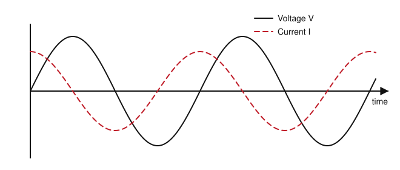
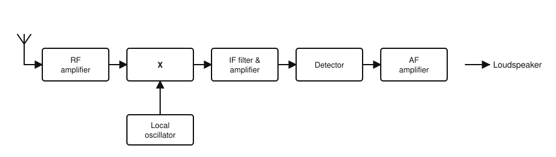
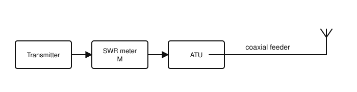

# IRTS HAREC Practice Exam — Set 4

60 questions · 2 hours · pass mark 60% **in each section** (at least 18/30 in Section A and 18/30 in Section B).
Only ONE answer is correct for each question. Answers and short explanations are at the end.

> Unofficial practice paper based on the IRTS HAREC Exam Syllabus (Rev 2.0.2), the IRTS Sample Exam Paper 2022 and the IRTS HAREC Study Guide (4.0.3).
> Page numbers in the answer key are the **printed** page numbers of the Study Guide; in a PDF viewer, add 24 (e.g. p. 343 is PDF page 367).

---

## Section A: Technical

### A.1 Safety (5 questions)

**1.** A 300 W device runs from the 230 V mains. Which plug fuse gives the highest level of protection?

- A) 3 A
- B) 5 A
- C) 13 A
- D) 1 kA

**2.** When you have to make adjustments to live high-voltage equipment, you should:

- A) Use both hands for a firm grip
- B) Keep one hand behind your back and make sure the other hand is not grounded
- C) Wear a metal watch to earth yourself
- D) Stand on a wet floor for better earthing

**3.** Which is good practice when soldering?

- A) Work in a closed, unventilated room
- B) Breathe in the flux fumes to check that the solder is flowing
- C) Avoid eye protection, which fogs up
- D) Work in a well-ventilated area and consider lead-free (RoHS-compliant) solder

**4.** For a tall tower in an area where lightning is a concern, good practice includes:

- A) Leaving the tower unconnected to earth
- B) Bringing the lightning protection inside the shack
- C) Connecting each leg to its own ground rod, with the rods bonded together
- D) Using a plastic tower

**5.** The ICNIRP exposure limits are lowest (most stringent) for:

- A) Members of the general public
- B) Occupationally exposed workers
- C) Radio amateurs only
- D) Animals only

### A.2 Interference and Immunity (4 questions)

**6.** Which EU directive deals with the electromagnetic compatibility (emissions and immunity) of electrical equipment?

- A) The RoHS Directive
- B) The EMC Directive
- C) The Low Voltage Directive only
- D) The ICNIRP Directive

**7.** Cross-modulation is:

- A) The deliberate modulation of a transmitter
- B) Harmonic radiation from a transmitter
- C) A low SWR condition
- D) The modulation of a wanted signal by a strong unwanted signal in a receiver

**8.** Interference reaches a neighbour's equipment through the mains wiring. A suitable remedy is:

- A) A mains filter and/or ferrite chokes on the mains lead
- B) A longer antenna
- C) A higher-gain antenna pointed at the house
- D) Increasing the transmitter power

**9.** Many EMC problems in and around the shack are related to excessive:

- A) Antenna gain
- B) Feeder length
- C) Common-mode currents travelling along the transmission line
- D) Mains voltage

### A.3 Electrical, Electromagnetic, and Radio Theory (4 questions)

**10.** A current of 2 A flows through a resistor with 10 V across it. The resistance is:

- A) 20 Ω
- B) 0.2 Ω
- C) 12 Ω
- D) 5 Ω

**11.** How long will a 100 W device take to use 1 kWh of energy?

- A) 1 hour
- B) 10 hours
- C) 100 hours
- D) 0.1 hour

**12.** An absolute power of 14 dBW is approximately:

- A) 25 W
- B) 14 W
- C) 50 W
- D) 140 W

**13.** A square wave consists of:

- A) A single sine wave
- B) Only even harmonics
- C) A fundamental plus its odd harmonics
- D) Random noise

### A.4 Components and Circuits (3 questions)

**14.** In a steady DC circuit, an ideal inductor behaves like:

- A) An open circuit
- B) A short circuit (very low resistance)
- C) A capacitor
- D) A diode

**15.** The figure shows the voltage V (solid) and current I (dashed) in an AC circuit. What kind of circuit is it?

- A) A pure resistance
- B) A pure inductance
- C) A series LC circuit at resonance
- D) A pure capacitance

**16.** The main advantage of a quartz crystal oscillator is:

- A) Excellent frequency stability
- B) Wide tuning range
- C) High output power
- D) No need for a power supply

### A.5 Transmitters and Receivers (4 questions)

**17.** In the superheterodyne receiver block diagram, what is the block marked "X"?

- A) Detector
- B) IF amplifier
- C) Mixer
- D) AGC

**18.** Key clicks from a CW transmitter can be reduced by:

- A) Increasing the transmitter power
- B) Shaping the keying so the rise and fall times are not too fast
- C) Using a higher SWR
- D) Removing the low-pass filter

**19.** The selectivity of a receiver is its ability to:

- A) Separate the wanted signal from signals on adjacent frequencies
- B) Receive very weak signals
- C) Reject mains hum
- D) Produce loud audio

**20.** In an SDR receiver, the component that converts the analogue signal into digital samples is the:

- A) DAC
- B) BFO
- C) VFO
- D) ADC

### A.6 Antennas and Transmission Lines (4 questions)

**21.** Waveguides are typically used as feeders at:

- A) LF
- B) MF
- C) Microwave frequencies
- D) HF only

**22.** The purpose of traps in a trap dipole is to:

- A) Allow operation on more than one band
- B) Increase the power handling
- C) Make the antenna directional
- D) Protect against lightning

**23.** An antenna gain of 0 dBd (half-wave dipole reference) is equal to about:

- A) 0 dBi
- B) 2.15 dBi
- C) 3 dBi
- D) −2.15 dBi

**24.** In the station shown, the ATU has been adjusted until meter M reads an SWR of 1:1. What does this tell you?

- A) The SWR on the coax to the antenna is also 1:1
- B) The antenna is resonant
- C) There is no loss in the coax
- D) The transmitter sees a matched load, but the SWR on the coax between the ATU and the antenna may still be high

### A.7 Propagation (4 questions)

**25.** At night, the D layer:

- A) Largely disappears, reducing absorption on the lower HF and MF bands
- B) Becomes stronger
- C) Merges with the F2 layer
- D) Reflects VHF signals

**26.** Space wave (line-of-sight) propagation is the main mode used on:

- A) 160 m
- B) 80 m
- C) VHF and UHF
- D) 40 m

**27.** Signals received via auroral scatter typically:

- A) Are perfectly clear
- B) Have a distorted, rasping or buzzing tone
- C) Arrive only from the south
- D) Occur only on 160 m

**28.** In EME (Earth–Moon–Earth) communication:

- A) Signals are reflected by the F2 layer
- B) Signals travel along the ground
- C) Signals are ducted in the troposphere
- D) The Moon is used as a passive reflector

### A.8 Measurements (2 questions)

**29.** To measure current with a multimeter you should:

- A) Select the current range and connect the meter in series with the circuit
- B) Select the voltage range and connect it in parallel
- C) Select the resistance range and connect it across the supply
- D) Connect the meter directly across the supply on the current range

**30.** The RMS value of a sine wave with a 100 V peak is about:

- A) 50 V
- B) 141 V
- C) 70.7 V
- D) 200 V

---

## Section B: Operating Rules, Procedures, and Regulations

### B.1 Phonetic Alphabet (1 question)

**31.** The ITU phonetic word for the letter Q is:

- A) Queen
- B) Quebec
- C) Quick
- D) Quarter

### B.2 Q-Codes (3 questions)

**32.** "QRO" (as a statement or instruction) means:

- A) Decrease your power
- B) I am busy
- C) Increase your power
- D) Stop transmitting

**33.** "QRZ?" means:

- A) Who is calling me?
- B) What is my readability?
- C) Are you ready?
- D) Shall I change frequency?

**34.** "QRS" (as an instruction) means:

- A) Send faster
- B) Stop sending
- C) Send more power
- D) Send more slowly

### B.3 International Distress Signs, Emergency Traffic and Natural Disaster Communications (3 questions)

**35.** You hear emergency traffic but you are not able to help. You should:

- A) Change frequency immediately and forget about it
- B) Not leave the frequency until you are sure you cannot help or someone else is helping, and not transmit unless you can help
- C) Call CQ to find someone else
- D) Transmit to tell the station you cannot help

**36.** 3.760 MHz is:

- A) The Irish 80 m emergency centre of activity
- B) The 80 m QRP centre of activity
- C) The IARU Region 1 80 m emergency centre of activity (Ireland uses 3.660 MHz)
- D) A propagation beacon frequency

**37.** Using 7.115 MHz for a normal QSO is:

- A) Allowed if it is not in use and no well-publicised emergency is in progress
- B) Never allowed
- C) Allowed only with ComReg permission
- D) Allowed only in contests

### B.4 Call Signs (3 questions)

**38.** In the normal ITU format, the first section of a call sign (the nationality part):

- A) Must be exactly three letters
- B) Must contain only numbers
- C) Must end in a number
- D) Has one or two characters, at least one of which is a letter

**39.** Which of these is a special event call sign of the type ComReg may issue?

- A) EI5ABC/P
- B) EI90IRTS
- C) EI5ABC/QRP
- D) EJ/EI5ABC

**40.** The prefix for Belgium is:

- A) ON
- B) BE
- C) OB
- D) BL

### B.5 Radio Spectrum Allocation in Ireland and IARU Band Plans (4 questions)

**41.** The band edges of the 15 m band in Ireland are:

- A) 21.000–21.350 MHz
- B) 21.050–21.450 MHz
- C) 21.000–21.450 MHz
- D) 21.000–21.500 MHz

**42.** The power limit in the contiguous part of the 60 m band (5.3515–5.3665 MHz) is:

- A) 400 W PEP
- B) 100 W PEP
- C) 10 W PEP
- D) 15 W EIRP

**43.** Which bands are allocated to amateurs in Ireland on a SECONDARY basis?

- A) 5 MHz, 10 MHz, 50 MHz and 70 MHz
- B) 3.5 MHz, 7 MHz, 14 MHz and 21 MHz
- C) 144 MHz and 430 MHz
- D) 1.8 MHz and 28 MHz

**44.** Taking the IARU R1 plan into account, the lowest dial setting for LSB voice on 80 m is:

- A) 3500 kHz
- B) 3603 kHz
- C) 3600 kHz
- D) 3570 kHz

### B.6 Social Responsibility of Radio Amateur Operation and the Code of Conduct (3 questions)

**45.** A long, chatty conversation on the air is known as a:

- A) Pile-up
- B) Sked
- C) Ragchew
- D) Net

**46.** Who deals with breaches of amateur radio laws and regulations?

- A) The IARU
- B) The IRTS
- C) Any experienced radio amateur
- D) Only the authorities (e.g. ComReg)

**47.** How should you start a transmission to a friend?

- A) With call signs, e.g. "EI6XYZ from EI5ABC", not "Hello Mike, this is Louis"
- B) With first names only
- C) With your nickname
- D) With music to attract attention

### B.7 Operating Procedures and Non-Interference (5 questions)

**48.** The readability value R3 means:

- A) Unreadable
- B) Readable with considerable difficulty
- C) Perfectly readable
- D) Barely readable

**49.** You are EI6XYZ, answering a Morse CQ from EI5ABC. A correct reply is:

- A) CQ CQ DE EI6XYZ K
- B) EI6XYZ DE EI5ABC K
- C) EI5ABC DE EI6XYZ KN
- D) QRZ? QRZ?

**50.** "SKED" means:

- A) Static
- B) Skip distance
- C) Sky wave
- D) A scheduled contact, planned in advance

**51.** At the end of a Morse CQ call, the letter K means:

- A) An invitation to transmit
- B) Kilowatt
- C) End of contact
- D) Keep off the frequency

**52.** You buy a radio transmitter online and it causes interference to other services. Who is legally responsible for non-interference?

- A) The seller
- B) The manufacturer
- C) You, the licensee
- D) ComReg

### B.8 ITU Radio Regulations (2 questions)

**53.** A primary allocation to the amateur service means:

- A) Amateurs must give way to all other users
- B) Amateurs can only use it at weekends
- C) The band is shared with broadcasters
- D) Amateurs have priority and can claim protection from harmful interference from secondary users

**54.** The emission designator J2B covers modes such as:

- A) AM speech
- B) RTTY or PSK31 generated via an SSB transmitter (telegraphy for automatic reception)
- C) FM speech
- D) Morse by ear

### B.9 CEPT Regulations (3 questions)

**55.** A HAREC certificate allows the holder to:

- A) Obtain a licence in another participating country where they have a permanent address
- B) Operate without any licence anywhere in Europe
- C) Broadcast to the public
- D) Operate on any frequency

**56.** An Irish licensee visiting the Isle of Man under CEPT arrangements uses the prefix:

- A) GD/
- B) IM/
- C) MD/
- D) M/

**57.** An Irish licensee EI5ABC visiting the state of Illinois in the USA (call area 9) would sign:

- A) EI5ABC/W9
- B) W9/EI5ABC
- C) USA/EI5ABC
- D) K/EI5ABC/9

### B.10 Irish Laws, Regulations, and Licence Conditions (3 questions)

**58.** An Irish Amateur Station Licence can be cancelled:

- A) By the IRTS
- B) Automatically after 5 years
- C) By a neighbour's complaint
- D) At the written request of the licensee

**59.** Before operating maritime mobile, you need approval from:

- A) The ship's Master or owner
- B) The IRTS
- C) The harbour master only
- D) No one

**60.** The maximum land mobile (/M) power on the 80 m band is:

- A) 400 W
- B) 10 W
- C) 50 W (17 dBW)
- D) 25 W

---

## Answer Key

| Q | Ans | Explanation (Study Guide page) |
|---|-----|-------------|
| 1 | A | 300/230 ≈ 1.3 A, so 3 A (p. 297) |
| 2 | B | One hand behind your back (p. 293) |
| 3 | D | Ventilation; RoHS/lead-free (p. 300) |
| 4 | C | Separate ground rods per leg, bonded together (p. 300) |
| 5 | A | General public limits are stricter (p. 302) |
| 6 | B | EMC Directive 2014/30/EU (p. 283) |
| 7 | D | Definition of cross-modulation (p. 205) |
| 8 | A | Mains filtering and chokes (p. 285) |
| 9 | C | Common-mode currents re-radiate along the line (p. 284) |
| 10 | D | R = V/I = 10/2 = 5 Ω (p. 22) |
| 11 | B | 1000 Wh / 100 W = 10 h (p. 26) |
| 12 | A | 14 dBW ≈ 25 W (p. 118) |
| 13 | C | Fundamental + odd harmonics (p. 49) |
| 14 | B | Inductors pass DC (p. 104) |
| 15 | D | I peaks a quarter cycle before V: the current leads, so the circuit is capacitive (p. 98) |
| 16 | A | Stability (p. 113) |
| 17 | C | X combines the RF and local oscillator signals: the mixer (p. 188) |
| 18 | B | Envelope shaping (p. 162) |
| 19 | A | Definition of selectivity (p. 202) |
| 20 | D | ADC = analogue-to-digital converter (p. 199) |
| 21 | C | Microwave (p. 249) |
| 22 | A | Multiband operation (p. 238) |
| 23 | B | 0 dBd = 2.15 dBi (p. 250) |
| 24 | D | The ATU only matches on its transmitter side (p. 220) |
| 25 | A | The D layer fades after sunset (p. 260) |
| 26 | C | VHF/UHF (p. 261) |
| 27 | B | Aurora gives a raspy tone (p. 267) |
| 28 | D | The Moon reflects the signal (p. 268) |
| 29 | A | Series connection on the current range (p. 273) |
| 30 | C | 100 × 0.707 = 70.7 V (p. 38) |
| 31 | B | Quebec (p. 335) |
| 32 | C | QRO = increase power (p. 346) |
| 33 | A | Who is calling me? (p. 347) |
| 34 | D | Send slower (p. 346) |
| 35 | B | IARU/AREN emergency measures (p. 354) |
| 36 | C | 3.760 is the IARU R1 centre; Ireland uses 3.660 (p. 339) |
| 37 | A | Allowed with care (p. 344) |
| 38 | D | 1–2 characters, at least one letter (p. 336) |
| 39 | B | Distinctive special event call sign (p. 329) |
| 40 | A | Belgium = ON (p. 323) |
| 41 | C | 21.000–21.450 MHz (p. 343) |
| 42 | D | 15 W EIRP (p. 343) |
| 43 | A | 5, 10, 50 and 70 MHz (p. 341) |
| 44 | B | 3600 + ~2.7 kHz LSB bandwidth → 3603 kHz (p. 342) |
| 45 | C | Ragchew (p. 358) |
| 46 | D | Only the authorities (p. 357) |
| 47 | A | Identify with call signs (p. 359) |
| 48 | B | R3 (p. 368) |
| 49 | C | Their call, DE, your call, KN (p. 366) |
| 50 | D | SKED = scheduled contact (p. 365) |
| 51 | A | K = invitation to transmit (p. 364) |
| 52 | C | The licensee (p. 370) |
| 53 | D | Priority and protection (p. 316) |
| 54 | B | J2B = SSB-generated telegraphy, e.g. RTTY/PSK31 (p. 317) |
| 55 | A | Purpose of HAREC (p. 320) |
| 56 | C | Isle of Man = MD/ (p. 324) |
| 57 | B | USA: regional prefix before the call sign (p. 323) |
| 58 | D | Written request (p. 328) |
| 59 | A | Ship's Master/owner (p. 330) |
| 60 | C | 50 W on /M (with lower limits on 160 m above 1.850, 60 m and 4 m) (p. 329) |
