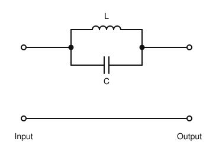
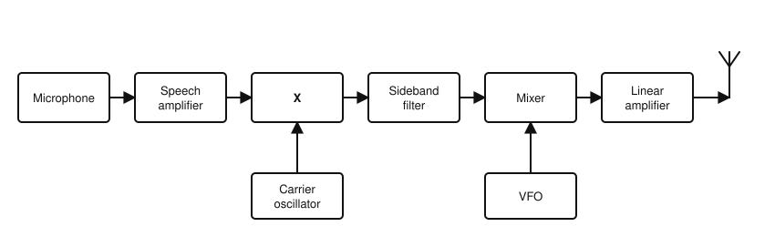
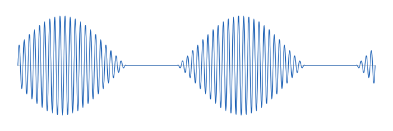

# IRTS HAREC Practice Exam — Set 5

60 questions · 2 hours · pass mark 60% **in each section** (at least 18/30 in Section A and 18/30 in Section B).
Only ONE answer is correct for each question. Answers and short explanations are at the end.

> Unofficial practice paper based on the IRTS HAREC Exam Syllabus (Rev 2.0.2), the IRTS Sample Exam Paper 2022 and the IRTS HAREC Study Guide (4.0.3).
> Page numbers in the answer key are the **printed** page numbers of the Study Guide; in a PDF viewer, add 24 (e.g. p. 343 is PDF page 367).

---

## Section A: Technical

### A.1 Safety (5 questions)

**1.** In a mains AC plug, the fuse should be fitted:

- A) In the neutral lead
- B) In the live lead
- C) In the earth lead
- D) In both the neutral and earth leads

**2.** Valve power amplifiers should have micro-switches (interlocks) that:

- A) Turn on the cooling fan
- B) Switch the antenna relay
- C) Measure the anode current
- D) Disconnect the high-voltage supply when the cover is removed

**3.** When installing a mobile station in a car, good practice is to:

- A) Fit fuses in both the positive and negative battery leads
- B) Connect directly to the battery without fuses
- C) Make band changes while driving
- D) Leave equipment loose so it can be moved easily

**4.** Towers and masts should be located at least ______ away from nearby power lines, people and property.

- A) 1 m
- B) Their own height
- C) Twice their own height
- D) 100 m regardless of height

**5.** The electric and magnetic fields around an antenna are strongest and hardest to measure in the:

- A) Radiating far field
- B) Reactive near field
- C) Radiating near field
- D) Ionosphere

### A.2 Interference and Immunity (4 questions)

**6.** Parasitic oscillations in a transmitter are:

- A) The wanted carrier
- B) Harmonics produced deliberately
- C) Unwanted oscillations, often at frequencies unrelated to the operating frequency
- D) Sidebands of an SSB signal

**7.** Interference that enters a piece of equipment by direct radiation (not via cables) is best reduced by:

- A) Using a longer mains cable
- B) A low-pass filter on the antenna
- C) Increasing the volume
- D) Better shielding of the affected equipment

**8.** A telephone picks up your transmissions (audio detection). A suitable remedy is:

- A) Increase power so the signal is clearer
- B) Fit RF filters or ferrite chokes on the telephone lines close to the phone
- C) Replace your coax with open-wire line
- D) Remove your station earth

**9.** A TV receiver suffers interference from your HF transmissions picked up by its antenna. A suitable filter at the TV input is:

- A) A high-pass filter
- B) A low-pass filter
- C) An HF band-pass filter
- D) An audio filter

### A.3 Electrical, Electromagnetic, and Radio Theory (4 questions)

**10.** Two 6 V, 10 Ah batteries are connected in parallel. The result is:

- A) 12 V, 10 Ah
- B) 12 V, 20 Ah
- C) 6 V, 20 Ah
- D) 3 V, 10 Ah

**11.** The terminal voltage of a battery falls when a heavy load is connected because:

- A) Some of the EMF is dropped across the battery's internal resistance
- B) The EMF increases
- C) The battery changes to AC
- D) The load generates a back EMF

**12.** The minimum sampling rate needed to digitise audio up to 3 kHz without aliasing is:

- A) 1.5 kHz
- B) 3 kHz
- C) 4.5 kHz
- D) 6 kHz

**13.** A change of −3 dB corresponds to a power ratio of about:

- A) 0.1
- B) 0.5
- C) 2
- D) 0.25

### A.4 Components and Circuits (3 questions)

**14.** L and C in the circuit shown are resonant at frequency f₀. Ignoring losses, signals at f₀:

- A) Pass through readily
- B) Pass only above f₀
- C) Are blocked (the parallel LC acts as a rejector)
- D) Are doubled in frequency

**15.** Increasing the area of the plates of a capacitor:

- A) Increases its capacitance
- B) Decreases its capacitance
- C) Has no effect on capacitance
- D) Turns it into an inductor

**16.** The three terminals of a bipolar junction transistor (BJT) are:

- A) Gate, drain, source
- B) Anode, cathode, grid
- C) Primary, secondary, tap
- D) Base, collector, emitter

### A.5 Transmitters and Receivers (4 questions)

**17.** In an FM receiver, the stage that recovers the audio is the:

- A) Product detector
- B) Discriminator (FM demodulator)
- C) BFO
- D) Balanced modulator

**18.** Compared with a low intermediate frequency, a high IF gives:

- A) Better selectivity at all times
- B) Lower noise
- C) Better image rejection
- D) No need for a mixer

**19.** The block diagram shows an SSB transmitter. What is the block marked "X"?

- A) Balanced modulator
- B) Frequency multiplier
- C) Discriminator
- D) SWR meter

**20.** Which mode places the greatest continuous duty on a transmitter's power amplifier?

- A) SSB voice
- B) CW
- C) Silence on SSB
- D) FM (constant full carrier)

### A.6 Antennas and Transmission Lines (4 questions)

**21.** The velocity factor of a transmission line is:

- A) The ratio of the speed of the wave in the line to its speed in free space
- B) The line's characteristic impedance
- C) The loss per 100 m
- D) The SWR

**22.** The main advantage of open-wire (ladder) line over coax is:

- A) Immunity to nearby metal
- B) It can be buried
- C) Lower loss, even with high SWR
- D) It is unbalanced

**23.** An antenna that is shorter than its resonant length shows at its feed point:

- A) Inductive reactance
- B) Capacitive reactance
- C) Zero reactance
- D) Infinite resistance

**24.** The horizontal radiation pattern of a horizontal half-wave dipole in free space is:

- A) Omnidirectional
- B) Cardioid
- C) A single narrow beam off one end
- D) A figure-of-eight, with maximum radiation broadside to the wire

### A.7 Propagation (4 questions)

**25.** The Lowest Usable Frequency (LUF) on an HF path is mainly set by:

- A) F2-layer height
- B) D-layer absorption
- C) Tropospheric ducting
- D) Meteor showers

**26.** Fading on HF sky-wave signals is commonly caused by:

- A) Signals arriving by several paths with changing phase (multipath)
- B) A low SWR
- C) The transmitter's low-pass filter
- D) Ground-wave absorption only

**27.** The main propagation mechanism for VHF and UHF signals is:

- A) Ground wave
- B) F2-layer sky wave
- C) D-layer reflection
- D) Line-of-sight

**28.** Why is long-distance communication on 160 m mainly possible at night?

- A) The F2 layer disappears
- B) The Sun heats the ground
- C) The D layer, which absorbs these frequencies in daytime, disappears
- D) Sporadic E occurs only at night

### A.8 Measurements (2 questions)

**29.** A directional SWR meter measures:

- A) Frequency
- B) Forward and reflected power (or voltage) on the line
- C) Mains voltage
- D) Antenna gain

**30.** The oscilloscope trace shows the RF output of an AM transmitter. It shows:

- A) Overmodulation
- B) Correct modulation (below 100%)
- C) An unmodulated carrier
- D) An FM signal

---

## Section B: Operating Rules, Procedures, and Regulations

### B.1 Phonetic Alphabet (1 question)

**31.** The number 3 is pronounced according to the ICAO recommendation as:

- A) THREE
- B) TERRA
- C) TREE
- D) THIRD

### B.2 Q-Codes (3 questions)

**32.** "QSO" means:

- A) A radio contact (I can communicate with...)
- B) Your signals are fading
- C) Stop transmitting
- D) Change frequency

**33.** "QRT" means:

- A) Decrease power
- B) Send faster
- C) I am ready
- D) Stop transmitting

**34.** "QRU?" means:

- A) Who is calling me?
- B) Have you anything for me?
- C) Are you busy?
- D) What is your location?

### B.3 International Distress Signs, Emergency Traffic and Natural Disaster Communications (3 questions)

**35.** The distress signal SOS should be used by an amateur:

- A) Spoken by voice on phone
- B) For any urgent message
- C) In radiotelegraphy (e.g. Morse) when there is grave and imminent danger to life
- D) As a test of the emergency net

**36.** In emergency communications, a "served agency" is:

- A) Any organisation which may request emergency communication assistance from you
- B) Only ComReg
- C) The IRTS
- D) Your local radio club

**37.** A communication emergency exists when:

- A) A repeater is out of service
- B) There is a contest in progress
- C) The bands are closed
- D) A critical communication system failure puts the public at risk

### B.4 Call Signs (3 questions)

**38.** A licensed Danish amateur, OZ5ABC, visits mainland Ireland under CEPT arrangements. Their call sign is:

- A) OZ5ABC/EI
- B) EI/OZ5ABC
- C) EJ/OZ5ABC
- D) EI5ABC

**39.** An Irish licensee's call sign may change:

- A) Every 5 years
- B) When they move house
- C) Whenever they ask
- D) Only when changing from a CEPT Class 2 to a CEPT Class 1 licence

**40.** The prefix for Poland is:

- A) PL
- B) PO
- C) SP
- D) OK

### B.5 Radio Spectrum Allocation in Ireland and IARU Band Plans (4 questions)

**41.** The band edges of the 10 m band in Ireland are:

- A) 28.000–29.700 MHz
- B) 28.000–30.000 MHz
- C) 27.000–29.700 MHz
- D) 28.500–29.700 MHz

**42.** Which of these bands does NOT contain an emergency centre of activity used in Ireland?

- A) 80 m
- B) 40 m
- C) 2 m
- D) 10 m

**43.** The beacon-exclusive range on the 2 m band is:

- A) 144.000–144.100 MHz
- B) 144.400–144.490 MHz
- C) 145.500–145.600 MHz
- D) 144.800–144.850 MHz

**44.** If ComReg's guidelines and the IARU R1 band plan conflict:

- A) The IARU plan takes precedence
- B) The operator chooses
- C) The ComReg guidelines take precedence
- D) Neither applies

### B.6 Social Responsibility of Radio Amateur Operation and the Code of Conduct (3 questions)

**45.** The most widely used language in international amateur radio is:

- A) English
- B) French
- C) Esperanto
- D) Morse only

**46.** Should you reply to a "CQ DX" call from a station that is not DX for you?

- A) Yes, always
- B) No — reply only if you are DX to the calling station
- C) Yes, but only with high power
- D) Only on weekends

**47.** When spelling words on the air, you should:

- A) Make up amusing phonetic words
- B) Mix different phonetic alphabets for variety
- C) Avoid phonetics altogether
- D) Use the standard phonetic alphabet consistently

### B.7 Operating Procedures and Non-Interference (5 questions)

**48.** On HF, a commonly used S-meter should read S9 with an input of about:

- A) 5 µV
- B) 500 µV
- C) 50 µV
- D) 5 V

**49.** You have arranged a sked with OM2ABC. On phone, the correct call is:

- A) "OM2ABC OM2ABC OM2ABC from EI5ABC EI5ABC EI5ABC calling on sked and listening for you"
- B) "CQ CQ CQ from EI5ABC"
- C) "CQ OM2ABC from EI5ABC"
- D) "EI5ABC calling OM2ABC" without repeating

**50.** During a QSO, it is better to make:

- A) Very long transmissions so the other station can relax
- B) Short transmissions, which make it easier for the other station to comment
- C) Transmissions of at least 10 minutes
- D) Only one transmission each

**51.** In Ireland, the legal prohibition on causing harmful interference to other spectrum users comes from:

- A) The IARU Ethics guide only
- B) The ITU Constitution only
- C) The CEPT T/R 61-01 recommendation
- D) The Wireless Telegraphy (Amateur Station Licence) Regulations 2009

**52.** When the other station hands over to you, it is a good habit to:

- A) Start transmitting immediately
- B) Change frequency
- C) Wait a brief moment to check whether someone else wants to join or use the frequency
- D) Call CQ

### B.8 ITU Radio Regulations (2 questions)

**53.** The ITU is:

- A) A European regulator
- B) The United Nations agency for information and communication technologies
- C) The international amateur radio union
- D) The Irish regulator

**54.** The emission designator F1B covers:

- A) Frequency-shift keyed telegraphy for automatic reception, e.g. RTTY
- B) FM speech
- C) AM speech
- D) Television

### B.9 CEPT Regulations (3 questions)

**55.** Under CEPT T/R 61-01, an Irish CEPT Class 2 licence is:

- A) Not recognised abroad
- B) Recognised only in the UK
- C) Valid only with Morse proficiency
- D) Treated as a CEPT licence, just like Class 1

**56.** An Irish licensee visiting Jersey under CEPT arrangements uses the prefix:

- A) MJ/
- B) GJ/
- C) JY/
- D) J/

**57.** Which non-European countries have implemented T/R 61-01, allowing Irish CEPT licence holders to operate during short visits?

- A) None
- B) China and India
- C) Countries including the USA and Canada
- D) Only Australia

### B.10 Irish Laws, Regulations, and Licence Conditions (3 questions)

**58.** Which item MUST be recorded in the station logbook?

- A) The name of the other operator
- B) The frequency band used
- C) The signal reports
- D) The weather

**59.** Maritime mobile operation is NOT permitted on:

- A) 160 m
- B) 40 m
- C) 20 m
- D) 2 m

**60.** Licence conditions require the licensee to have:

- A) A linear amplifier
- B) A tower at least 10 m high
- C) A computer logbook
- D) A device capable of measuring SWR

---

## Answer Key

| Q | Ans | Explanation (Study Guide page) |
|---|-----|-------------|
| 1 | B | Fuse in the live lead (p. 298) |
| 2 | D | Interlocks disconnect the HV (p. 298) |
| 3 | A | Fuse both battery leads (p. 299) |
| 4 | C | Twice their height (p. 299) |
| 5 | B | Reactive near field (p. 303) |
| 6 | C | Definition of parasitic oscillations (p. 290) |
| 7 | D | Shielding (p. 286) |
| 8 | B | Filter/choke at the affected equipment (p. 285) |
| 9 | A | HPF passes TV and blocks HF (p. 286) |
| 10 | C | Parallel: same voltage, capacities add (p. 18) |
| 11 | A | Internal resistance (p. 17) |
| 12 | D | Nyquist: 2 × 3 kHz (p. 61) |
| 13 | B | −3 dB ≈ half power (p. 116) |
| 14 | C | Parallel LC in series with the signal path = rejector (band-stop) (p. 103) |
| 15 | A | Larger plates mean more capacitance (p. 93) |
| 16 | D | Base, collector, emitter (p. 122) |
| 17 | B | FM discriminator (p. 195) |
| 18 | C | Image is 2 × IF away, so easier to reject (p. 203) |
| 19 | A | The balanced modulator combines the speech and the carrier, suppressing the carrier (p. 177) |
| 20 | D | FM has a 100% duty carrier (p. 147) |
| 21 | A | Definition of velocity factor (p. 208) |
| 22 | C | Low loss (p. 209) |
| 23 | B | Too short = capacitive (p. 234) |
| 24 | D | Figure-of-eight (p. 232) |
| 25 | B | D-layer absorption sets the LUF (p. 271) |
| 26 | A | Multipath (p. 269) |
| 27 | D | Range is extended with repeaters (p. 266) |
| 28 | C | The D layer is gone at night (p. 259) |
| 29 | B | Forward/reflected (p. 274) |
| 30 | A | The envelope is pinched to zero with flat gaps (p. 277) |
| 31 | C | TREE (p. 335) |
| 32 | A | QSO (p. 347) |
| 33 | D | QRT (p. 347) |
| 34 | B | QRU? (p. 346) |
| 35 | C | SOS for telegraphy; MAYDAY for voice (p. 350) |
| 36 | A | Definition of a served agency (p. 352) |
| 37 | D | Definition of a communication emergency (p. 352) |
| 38 | B | EI/ on the mainland (EJ/ on islands) (p. 322) |
| 39 | D | Only on moving from Class 2 to Class 1 (p. 336) |
| 40 | C | Poland = SP (p. 323) |
| 41 | A | 28.000–29.700 MHz (p. 343) |
| 42 | D | No emergency CoA on 10 m (p. 343) |
| 43 | B | 144.400–144.490 MHz (p. 344) |
| 44 | C | ComReg prevails (p. 338) |
| 45 | A | English (p. 358) |
| 46 | B | Only if you are DX to them (p. 364) |
| 47 | D | Standard phonetics (p. 358) |
| 48 | C | 50 µV on HF (5 µV on VHF/UHF) (p. 369) |
| 49 | A | Sked call format (p. 365) |
| 50 | B | Short overs (p. 361) |
| 51 | D | Wireless Telegraphy Regs 2009 (p. 370) |
| 52 | C | Pause before transmitting (p. 361) |
| 53 | B | UN agency (p. 314) |
| 54 | A | F1B = FSK telegraphy (p. 317) |
| 55 | D | Both classes are CEPT licences (p. 320) |
| 56 | A | Jersey = MJ/ (p. 324) |
| 57 | C | USA, Canada and others (p. 320) |
| 58 | B | Band (also date, UTC times, mode, power, call sign) (p. 331) |
| 59 | A | No /MM on 160 m (p. 330) |
| 60 | D | SWR-measuring device (p. 332) |
