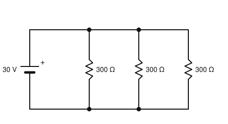
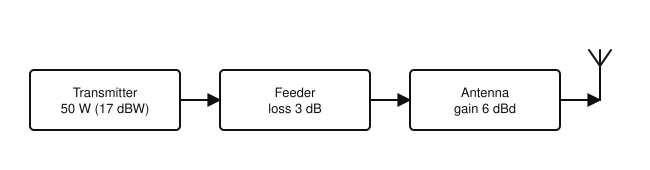
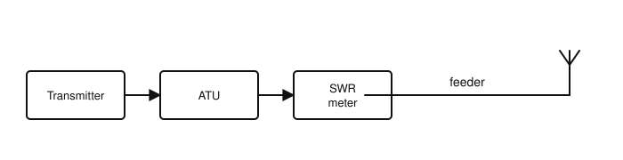

# IRTS HAREC Practice Exam — Set 7

60 questions · 2 hours · pass mark 60% **in each section** (at least 18/30 in Section A and 18/30 in Section B).
Only ONE answer is correct for each question. Answers and short explanations are at the end.

> Unofficial practice paper based on the IRTS HAREC Exam Syllabus (Rev 2.0.2), the IRTS Sample Exam Paper 2022 and the IRTS HAREC Study Guide (4.0.3).
> Page numbers in the answer key are the **printed** page numbers of the Study Guide; in a PDF viewer, add 24 (e.g. p. 343 is PDF page 367).

---

## Section A: Technical

### A.1 Safety (5 questions)

**1.** A transceiver power supply draws 800 W from the 230 V mains. Which plug fuse gives the best protection?

- A) 3 A
- B) 5 A
- C) 13 A
- D) 20 A

**2.** Why is an RCD important even when a circuit is protected by a fuse or MCB?

- A) It increases the voltage
- B) It replaces the earth connection
- C) A lethal current of about 50 mA to earth would not blow a fuse or trip an MCB, but would trip an RCD
- D) It filters RF interference

**3.** Before working on powered equipment you should remove:

- A) Watches, rings, necklaces and other jewellery that could cause a short circuit
- B) Your shoes
- C) The station earth
- D) The fuses from the mains plug

**4.** When thunderstorms are forecast, good practice is to:

- A) Increase power to get through the static
- B) Leave everything connected
- C) Disconnect the feeders inside the shack only
- D) Disconnect and earth the antenna feeders, preferably outside the building

**5.** If people are only present in the antenna's radiating far field, assessing EMF exposure is easier because:

- A) There are no fields at all
- B) The fields are predictable and can be estimated from the EIRP and distance
- C) Only the magnetic field exists
- D) The fields are stronger

### A.2 Interference and Immunity (4 questions)

**6.** Key clicks are heard:

- A) Either side of the CW signal's frequency
- B) Only on the second harmonic
- C) Only in the transmitter's own receiver
- D) Only when using FM

**7.** Interference to equipment via its antenna input is best tackled by:

- A) Reducing the length of the mains cable
- B) Earthing the transmitter's microphone
- C) Fitting a suitable filter at the affected receiver's antenna input
- D) Using CW only

**8.** The second harmonic of a 14.2 MHz signal is on:

- A) 7.1 MHz
- B) 21.3 MHz
- C) 42.6 MHz
- D) 28.4 MHz

**9.** Which neighbouring equipment is most likely to suffer interference from your transmitter?

- A) Equipment furthest from your antenna
- B) Equipment closest to your antenna, where the field strength is highest
- C) Battery-powered equipment in another town
- D) Equipment that is switched off

### A.3 Electrical, Electromagnetic, and Radio Theory (4 questions)

**10.** Kirchhoff's current law states that:

- A) The sum of currents entering a junction equals the sum of currents leaving it
- B) Voltage equals current times resistance
- C) Power equals voltage times current
- D) Current is the same in all parallel branches

**11.** Silicon is an example of a:

- A) Conductor
- B) Insulator
- C) Semiconductor
- D) Superconductor

**12.** An amplifier with 10 dB of gain feeds a cable with 3 dB of loss. The overall power ratio is about:

- A) 7
- B) 13
- C) 30
- D) 5

**13.** A spectrum display (frequency domain) shows:

- A) Voltage against time
- B) Signal amplitude against frequency
- C) Current against resistance
- D) Power against time only

### A.4 Components and Circuits (3 questions)

**14.** In the circuit shown, what current is drawn from the 30 V battery?

- A) 0.1 A
- B) 0.3 A
- C) 0.9 A
- D) 30 mA

**15.** If the frequency doubles, the reactance of an inductor:

- A) Doubles
- B) Halves
- C) Stays the same
- D) Quadruples

**16.** The peak inverse voltage (PIV) rating of a rectifier diode is:

- A) The forward voltage drop
- B) The maximum forward current
- C) The leakage current
- D) The maximum reverse voltage it can withstand

### A.5 Transmitters and Receivers (4 questions)

**17.** A 14 MHz signal is mixed with a 5 MHz local oscillator. The main mixer outputs are:

- A) 14 MHz and 5 MHz only
- B) 70 MHz
- C) 9 MHz and 19 MHz
- D) 2.8 MHz

**18.** The RF bandwidth of a well-shaped CW signal is about:

- A) 100–150 Hz
- B) 2.7 kHz
- C) 6 kHz
- D) 16 kHz

**19.** An FM signal has a peak deviation of 5 kHz and a modulating frequency of 2.5 kHz. The modulation index is:

- A) 0.5
- B) 12.5
- C) 7.5
- D) 2

**20.** The S meter in a receiver indicates:

- A) The SWR
- B) The relative strength of the received signal
- C) The transmitter power
- D) The audio frequency

### A.6 Antennas and Transmission Lines (4 questions)

**21.** For open-wire feeder, increasing the spacing between the conductors:

- A) Lowers the characteristic impedance
- B) Has no effect
- C) Raises the characteristic impedance
- D) Makes the line unbalanced

**22.** A high SWR on a feeder may result in:

- A) Increased feeder losses and possible damage to the transmitter
- B) More power reaching the antenna
- C) Better reception
- D) Reduced harmonics

**23.** On a resonant quarter-wave vertical, the current is maximum:

- A) At the top
- B) Halfway up
- C) On the tips of the radials
- D) At the base (feed point)

**24.** Using the figure, what is the ERP?

- A) 23 dBW (200 W)
- B) 20 dBW (100 W)
- C) 14 dBW (25 W)
- D) 26 dBW (400 W)

### A.7 Propagation (4 questions)

**25.** The E layer is at a height of about:

- A) 10 km
- B) 300 km
- C) 1000 km
- D) 100–120 km

**26.** The maximum distance of a single F2-layer hop is about:

- A) 4000 km
- B) 400 km
- C) 40 km
- D) 40000 km

**27.** HF propagation predictions are usually made:

- A) Using the transmitter's SWR
- B) Only by trial and error
- C) Using models based on solar indices (e.g. sunspot number or solar flux) and path geometry
- D) Using the local weather forecast

**28.** In the radiating far field of an antenna, when the distance doubles, the field strength:

- A) Is unchanged
- B) Halves
- C) Falls to a quarter
- D) Doubles

### A.8 Measurements (2 questions)

**29.** An ideal ammeter has:

- A) Infinite internal resistance
- B) A resistance of exactly 50 Ω
- C) As low an internal resistance as possible
- D) A resistance equal to the load

**30.** In the station shown, the SWR meter measures:

- A) The SWR on the feeder to the antenna
- B) The SWR between the transmitter and the ATU
- C) The mains voltage
- D) The antenna gain

---

## Section B: Operating Rules, Procedures, and Regulations

### B.1 Phonetic Alphabet (1 question)

**31.** In the call sign EI0SWL, the digit 0 is pronounced (ICAO):

- A) OH
- B) NULL
- C) NADAZERO
- D) ZE-RO

### B.2 Q-Codes (3 questions)

**32.** "QRK?" means:

- A) What is the readability of my signals?
- B) Are you busy?
- C) Shall I increase power?
- D) What is your location?

**33.** Your signal is reported as having "QSB". This means:

- A) Interference
- B) Static
- C) Fading
- D) Over-modulation

**34.** The abbreviation "DE" means:

- A) Delete
- B) From
- C) Destination
- D) Decrease

### B.3 International Distress Signs, Emergency Traffic and Natural Disaster Communications (3 questions)

**35.** You receive a distress message and do not know what else to do with it. You should:

- A) Ignore it
- B) Post it on social media
- C) Call CQ asking for help
- D) Pass it to the emergency services by calling 999 or 112

**36.** Which Principal Emergency Service coordinates maritime emergencies in Irish waters?

- A) The Irish Coast Guard
- B) The Fire Service
- C) Civil Defence
- D) The IRTS

**37.** Which of these is a Voluntary Emergency Service (VES)?

- A) An Garda Síochána
- B) The Health Services Executive
- C) The Irish Red Cross
- D) The Fire Service

### B.4 Call Signs (3 questions)

**38.** Which prefixes are used for the USA?

- A) U, S and A
- B) A, K, N and W
- C) VE
- D) US

**39.** A land mobile station must send its call sign and location:

- A) At the beginning and end of each contact, or every 30 minutes, whichever is more frequent
- B) Only once a day
- C) Every 5 minutes
- D) Only at the start of the first contact

**40.** The prefix for Norway is:

- A) NO
- B) OH
- C) OZ
- D) LA

### B.5 Radio Spectrum Allocation in Ireland and IARU Band Plans (4 questions)

**41.** The band edges of the 12 m band in Ireland are:

- A) 24.000–24.990 MHz
- B) 24.890–24.990 MHz
- C) 24.890–25.000 MHz
- D) 24.990–25.140 MHz

**42.** The power limit in the 432–440 MHz part of the 70 cm band is:

- A) 50 W
- B) 100 W
- C) 400 W (26 dBW)
- D) 25 W

**43.** Is maritime mobile operation permitted on the 6 m band?

- A) No
- B) Yes, at 10 W
- C) Yes, at 100 W
- D) Only in harbours

**44.** In the IARU R1 80 m band plan, 3570–3600 kHz is used for:

- A) CW only, contest preferred
- B) All modes, SSB contest preferred
- C) Beacons
- D) Narrow-band modes / digimodes

### B.6 Social Responsibility of Radio Amateur Operation and the Code of Conduct (3 questions)

**45.** Which joke should NOT be told on the air?

- A) A pun about antennas
- B) One you would not tell a ten-year-old child (bathroom humour)
- C) A joke about propagation
- D) A joke about your own mistakes

**46.** Many people may be listening to your transmissions. This means you should:

- A) Speak in code
- B) Use high power
- C) Remain polite and in control of your language and tone
- D) Avoid giving your call sign

**47.** Regarding Q-codes on phone (voice), the IARU guidance is to:

- A) Use Q-codes for every phrase
- B) Never use them
- C) Use them only in Morse
- D) Use a small number of common ones and avoid overusing them

### B.7 Operating Procedures and Non-Interference (5 questions)

**48.** R1 in a signal report means:

- A) Unreadable
- B) Perfectly readable
- C) Strength 1
- D) Tone 1

**49.** You are EI6XYZ, answering EI5ABC's phone CQ. A correct reply is:

- A) "CQ CQ from EI6XYZ"
- B) "Hello, who's calling?"
- C) "EI5ABC from EI6XYZ, over"
- D) "EI6XYZ from EI5ABC, over"

**50.** Broadcasting speech or music to the general public on the amateur bands is:

- A) Permitted at low power
- B) Not permitted
- C) Permitted on 2 m
- D) Permitted at weekends

**51.** Advertising your business on the air is:

- A) Encouraged for small businesses
- B) Allowed on HF only
- C) Allowed if the products are radio-related
- D) Not allowed — you may mention your profession but not advertise

**52.** Ending a Morse CQ with <AR> alone is:

- A) Not sufficient — it should be followed by K to invite others to transmit
- B) The recommended IARU format
- C) Required by ComReg
- D) Equivalent to KN

### B.8 ITU Radio Regulations (2 questions)

**53.** ITU Region 3 covers:

- A) Europe and Africa
- B) The Americas
- C) Asia east of and including Iran (excluding the former USSR) and most of Oceania
- D) The polar regions

**54.** The emission designator A3E describes:

- A) SSB speech
- B) AM speech (double sideband with carrier)
- C) FM speech
- D) CW

### B.9 CEPT Regulations (3 questions)

**55.** The CEPT T/R 61-01 arrangements apply to:

- A) Residents of the visited country
- B) Permanent emigrants
- C) Commercial operators
- D) Non-residents during a short temporary visit

**56.** An Irish licensee visiting Guernsey under CEPT arrangements uses the prefix:

- A) MU/
- B) GU/
- C) MG/
- D) G/

**57.** The prefix for Iceland is:

- A) IC
- B) IS
- C) TF
- D) OX

### B.10 Irish Laws, Regulations, and Licence Conditions (3 questions)

**58.** The Wireless Telegraphy (Amateur Station Licence) Regulations 2009 legally require the licensee to:

- A) Join the IRTS
- B) Have utmost regard for ComReg guidelines and observe good engineering practice
- C) Operate at least once a month
- D) Use only CE-marked equipment

**59.** To be issued a CEPT Class 1 licence (rather than Class 2), a HAREC holder must provide:

- A) Evidence of a Morse proficiency qualification
- B) Proof of 5 years' operating
- C) A recommendation from a club
- D) A higher exam mark

**60.** Unlike for land mobile, for maritime mobile operation the logbook must also include:

- A) The weather
- B) The names of the crew
- C) The ship's speed
- D) The geographic position

---

## Answer Key

| Q | Ans | Explanation (Study Guide page) |
|---|-----|-------------|
| 1 | B | 800/230 ≈ 3.5 A, so 5 A (p. 297) |
| 2 | C | Fuses/MCBs don't trip at tens of mA (p. 295) |
| 3 | A | Remove jewellery (p. 299) |
| 4 | D | Disconnect and earth, preferably outside (p. 300) |
| 5 | B | The far field is predictable (p. 303) |
| 6 | A | Clicks either side of the carrier (p. 288) |
| 7 | C | Filter at the victim's antenna input (p. 286) |
| 8 | D | 2 × 14.2 = 28.4 MHz (p. 287) |
| 9 | B | Highest field strength (p. 283) |
| 10 | A | KCL (p. 20) |
| 11 | C | Semiconductor (p. 16) |
| 12 | D | 10 − 3 = 7 dB ≈ ×5 (p. 116) |
| 13 | B | Amplitude vs frequency (p. 53) |
| 14 | B | 300/3 = 100 Ω; I = 30/100 = 0.3 A (p. 30) |
| 15 | A | XL = 2πfL (p. 88) |
| 16 | D | Max reverse voltage (p. 121) |
| 17 | C | 14 ± 5 MHz (p. 191) |
| 18 | A | ~100–150 Hz (p. 162) |
| 19 | D | 5/2.5 = 2 (p. 153) |
| 20 | B | Received signal strength (p. 197) |
| 21 | C | Wider spacing = higher Z₀ (p. 206) |
| 22 | A | Losses and possible damage (p. 207) |
| 23 | D | Current max at the base (p. 239) |
| 24 | B | 17 − 3 + 6 = 20 dBW = 100 W (p. 251) |
| 25 | D | ~100–120 km (p. 259) |
| 26 | A | ~4000 km (p. 260) |
| 27 | C | Models based on solar indices (p. 257) |
| 28 | B | Halves (1/d) (p. 262) |
| 29 | C | Low resistance (p. 273) |
| 30 | A | It measures where it is placed: the feeder side of the ATU (p. 274) |
| 31 | D | ZE-RO (p. 334) |
| 32 | A | QRK? (p. 346) |
| 33 | C | QSB = fading (p. 347) |
| 34 | B | DE = from (p. 349) |
| 35 | D | 999 / 112 (p. 347) |
| 36 | A | Coast Guard (p. 352) |
| 37 | C | Red Cross is a VES (p. 352) |
| 38 | B | A, K, N, W (p. 324) |
| 39 | A | Start/end or every 30 minutes (p. 329) |
| 40 | D | Norway = LA (p. 323) |
| 41 | B | 24.890–24.990 MHz (p. 343) |
| 42 | C | 400 W above 432 MHz (p. 343) |
| 43 | A | No /MM on 6 m (p. 343) |
| 44 | D | Narrow band / digimodes (p. 339) |
| 45 | B | Bathroom humour is to be avoided (p. 361) |
| 46 | C | Politeness (p. 356) |
| 47 | D | Don't overuse Q-codes on phone (p. 358) |
| 48 | A | R1 = unreadable (p. 368) |
| 49 | C | Their call first, then yours (p. 366) |
| 50 | B | No broadcasting (p. 361) |
| 51 | D | No business advertising (p. 361) |
| 52 | A | Must end with K (p. 364) |
| 53 | C | Region 3 (p. 314) |
| 54 | B | A3E = AM (p. 317) |
| 55 | D | Non-residents, short visits (p. 322) |
| 56 | A | Guernsey = MU/ (p. 324) |
| 57 | C | Iceland = TF (p. 323) |
| 58 | B | Duties under the Regulations (p. 326) |
| 59 | A | Morse qualification (p. 327) |
| 60 | D | Position for /MM (p. 330) |
