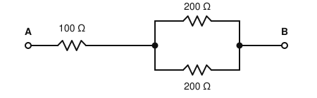
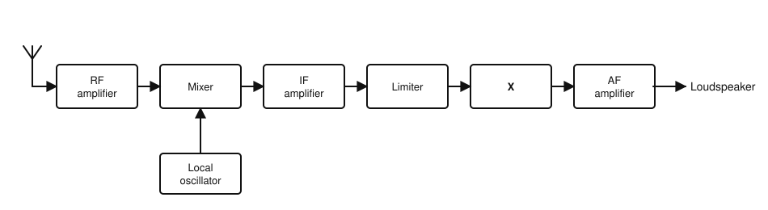
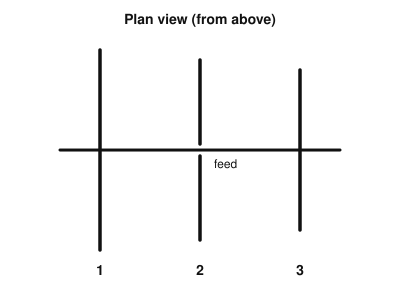

# IRTS HAREC Practice Exam — Set 8

60 questions · 2 hours · pass mark 60% **in each section** (at least 18/30 in Section A and 18/30 in Section B).
Only ONE answer is correct for each question. Answers and short explanations are at the end.

> Unofficial practice paper based on the IRTS HAREC Exam Syllabus (Rev 2.0.2), the IRTS Sample Exam Paper 2022 and the IRTS HAREC Study Guide (4.0.3).
> Page numbers in the answer key are the **printed** page numbers of the Study Guide; in a PDF viewer, add 24 (e.g. p. 343 is PDF page 367).

---

## Section A: Technical

### A.1 Safety (5 questions)

**1.** A device needs a maximum current of 2.5 A. Which fuse gives the best protection?

- A) 3 A
- B) 2.5 A exactly
- C) 13 A
- D) 30 A

**2.** Having several earths in a station that are NOT bonded together:

- A) Improves safety
- B) Can create lethal hazards
- C) Is required by Irish regulations
- D) Has no effect

**3.** Earthing and bonding advice written for the USA:

- A) Should always be followed in Ireland
- B) Is identical to Irish practice
- C) Is required by ComReg
- D) May be dangerous in Ireland, which uses different earthing arrangements — follow Irish regulations and use a qualified electrician

**4.** Towers, masts and rotators should be:

- A) As light as possible, regardless of loads
- B) Unguyed
- C) Rated for the loads they carry, including wind load
- D) Painted black

**5.** Why do magnetic loop antennas need particular care regarding EMF exposure?

- A) Their small size is deceptive — their reactive near fields can be very strong close by
- B) They radiate no energy
- C) They only work on receive
- D) They produce ionising radiation

### A.2 Interference and Immunity (4 questions)

**6.** Intermodulation distortion (IMD) happens when:

- A) A filter is too narrow
- B) The non-linearity of an amplifier amplifies unwanted frequency-mixing products more than the original signal
- C) The antenna is too short
- D) The SWR is exactly 1:1

**7.** To avoid overdriving a linear amplifier you should:

- A) Set the transceiver to full power always
- B) Remove the ALC connection
- C) Keep the drive within the amplifier's specification and use ALC correctly
- D) Increase the microphone gain

**8.** The immunity of consumer electronics to external electromagnetic fields is covered by:

- A) The RoHS Directive
- B) ICNIRP guidelines
- C) The IARU band plan
- D) The EMC Directive

**9.** Interference to a neighbour's equipment travels via the mains wiring from your station. A first step is to:

- A) Ensure good RF earthing/bonding and fit mains filtering at your station
- B) Use a higher-gain antenna
- C) Move the antenna closer to the house
- D) Remove the low-pass filter

### A.3 Electrical, Electromagnetic, and Radio Theory (4 questions)

**10.** 2.2 kΩ is the same as:

- A) 22 Ω
- B) 220 Ω
- C) 2200 Ω
- D) 22 000 Ω

**11.** The ampere-hour (Ah) is a unit of:

- A) Electric charge, used for battery capacity
- B) Power
- C) Resistance
- D) Frequency

**12.** A power gain of 6 dB corresponds to a power ratio of about:

- A) 2
- B) 6
- C) 3
- D) 4

**13.** Increasing the number of bits (resolution) of an ADC:

- A) Reduces the sampling rate
- B) Improves the dynamic range and signal-to-noise ratio
- C) Has no effect
- D) Halves the bandwidth

### A.4 Components and Circuits (3 questions)

**14.** What is the total resistance between terminals A and B?

- A) 500 Ω
- B) 300 Ω
- C) 200 Ω
- D) 150 Ω

**15.** Capacitors of 10 nF and 22 nF are connected in parallel. The total capacitance is:

- A) 32 nF
- B) 6.9 nF
- C) 12 nF
- D) 220 nF

**16.** Compared with a bipolar transistor (BJT), a field-effect transistor (FET) is:

- A) Current controlled with a low input impedance
- B) A type of valve
- C) Only usable at audio frequencies
- D) Voltage controlled, with a high input impedance

### A.5 Transmitters and Receivers (4 questions)

**17.** A Variable Frequency Oscillator (VFO) is used to:

- A) Rectify the mains
- B) Allow the operating frequency to be tuned
- C) Provide AGC
- D) Measure SWR

**18.** In an SSB transmitter, when there is no speech:

- A) Full carrier power is transmitted
- B) Half power is transmitted
- C) No RF output is produced (the carrier is suppressed)
- D) A test tone is sent

**19.** The block diagram shows an FM receiver. What is the block marked "X"?

- A) Discriminator (FM demodulator)
- B) Product detector
- C) Beat frequency oscillator
- D) Balanced modulator

**20.** The dynamic range of a receiver is:

- A) The tuning range
- B) The audio volume range
- C) The difference between the RF and IF frequencies
- D) The range between the weakest and strongest signals it can handle without unacceptable distortion

### A.6 Antennas and Transmission Lines (4 questions)

**21.** The loss in a coaxial cable:

- A) Decreases with frequency
- B) Increases with frequency
- C) Is independent of frequency
- D) Depends only on the transmitter power

**22.** On a half-wave dipole, the impedance is:

- A) Low at the centre and high at the ends
- B) High at the centre and low at the ends
- C) The same everywhere
- D) Zero at the ends

**23.** Antenna efficiency is:

- A) Gain divided by SWR
- B) Length divided by wavelength
- C) Radiated power divided by the power delivered to the antenna
- D) Front-to-back ratio

**24.** The figure shows a 3-element Yagi from above; element 2 is fed. In which direction is the maximum radiation?

- A) Towards element 1
- B) Perpendicular to the boom
- C) Equally in all directions
- D) Towards element 3

### A.7 Propagation (4 questions)

**25.** The troposphere is:

- A) The highest ionospheric layer
- B) The lowest layer of the atmosphere, where weather occurs
- C) The region between the E and F layers
- D) Space beyond the Moon

**26.** Around solar maximum:

- A) The higher HF bands (e.g. 10 m and 12 m) open more often for long-distance contacts
- B) All HF propagation stops
- C) Only 160 m is usable
- D) The D layer disappears in daytime

**27.** Which mode allows 144 MHz contacts of several hundred kilometres in short bursts?

- A) Ground wave
- B) Sky wave via the F2 layer
- C) Meteor scatter
- D) EME only

**28.** Sky-wave signals cannot be heard in the dead zone because:

- A) The D layer absorbs them
- B) The receiver is overloaded
- C) The signals are reflected back into space
- D) It lies beyond ground-wave range but closer than the first sky-wave return

### A.8 Measurements (2 questions)

**29.** An in-line SWR meter must be connected:

- A) Across the mains supply
- B) In series in the coaxial line
- C) In parallel with the antenna
- D) To the receiver audio output

**30.** Displaying the RF envelope of a CW signal on an oscilloscope helps check for:

- A) Key clicks caused by poor keying shape
- B) Antenna gain
- C) Battery capacity
- D) Ionospheric height

---

## Section B: Operating Rules, Procedures, and Regulations

### B.1 Phonetic Alphabet (1 question)

**31.** The ITU phonetic word for the letter J is:

- A) Jack
- B) Japan
- C) Jupiter
- D) Juliett

### B.2 Q-Codes (3 questions)

**32.** "QRV?" means:

- A) Who is calling me?
- B) Are you ready?
- C) Shall I stop?
- D) Is my signal fading?

**33.** "QSY 7055" means:

- A) Change frequency to 7055 kHz
- B) My location is 7055
- C) I will call back at 7:05
- D) Your report is 7055

**34.** The abbreviation "UR" means:

- A) You are
- B) Urgent
- C) Your
- D) Unreadable

### B.3 International Distress Signs, Emergency Traffic and Natural Disaster Communications (3 questions)

**35.** In Morse, the distress signal SOS is sent:

- A) As three separate letters with normal spacing
- B) As "SOS SOS" with a pause
- C) As dah-dit-dah repeated
- D) As one continuous sequence: dit-dit-dit-dah-dah-dah-dit-dit-dit

**36.** Which of these bands contains an emergency centre of activity used in Ireland?

- A) 15 m
- B) 10 m
- C) 12 m
- D) 30 m

**37.** A served agency asks you to deliver a message. You should:

- A) Use only amateur radio, whatever happens
- B) Get the message through by the best and fastest means available, radio or not
- C) Refuse unless it is about radio
- D) Charge a fee

### B.4 Call Signs (3 questions)

**38.** Which call sign does NOT follow the normal ITU rules?

- A) 2E0RGD
- B) EI3F
- C) 2-6-A (i.e. "26A")
- D) M6A

**39.** Adding "/P" to your call sign when operating portable in Ireland is:

- A) Mandatory
- B) Optional
- C) Required only in a field
- D) Not permitted

**40.** The prefix for Finland is:

- A) OH
- B) FI
- C) FN
- D) SF

### B.5 Radio Spectrum Allocation in Ireland and IARU Band Plans (4 questions)

**41.** The band edges of the 80 m band in Ireland are:

- A) 3.500–4.000 MHz
- B) 3.500–3.800 MHz
- C) 3.600–3.800 MHz
- D) 3.500–3.700 MHz

**42.** Which statement about the 30 m band is correct?

- A) SSB is recommended
- B) It is allocated on a primary basis
- C) Contests are encouraged
- D) Only narrow-band modes such as CW and some data are used; no SSB

**43.** In the IARU R1 band plans, the "maximum bandwidth" column shows:

- A) The maximum bandwidth a single transmission may use in that segment
- B) The total width of the band
- C) The maximum power
- D) The receiver IF bandwidth

**44.** Are contests permitted on the 60 m band?

- A) Yes
- B) Only CW contests
- C) No
- D) Only at night

### B.6 Social Responsibility of Radio Amateur Operation and the Code of Conduct (3 questions)

**45.** Regarding how amateurs behave on air, the authorities in most countries (including Ireland):

- A) Monitor every QSO
- B) Are mainly concerned with compliance with laws and regulations; the amateur community relies on self-discipline
- C) Set the band plans in detail
- D) Assign frequencies to each QSO

**46.** Writing "best 73s" is:

- A) Redundant — "73" already means best regards
- B) The correct form
- C) Required by the IARU
- D) A distress signal

**47.** To "work" a station means to:

- A) Repair it
- B) Listen to it
- C) Interfere with it
- D) Make a contact with it

### B.7 Operating Procedures and Non-Interference (5 questions)

**48.** An RST report of 599 means:

- A) Unreadable, very strong, perfect tone
- B) Perfectly readable, weak, perfect tone
- C) Perfectly readable, very strong signals, perfect tone
- D) Perfectly readable, very strong, poor tone

**49.** The recommended Morse CQ call is:

- A) CQ CQ CQ DE EI5ABC EI5ABC EI5ABC K
- B) DE EI5ABC CQ CQ CQ
- C) CQ CQ CQ <AR>
- D) EI5ABC CQ KN

**50.** A signal can be very strong yet have poor readability because of:

- A) A low S-meter reading
- B) Interference, noise or distortion
- C) A perfect tone
- D) The use of CW

**51.** When checking whether a frequency is in use before calling CQ, you should:

- A) Ask once and transmit straight away
- B) Not ask, only listen
- C) Transmit a carrier
- D) Ask more than once and listen, even if it seemed clear

**52.** When using a digital mode such as FT8, you should choose a transmit frequency (offset) by:

- A) Transmitting on top of the strongest signal
- B) Always using 0 Hz offset
- C) Using the software's spectrum display to find a clear spot
- D) Choosing randomly

### B.8 ITU Radio Regulations (2 questions)

**53.** International communications on behalf of third parties are permitted by the ITU:

- A) Only in case of emergencies or disaster relief
- B) Always
- C) Never, under any circumstances
- D) Only on 2 m

**54.** In an ITU emission designator such as J3E, the first symbol indicates:

- A) The type of information transmitted
- B) The type of modulation
- C) The nature of the modulating signal
- D) The bandwidth

### B.9 CEPT Regulations (3 questions)

**55.** CEPT recommendation T/R 61-01 concerns:

- A) The HAREC exam syllabus
- B) EMF limits
- C) The CEPT Radio Amateur Licence, allowing operation during short visits
- D) Band plans

**56.** The prefix for Italy is:

- A) IT
- B) IA
- C) IY
- D) I

**57.** The prefix for Lithuania is:

- A) LT
- B) LY
- C) YL
- D) LX

### B.10 Irish Laws, Regulations, and Licence Conditions (3 questions)

**58.** ComReg can grant an Irish amateur licence only for a station whose address is:

- A) In Ireland
- B) Anywhere on the island of Ireland, including Northern Ireland
- C) Anywhere in the EU
- D) Anywhere in CEPT

**59.** The land mobile power limit on 160 m above 1.850 MHz is:

- A) 50 W
- B) 400 W
- C) 10 W
- D) 25 W

**60.** The station logbook must be:

- A) Sent to ComReg every year
- B) Destroyed after 1 year
- C) Kept on paper only
- D) Kept up to date at the station and available for inspection at ComReg's request

---

## Answer Key

| Q | Ans | Explanation (Study Guide page) |
|---|-----|-------------|
| 1 | A | Slightly above the maximum current, e.g. 3 A (p. 297) |
| 2 | B | Unbonded earths are dangerous (p. 296) |
| 3 | D | Irish earthing practice differs (p. 297) |
| 4 | C | Rated for loads, including wind (p. 299) |
| 5 | A | Strong near fields (p. 303) |
| 6 | B | Mixing products at sums and differences of the input frequencies (p. 288) |
| 7 | C | Correct drive and ALC (p. 287) |
| 8 | D | EMC Directive (p. 283) |
| 9 | A | Earthing and filtering (p. 286) |
| 10 | C | 2200 Ω (p. 13) |
| 11 | A | Charge / battery capacity (p. 26) |
| 12 | D | 6 dB ≈ ×4 (p. 116) |
| 13 | B | More bits = more dynamic range (p. 60) |
| 14 | C | 100 + (200 ∥ 200 = 100) = 200 Ω (p. 30) |
| 15 | A | Parallel capacitors add (p. 95) |
| 16 | D | FET: voltage controlled, high input impedance (p. 123) |
| 17 | B | Tuning (p. 177) |
| 18 | C | No speech, no output (p. 157) |
| 19 | A | The limiter is followed by the FM discriminator (p. 195) |
| 20 | D | Definition of dynamic range (p. 203) |
| 21 | B | Loss rises with frequency (p. 206) |
| 22 | A | Low at the centre, high at the ends (p. 230) |
| 23 | C | Definition of efficiency (p. 246) |
| 24 | D | 1 = reflector (longest), 3 = director (shortest): beam towards the director (p. 242) |
| 25 | B | Troposphere (p. 259) |
| 26 | A | Higher bands open (p. 254) |
| 27 | C | Meteor scatter (p. 267) |
| 28 | D | Definition of the skip zone (p. 264) |
| 29 | B | In series in the line (p. 274) |
| 30 | A | Key clicks (p. 278) |
| 31 | D | Juliett (p. 335) |
| 32 | B | QRV? (p. 347) |
| 33 | A | QSY (p. 347) |
| 34 | C | UR = your (p. 349) |
| 35 | D | One continuous character (p. 350) |
| 36 | A | 15 m (21.360 MHz) (p. 345) |
| 37 | B | Any means necessary (p. 354) |
| 38 | C | No letter in the first section (p. 336) |
| 39 | D | /P is not permitted (p. 330) |
| 40 | A | Finland = OH (p. 323) |
| 41 | B | 3.500–3.800 MHz (p. 343) |
| 42 | D | Narrow-band only; secondary (p. 341) |
| 43 | A | Column meaning (p. 340) |
| 44 | C | No contests on 60 m (p. 342) |
| 45 | B | Self-discipline (p. 357) |
| 46 | A | 73 is already plural in meaning (p. 358) |
| 47 | D | Work = contact (p. 358) |
| 48 | C | 599 (p. 369) |
| 49 | A | IARU format (p. 363) |
| 50 | B | Readability vs strength (p. 368) |
| 51 | D | Ask more than once (p. 363) |
| 52 | C | Use the spectrum scope (p. 362) |
| 53 | A | Emergencies/disaster relief (p. 315) |
| 54 | B | Type of modulation (p. 316) |
| 55 | C | CEPT licence (p. 320) |
| 56 | D | Italy = I (p. 323) |
| 57 | B | Lithuania = LY (p. 323) |
| 58 | A | Station address must be in Ireland (p. 328) |
| 59 | C | 10 W (p. 329) |
| 60 | D | Available for ComReg inspection (p. 331) |
