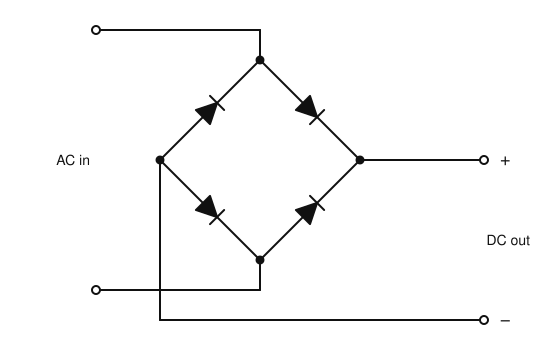
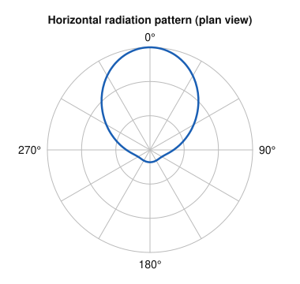
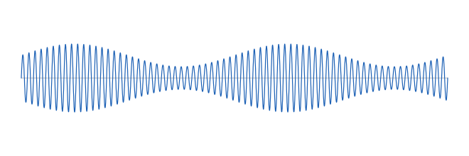

# IRTS HAREC Practice Exam — Set 13

60 questions · 2 hours · pass mark 60% **in each section** (at least 18/30 in Section A and 18/30 in Section B).
Only ONE answer is correct for each question. Answers and short explanations are at the end.

> Unofficial practice paper based on the IRTS HAREC Exam Syllabus (Rev 2.0.2), the IRTS Sample Exam Paper 2022 and the IRTS HAREC Study Guide (4.0.3).
> Page numbers in the answer key are the **printed** page numbers of the Study Guide; in a PDF viewer, add 24 (e.g. p. 343 is PDF page 367).

---

## Section A: Technical

### A.1 Safety (5 questions)

**1.** The location and purpose of the station's main (master) power switch should be:

- A) Known only to the licensee
- B) Known to all family or club members
- C) Hidden to prevent misuse
- D) Marked only in the logbook

**2.** In Ireland, anyone carrying out electrical work in a domestic setting must by law be:

- A) A licensed radio amateur
- B) A member of the IRTS
- C) Approved by ComReg
- D) Registered with Safe Electric

**3.** When operating a mobile station while driving, major adjustments such as band changes should be made:

- A) When stationary
- B) At high speed on motorways only
- C) While overtaking
- D) Never — mobile operation is illegal

**4.** Why must you be careful where you locate a high-quality magnetic loop antenna indoors (e.g. in an attic)?

- A) It attracts lightning
- B) It is very heavy
- C) It can cause intense heating of nearby conductors, creating a fire risk
- D) It needs a ground rod

**5.** Most ICNIRP exposure limits are specified as values averaged over a period such as:

- A) 1 second
- B) 6 or 30 minutes
- C) 24 hours
- D) 1 year

### A.2 Interference and Immunity (4 questions)

**6.** Splatter is:

- A) A type of lightning damage
- B) Fading on 10 m
- C) Interference from solar panels
- D) Unwanted emissions outside the necessary bandwidth, typically from an overdriven or overmodulated transmitter

**7.** Which of these is a common source of interference to amateur reception?

- A) Poorly designed devices such as some solar PV installations and switch-mode power supplies
- B) Lead-acid batteries
- C) Quartz crystals
- D) Open-wire feeders

**8.** Which of these is NOT a spurious emission?

- A) A harmonic
- B) A parasitic oscillation
- C) The modulation within the necessary bandwidth
- D) An intermodulation product radiated by the transmitter

**9.** Cross-modulation in a receiver is usually caused by:

- A) A low SWR
- B) A very strong nearby signal overloading the receiver's front end
- C) Using SSB
- D) Using a crystal filter

### A.3 Electrical, Electromagnetic, and Radio Theory (4 questions)

**10.** Kirchhoff's voltage law states that, around a closed loop:

- A) The sum of the voltage drops equals the source EMF
- B) Current is the same in every branch
- C) Voltage equals current divided by resistance
- D) Power is constant

**11.** A sine wave has a peak value of 10 V. Its instantaneous value at 30° is:

- A) 10 V
- B) 7.07 V
- C) 5 V
- D) 8.66 V

**12.** The third harmonic of 7 MHz is:

- A) 10 MHz
- B) 3.5 MHz
- C) 14 MHz
- D) 21 MHz

**13.** A Fast Fourier Transform (FFT) converts a digitised signal:

- A) From DC to AC
- B) From the time domain to the frequency domain
- C) From analogue to digital
- D) From FM to AM

### A.4 Components and Circuits (3 questions)

**14.** The circuit shown is a:

- A) Half-wave rectifier
- B) Full-wave bridge rectifier
- C) Band-pass filter
- D) Voltage regulator using a transistor

**15.** The back-EMF induced in an inductor:

- A) Opposes any change in the current through it
- B) Adds to the applied voltage
- C) Only exists in DC circuits
- D) Is caused by the dielectric

**16.** A Class A amplifier is:

- A) The most efficient class
- B) Used only for FM
- C) Non-linear
- D) The most linear but least efficient class

### A.5 Transmitters and Receivers (4 questions)

**17.** The low-pass filter after a transmitter's power amplifier is there to:

- A) Remove the audio
- B) Increase the power
- C) Attenuate harmonics
- D) Reduce the SWR

**18.** In a filter-type SSB transmitter, the sideband filter:

- A) Generates the carrier
- B) Removes the unwanted sideband
- C) Multiplies the frequency
- D) Measures modulation

**19.** The AGC in a receiver controls the gain of:

- A) The RF and IF stages, according to signal strength
- B) The transmitter
- C) The BFO
- D) The antenna

**20.** The squelch control of an FM receiver is normally set:

- A) Fully off
- B) To maximum
- C) To the same level as the volume
- D) Just above the point where background noise is muted

### A.6 Antennas and Transmission Lines (4 questions)

**21.** The velocity factor of typical coax with a solid polyethylene dielectric is about:

- A) 0.1
- B) 1.0
- C) 0.66
- D) 2.0

**22.** Compared with a simple half-wave dipole, a folded dipole has:

- A) A higher feed impedance (about 300 Ω)
- B) A lower feed impedance (about 12 Ω)
- C) A much higher gain
- D) No resonance

**23.** An end-fed half-wave antenna is normally fed through:

- A) A 1:1 current balun only
- B) A high-ratio impedance transformer (e.g. 49:1)
- C) A dummy load
- D) A low-pass filter only

**24.** The horizontal pattern shown is typical of:

- A) A half-wave dipole
- B) A quarter-wave vertical
- C) A multi-element Yagi pointing towards 0°
- D) An isotropic radiator

### A.7 Propagation (4 questions)

**25.** The lowest usable frequency (LUF) on an HF path rises when:

- A) D-layer absorption increases (e.g. around midday)
- B) Night falls
- C) The MUF falls
- D) You use higher power

**26.** Ground-wave propagation gives the greatest range on:

- A) UHF
- B) VHF
- C) Microwaves
- D) The lower frequencies, such as LF and MF (e.g. 160 m)

**27.** Which is a VHF/UHF propagation mechanism?

- A) D-layer absorption
- B) Ground wave on 160 m
- C) Tropospheric ducting
- D) NVIS

**28.** Meteor scatter contacts typically consist of:

- A) Long, steady QSOs
- B) Short bursts lasting seconds
- C) Contacts via the Moon
- D) Ground-wave contacts

### A.8 Measurements (2 questions)

**29.** Before measuring a resistor's value with an ohmmeter, you should:

- A) Apply the supply voltage
- B) Use the current range
- C) Switch off the circuit and preferably disconnect one end of the resistor
- D) Connect the meter in series

**30.** The oscilloscope trace shows the output of an AM transmitter. It shows:

- A) Overmodulation
- B) An unmodulated carrier
- C) Correct modulation, less than 100%
- D) Key clicks

---

## Section B: Operating Rules, Procedures, and Regulations

### B.1 Phonetic Alphabet (1 question)

**31.** The correct phonetic word for the letter H is:

- A) Henry
- B) Harry
- C) Holland
- D) Hotel

### B.2 Q-Codes (3 questions)

**32.** A station sends "QRX 3". This usually means:

- A) Wait for three minutes
- B) Send 3 dB more power
- C) Readability 3
- D) Change to channel 3

**33.** QUF (as a statement) means:

- A) I have received the distress signal sent by…
- B) I am closing down
- C) Your signals are weak
- D) I am ready

**34.** The abbreviation "PSE" means:

- A) Power supply earth
- B) Pause
- C) Please
- D) Pressure

### B.3 International Distress Signs, Emergency Traffic and Natural Disaster Communications (3 questions)

**35.** The IARU emergency guidance suggests that emergency communications volunteers think of themselves as:

- A) Commanders of the operation
- B) Independent observers
- C) Members of the press
- D) Unpaid employees of the agency they serve

**36.** Compared with contesting, emergency communications require:

- A) Contacting as many random stations as possible
- B) Teamwork and contacting specific stations quickly to pass messages
- C) Using maximum power at all times
- D) Using only CW

**37.** Which two Irish emergency centres of activity differ from the IARU Region 1 band plan?

- A) 3.660 MHz and 7.115 MHz
- B) 14.300 MHz and 18.160 MHz
- C) 21.360 MHz and 144.800 MHz
- D) 430.400 MHz and 433.775 MHz

### B.4 Call Signs (3 questions)

**38.** If an Irish licence is surrendered or cancelled, the call sign:

- A) Is given to the next applicant
- B) Can be inherited
- C) Is permanently revoked and will not be reissued
- D) Is held for 5 years

**39.** An Irish licensee visiting Scotland under CEPT should use the prefix:

- A) GM/
- B) MM/
- C) SC/
- D) 2M/

**40.** The national prefix for Latvia is:

- A) LV
- B) LA
- C) LT
- D) YL

### B.5 Radio Spectrum Allocation in Ireland and IARU Band Plans (4 questions)

**41.** Which part of the 70 cm band is limited to 50 W (17 dBW)?

- A) 430.000–432.000 MHz
- B) 432.000–440.000 MHz
- C) 435.000–438.000 MHz
- D) The whole band

**42.** On 160 m in Ireland, the 10 W power limit applies to:

- A) 1.810–1.850 MHz
- B) 1.800–1.810 MHz
- C) 1.850–2.000 MHz
- D) The whole band

**43.** Which range of the 10 m band is reserved for propagation beacons?

- A) 28.000–28.070 MHz
- B) 29.600–29.700 MHz
- C) 28.500–28.600 MHz
- D) 28.190–28.225 MHz

**44.** On which band are contests NOT permitted?

- A) 15 m
- B) 12 m
- C) 10 m
- D) 80 m

### B.6 Social Responsibility of Radio Amateur Operation and the Code of Conduct (3 questions)

**45.** The principle of politeness reminds you that:

- A) Only your QSO partner can hear you
- B) Rude language is allowed on CW
- C) Many people may be listening, so remain in control of your language and tone
- D) Politeness slows contacts down

**46.** In amateur jargon, "YL" and "OM" refer to:

- A) A woman and a man
- B) Yellow light and orange mode
- C) Your location and other modes
- D) Yesterday's log and old messages

**47.** Not everything heard on the bands is good practice. You should:

- A) Copy what most stations do
- B) Avoid listening
- C) Correct others on the air loudly
- D) Be a good example and follow the recommended operating procedures

### B.7 Operating Procedures and Non-Interference (5 questions)

**48.** A report of "59 plus 15" means:

- A) Readability 5, strength 9, 15 W
- B) Perfectly readable, S-meter 15 dB over S9
- C) Strength 5, readability 9
- D) 15 minutes late

**49.** On phone, an over is usually ended by the word:

- A) "Over"
- B) "Out"
- C) "Roger"
- D) "Break"

**50.** The first step before making a general call on a band is to:

- A) Call CQ loudly
- B) Set maximum power
- C) Tune the ATU on a busy frequency
- D) Check which portion of the band to use by referring to the IARU R1 band plan

**51.** When buying radio equipment, which marking indicates EU regulatory compliance?

- A) UL
- B) FCC
- C) CE
- D) IARU

**52.** If a frequency in a band allocated on a secondary basis is not clear, you should:

- A) Not use it
- B) Use it at low power
- C) Ask the primary user to move
- D) Use it only on CW

### B.8 ITU Radio Regulations (2 questions)

**53.** Which of these is in ITU Region 1?

- A) Australia
- B) Brazil
- C) Japan
- D) Africa

**54.** An ITU emission designator has a minimum of:

- A) One character
- B) Three characters
- C) Five characters
- D) Seven characters

### B.9 CEPT Regulations (3 questions)

**55.** Can ComReg issue a HAREC certificate to a candidate living in Northern Ireland who passes the Irish exam?

- A) No, only to residents of the Republic
- B) Only with Ofcom approval
- C) Yes — it can then be used to obtain a UK licence from Ofcom
- D) Only after 5 years

**56.** The national prefix for Bulgaria is:

- A) LZ
- B) BG
- C) BU
- D) YU

**57.** The national prefix for (mainland) Portugal is:

- A) PT
- B) PO
- C) CP
- D) CT7

### B.10 Irish Laws, Regulations, and Licence Conditions (3 questions)

**58.** ComReg may suspend or revoke an Amateur Station Licence:

- A) At any time without reason
- B) Where there is serious or repeated non-compliance with the licence conditions
- C) If the licensee does not join the IRTS
- D) If the licensee does not operate for a year

**59.** The rights under a club licence, including the call sign, belong to:

- A) The nominated individual
- B) ComReg
- C) The IRTS
- D) The club itself

**60.** According to the ComReg guidelines, the /M suffix is spoken as:

- A) "Slash mobile"
- B) "Portable"
- C) "Mike"
- D) "Moving"

---

## Answer Key

| Q | Ans | Explanation (Study Guide page) |
|---|-----|-------------|
| 1 | B | Everyone should know where it is (p. 295) |
| 2 | D | Electrical contractors must register with Safe Electric (p. 295) |
| 3 | A | Use hands-free operation; adjust when stationary (p. 299) |
| 4 | C | Strong near fields can heat nearby conductors (p. 304) |
| 5 | B | Time-averaged over e.g. 6 or 30 minutes (p. 302) |
| 6 | D | Splatter spreads energy onto adjacent frequencies (p. 288) |
| 7 | A | Poorly made digital devices and PV installations cause interference (p. 371) |
| 8 | C | The wanted modulation is not spurious (p. 287) |
| 9 | B | Strong signals cause non-linear behaviour in the front end (p. 205) |
| 10 | A | KVL (p. 20) |
| 11 | C | 10 × sin 30° = 5 V (p. 39) |
| 12 | D | 3 × 7 = 21 MHz (p. 45) |
| 13 | B | FFT: time → frequency domain (p. 56) |
| 14 | B | Four diodes in a bridge give full-wave rectification (p. 132) |
| 15 | A | Self-induction opposes changes of current (p. 89) |
| 16 | D | Class A conducts all the time: linear, inefficient (p. 135) |
| 17 | C | Harmonics lie above the operating frequency (p. 175) |
| 18 | B | Only one sideband is passed (p. 177) |
| 19 | A | AGC reduces RF/IF gain on strong signals (p. 196) |
| 20 | D | Set the threshold just above the noise (p. 198) |
| 21 | C | About 0.66 (p. 208) |
| 22 | A | ≈ 4 × 73 Ω ≈ 300 Ω (p. 237) |
| 23 | B | The end impedance is several thousand ohms (p. 236) |
| 24 | C | Strong forward lobe, small back lobe (p. 243) |
| 25 | A | More absorption raises the LUF (p. 271) |
| 26 | D | Ground-wave losses increase with frequency (p. 262) |
| 27 | C | Ducting is a VHF/UHF mode (p. 260) |
| 28 | B | Ionised meteor trails last only briefly (p. 267) |
| 29 | C | Ohmmeters are used on de-energised, isolated components (p. 272) |
| 30 | C | The envelope varies smoothly without reaching zero (p. 277) |
| 31 | D | H = Hotel (p. 334) |
| 32 | B | QRX + number = wait that many minutes (p. 347) |
| 33 | A | QUF concerns a distress signal (p. 347) |
| 34 | C | PSE = please (p. 349) |
| 35 | D | Unpaid employees, not in charge (p. 353) |
| 36 | B | Teamwork, not competition (p. 353) |
| 37 | A | The 80 m and 40 m Irish frequencies differ from IARU R1 (p. 345) |
| 38 | C | Revoked call signs are not reissued (p. 336) |
| 39 | B | Use the M-series prefix: MM/ (p. 323) |
| 40 | D | Latvia = YL (p. 323) |
| 41 | A | 430–432 MHz: 50 W; 432–440 MHz: 400 W (p. 343) |
| 42 | C | 400 W below 1.850 MHz, 10 W above (p. 343) |
| 43 | D | 28.190–28.225 MHz (p. 344) |
| 44 | B | No contests on 60 m or the WARC bands (p. 343) |
| 45 | C | Everyone can listen (p. 356) |
| 46 | A | YL = woman, OM = man (p. 358) |
| 47 | D | Be a good example on the air (p. 359) |
| 48 | B | 15 dB over S9 (p. 369) |
| 49 | A | Phone: "over"; Morse: K or KN (p. 360) |
| 50 | D | Always refer to the band plan (p. 362) |
| 51 | C | Look for the CE marking (p. 370) |
| 52 | A | Secondary users must not interfere (p. 370) |
| 53 | D | Region 1: Europe, Africa, Middle East, former USSR, Mongolia (p. 314) |
| 54 | B | e.g. J3E (p. 316) |
| 55 | C | HAREC is issued no matter where the candidate lives (p. 328) |
| 56 | A | Bulgaria = LZ (p. 323) |
| 57 | D | Portugal = CT7 (in Table 21-A) (p. 322) |
| 58 | B | Serious or repeated non-compliance (p. 328) |
| 59 | D | They vest in the club (p. 329) |
| 60 | A | ComReg says "slash mobile" (IARU recommends "stroke") (p. 329) |
