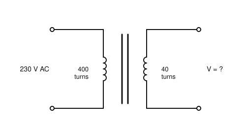
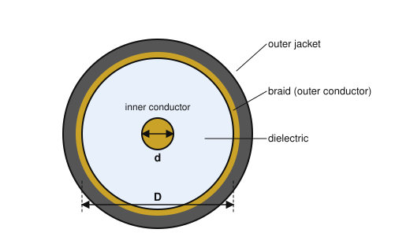
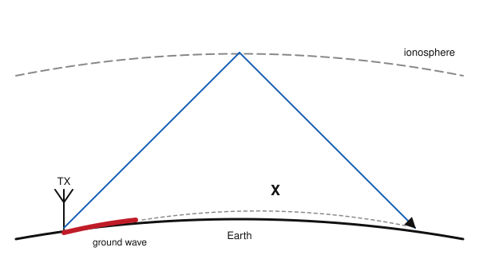

# IRTS HAREC Practice Exam — Set 14

60 questions · 2 hours · pass mark 60% **in each section** (at least 18/30 in Section A and 18/30 in Section B).
Only ONE answer is correct for each question. Answers and short explanations are at the end.

> Unofficial practice paper based on the IRTS HAREC Exam Syllabus (Rev 2.0.2), the IRTS Sample Exam Paper 2022 and the IRTS HAREC Study Guide (4.0.3).
> Page numbers in the answer key are the **printed** page numbers of the Study Guide; in a PDF viewer, add 24 (e.g. p. 343 is PDF page 367).

---

## Section A: Technical

### A.1 Safety (5 questions)

**1.** The fuse in a mains-powered piece of equipment should be fitted in the live lead:

- A) On the mains side of the switch
- B) In parallel with the switch
- C) On the equipment side of the switch
- D) Only in the neutral lead

**2.** When earthing several pieces of station equipment, you should:

- A) Connect each device directly to a common earthing point rather than daisy-chaining them
- B) Daisy-chain them from one to the next
- C) Earth only the transceiver
- D) Use the mains neutral as earth

**3.** Wide, flat earth straps are better than round wires for RF earthing because they:

- A) Are cheaper
- B) Are easier to solder
- C) Look neater
- D) Have lower inductance, and therefore lower impedance at RF

**4.** Microphones and Morse keys in the shack should be:

- A) Connected to the neutral
- B) Either fully insulated or properly connected to an earthed chassis
- C) Left floating
- D) Connected to the antenna

**5.** RF exposure calculators based only on far-field assumptions:

- A) Are exact everywhere
- B) Are required by ComReg
- C) May be inaccurate or misleading for predicting exposure in the near field
- D) Only work for VHF

### A.2 Interference and Immunity (4 questions)

**6.** According to the Study Guide, the two routes by which EMC problems arrive are:

- A) Radiated emissions and conducted emissions
- B) AM and FM
- C) Ionospheric and tropospheric paths
- D) Primary and secondary allocations

**7.** When a device malfunctions because it lacks immunity to legitimate amateur transmissions, this is known as:

- A) Harmonic radiation
- B) Splatter
- C) Key clicks
- D) Breakthrough

**8.** An earthed screen (shield) around equipment or cables reduces interference by:

- A) Increasing the signal voltage
- B) Preventing external fields from reaching the circuits inside
- C) Changing the frequency
- D) Reducing the mains voltage

**9.** Overdriving a linear amplifier to get "a bit more power" results in:

- A) Cleaner signals
- B) Lower harmonic content
- C) Little extra power but much more distortion and splatter
- D) Reduced power consumption

### A.3 Electrical, Electromagnetic, and Radio Theory (4 questions)

**10.** A 7 Ah battery supplies a constant 0.5 A. Ignoring losses, how long until it is empty?

- A) 3.5 hours
- B) 14 hours
- C) 7 hours
- D) 0.07 hours

**11.** Two 1.5 V cells connected in series (positive to negative) give:

- A) 3 V
- B) 1.5 V
- C) 0.75 V
- D) 0 V

**12.** A gain of about 9 dB corresponds to a power ratio of about:

- A) 3
- B) 5
- C) 2
- D) 8

**13.** The period of a 7 MHz signal is approximately:

- A) 7 µs
- B) 1.4 ms
- C) 143 ns
- D) 0.7 s

### A.4 Components and Circuits (3 questions)

**14.** A 10 Ω resistor and a 40 Ω resistor are connected in parallel. The total resistance is:

- A) 50 Ω
- B) 25 Ω
- C) 8 Ω
- D) 4 Ω

**15.** In the transformer shown, what is the secondary voltage?

- A) 2.3 V
- B) 23 V
- C) 2300 V
- D) 230 V

**16.** In the circuit symbol of a PNP transistor, the arrow on the emitter:

- A) Points inwards, towards the base
- B) Points outwards, away from the base
- C) Is on the collector
- D) Is absent

### A.5 Transmitters and Receivers (4 questions)

**17.** The frequency stability of a VFO is improved by:

- A) Using a high SWR
- B) Overdriving the PA
- C) Using a longer feeder
- D) Temperature-stable components, a buffer stage and a regulated supply

**18.** In an FM transmitter, the frequency deviation is proportional to:

- A) The audio frequency
- B) The amplitude (loudness) of the modulating audio
- C) The supply voltage
- D) The SWR

**19.** The sensitivity of a receiver is the:

- A) Maximum signal it can handle
- B) Width of its IF filter
- C) Weakest signal that gives an acceptable signal-to-noise ratio
- D) Accuracy of its dial

**20.** A double-conversion superheterodyne uses:

- A) Two intermediate frequencies: a high first IF and a lower second IF
- B) Two antennas
- C) Two BFOs
- D) Two power supplies

### A.6 Antennas and Transmission Lines (4 questions)

**21.** A waveguide is:

- A) A balanced twin-lead
- B) A coaxial cable with air dielectric
- C) A type of antenna tuner
- D) A hollow metal tube used as a feeder at microwave frequencies

**22.** The figure shows a cross-section of coaxial cable. Its characteristic impedance depends on:

- A) Its length
- B) The ratio of D to d and the dielectric material
- C) The thickness of the outer jacket
- D) The power applied

**23.** The voltage standing wave ratio (VSWR) is the ratio of:

- A) Forward to reflected power
- B) Antenna gain to feeder loss
- C) Maximum to minimum voltage along the line
- D) Input to output impedance

**24.** Which of these is an unbalanced antenna?

- A) A quarter-wave vertical (ground plane)
- B) A centre-fed half-wave dipole
- C) A folded dipole
- D) A doublet fed with ladder line

### A.7 Propagation (4 questions)

**25.** At night, the F1 and F2 layers:

- A) Both disappear
- B) Merge into a single F layer
- C) Move below the D layer
- D) Become the E layer

**26.** A signal above the MUF for a path will:

- A) Be absorbed by the D layer
- B) Be reflected more strongly
- C) Pass through the ionosphere and not return to earth on that path
- D) Travel by ground wave

**27.** In the figure, the region marked "X" is the:

- A) Ground-wave zone
- B) Skip (dead) zone
- C) Reactive near field
- D) Radio horizon

**28.** Around solar maximum, the number of sunspots:

- A) Is zero
- B) Has no relation to propagation
- C) Falls to a minimum
- D) Is high, and increased solar radiation raises ionisation and the MUF

### A.8 Measurements (2 questions)

**29.** Why should an ideal ammeter have a very low resistance?

- A) So that it does not significantly affect the current being measured
- B) So that it can measure voltage too
- C) To protect the battery
- D) So that it can be connected in parallel

**30.** A frequency counter is used to:

- A) Count QSOs
- B) Measure SWR
- C) Measure the frequency of a signal accurately
- D) Measure antenna gain

---

## Section B: Operating Rules, Procedures, and Regulations

### B.1 Phonetic Alphabet (1 question)

**31.** The phonetic word for the letter Y is:

- A) Yellow
- B) Yankee
- C) Yokohama
- D) Yacht

### B.2 Q-Codes (3 questions)

**32.** In Morse, which short form is often heard in place of "QRZ?"

- A) K
- B) AR
- C) SK
- D) A question mark "?" on its own

**33.** "QRO?" (as a question) means:

- A) Shall I increase power?
- B) Shall I decrease power?
- C) Are you ready?
- D) Shall I stop?

**34.** Used on its own as an operational abbreviation, "R" means:

- A) Repeat
- B) Readability 5
- C) Received; also a general "yes" or "confirmed"
- D) Radio

### B.3 International Distress Signs, Emergency Traffic and Natural Disaster Communications (3 questions)

**35.** During an emergency, a net control station gives you instructions. You should:

- A) Ignore them unless you are licensed for emergencies
- B) Follow those instructions
- C) Change frequency
- D) Ask for their licence

**36.** The Fire Service is part of which Principal Response Agency?

- A) An Garda Síochána
- B) The Health Services Executive
- C) The Irish Coast Guard
- D) The Local Authorities

**37.** AREN (Amateur Radio Emergency Network) is run by:

- A) The IRTS in co-operation with ComReg
- B) An Garda Síochána
- C) The HSE
- D) The ITU

### B.4 Call Signs (3 questions)

**38.** Which is a valid normal Irish call sign?

- A) EI6ABCDE
- B) EI-ABC
- C) EI6ABCD
- D) 6EIABC

**39.** The national prefix for Canada (used with a regional indicator) is:

- A) VE
- B) CA
- C) CN
- D) K

**40.** An Irish licensee visiting Northern Ireland should use the prefix:

- A) GI/
- B) 2I/
- C) NI/
- D) MI/

### B.5 Radio Spectrum Allocation in Ireland and IARU Band Plans (4 questions)

**41.** The maximum power for a fixed station on the 80 m band is:

- A) 10 W
- B) 100 W
- C) 400 W (26 dBW)
- D) 1 kW

**42.** On the 15 m band, maritime mobile operation is:

- A) Not permitted
- B) Permitted (at up to 10 W)
- C) Permitted at 400 W
- D) Permitted only in contests

**43.** On the six 60 m spot frequencies listed in the ComReg guidelines, the power limit is:

- A) 200 W PEP
- B) 15 W EIRP
- C) 10 W PEP
- D) 400 W PEP

**44.** For SSB voice on the 40 m band you should use:

- A) USB
- B) AM
- C) Either, by preference
- D) LSB

### B.6 Social Responsibility of Radio Amateur Operation and the Code of Conduct (3 questions)

**45.** According to the code of conduct, radio amateurs aim to be:

- A) Colleagues and friends
- B) Competitors at all times
- C) Anonymous
- D) Regulators of each other

**46.** Why can telegraphy (Morse) contacts succeed between operators who share no common language?

- A) Morse is the same as English
- B) Translators are provided
- C) Because of the reliance on Q-codes and operational abbreviations
- D) They cannot

**47.** The /QRP call sign suffix is:

- A) Required in all countries
- B) Not permitted in Ireland, and against regulations in some other countries such as Belgium
- C) Required in Ireland below 5 W
- D) Allowed only on 2 m

### B.7 Operating Procedures and Non-Interference (5 questions)

**48.** Readability R4 means:

- A) Unreadable
- B) Barely readable
- C) Readable with considerable difficulty
- D) Readable with practically no difficulty

**49.** The Morse transmission "OM2ABC OM2ABC DE EI5ABC KN" means:

- A) EI5ABC is calling OM2ABC and wants only OM2ABC to reply
- B) OM2ABC is calling EI5ABC
- C) EI5ABC is calling CQ
- D) EI5ABC is closing down

**50.** When you select an LSB frequency, your transmitted signal occupies about:

- A) 2.7 kHz above the displayed frequency
- B) 100 Hz around the displayed frequency
- C) 2.7 kHz below the displayed frequency
- D) 10 kHz either side

**51.** IARUMS stands for:

- A) International Amateur Radio Union Mobile Service
- B) IARU Monitoring System
- C) Irish Amateur Radio Union Membership Scheme
- D) International Aeronautical Radio Unit

**52.** In Morse, the prosign <SK> indicates:

- A) A request for a signal report
- B) Please send slower
- C) Sked
- D) The end of a QSO

### B.8 ITU Radio Regulations (2 questions)

**53.** The ITU Radio Regulations govern:

- A) Only amateur radio
- B) Only broadcasting
- C) The legal and technical requirements of all users of radio frequencies
- D) Only Region 1

**54.** In an emission designator, the second symbol "1" means:

- A) One channel containing digital information, with no subcarrier
- B) One channel of analogue information
- C) Two channels
- D) Telephony

### B.9 CEPT Regulations (3 questions)

**55.** A condition of operating under a CEPT licence abroad is that you must:

- A) Use your Irish power limits
- B) Apply for a temporary licence
- C) Use your Irish call sign without a prefix
- D) Learn about and strictly observe the regulations of the country you are visiting

**56.** The national prefix for Malta is:

- A) MT
- B) 9H
- C) 9A
- D) ML

**57.** The national prefix for Cyprus is:

- A) CY
- B) 5C
- C) 5B
- D) C4

### B.10 Irish Laws, Regulations, and Licence Conditions (3 questions)

**58.** An applicant who does not permanently reside in Ireland must submit:

- A) Full particulars of the station, including contact details, station details and qualifications
- B) Nothing extra
- C) A passport only
- D) A letter from the IRTS

**59.** The geographic position of the station must be recorded in the logbook:

- A) For all contacts
- B) Only for maritime mobile operation
- C) Only for land mobile operation
- D) Never

**60.** An amateur station on a ship must not be used to send messages that would otherwise be sent by:

- A) Another amateur
- B) The IRTS
- C) The vessel's own wireless telegraphy station
- D) Email

---

## Answer Key

| Q | Ans | Explanation (Study Guide page) |
|---|-----|-------------|
| 1 | C | Live lead, equipment side of the switch (p. 298) |
| 2 | A | Avoid daisy-chaining earth connections (p. 296) |
| 3 | D | Wide straps have low inductance (p. 296) |
| 4 | B | Insulated or properly earthed (p. 294) |
| 5 | C | Near fields are hard to predict (p. 306) |
| 6 | A | Radio waves through the air, and RF currents conducted along wiring (p. 282) |
| 7 | D | Lack of immunity to a legitimate signal = breakthrough (p. 283) |
| 8 | B | Shielding blocks radiated coupling (p. 286) |
| 9 | C | Drive levels must be kept within the linear range (p. 287) |
| 10 | B | 7 Ah / 0.5 A = 14 h (p. 26) |
| 11 | A | EMFs in series add (p. 18) |
| 12 | D | 9 dB = 3 + 3 + 3 dB = ×8 (p. 116) |
| 13 | C | T = 1/f = 1/7 000 000 s ≈ 143 ns (p. 38) |
| 14 | C | (10 × 40)/(10 + 40) = 8 Ω (p. 30) |
| 15 | B | Turns ratio 10:1 → 230/10 = 23 V (p. 128) |
| 16 | A | NPN: arrow out; PNP: arrow in (p. 122) |
| 17 | D | Methods of achieving frequency stability (p. 174) |
| 18 | B | Louder audio = more deviation (p. 153) |
| 19 | C | Ability to receive weak signals (p. 202) |
| 20 | A | High first IF for image rejection, low second IF for selectivity (p. 189) |
| 21 | D | Hollow conductive pipe for microwaves (p. 213) |
| 22 | B | Z₀ depends on the conductor diameters and the dielectric (p. 211) |
| 23 | C | VSWR = Vmax / Vmin (p. 219) |
| 24 | A | Verticals work against ground and suit unbalanced coax (p. 239) |
| 25 | B | The F1/F2 split exists in daytime only (p. 259) |
| 26 | C | Above the MUF the wave is not returned (p. 269) |
| 27 | B | Beyond ground-wave range, closer than the sky-wave return (p. 264) |
| 28 | D | More sunspots, more ionisation (p. 257) |
| 29 | A | Any significant meter resistance changes the circuit (p. 273) |
| 30 | C | Licensees must have an accurate means of checking frequency (p. 279) |
| 31 | B | Y = Yankee (p. 335) |
| 32 | D | "?" alone asks who is calling (p. 347) |
| 33 | A | QRO? = shall I increase power? (p. 346) |
| 34 | C | R = received / confirmed (p. 349) |
| 35 | B | Follow net control instructions (p. 354) |
| 36 | D | The Fire Service is a Local Authority service (p. 352) |
| 37 | A | Run by the IRTS with ComReg (p. 316) |
| 38 | C | EI + digit + 1–4 letter suffix (p. 337) |
| 39 | A | Canada = VE (e.g. EI5ABC/VE3) (p. 323) |
| 40 | D | Use MI/, not GI/ (p. 323) |
| 41 | C | 80 m: 400 W (p. 343) |
| 42 | B | 15 m allows /MM (p. 343) |
| 43 | A | Spot frequencies: 200 W PEP (p. 342) |
| 44 | D | Below 10 MHz (except 60 m): LSB (p. 341) |
| 45 | A | Social feeling and friendly spirit (p. 356) |
| 46 | C | Q-codes act as an international language (p. 359) |
| 47 | B | Not allowed in Ireland; illegal in e.g. Belgium (p. 359) |
| 48 | D | R4 (p. 368) |
| 49 | A | KN: only the called station (p. 366) |
| 50 | C | Stay inside the band plan allowing for the 2.7 kHz below the dial (p. 362) |
| 51 | B | The IARU Monitoring System (p. 371) |
| 52 | D | <SK> = end of QSO (p. 366) |
| 53 | C | All radio users (p. 314) |
| 54 | A | e.g. A1A, F1B (p. 317) |
| 55 | D | Observe the visited country's rules (p. 321) |
| 56 | B | Malta = 9H (p. 323) |
| 57 | C | Cyprus = 5B (p. 323) |
| 58 | A | Full particulars are required (p. 328) |
| 59 | B | Position logging is only required for /MM (p. 331) |
| 60 | C | It must not replace the ship's station (p. 330) |
