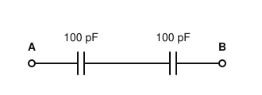
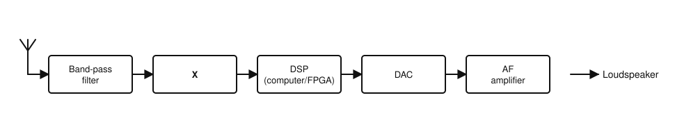
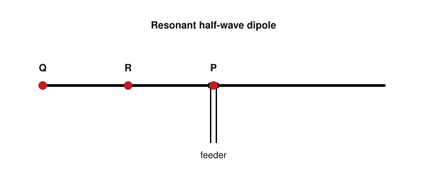

# IRTS HAREC Practice Exam — Set 15

60 questions · 2 hours · pass mark 60% **in each section** (at least 18/30 in Section A and 18/30 in Section B).
Only ONE answer is correct for each question. Answers and short explanations are at the end.

> Unofficial practice paper based on the IRTS HAREC Exam Syllabus (Rev 2.0.2), the IRTS Sample Exam Paper 2022 and the IRTS HAREC Study Guide (4.0.3).
> Page numbers in the answer key are the **printed** page numbers of the Study Guide; in a PDF viewer, add 24 (e.g. p. 343 is PDF page 367).

---

## Section A: Technical

### A.1 Safety (5 questions)

**1.** The saying "it's the volts that jolt but the mills that kill" means:

- A) Only high voltage is dangerous
- B) It is the current (milliamps) through the body that kills
- C) Mills (factories) are dangerous
- D) Low voltages are always safe

**2.** In adverse circumstances, voltages as low as about ______ can kill.

- A) 3 V
- B) 1 V
- C) 30 V
- D) 3000 V

**3.** The most dangerous path for an electric shock is:

- A) From one hand, across the chest, to the other hand which is grounded
- B) Through one finger only
- C) From foot to foot
- D) Through the hair

**4.** Why can you get an RF burn from an antenna even before touching it?

- A) Antennas get hot from sunlight
- B) Static from the feeder
- C) Lightning
- D) An electrical arc can form between the skin and a conductor at high RF voltage

**5.** Which is particularly dangerous at microwave frequencies?

- A) Using a dummy load
- B) Looking into an active waveguide or standing close in front of an active microwave antenna
- C) Touching a coax connector when switched off
- D) Using a low-pass filter

### A.2 Interference and Immunity (4 questions)

**6.** Interference caused by unwanted, excessive spurious emissions from your station must be remedied:

- A) At the victim's equipment only
- B) By the neighbour
- C) On the transmitting side
- D) By ComReg

**7.** The likelihood of causing interference is directly related to:

- A) The strength of the field from your antenna (antenna type, power and distance)
- B) The colour of the coax
- C) The time of day only
- D) The mode of the neighbour's TV

**8.** A simple first step that reduces many EMC problems is:

- A) Removing the station earth
- B) Using a longer coax
- C) Moving the antenna into the attic
- D) Reducing the transmit power

**9.** An HF station should include a low-pass filter at the transmitter output with a cut-off at about:

- A) 3 MHz
- B) 30 MHz
- C) 300 MHz
- D) 3 GHz

### A.3 Electrical, Electromagnetic, and Radio Theory (4 questions)

**10.** A 50 W device runs for 20 hours. How much energy does it use?

- A) 1 kWh
- B) 2.5 kWh
- C) 70 Wh
- D) 10 kWh

**11.** Which of these materials is a good electrical insulator?

- A) Copper
- B) Aluminium
- C) Silicon
- D) PTFE (a plastic)

**12.** An absolute power of 12 dBW is approximately:

- A) 12 W
- B) 120 W
- C) 16 W
- D) 1.2 W

**13.** Electric field strength is measured in:

- A) A/m
- B) V/m
- C) W
- D) Ω

### A.4 Components and Circuits (3 questions)

**14.** What is the total capacitance between A and B?

- A) 200 pF
- B) 100 pF
- C) 50 pF
- D) 10 000 pF

**15.** Replacing the air dielectric of a capacitor with a material of higher permittivity:

- A) Increases the capacitance
- B) Decreases the capacitance
- C) Has no effect
- D) Turns it into an inductor

**16.** An integrated circuit (IC) is:

- A) A single large resistor
- B) A type of valve
- C) A coil wound on ferrite
- D) Many components (transistors, resistors etc.) built on a single chip

### A.5 Transmitters and Receivers (4 questions)

**17.** Which IF filter bandwidth is most suitable for receiving CW?

- A) 6 kHz
- B) About 500 Hz
- C) 15 kHz
- D) 2.7 kHz

**18.** PEP stands for:

- A) Primary Emission Power
- B) Power Every Period
- C) Peak Envelope Power
- D) Pulse Energy Peak

**19.** A high-power linear amplifier in an amateur station:

- A) Amplifies the transceiver output while keeping the waveform undistorted, within the licence power limit
- B) Converts SSB into FM
- C) Removes the need for a low-pass filter
- D) Allows any power level to be used legally

**20.** The figure shows a direct-sampling SDR receiver. What is block "X"?

- A) DAC
- B) BFO
- C) ADC (analogue-to-digital converter)
- D) NCO

### A.6 Antennas and Transmission Lines (4 questions)

**21.** Why must water be kept out of coaxial cable?

- A) It increases the velocity factor to 1
- B) It turns coax into a waveguide
- C) It cools the cable too much
- D) The braid wicks moisture, which changes the impedance and causes standing waves

**22.** A choke made by threading ferrite rings over a coaxial feeder (the "Maxwell" design) is used to:

- A) Increase the SWR
- B) Reduce common-mode currents on the outside of the coax
- C) Convert 50 Ω to 200 Ω
- D) Filter harmonics

**23.** On the resonant half-wave dipole shown, at which point is the RF voltage highest?

- A) P
- B) R
- C) Q
- D) It is the same everywhere

**24.** Antenna gain differs from directivity because gain also takes into account:

- A) The antenna's efficiency (losses)
- B) The colour of the antenna
- C) The transmitter power
- D) The feeder length only

### A.7 Propagation (4 questions)

**25.** A large solar flare can cause:

- A) Better conditions on 160 m
- B) Tropospheric ducting
- C) A sudden HF fade-out due to greatly increased D-layer absorption
- D) Meteor showers

**26.** The troposphere is the lowest part of the atmosphere, extending up to about:

- A) 1 km
- B) 10–15 km
- C) 100 km
- D) 300 km

**27.** The E layer:

- A) Is highest at night
- B) Exists only during solar minimum
- C) Reflects only VHF
- D) Is mainly a daytime layer at about 100–120 km that largely disappears at night

**28.** Which propagation mode uses the Moon as a passive reflector?

- A) Earth–Moon–Earth (EME)
- B) Sporadic E
- C) Tropospheric ducting
- D) Auroral scatter

### A.8 Measurements (2 questions)

**29.** To measure current with a meter, the circuit must be:

- A) Short-circuited
- B) Opened (broken) so that the current passes through the meter
- C) Switched off
- D) Connected to an earth

**30.** A general-purpose multimeter used near a transmitting antenna:

- A) Always reads correctly
- B) Measures RF power
- C) Becomes a frequency counter
- D) May be affected by RF and give wrong readings

---

## Section B: Operating Rules, Procedures, and Regulations

### B.1 Phonetic Alphabet (1 question)

**31.** According to the ICAO pronunciation, the number 4 is spoken:

- A) FOW-er
- B) FOUR
- C) KAR-tay
- D) FAW

### B.2 Q-Codes (3 questions)

**32.** On phone, saying "QSL?" with a questioning tone means:

- A) Send me your QSL card
- B) Change frequency?
- C) Can you confirm reception of what we just exchanged?
- D) What is your location?

**33.** Someone says "Nothing seemed to happen on that QRG". Here, QRG means:

- A) Location
- B) Frequency
- C) Power
- D) Group

**34.** "Being QRV" means:

- A) Being interfered with
- B) Being on low power
- C) Leaving the station
- D) Being ready / available

### B.3 International Distress Signs, Emergency Traffic and Natural Disaster Communications (3 questions)

**35.** Distress signals must only be used when there is:

- A) Grave and imminent danger to life
- B) A power cut
- C) Interference on your frequency
- D) A contest

**36.** If you receive emergency traffic you should:

- A) Relay it to social media
- B) Ask for a signal report
- C) Listen carefully and write down all you can hear
- D) Change frequency

**37.** Without further training (e.g. from AREN), should you take on emergency communication roles beyond the basic measures?

- A) Yes, any licensed amateur may
- B) No
- C) Yes, if you have a high-power station
- D) Only on 2 m

### B.4 Call Signs (3 questions)

**38.** A UK call sign beginning with "2E" belongs to a licensee in:

- A) Estonia
- B) Spain
- C) Egypt
- D) England

**39.** The holder of EI0SWL visiting an Irish offshore island should sign:

- A) EJ0SWL
- B) EJ/EI0SWL
- C) EI0SWL/EJ
- D) EI0SWL/P

**40.** The national prefix for Russia is:

- A) RU
- B) RS
- C) UA
- D) R1

### B.5 Radio Spectrum Allocation in Ireland and IARU Band Plans (4 questions)

**41.** Which band is: primary, 400 W, contests permitted, maritime mobile permitted, with an Irish emergency centre of activity?

- A) 30 m
- B) 40 m
- C) 60 m
- D) 12 m

**42.** Is maritime mobile operation permitted on the 70 cm band?

- A) No
- B) Yes, at 10 W
- C) Yes, at 50 W
- D) Only above 432 MHz

**43.** Which ComReg document describes all radio frequency allocations and uses in Ireland?

- A) The IARU band plan
- B) T/R 61-01
- C) The Wireless Telegraphy Act
- D) The Radio Frequency Plan for Ireland

**44.** In the IARU R1 80 m band plan, 3735 kHz is the:

- A) Emergency centre of activity
- B) Digital voice centre of activity
- C) Image centre of activity
- D) CW QRP centre of activity

### B.6 Social Responsibility of Radio Amateur Operation and the Code of Conduct (3 questions)

**45.** "Ham" is:

- A) A colloquial term for a radio amateur
- B) A type of antenna
- C) A Q-code
- D) An insult

**46.** Sections B6 and B7 of the syllabus refer to which edition of the IARU Ethics and Operating Procedures guide?

- A) 1st
- B) 2nd
- C) 5th
- D) 3rd

**47.** Non-English-speaking operators sometimes use with each other:

- A) Only Morse
- B) Their national phonetic alphabet
- C) CB jargon
- D) No call signs

### B.7 Operating Procedures and Non-Interference (5 questions)

**48.** A commonly used S meter should read S9 on VHF/UHF with an input of about:

- A) 50 µV
- B) 500 µV
- C) 5 µV
- D) 0.5 V

**49.** In Morse, a CQ call aimed only at stations in Japan is sent as:

- A) CQ JA CQ JA CQ JA DE EI5ABC EI5ABC EI5ABC K
- B) CQ DX DE EI5ABC
- C) JA DE EI5ABC KN
- D) CQ JAPAN SK

**50.** When working a rare DX station in a busy pile-up:

- A) Long conversations are expected
- B) Reports must be measured exactly
- C) You should call continuously
- D) Only the barest information is exchanged, often with a 59 / 599 report

**51.** Which mode, according to the Study Guide, always uses LSB?

- A) FT8
- B) RTTY
- C) CW
- D) FM

**52.** IARUMS is interested in reports of:

- A) Only intruders from outside Europe
- B) Only contest cheating
- C) All kinds of interference, including poorly designed devices
- D) Only CB activity

### B.8 ITU Radio Regulations (2 questions)

**53.** In general, licensed amateur stations may only contact:

- A) Other licensed amateur stations (with emergency exceptions)
- B) Any station that answers
- C) Ships and aircraft
- D) Broadcast stations

**54.** In ITU emission designators, the third letter D means:

- A) Telephony
- B) Telegraphy by ear
- C) Television
- D) Data, e.g. computer files, telemetry or packet radio

### B.9 CEPT Regulations (3 questions)

**55.** Which non-European country has implemented T/R 61-01?

- A) China
- B) New Zealand
- C) Brazil
- D) India

**56.** The national prefix for Denmark is:

- A) DK
- B) DN
- C) OZ
- D) DA

**57.** Can an Irish CEPT Class 1 licence holder get extra privileges in some countries beyond T/R 61-01?

- A) A small number of countries may give additional privileges — you must research the country's regulations
- B) No, never
- C) Yes, in all CEPT countries
- D) Only in the USA

### B.10 Irish Laws, Regulations, and Licence Conditions (3 questions)

**58.** Besides complying with ComReg guidelines, the Wireless Telegraphy Regulations legally require you to:

- A) Join a club
- B) Operate weekly
- C) Observe good engineering practices
- D) Use only commercial equipment

**59.** May an unlicensed person (e.g. a shortwave listener) operate your station?

- A) No, never
- B) Yes, but only under the direct supervision of the licensee
- C) Yes, unsupervised
- D) Only on 2 m

**60.** Which details of the station addresses are shown in an Irish licence?

- A) None
- B) Only the county
- C) Only the Eircode
- D) The addresses, including their GPS coordinates

---

## Answer Key

| Q | Ans | Explanation (Study Guide page) |
|---|-----|-------------|
| 1 | B | It is the current that kills (p. 293) |
| 2 | C | As low as 30 V with sufficient current (p. 293) |
| 3 | A | Hand-to-hand across the chest (p. 293) |
| 4 | D | High RF voltages can arc to the skin (p. 294) |
| 5 | B | Eyes can be damaged quickly by high RF power density (p. 304) |
| 6 | C | Excessive spurious emissions need remediation at the transmitter (p. 283) |
| 7 | A | Field strength drives EMC problems (p. 283) |
| 8 | D | Use no more power than necessary (p. 284) |
| 9 | B | Cut-off around 30 MHz (p. 286) |
| 10 | A | 50 W × 20 h = 1000 Wh = 1 kWh (p. 26) |
| 11 | D | Plastics are insulators; silicon is a semiconductor (p. 16) |
| 12 | C | 10 dBW = 10 W; +2 dB ≈ ×1.6 → about 16 W (p. 118) |
| 13 | B | E field in volts per metre (p. 80) |
| 14 | C | Two equal capacitors in series: C/2 = 50 pF (p. 95) |
| 15 | A | Capacitance depends on the dielectric (p. 93) |
| 16 | D | Basic understanding of ICs (p. 126) |
| 17 | B | CW is narrow; SSB ≈ 2.4–2.7 kHz; AM ≈ 6 kHz (p. 193) |
| 18 | C | Licence limits are PEP (except 60 m) (p. 171) |
| 19 | A | Linear amplifiers must preserve the waveform; power limits still apply (p. 186) |
| 20 | C | The RF is digitised by an ADC before the DSP (p. 199) |
| 21 | D | Moisture ruins coax (p. 284) |
| 22 | B | A 1:1 current balun/choke (p. 285) |
| 23 | C | Voltage is maximum at the ends, current at the centre (p. 229) |
| 24 | A | Gain = directivity × efficiency (p. 246) |
| 25 | C | Flares increase ionisation in the D layer (p. 257) |
| 26 | B | Weather happens in the troposphere (p. 259) |
| 27 | D | Daytime layer (p. 259) |
| 28 | A | EME (moonbounce) (p. 268) |
| 29 | B | Ammeter in series (p. 273) |
| 30 | D | Unless designed for radio use, meters can be affected by RF (p. 272) |
| 31 | A | FOW-er (p. 334) |
| 32 | C | A questioning tone turns a Q-code into a question (p. 348) |
| 33 | B | QRG used as an abbreviation for frequency (p. 349) |
| 34 | D | QRV = ready (p. 349) |
| 35 | A | Distress = grave and imminent danger to life (p. 350) |
| 36 | C | Measures in case of emergency (p. 354) |
| 37 | B | Untrained operators must not impede emergency operations (p. 351) |
| 38 | D | 2E, G and M denote England (p. 323) |
| 39 | A | Simply change EI to EJ (p. 322) |
| 40 | C | Russia = UA (p. 323) |
| 41 | B | 40 m (7.115 MHz) (p. 343) |
| 42 | A | No /MM on 430 MHz (p. 343) |
| 43 | D | Radio Frequency Plan for Ireland (p. 338) |
| 44 | C | 3735 kHz = image (SSTV etc.) centre of activity (p. 339) |
| 45 | A | Colloquial term (p. 358) |
| 46 | D | The 3rd edition (p. 356) |
| 47 | B | National phonetic alphabets are heard, e.g. in contests (p. 359) |
| 48 | C | 50 µV on HF, 5 µV on VHF/UHF (p. 369) |
| 49 | A | JA is the national prefix for Japan (p. 364) |
| 50 | D | Speed matters in pile-ups (p. 369) |
| 51 | B | RTTY uses LSB; FT8 typically USB (p. 341) |
| 52 | C | All kinds of interference (p. 371) |
| 53 | A | Amateurs contact amateurs (p. 315) |
| 54 | D | D = data (p. 317) |
| 55 | B | Also Australia, Canada, Israel, Peru, South Africa and the USA (p. 321) |
| 56 | C | Denmark = OZ (p. 322) |
| 57 | A | Research the visited country's rules (p. 322) |
| 58 | C | Good engineering practice is a legal requirement (p. 326) |
| 59 | B | Direct supervision of the licensee (p. 326) |
| 60 | D | Addresses with GPS coordinates (p. 326) |
