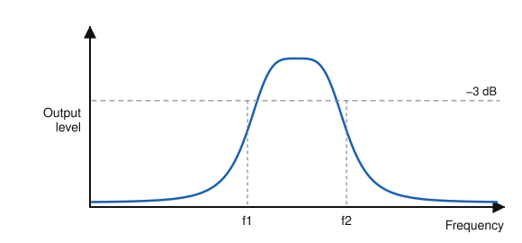
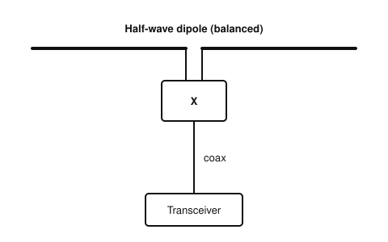
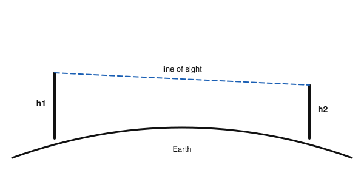

# IRTS HAREC Practice Exam — Set 17

60 questions · 2 hours · pass mark 60% **in each section** (at least 18/30 in Section A and 18/30 in Section B).
Only ONE answer is correct for each question. Answers and short explanations are at the end.

> Unofficial practice paper based on the IRTS HAREC Exam Syllabus (Rev 2.0.2), the IRTS Sample Exam Paper 2022 and the IRTS HAREC Study Guide (4.0.3).
> Page numbers in the answer key are the **printed** page numbers of the Study Guide; in a PDF viewer, add 24 (e.g. p. 343 is PDF page 367).

---

## Section A: Technical

### A.1 Safety (5 questions)

**1.** A Safe Electric Completion Certificate confirms:

- A) That your station meets the ICNIRP limits
- B) The standard of the electrical works, including the correct functioning of the protective earth
- C) Your HAREC result
- D) That your antenna is lightning-proof

**2.** When you must adjust powered equipment on a circuit without a dedicated RCD, you should:

- A) Use a plug-in RCD in the mains socket
- B) Remove the earth wire
- C) Use a higher-rated fuse
- D) Wear rubber gloves only

**3.** The type of static discharger used in open-wire feeder is:

- A) A fuse
- B) An RCD
- C) A ferrite ring
- D) A spark gap

**4.** When not in use, antennas should be:

- A) Left connected to the transceiver
- B) Pointed at the sky
- C) Earthed
- D) Disconnected from earth

**5.** Which ICNIRP guidelines does Irish law require you to follow?

- A) Only the 1998 guidelines
- B) The law does not state which; both the 1998 and 2020 editions are in current use
- C) Only the 2020 guidelines
- D) Neither

### A.2 Interference and Immunity (4 questions)

**6.** Common-mode currents that cause EMC problems in the shack are often:

- A) Picked up from the transmitting antenna and travel along the transmission line into the radio room
- B) Generated by the microphone
- C) Caused by low SWR
- D) Produced by the S meter

**7.** For ferrite chokes at HF, the Study Guide suggests a suitable ferrite material is:

- A) #77 only for VHF
- B) Any iron bolt
- C) Plastic rings
- D) #31 core material

**8.** Key clicks on nearby frequencies sound like:

- A) A steady carrier
- B) Static crashes
- C) Loud, hollow, distorted echoes of Morse signals
- D) Music

**9.** A badly distorted SSB transmission may occupy:

- A) Less than 1 kHz
- B) Over 7 kHz instead of about 2.7 kHz
- C) Exactly 2.7 kHz
- D) 100 Hz

### A.3 Electrical, Electromagnetic, and Radio Theory (4 questions)

**10.** In a parallel circuit, the voltage across each branch is:

- A) Different in each branch
- B) Zero
- C) The same
- D) Proportional to the branch current

**11.** The SI unit of inductance is the:

- A) Henry (H)
- B) Farad (F)
- C) Ohm (Ω)
- D) Tesla (T)

**12.** A loss of 6 dB corresponds to a power ratio of about:

- A) 0.5
- B) 0.1
- C) 0.75
- D) 0.25

**13.** Oversampling (sampling much faster than the minimum rate) helps to:

- A) Reduce the bandwidth
- B) Improve the signal-to-noise ratio / effective resolution
- C) Avoid the need for an ADC
- D) Increase the transmitter power

### A.4 Components and Circuits (3 questions)

**14.** Quartz crystals are used in oscillators and filters mainly because of their:

- A) Low cost
- B) Large size
- C) Very high Q and frequency stability
- D) Ability to handle mains voltage

**15.** The bandwidth of the filter shown is:

- A) f1
- B) f2
- C) f2 + f1
- D) f2 − f1, measured between the half-power (−3 dB) points

**16.** In a valve (triode), the heater (filament) is used to:

- A) Heat the cathode so that it emits electrons
- B) Cool the anode
- C) Control the grid
- D) Light the dial

### A.5 Transmitters and Receivers (4 questions)

**17.** In an AM signal, the information is carried in:

- A) The carrier only
- B) The sidebands
- C) The harmonics
- D) The DC component

**18.** If you speak louder into an SSB transmitter (without overdriving it):

- A) The frequency changes
- B) The carrier increases
- C) The bandwidth halves
- D) The output power (PEP) increases

**19.** Compared with a high IF, a low intermediate frequency makes it easier to achieve:

- A) Good image rejection
- B) High transmitter power
- C) Good selectivity (narrow filters)
- D) Wide bandwidth

**20.** Compared with AM, FM reception is relatively immune to:

- A) Amplitude noise and static
- B) Frequency drift
- C) Multipath
- D) Weak signals

### A.6 Antennas and Transmission Lines (4 questions)

**21.** Component "X" connects a balanced dipole to coaxial cable. It is typically a:

- A) 1:1 current balun (common-mode choke)
- B) Low-pass filter
- C) Dummy load
- D) SWR meter

**22.** Maximum power is transferred from a feeder to an antenna when:

- A) The feeder is as long as possible
- B) The impedances are matched
- C) The SWR is high
- D) The antenna is non-resonant

**23.** On VHF, using a vertical antenna to receive a horizontally polarised signal results in:

- A) No difference
- B) A stronger signal
- C) Doubling of the frequency
- D) A significant loss of signal strength

**24.** A non-resonant wire (doublet) used on several bands normally needs:

- A) Traps
- B) A dummy load
- C) An antenna tuning unit (ATU)
- D) A waveguide

### A.7 Propagation (4 questions)

**25.** For an oblique (long-distance) path, the MUF is:

- A) Higher than the critical frequency
- B) Lower than the critical frequency
- C) Equal to the LUF
- D) Zero

**26.** HF sky waves return to earth because the ionosphere:

- A) Absorbs them
- B) Refracts (bends) them back towards the ground
- C) Amplifies them
- D) Converts them to ground waves

**27.** Tropospheric ducting on VHF/UHF can produce contacts over:

- A) Only a few metres
- B) Exactly the line-of-sight distance
- C) Paths only during solar maximum
- D) Distances far beyond the normal horizon, sometimes over 1000 km

**28.** To increase the maximum line-of-sight distance between the two VHF stations shown, you should:

- A) Lower the frequency to HF
- B) Use AM
- C) Increase the antenna heights h1 and/or h2
- D) Use a longer feeder

### A.8 Measurements (2 questions)

**29.** The RF power fed into a transmission line is usually measured with:

- A) An ohmmeter
- B) An S meter
- C) A dedicated power meter
- D) A frequency counter

**30.** An oscilloscope monitoring the RF envelope of a transmitter can reveal:

- A) The antenna gain
- B) Overmodulation and key clicks
- C) The station's location
- D) The SWR

---

## Section B: Operating Rules, Procedures, and Regulations

### B.1 Phonetic Alphabet (1 question)

**31.** The phonetic word "Kilo" represents the letter:

- A) C
- B) Q
- C) G
- D) K

### B.2 Q-Codes (3 questions)

**32.** Besides being a Q-code, "QSO" is also commonly used to mean:

- A) A radio contact
- B) A QSL card
- C) A location
- D) A frequency

**33.** When might you ask "QRZ?" after finishing a brief contact?

- A) When you want to stop
- B) When you want to change band
- C) When several stations replied to your call and you want the next one
- D) When the signal is fading

**34.** Q-codes date back to:

- A) 1990
- B) 1909, with the first twelve standardised in 1912
- C) 1950
- D) 2014

### B.3 International Distress Signs, Emergency Traffic and Natural Disaster Communications (3 questions)

**35.** AREN operators may pass messages of designated services such as:

- A) The Ambulance Service, Civil Defence, Fire Service, Gardaí and Irish Coast Guard
- B) Private companies
- C) Political parties
- D) Broadcasters

**36.** If the agency you are helping runs short of doctors or cooks, you should:

- A) Take over those roles
- B) Leave
- C) Order other volunteers to help
- D) Remember that you cannot do it all — it is not your job to fill that void

**37.** You hear someone calling "SOS" by voice, although "MAYDAY" is the correct voice signal. You should:

- A) Ignore it — it is incorrect
- B) Correct them on the air
- C) Apply common sense and treat it as a request for help
- D) Report them to ComReg

### B.4 Call Signs (3 questions)

**38.** A call sign is:

- A) Chosen freely by the operator
- B) An ITU-compliant unique identifier assigned by ComReg as part of the licence
- C) Issued by the IRTS
- D) The same as a Garda ID

**39.** In a normal call sign, the second section is:

- A) A single digit
- B) Two letters
- C) A slash
- D) Up to four characters

**40.** The national prefix for Austria is:

- A) AU
- B) AT
- C) OA
- D) OE

### B.5 Radio Spectrum Allocation in Ireland and IARU Band Plans (4 questions)

**41.** The power limit on the 30 m band (10.100–10.150 MHz) is:

- A) 15 W EIRP
- B) 10 W
- C) 400 W (26 dBW)
- D) 50 W

**42.** PEP power limits (all bands except 60 m) are measured:

- A) At the antenna
- B) At the output of the transmitter or amplifier
- C) At the mains plug
- D) As EIRP

**43.** Is maritime mobile operation permitted on the 10 m band?

- A) No
- B) Only in contests
- C) Only on CW
- D) Yes, at up to 10 W

**44.** Digital modes may NOT be used in:

- A) The lowest portion of a band, reserved for CW
- B) The "all modes" segments
- C) The 2 m band
- D) Any segment above 3600 kHz

### B.6 Social Responsibility of Radio Amateur Operation and the Code of Conduct (3 questions)

**45.** Some amateurs prefer long conversations and others short contacts. According to the guide:

- A) Short contacts are forbidden
- B) Both are fine — many amateurs enjoy ragchews, short contacts and contests
- C) Ragchews are not allowed
- D) Only contests are allowed

**46.** Someone starts a QSO on "your" frequency after you have used it for half an hour. The guide reminds you that:

- A) They must be jamming you
- B) You own the frequency
- C) You should report them
- D) There is no malice — changing propagation probably brought you into range of each other

**47.** Updating the IARU band plans to follow usage patterns typically takes:

- A) A few days
- B) One month
- C) A couple of years
- D) Fifty years

### B.7 Operating Procedures and Non-Interference (5 questions)

**48.** Readability R2 means:

- A) Barely readable, occasional words distinguishable
- B) Unreadable
- C) Perfectly readable
- D) Readable with practically no difficulty

**49.** Which phone call is correct for calling a specific station, OM2ABC?

- A) CQ OM2ABC from EI5ABC
- B) "OM2ABC OM2ABC OM2ABC from EI5ABC EI5ABC EI5ABC standing by"
- C) "EI5ABC to anyone"
- D) "Break OM2ABC"

**50.** Why is "Is this frequency in use?" better than "Is this frequency clear?"

- A) It is shorter
- B) ComReg requires it
- C) It is easier in Morse
- D) A frequency clear to one station may not be clear to another, so "clear?" may lead to confusion

**51.** Deliberate interference on the amateur bands:

- A) Should be answered by transmitting over it
- B) Is the same as normal EMC problems
- C) Should not be confused with everyday EMC interference, and should be reported through the correct channels
- D) Is legal at night

**52.** Apart from test signals, CQ calls and some emergency calls, amateur contacts always have:

- A) A specific participant or group of participants, identified by call signs
- B) An audience of the general public
- C) Music
- D) Advertising

### B.8 ITU Radio Regulations (2 questions)

**53.** An allocation on a "primary shared" basis means the band is:

- A) Reserved for amateurs only
- B) Shared with other, non-amateur primary users
- C) Secondary
- D) For beacons only

**54.** In designators such as F2B or F2D, the digit 2 indicates:

- A) Two channels of speech
- B) Analogue information
- C) No modulation
- D) Digital information using a subcarrier

### B.9 CEPT Regulations (3 questions)

**55.** After passing the ComReg-approved exam, you receive from ComReg:

- A) A HAREC certificate
- B) An IARU membership
- C) A CEPT passport
- D) A US licence

**56.** T/R 61-01 is a CEPT ECC:

- A) Directive
- B) Law
- C) Technical Recommendation
- D) Band plan

**57.** The national prefix for Ukraine is:

- A) UK
- B) UA
- C) UR
- D) UT

### B.10 Irish Laws, Regulations, and Licence Conditions (3 questions)

**58.** Morse proficiency testing for the CEPT Class 1 licence in Ireland is conducted by:

- A) ComReg directly
- B) The IRTS, to the standard required by ComReg
- C) CEPT
- D) The ITU

**59.** Special event call signs may be issued to:

- A) Only the IRTS
- B) Only commercial companies
- C) Only visitors
- D) Clubs and individual licensees

**60.** Licence technical requirements are intended to ensure that no harmful interference is caused and that:

- A) Maximum range is achieved
- B) The station looks tidy
- C) The safety of persons or property is not endangered
- D) Contests are won

---

## Answer Key

| Q | Ans | Explanation (Study Guide page) |
|---|-----|-------------|
| 1 | B | Issued by a registered electrician (p. 295) |
| 2 | A | A plug-in RCD disconnects at about 30 mA (p. 299) |
| 3 | D | Spark-gap dischargers for open-wire lines (p. 300) |
| 4 | C | Earth antennas when not in use (p. 300) |
| 5 | B | Both editions are in use (p. 301) |
| 6 | A | They re-radiate along the line (p. 284) |
| 7 | D | #31 suits many HF applications (p. 285) |
| 8 | C | Caused by improperly shaped keying (p. 288) |
| 9 | B | Distortion widens the bandwidth (p. 288) |
| 10 | C | Parallel branches share the same voltage (p. 20) |
| 11 | A | Inductance in henries (p. 14) |
| 12 | D | −6 dB ≈ a quarter (p. 116) |
| 13 | B | Oversampling improves SNR (p. 58) |
| 14 | C | Very high Q (p. 113) |
| 15 | D | Half-power bandwidth (p. 107) |
| 16 | A | Thermionic emission (p. 125) |
| 17 | B | The carrier carries no information (p. 140) |
| 18 | D | SSB output follows the audio level (p. 157) |
| 19 | C | Trade-off: high IF for images, low IF for selectivity (p. 189) |
| 20 | A | The limiter removes amplitude variations (p. 198) |
| 21 | A | Balanced antenna to unbalanced coax (p. 221) |
| 22 | B | Impedance matching (p. 215) |
| 23 | D | Polarisation mismatch causes large losses (p. 229) |
| 24 | C | An ATU matches the varying impedance (p. 234) |
| 25 | A | Oblique incidence returns higher frequencies (p. 269) |
| 26 | B | Refraction in the ionosphere (p. 262) |
| 27 | D | Ducts trap the waves (p. 267) |
| 28 | C | Higher antennas extend the radio horizon (p. 261) |
| 29 | C | Use an RF power meter (p. 274) |
| 30 | B | Oscilloscope use (p. 274) |
| 31 | D | Kilo = K (p. 335) |
| 32 | A | "Thank you for this nice QSO!" (p. 347) |
| 33 | C | QRZ? = who is calling me? (p. 347) |
| 34 | B | Very old origins (p. 346) |
| 35 | A | Designated services (p. 316) |
| 36 | D | Know your limits (p. 353) |
| 37 | C | They may be untrained and under stress (p. 354) |
| 38 | B | Assigned by ComReg (p. 336) |
| 39 | A | e.g. EI-6-XYZ (p. 336) |
| 40 | D | Austria = OE (p. 323) |
| 41 | C | 30 m: secondary, 400 W (p. 343) |
| 42 | B | At the transmitter/amplifier output (p. 343) |
| 43 | D | 10 m permits /MM (p. 343) |
| 44 | A | The lowest segment is CW only (p. 341) |
| 45 | B | Different styles are all part of the hobby (p. 358) |
| 46 | D | Danger of conflict (p. 357) |
| 47 | C | Band plans change from time to time (p. 340) |
| 48 | A | R2 (p. 368) |
| 49 | B | Specific call format (p. 365) |
| 50 | D | Ask whether it is in use (p. 362) |
| 51 | C | Report via IRTS/IARUMS (p. 371) |
| 52 | A | Amateurs do not broadcast (p. 361) |
| 53 | B | Shared with other primary users (p. 316) |
| 54 | D | 2 = digital with subcarrier (p. 317) |
| 55 | A | HAREC certificate (p. 320) |
| 56 | C | Recommendations that countries may adopt (p. 320) |
| 57 | D | Ukraine = UT (p. 323) |
| 58 | B | IRTS Morse tests (p. 328) |
| 59 | D | On request, for a temporary period (p. 329) |
| 60 | C | Technical requirements (p. 331) |
