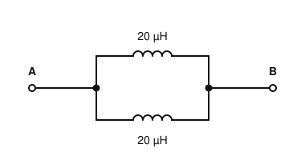
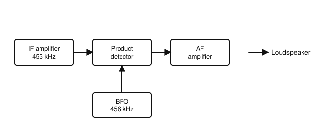
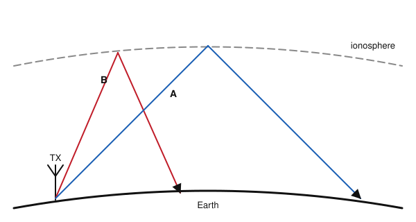

# IRTS HAREC Practice Exam — Set 20

60 questions · 2 hours · pass mark 60% **in each section** (at least 18/30 in Section A and 18/30 in Section B).
Only ONE answer is correct for each question. Answers and short explanations are at the end.

> Unofficial practice paper based on the IRTS HAREC Exam Syllabus (Rev 2.0.2), the IRTS Sample Exam Paper 2022 and the IRTS HAREC Study Guide (4.0.3).
> Page numbers in the answer key are the **printed** page numbers of the Study Guide; in a PDF viewer, add 24 (e.g. p. 343 is PDF page 367).

---

## Section A: Technical

### A.1 Safety (5 questions)

**1.** In high-voltage power supplies, a bleeder resistor is connected across each smoothing capacitor to:

- A) Increase the output voltage
- B) Allow the capacitors to discharge after the power is switched off
- C) Filter RF
- D) Act as a fuse

**2.** Microswitches in a valve power amplifier are fitted so that:

- A) The fan starts
- B) The band changes
- C) The SWR is measured
- D) The high-voltage supply is automatically disconnected when the cover is removed

**3.** Soldering should be carried out:

- A) In a closed cupboard
- B) Only outdoors in rain
- C) With the iron held near the face
- D) In a well-ventilated area, avoiding inhaling the fumes

**4.** In open-wire feeder, which type of static discharger should be used?

- A) A gas-filled coax arrestor only
- B) A ferrite choke
- C) A spark-gap type
- D) A fuse

**5.** Heating of body tissue by RF is a particular risk when:

- A) The heat cannot be dissipated quickly enough by the body's natural cooling
- B) The frequency is very low
- C) The antenna is resonant
- D) You wear glasses

### A.2 Interference and Immunity (4 questions)

**6.** Electromagnetic compatibility (EMC) is:

- A) A type of antenna
- B) The avoidance of interference between any two pieces of electronic equipment
- C) A licence condition only for repeaters
- D) The SWR of a system

**7.** Conducted emissions are:

- A) Radio waves travelling through the air
- B) Signals from the ionosphere
- C) Sound from a loudspeaker
- D) RF currents conducted onto or from connected wiring, such as mains cables

**8.** Almost all equipment sold in the EU carries the CE mark, which requires it to have:

- A) A specific colour
- B) Immunity from legitimate radio transmissions
- C) An amateur licence
- D) A 30 MHz low-pass filter

**9.** Harmonic distortion of a 40 m signal can cause significant interference on:

- A) The 20 m band
- B) The 80 m band
- C) The 160 m band
- D) Only 40 m

### A.3 Electrical, Electromagnetic, and Radio Theory (4 questions)

**10.** A 230 V supply delivers 0.5 A. The power is:

- A) 460 W
- B) 230.5 W
- C) 115 W
- D) 0.002 W

**11.** The SI unit of capacitance is the:

- A) Henry
- B) Farad
- C) Siemens
- D) Weber

**12.** An absolute level of 0 dBW equals:

- A) 0 W
- B) 10 W
- C) 1 mW
- D) 1 W

**13.** A signal with a frequency of 145 MHz is in which range?

- A) VHF (30–300 MHz)
- B) HF (3–30 MHz)
- C) UHF (300–3000 MHz)
- D) MF (300–3000 kHz)

### A.4 Components and Circuits (3 questions)

**14.** What is the total inductance of the two coils shown (assuming no mutual coupling)?

- A) 40 µH
- B) 20 µH
- C) 10 µH
- D) 5 µH

**15.** A diode allows current to flow:

- A) In both directions equally
- B) In one direction only (when forward biased)
- C) Only at RF
- D) Only through its case

**16.** Light emitting diodes (LEDs) are used:

- A) Only as rectifiers
- B) As voltage references
- C) As tuning capacitors
- D) In household lighting and instrument displays

### A.5 Transmitters and Receivers (4 questions)

**17.** A CW transmitter with a keying waveform that has too short a rise time will produce:

- A) Key clicks
- B) Chirp-free signals
- C) Lower bandwidth
- D) Better readability

**18.** The ALC (automatic level control) in a transmitter:

- A) Measures frequency
- B) Reduces the drive to prevent the amplifier being overdriven
- C) Sets the IF
- D) Tunes the antenna

**19.** In the receiver shown, a CW signal at the IF of 455 kHz beats with the BFO. What audio tone is heard?

- A) 455 kHz
- B) 911 kHz
- C) 1 kHz
- D) 456 Hz

**20.** Automatic gain control (AGC) in a receiver:

- A) Keeps the output level more constant as signal strength changes
- B) Changes the frequency
- C) Removes the BFO
- D) Increases selectivity

### A.6 Antennas and Transmission Lines (4 questions)

**21.** The velocity factor of a coaxial cable with solid polyethylene dielectric is about:

- A) 0.1
- B) 1.5
- C) 0.95
- D) 0.66

**22.** The feed-point impedance of a half-wave dipole is:

- A) 300 Ω
- B) 30–80 Ω, depending on its height above the ground
- C) 600 Ω
- D) 1 Ω

**23.** A trap dipole works on several bands because:

- A) Parallel resonant traps isolate the outer sections on the higher band
- B) It has no feeder
- C) It is non-resonant
- D) It uses a waveguide

**24.** Compared with a single-element vertical, a Yagi antenna:

- A) Is omnidirectional
- B) Has no gain
- C) Concentrates radiation in one direction, giving gain
- D) Works only on HF

### A.7 Propagation (4 questions)

**25.** The Sun follows an activity cycle of approximately:

- A) 27 days
- B) 11 years
- C) 1 year
- D) 22 months

**26.** Which ray in the figure produces the longer skip distance?

- A) Ray B (high angle)
- B) Both are the same
- C) Neither returns
- D) Ray A (low angle)

**27.** At night, the D layer:

- A) Disappears, so absorption of lower HF signals falls
- B) Becomes the strongest layer
- C) Merges with F2
- D) Blocks all HF signals

**28.** The Lowest Usable Frequency (LUF) on a path is mainly limited by:

- A) Ground conductivity
- B) Feeder loss
- C) D-layer absorption
- D) Antenna height

### A.8 Measurements (2 questions)

**29.** To measure voltage, the meter is connected:

- A) In series with the circuit
- B) Across the points (in parallel) where voltage is to be measured
- C) To the antenna
- D) Between earth and neutral only

**30.** A multimeter (multi-range meter) can measure:

- A) Current, resistance and voltage
- B) Only SWR
- C) Only frequency
- D) Only RF power

---

## Section B: Operating Rules, Procedures, and Regulations

### B.1 Phonetic Alphabet (1 question)

**31.** In the ITU phonetic alphabet, the letter A is:

- A) Apple
- B) Able
- C) Alfa
- D) Alpha

### B.2 Q-Codes (3 questions)

**32.** "QRL?" means:

- A) Is the frequency in use?
- B) What is your location?
- C) Shall I stop?
- D) Who is calling?

**33.** "QRU" (as a statement) means:

- A) I am ready
- B) I have nothing for you
- C) Increase power
- D) Fading

**34.** The first twelve Q-codes were standardised in:

- A) 1909
- B) 1950
- C) 2012
- D) 1912

### B.3 International Distress Signs, Emergency Traffic and Natural Disaster Communications (3 questions)

**35.** According to the ITU, amateur stations may transmit international communications on behalf of third parties:

- A) At any time
- B) Never
- C) Only in case of emergencies or disaster relief
- D) Only for businesses

**36.** The distress signal used on phone (voice) is:

- A) SOS
- B) MAYDAY
- C) PAN
- D) HELP

**37.** In Ireland, 3.660 MHz is listed as an emergency centre of activity on the:

- A) 80 m band
- B) 40 m band
- C) 160 m band
- D) 60 m band

### B.4 Call Signs (3 questions)

**38.** An Irish licensee visiting Scotland should use the prefix:

- A) GS/
- B) MS/
- C) SC/
- D) MM/

**39.** Call sign prefixes identify:

- A) Only the operator's age
- B) Only the band
- C) The country, and sometimes the region and licence class
- D) The mode in use

**40.** The national prefix for Spain is:

- A) SP
- B) EA
- C) ES
- D) SN

### B.5 Radio Spectrum Allocation in Ireland and IARU Band Plans (4 questions)

**41.** Which emergency centre of activity is used in Ireland on the 40 m band?

- A) 7.115 MHz
- B) 7.050 MHz
- C) 7.200 MHz
- D) 7.000 MHz

**42.** Contests are NOT permitted on which band?

- A) 20 m
- B) 80 m
- C) 2 m
- D) 12 m

**43.** The maximum power on the 160 m band above 1.850 MHz is:

- A) 400 W
- B) 100 W
- C) 10 W
- D) 50 W

**44.** Which band is secondary in Ireland?

- A) 2 m
- B) 6 m (50 MHz)
- C) 20 m
- D) 70 cm

### B.6 Social Responsibility of Radio Amateur Operation and the Code of Conduct (3 questions)

**45.** Contacts between radio amateurs are commonly referred to as:

- A) Calls
- B) Sessions
- C) Links
- D) QSOs

**46.** Self-discipline in amateur radio means that:

- A) Operators voluntarily follow band plans and good practice; only the authorities enforce the law
- B) Clubs fine their members
- C) The IARU issues licences
- D) Anyone can jam rule-breakers

**47.** The radio spectrum is best described as:

- A) Owned by the first user
- B) Owned by the IRTS
- C) Reserved for contesters
- D) A space shared by all radio amateurs, each with their own interests

### B.7 Operating Procedures and Non-Interference (5 questions)

**48.** In the RST system, "S" stands for:

- A) Speed
- B) Signal strength
- C) Selectivity
- D) Sideband

**49.** Before calling on a frequency in Morse, you should send:

- A) CQ immediately
- B) SOS
- C) QRL? DE (your call)
- D) QRT

**50.** In your transmissions, which call sign should come first?

- A) The call sign of the station you are speaking to, followed by your own
- B) Your own call sign first
- C) Either, it does not matter
- D) Only your own

**51.** Irish regulations prescribe how often to identify during a QSO:

- A) Every minute
- B) Every 10 minutes always
- C) Every 5 minutes on HF
- D) They do not prescribe it, except in specific cases such as maritime mobile

**52.** You are asked "Is this frequency in use?" while you are listening to a weak station. You should:

- A) Say nothing
- B) Reply that the frequency is in use
- C) Transmit a carrier
- D) Change band

### B.8 ITU Radio Regulations (2 questions)

**53.** ITU Region 1 includes:

- A) Europe, Africa, the Middle East and the former USSR
- B) The Americas
- C) Australia and Japan
- D) Only the EU

**54.** The emission designator for SSB telephony with suppressed carrier is:

- A) A1A
- B) F3E
- C) G3E
- D) J3E

### B.9 CEPT Regulations (3 questions)

**55.** The duration of a "short temporary visit" under CEPT arrangements is defined by each country, usually:

- A) Up to 1 week
- B) Up to 3 months
- C) Up to 5 years
- D) Unlimited

**56.** Under CEPT, which regulations, frequencies, modes and power limits must be observed?

- A) Those of your home country
- B) Those of the ITU only
- C) Those in force for the national CEPT-equivalent licence in the country being visited
- D) Any you choose

**57.** The national prefix for Poland is:

- A) SP
- B) PL
- C) PO
- D) OK

### B.10 Irish Laws, Regulations, and Licence Conditions (3 questions)

**58.** Formal application and authorisation from ComReg is required for:

- A) Changing band
- B) Using a new antenna
- C) Automatic or remote stations such as repeaters, beacons or Internet gateways
- D) Using FT8

**59.** Which of these must be recorded in the logbook?

- A) The weather
- B) The power level (dBW or W)
- C) The other operator's name
- D) The topic discussed

**60.** On a vessel, an amateur station operating /MM must send its call sign:

- A) At the beginning and end of each contact, or every 30 minutes, whichever is more frequent
- B) Once a day
- C) Only at the end
- D) Every minute

---

## Answer Key

| Q | Ans | Explanation (Study Guide page) |
|---|-----|-------------|
| 1 | B | Capacitors may hold charge for months or even years (p. 298) |
| 2 | D | Interlocks (p. 298) |
| 3 | D | Chemicals and fumes (p. 300) |
| 4 | C | Spark gaps for open-wire lines (p. 300) |
| 5 | A | Eyes are especially vulnerable (p. 303) |
| 6 | B | Definition (p. 282) |
| 7 | D | As opposed to radiated emissions (p. 283) |
| 8 | B | EU EMC directives (p. 283) |
| 9 | A | The 2nd harmonic of 7 MHz is 14 MHz (p. 288) |
| 10 | C | P = V × I = 230 × 0.5 = 115 W (p. 23) |
| 11 | B | Capacitance in farads (p. 14) |
| 12 | D | dBW is relative to 1 W (p. 118) |
| 13 | A | 2 m band, VHF (p. 82) |
| 14 | C | Equal inductors in parallel: L/2 = 10 µH (p. 90) |
| 15 | B | Rectifying behaviour (p. 121) |
| 16 | D | LED uses (p. 120) |
| 17 | A | Shape the keying waveform (p. 162) |
| 18 | B | Prevents overdriving (p. 172) |
| 19 | C | 456 − 455 = 1 kHz (p. 191) |
| 20 | A | AGC (p. 196) |
| 21 | D | Waves travel slower in the dielectric (p. 208) |
| 22 | B | A 1:1 balun allows 50 Ω coax to be used (p. 232) |
| 23 | A | Traps act as switches (p. 238) |
| 24 | C | Directional beam (p. 242) |
| 25 | B | 11-year solar cycle (p. 256) |
| 26 | D | Lower radiation angles reach further per hop (p. 263) |
| 27 | A | D layer needs sunlight (p. 259) |
| 28 | C | Absorption rises at lower frequencies (p. 269) |
| 29 | B | Voltmeter in parallel (p. 272) |
| 30 | A | Multimeter (p. 272) |
| 31 | C | Spelled "Alfa" (p. 334) |
| 32 | A | QRL? = are you busy / is the frequency in use? (p. 346) |
| 33 | B | QRU = I have nothing for you (p. 346) |
| 34 | D | Q-codes date from 1909; first twelve standardised in 1912 (p. 346) |
| 35 | C | Emergency exception (p. 350) |
| 36 | B | MAYDAY by voice; SOS by Morse (p. 349) |
| 37 | A | 80 m (p. 343) |
| 38 | D | MM/ in Scotland (p. 323) |
| 39 | C | Prefixes (p. 323) |
| 40 | B | Spain = EA; SP is Poland (p. 323) |
| 41 | A | 7.115 MHz (p. 343) |
| 42 | D | No contests on 60, 30, 17 or 12 m (p. 343) |
| 43 | C | 1.850–2.000 MHz: 10 W (p. 343) |
| 44 | B | Secondary: 5, 10, 50, 70 MHz (p. 343) |
| 45 | D | QSO = a radio contact (p. 358) |
| 46 | A | The authority vs. self-discipline (p. 357) |
| 47 | D | Danger of conflict (p. 357) |
| 48 | B | Readability, Strength, Tone (p. 368) |
| 49 | C | Ask if the frequency is in use (p. 362) |
| 50 | A | ORDER OF CALL SIGNS (p. 360) |
| 51 | D | /MM: at the beginning and end and every 30 minutes (p. 360) |
| 52 | B | A frequency clear to one station may not be clear to another (p. 362) |
| 53 | A | Ireland is in Region 1 (p. 314) |
| 54 | D | J = SSB suppressed carrier, 3 = analogue, E = telephony (p. 316) |
| 55 | B | Usually up to 3 months (p. 322) |
| 56 | C | The visited country's rules (p. 322) |
| 57 | A | Poland = SP (p. 323) |
| 58 | C | Additional authorisations (p. 331) |
| 59 | B | Logbook details (p. 331) |
| 60 | A | Maritime mobile identification (p. 329) |
